# DFD NIVEL 0 - DIAGRAMA DE CONTEXTO

## Ecosistema Mateatletas

**Versión:** 1.0  
**Fecha:** 2025-10-24  
**Descripción:** Visión general del sistema mostrando entidades externas y flujos principales de datos

---

## Diagrama de Contexto

```mermaid
flowchart TB
    %% Entidades Externas
    ADMIN[👤 ADMIN<br/>Administrador]
    DOCENTE[👨‍🏫 DOCENTE<br/>Profesor]
    TUTOR[👨‍👩‍👧 TUTOR<br/>Padre/Madre]
    ESTUDIANTE[🎓 ESTUDIANTE<br/>Alumno]

    %% Sistemas Externos
    MERCADOPAGO[💳 MercadoPago<br/>Procesador de Pagos]
    GOOGLE[📧 Google Workspace<br/>Email & Calendar]

    %% Sistema Central
    MATEATLETAS[(🎯 ECOSISTEMA<br/>MATEATLETAS<br/><br/>Sistema de Gestión<br/>Educativa STEAM)]

    %% Flujos desde ADMIN hacia el sistema
    ADMIN -->|Crea Clases/Grupos| MATEATLETAS
    ADMIN -->|Crea Planificaciones| MATEATLETAS
    ADMIN -->|Configura Precios| MATEATLETAS
    ADMIN -->|Gestiona Usuarios| MATEATLETAS
    ADMIN -->|Crea Inscripciones Mensuales| MATEATLETAS

    %% Flujos desde el sistema hacia ADMIN
    MATEATLETAS -->|Dashboard Métricas| ADMIN
    MATEATLETAS -->|Reportes Financieros| ADMIN
    MATEATLETAS -->|Alertas del Sistema| ADMIN
    MATEATLETAS -->|Historial de Cambios| ADMIN

    %% Flujos desde DOCENTE hacia el sistema
    DOCENTE -->|Registra Asistencia| MATEATLETAS
    DOCENTE -->|Otorga Puntos| MATEATLETAS
    DOCENTE -->|Desbloquea Logros| MATEATLETAS
    DOCENTE -->|Asigna Planificaciones| MATEATLETAS
    DOCENTE -->|Asigna Actividades| MATEATLETAS

    %% Flujos desde el sistema hacia DOCENTE
    MATEATLETAS -->|Lista de Clases Asignadas| DOCENTE
    MATEATLETAS -->|Lista de Estudiantes| DOCENTE
    MATEATLETAS -->|Notificaciones de Clases| DOCENTE
    MATEATLETAS -->|Progreso de Actividades| DOCENTE

    %% Flujos desde TUTOR hacia el sistema
    TUTOR -->|Reserva Clases| MATEATLETAS
    TUTOR -->|Cancela Reservas| MATEATLETAS
    TUTOR -->|Realiza Pagos| MATEATLETAS
    TUTOR -->|Consulta Info Estudiantes| MATEATLETAS

    %% Flujos desde el sistema hacia TUTOR
    MATEATLETAS -->|Dashboard Hijos| TUTOR
    MATEATLETAS -->|Calendario de Clases| TUTOR
    MATEATLETAS -->|Estado de Pagos| TUTOR
    MATEATLETAS -->|Alertas de Asistencia| TUTOR
    MATEATLETAS -->|Notificaciones Actividades| TUTOR
    MATEATLETAS -->|Métricas Gamificación| TUTOR

    %% Flujos desde ESTUDIANTE hacia el sistema
    ESTUDIANTE -->|Completa Actividades| MATEATLETAS
    ESTUDIANTE -->|Consulta Cursos| MATEATLETAS
    ESTUDIANTE -->|Ve Calendario| MATEATLETAS

    %% Flujos desde el sistema hacia ESTUDIANTE
    MATEATLETAS -->|Actividades Asignadas| ESTUDIANTE
    MATEATLETAS -->|Gamificación Personal| ESTUDIANTE
    MATEATLETAS -->|Calendario de Clases| ESTUDIANTE
    MATEATLETAS -->|Notificaciones de Logros| ESTUDIANTE
    MATEATLETAS -->|Cursos Disponibles| ESTUDIANTE

    %% Flujos con Sistemas Externos
    MATEATLETAS <-->|Procesa Pagos| MERCADOPAGO
    MATEATLETAS <-->|Sincroniza Eventos| GOOGLE
    MATEATLETAS -->|Envía Emails| GOOGLE

    %% Estilos
    classDef userExternal fill:#4A90E2,stroke:#2E5C8A,stroke-width:3px,color:#fff
    classDef systemExternal fill:#E24A4A,stroke:#8A2E2E,stroke-width:3px,color:#fff
    classDef mainSystem fill:#50C878,stroke:#2E8A57,stroke-width:4px,color:#fff,font-size:16px

    class ADMIN,DOCENTE,TUTOR,ESTUDIANTE userExternal
    class MERCADOPAGO,GOOGLE systemExternal
    class MATEATLETAS mainSystem
```



---

## Descripción de Entidades Externas

### 👤 ADMIN (Administrador)

**Rol:** Gestión completa del sistema  
**Acciones principales:**

- Crear y gestionar clases individuales y grupos recurrentes
- Crear planificaciones mensuales y actividades semanales
- Configurar precios y productos
- Crear inscripciones mensuales para estudiantes
- Gestionar usuarios (docentes, tutores, estudiantes)
- Consultar dashboards y métricas del negocio

**Datos que recibe:**

- Métricas de ingresos, asistencia, engagement
- Reportes financieros y operativos
- Alertas del sistema (pagos vencidos, asistencia baja)
- Historial de cambios en configuraciones

---

### 👨‍🏫 DOCENTE (Profesor)

**Rol:** Facilitador educativo y gestor de gamificación  
**Acciones principales:**

- Registrar asistencia de estudiantes en clases
- Otorgar puntos por acciones específicas
- Desbloquear logros manualmente
- Asignar planificaciones a grupos
- Asignar actividades semanales a estudiantes

**Datos que recibe:**

- Clases asignadas (fecha, hora, estudiantes)
- Lista de estudiantes por clase/grupo
- Notificaciones de nuevas clases programadas
- Progreso de actividades completadas por estudiantes

---

### 👨‍👩‍👧 TUTOR (Padre/Madre)

**Rol:** Responsable legal y financiero de estudiantes  
**Acciones principales:**

- Reservar clases para sus estudiantes (hijos)
- Cancelar reservas si es necesario
- Realizar pagos de inscripciones mensuales
- Consultar información de progreso y asistencia

**Datos que recibe:**

- Dashboard con métricas de todos sus hijos
- Calendario de próximas clases
- Estado de pagos e inscripciones
- Alertas de asistencia baja o pagos pendientes
- Notificaciones cuando hijos completan actividades
- Gamificación: puntos, niveles, logros de cada hijo

---

### 🎓 ESTUDIANTE (Alumno)

**Rol:** Usuario final del contenido educativo  
**Acciones principales:**

- Completar actividades semanales asignadas
- Consultar cursos disponibles
- Ver calendario de clases y eventos

**Datos que recibe:**

- Actividades asignadas (pendientes y completadas)
- Gamificación personal (puntos, nivel, logros, ranking)
- Calendario de clases programadas
- Notificaciones de logros desbloqueados
- Cursos disponibles según suscripción

---

## Sistemas Externos

### 💳 MercadoPago

**Función:** Procesador de pagos para inscripciones mensuales  
**Flujos:**

- **Entrada:** Solicitud de pago con monto, estudiante, producto
- **Salida:** Confirmación de pago exitoso/fallido
- **Webhook:** Notificación de cambios de estado de pago

---

### 📧 Google Workspace

**Función:** Gestión de emails y calendario  
**Flujos:**

- **Entrada:** Eventos de clases para sincronizar
- **Salida:** Envío de emails de notificación
- **Integración:** Google Meet para clases virtuales (links automáticos)

---

## Flujos de Datos Principales

### 1. Flujo de Creación de Clases

```
ADMIN → [Datos de Clase] → SISTEMA → [Notificación] → DOCENTE
```

### 2. Flujo de Reserva de Clases

```
TUTOR → [Reserva] → SISTEMA → [Notificación] → DOCENTE
                              → [Confirmación] → TUTOR
```

### 3. Flujo de Asistencia y Gamificación

```
DOCENTE → [Asistencia] → SISTEMA → [Puntos] → ESTUDIANTE
                                  → [Métrica] → TUTOR
```

### 4. Flujo de Pagos

```
TUTOR → [Solicitud Pago] → SISTEMA → [Pago] → MERCADOPAGO
                                    ← [Confirmación]
        ← [Acceso Activado] ← SISTEMA
```

### 5. Flujo de Actividades

```
ADMIN → [Planificación] → SISTEMA → [Asignación] → DOCENTE
                                   → [Actividades] → ESTUDIANTE
                                   → [Notificación] → TUTOR
```

---

## Características del Sistema Central

### 🎯 Ecosistema Mateatletas

**Tecnologías:**

- Frontend: Next.js 14+ (App Router)
- Backend: NestJS con TypeScript
- Base de Datos: PostgreSQL con Prisma ORM
- Autenticación: JWT con roles (ADMIN, DOCENTE, TUTOR, ESTUDIANTE)

**Módulos Principales:**

1. **Gestión de Usuarios:** Admin, Docentes, Tutores, Estudiantes
2. **Gestión de Clases:** Clases individuales y grupos recurrentes
3. **Gestión de Contenido:** Sectores, Rutas Curriculares, Productos
4. **Sistema de Gamificación:** Puntos, Niveles, Logros, Equipos
5. **Sistema de Pagos:** Inscripciones mensuales, Membresías, Becas
6. **Planificaciones:** Mensuales y Actividades Semanales
7. **Notificaciones:** Sistema de alertas para todos los roles
8. **Reportes y Métricas:** Dashboards personalizados por rol

**Almacenes de Datos:**

- Usuarios (admins, docentes, tutores, estudiantes)
- Clases y Grupos
- Inscripciones y Asistencias
- Gamificación (puntos, logros, equipos)
- Pagos y Facturación
- Planificaciones y Actividades
- Notificaciones y Eventos

---

## Resumen de Interacciones

| Actor           | Entrada Principal                    | Salida Principal                      |
| --------------- | ------------------------------------ | ------------------------------------- |
| **ADMIN**       | Configuración, Creación de entidades | Dashboards, Reportes                  |
| **DOCENTE**     | Asistencia, Puntos, Asignaciones     | Clases, Estudiantes, Progreso         |
| **TUTOR**       | Reservas, Pagos                      | Dashboard hijos, Alertas, Calendario  |
| **ESTUDIANTE**  | Actividades completadas              | Gamificación, Actividades, Calendario |
| **MercadoPago** | Webhooks de pagos                    | Solicitudes de pago                   |
| **Google**      | Sincronización calendario            | Emails, Eventos                       |

---

## Notas de Implementación

### Estado Actual (Octubre 2025)

- ✅ Sistema 88% completo
- ✅ Backend: 85-95% implementado
- ⚠️ Frontend: 50-75% implementado
- ⚠️ Notificaciones real-time pendientes (WebSocket)

### Próximos Hitos

- 📅 MVP: 26 de Octubre
- 🚀 Lanzamiento: 31 de Octubre
- 🎓 Mes de Matemática Aplicada: Noviembre

---

**Fin del DFD Nivel 0**
