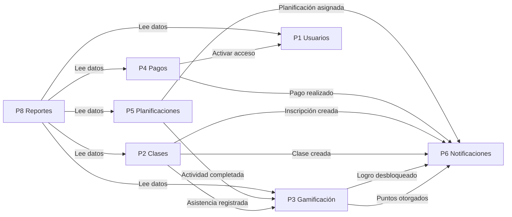

# DFD NIVEL 1 - PROCESOS PRINCIPALES

## Ecosistema Mateatletas

**Versión:** 1.0  
**Fecha:** 2025-10-24  
**Descripción:** Descomposición del sistema en procesos principales y almacenes de datos

---

## Diagrama de Nivel 1

```mermaid
flowchart TB
    %% Entidades Externas
    ADMIN[👤 ADMIN]
    DOCENTE[👨‍🏫 DOCENTE]
    TUTOR[👨‍👩‍👧 TUTOR]
    ESTUDIANTE[🎓 ESTUDIANTE]
    MERCADOPAGO[💳 MercadoPago]
    GOOGLE[📧 Google]

    %% Procesos Principales
    P1[P1<br/>GESTIÓN DE<br/>USUARIOS]
    P2[P2<br/>GESTIÓN DE<br/>CLASES]
    P3[P3<br/>SISTEMA DE<br/>GAMIFICACIÓN]
    P4[P4<br/>SISTEMA DE<br/>PAGOS]
    P5[P5<br/>GESTIÓN DE<br/>PLANIFICACIONES]
    P6[P6<br/>SISTEMA DE<br/>NOTIFICACIONES]
    P7[P7<br/>GESTIÓN DE<br/>CONTENIDO]
    P8[P8<br/>REPORTES Y<br/>MÉTRICAS]

    %% Almacenes de Datos
    D1[(D1<br/>USUARIOS)]
    D2[(D2<br/>CLASES Y<br/>GRUPOS)]
    D3[(D3<br/>INSCRIPCIONES)]
    D4[(D4<br/>ASISTENCIAS)]
    D5[(D5<br/>GAMIFICACIÓN)]
    D6[(D6<br/>PAGOS)]
    D7[(D7<br/>PLANIFICACIONES)]
    D8[(D8<br/>NOTIFICACIONES)]
    D9[(D9<br/>CONTENIDO<br/>EDUCATIVO)]

    %% === FLUJOS DESDE ENTIDADES EXTERNAS A PROCESOS ===

    %% ADMIN
    ADMIN -->|Crea/Actualiza Usuarios| P1
    ADMIN -->|Crea Clases/Grupos| P2
    ADMIN -->|Configura Precios| P4
    ADMIN -->|Crea Planificaciones| P5
    ADMIN -->|Crea Contenido| P7
    ADMIN -->|Solicita Reportes| P8

    %% DOCENTE
    DOCENTE -->|Registra Asistencia| P2
    DOCENTE -->|Otorga Puntos/Logros| P3
    DOCENTE -->|Asigna Planificaciones| P5
    DOCENTE -->|Consulta Clases| P2

    %% TUTOR
    TUTOR -->|Reserva/Cancela Clases| P2
    TUTOR -->|Realiza Pagos| P4
    TUTOR -->|Consulta Info Hijos| P1
    TUTOR -->|Consulta Calendario| P2

    %% ESTUDIANTE
    ESTUDIANTE -->|Completa Actividades| P5
    ESTUDIANTE -->|Consulta Gamificación| P3
    ESTUDIANTE -->|Consulta Clases| P2
    ESTUDIANTE -->|Consulta Cursos| P7

    %% === FLUJOS DESDE PROCESOS A ENTIDADES EXTERNAS ===

    P1 -->|Datos de Usuarios| ADMIN
    P2 -->|Clases Asignadas| DOCENTE
    P2 -->|Calendario| TUTOR
    P2 -->|Calendario| ESTUDIANTE
    P3 -->|Gamificación Personal| ESTUDIANTE
    P3 -->|Métricas Hijos| TUTOR
    P4 -->|Estado Pagos| TUTOR
    P4 -->|Acceso Activado| ESTUDIANTE
    P5 -->|Actividades Asignadas| ESTUDIANTE
    P5 -->|Progreso Actividades| DOCENTE
    P6 -->|Notificaciones| ADMIN
    P6 -->|Notificaciones| DOCENTE
    P6 -->|Notificaciones| TUTOR
    P6 -->|Notificaciones| ESTUDIANTE
    P7 -->|Cursos Disponibles| ESTUDIANTE
    P8 -->|Dashboards| ADMIN
    P8 -->|Métricas| DOCENTE
    P8 -->|Dashboard Hijos| TUTOR

    %% === FLUJOS CON SISTEMAS EXTERNOS ===

    P4 <-->|Procesar Pagos| MERCADOPAGO
    P2 -->|Sincronizar Eventos| GOOGLE
    P6 -->|Enviar Emails| GOOGLE

    %% === FLUJOS ENTRE PROCESOS Y ALMACENES ===

    %% P1 - Gestión de Usuarios
    P1 <-->|CRUD Usuarios| D1

    %% P2 - Gestión de Clases
    P2 -->|Crear Clases/Grupos| D2
    P2 <-->|Leer Clases| D2
    P2 -->|Crear Inscripciones| D3
    P2 <-->|Leer/Actualizar Inscripciones| D3
    P2 -->|Registrar Asistencia| D4
    P2 -->|Leer Usuarios| D1

    %% P3 - Sistema de Gamificación
    P3 -->|Registrar Puntos| D5
    P3 -->|Desbloquear Logros| D5
    P3 <-->|Actualizar Equipos| D5
    P3 -->|Leer Estudiantes| D1
    P3 -->|Leer Asistencias| D4

    %% P4 - Sistema de Pagos
    P4 -->|Crear Inscripciones Mensuales| D6
    P4 <-->|Actualizar Estado Pagos| D6
    P4 -->|Leer Precios| D6
    P4 -->|Leer Estudiantes| D1
    P4 <-->|Actualizar Acceso| D1

    %% P5 - Gestión de Planificaciones
    P5 -->|Crear Planificaciones| D7
    P5 <-->|Asignar Actividades| D7
    P5 <-->|Registrar Progreso| D7
    P5 -->|Leer Estudiantes| D1
    P5 -->|Leer Grupos| D2

    %% P6 - Sistema de Notificaciones
    P6 -->|Crear Notificaciones| D8
    P6 <-->|Marcar Leídas| D8
    P6 -->|Leer Usuarios| D1

    %% P7 - Gestión de Contenido
    P7 <-->|CRUD Contenido| D9
    P7 -->|Leer Suscripciones| D6

    %% P8 - Reportes y Métricas
    P8 -->|Leer Asistencias| D4
    P8 -->|Leer Pagos| D6
    P8 -->|Leer Gamificación| D5
    P8 -->|Leer Clases| D2
    P8 -->|Leer Usuarios| D1
    P8 -->|Leer Progreso| D7

    %% === FLUJOS ENTRE PROCESOS ===

    P2 -->|Evento: Asistencia Registrada| P3
    P3 -->|Evento: Puntos Otorgados| P6
    P3 -->|Evento: Logro Desbloqueado| P6
    P2 -->|Evento: Clase Creada| P6
    P2 -->|Evento: Inscripción Creada| P6
    P4 -->|Evento: Pago Realizado| P6
    P4 -->|Evento: Pago Realizado| P1
    P5 -->|Evento: Actividad Completada| P3
    P5 -->|Evento: Planificación Asignada| P6

    %% Estilos
    classDef userExternal fill:#4A90E2,stroke:#2E5C8A,stroke-width:2px,color:#fff
    classDef systemExternal fill:#E24A4A,stroke:#8A2E2E,stroke-width:2px,color:#fff
    classDef process fill:#50C878,stroke:#2E8A57,stroke-width:2px,color:#fff
    classDef datastore fill:#FFB84D,stroke:#CC8A3D,stroke-width:2px,color:#000

    class ADMIN,DOCENTE,TUTOR,ESTUDIANTE userExternal
    class MERCADOPAGO,GOOGLE systemExternal
    class P1,P2,P3,P4,P5,P6,P7,P8 process
    class D1,D2,D3,D4,D5,D6,D7,D8,D9 datastore
```



---

## DESCRIPCIÓN DE PROCESOS

### P1: GESTIÓN DE USUARIOS

**Responsabilidad:** Administrar el ciclo de vida de todos los usuarios del sistema

**Entradas:**

- **Desde ADMIN:** Datos de nuevos usuarios (docentes, tutores, estudiantes)
- **Desde TUTOR:** Consultas de información de sus hijos
- **Desde P4:** Actualización de estado de acceso tras pago

**Procesos Internos:**

1. Crear usuarios (ADMIN, DOCENTE, TUTOR, ESTUDIANTE)
2. Actualizar información de perfil
3. Desactivar/Activar usuarios
4. Validar relaciones Tutor-Estudiante
5. Gestionar roles y permisos
6. Actualizar estado de acceso (activo/inactivo)

**Salidas:**

- **A ADMIN:** Listado de usuarios, métricas
- **A D1:** CRUD de registros de usuarios
- **A otros procesos:** Datos de usuarios para validaciones

**Almacenes Utilizados:**

- **D1 (USUARIOS):** Lectura y escritura

**Estado de Implementación:** ✅ 100%

---

### P2: GESTIÓN DE CLASES

**Responsabilidad:** Administrar clases individuales, grupos recurrentes, inscripciones y asistencias

**Entradas:**

- **Desde ADMIN:** Datos de nuevas clases/grupos
- **Desde DOCENTE:** Registro de asistencia, consultas de clases asignadas
- **Desde TUTOR:** Reservas y cancelaciones de clases
- **Desde ESTUDIANTE:** Consultas de calendario

**Procesos Internos:**

1. **Crear Clase Individual:**
   - Validar docente existe y está disponible
   - Verificar cupos disponibles
   - Crear registro en D2
   - Notificar a docente (→ P6)

2. **Crear Grupo Recurrente:**
   - Validar docente(s)
   - Configurar horarios recurrentes
   - Crear registro en D2

3. **Reservar Clase:**
   - Validar cupos disponibles
   - Validar relación Tutor-Estudiante
   - Crear inscripción en D3
   - Notificar a docente (→ P6)

4. **Cancelar Reserva:**
   - Validar ownership
   - Liberar cupo
   - Eliminar inscripción de D3

5. **Registrar Asistencia:**
   - Validar clase existe
   - Marcar estado (Presente/Ausente/Justificado)
   - Guardar en D4
   - **Trigger:** Enviar evento a P3 (otorgar puntos por asistencia)

6. **Sincronizar con Google Calendar:**
   - Crear eventos en Google (→ GOOGLE)
   - Enviar invitaciones a participantes

**Salidas:**

- **A DOCENTE:** Lista de clases asignadas, estudiantes por clase
- **A TUTOR:** Calendario de clases de sus hijos
- **A ESTUDIANTE:** Calendario personal
- **A D2:** Clases y grupos
- **A D3:** Inscripciones
- **A D4:** Asistencias
- **A P3:** Eventos de asistencia registrada
- **A P6:** Eventos de creación/inscripción

**Almacenes Utilizados:**

- **D1 (USUARIOS):** Lectura (validaciones)
- **D2 (CLASES Y GRUPOS):** Lectura y escritura
- **D3 (INSCRIPCIONES):** Lectura y escritura
- **D4 (ASISTENCIAS):** Escritura

**Estado de Implementación:**

- Backend: ✅ 100%
- Frontend: ⚠️ 75% (grupos recurrentes parcial)

---

### P3: SISTEMA DE GAMIFICACIÓN

**Responsabilidad:** Gestionar puntos, niveles, logros y equipos de estudiantes

**Entradas:**

- **Desde DOCENTE:** Otorgar puntos manuales, desbloquear logros
- **Desde ESTUDIANTE:** Consultas de gamificación personal
- **Desde P2:** Eventos de asistencia registrada
- **Desde P5:** Eventos de actividades completadas

**Procesos Internos:**

1. **Otorgar Puntos:**
   - Validar acción puntuable existe
   - Crear registro en puntos_obtenidos (D5)
   - Actualizar puntos_totales del estudiante
   - **Verificar subida de nivel:**
     - Consultar tabla niveles_config
     - Si cruza umbral → actualizar nivel_actual
     - Si sube nivel → desbloquear logro automático "Nivel X alcanzado"
   - **Actualizar equipo:**
     - Si estudiante pertenece a equipo
     - Sumar puntos a puntos_totales del equipo
   - Notificar a estudiante (→ P6)

2. **Desbloquear Logro Manual:**
   - Validar logro existe
   - Validar estudiante no lo tiene ya
   - Crear registro en logros_desbloqueados (D5)
   - Notificar a estudiante (→ P6)

3. **Calcular Rankings:**
   - Ordenar estudiantes por puntos_totales
   - Ordenar equipos por puntos_totales
   - Retornar top N

4. **Consultar Gamificación Personal:**
   - Leer puntos_totales, nivel_actual, logros_desbloqueados
   - Calcular progreso al siguiente nivel
   - Retornar ranking personal

**Salidas:**

- **A ESTUDIANTE:** Puntos, nivel, logros, ranking personal
- **A TUTOR:** Métricas de gamificación de sus hijos
- **A D5:** Puntos, logros, actualización de equipos y niveles
- **A P6:** Eventos de puntos otorgados y logros desbloqueados

**Almacenes Utilizados:**

- **D1 (USUARIOS):** Lectura y escritura (puntos_totales, nivel_actual)
- **D4 (ASISTENCIAS):** Lectura (para calcular puntos automáticos)
- **D5 (GAMIFICACIÓN):** Lectura y escritura

**Cascadas Automáticas:**

```
Asistencia Presente → +10 puntos → Verificar nivel → Si sube → Logro → Notificación
Actividad Completada → +X puntos → Verificar nivel → Si sube → Logro → Notificación
```

**Estado de Implementación:**

- Backend: ✅ 95%
- Frontend: ⚠️ 75%

---

### P4: SISTEMA DE PAGOS

**Responsabilidad:** Gestionar inscripciones mensuales, pagos, precios y acceso de estudiantes

**Entradas:**

- **Desde ADMIN:** Configuración de precios, creación de inscripciones mensuales
- **Desde TUTOR:** Solicitudes de pago
- **Desde MERCADOPAGO:** Webhooks de confirmación de pago

**Procesos Internos:**

1. **Calcular Precio de Inscripción:**
   - Leer configuracion_precios (D6)
   - Aplicar descuentos por cantidad de estudiantes
   - Aplicar descuentos por productos múltiples
   - Validar becas activas
   - Retornar desglose de precio

2. **Crear Inscripción Mensual:**
   - Validar estudiante existe
   - Validar producto existe
   - Validar no existe inscripción para mismo período
   - Calcular precio con descuentos
   - Crear registro en inscripciones_mensuales (D6)
   - estado_pago = "Pendiente"
   - Notificar a tutor (→ P6)

3. **Procesar Pago:**
   - Crear preferencia de pago en MercadoPago
   - Redirigir a tutor a checkout
   - **Webhook:** Recibir confirmación
     - Actualizar estado_pago = "Pagado"
     - Actualizar estudiante.acceso_activo = true (→ P1)
     - Crear registro en membresias (D6)
     - Notificar a tutor y estudiante (→ P6)

4. **Gestionar Membresías:**
   - Verificar expiración de membresías
   - Desactivar acceso si venció (→ P1)
   - Crear alertas para tutores (→ P6)

5. **Actualizar Configuración de Precios:**
   - Guardar nueva configuración
   - Registrar en historial_cambio_precios (D6)

**Salidas:**

- **A TUTOR:** Estado de pagos, membresías activas
- **A ESTUDIANTE:** Acceso activado/desactivado
- **A MERCADOPAGO:** Solicitudes de pago
- **Desde MERCADOPAGO:** Confirmaciones de pago
- **A D6:** Inscripciones, pagos, configuración de precios
- **A P1:** Actualización de acceso de estudiantes
- **A P6:** Eventos de pagos realizados

**Almacenes Utilizados:**

- **D1 (USUARIOS):** Lectura y escritura (acceso_activo)
- **D6 (PAGOS):** Lectura y escritura

**Estado de Implementación:**

- Backend: ✅ 100%
- Frontend: ⚠️ 75% (integración MercadoPago completa, panel manual en desarrollo)

---

### P5: GESTIÓN DE PLANIFICACIONES

**Responsabilidad:** Administrar planificaciones mensuales, actividades semanales y progreso de estudiantes

**Entradas:**

- **Desde ADMIN:** Creación de planificaciones y actividades
- **Desde DOCENTE:** Asignación de planificaciones a grupos, asignación de actividades
- **Desde ESTUDIANTE:** Completación de actividades, consulta de actividades asignadas

**Procesos Internos:**

1. **Crear Planificación Mensual:**
   - Validar ruta_curricular_id existe
   - Crear registro en planificaciones_mensuales (D7)
   - estado = "Borrador"

2. **Crear Actividad Semanal:**
   - Validar planificacion_id existe
   - Crear registro en actividades_semanales (D7)
   - Asociar a semana específica

3. **Publicar Planificación:**
   - Actualizar estado = "Publicada"
   - Notificar a docentes asignados (→ P6)

4. **Asignar Planificación a Grupo:**
   - Validar grupo existe
   - Validar docente tiene permisos
   - Crear asignaciones_docente (D7)
   - Crear asignaciones_actividad_estudiante para cada estudiante del grupo
   - Notificar a estudiantes y tutores (→ P6)

5. **Asignar Actividad Individual:**
   - Validar actividad existe
   - Validar estudiante existe
   - Crear asignacion_actividad_estudiante (D7)
   - Notificar a estudiante y tutor (→ P6)

6. **Registrar Progreso de Actividad:**
   - Validar asignación existe
   - Actualizar progreso_estudiante_actividad (D7)
   - Si completado = true:
     - **Trigger:** Enviar evento a P3 (otorgar puntos)
     - Notificar a tutor (→ P6)

7. **Consultar Actividades Asignadas:**
   - Filtrar por estudiante_id
   - Retornar pendientes y completadas

**Salidas:**

- **A ESTUDIANTE:** Actividades asignadas (pendientes/completadas)
- **A DOCENTE:** Progreso de actividades por estudiante
- **A TUTOR:** Notificaciones de actividades completadas
- **A D7:** Planificaciones, actividades, asignaciones, progreso
- **A P3:** Eventos de actividades completadas
- **A P6:** Eventos de asignación y completación

**Almacenes Utilizados:**

- **D1 (USUARIOS):** Lectura (estudiantes, docentes)
- **D2 (CLASES Y GRUPOS):** Lectura (grupos)
- **D7 (PLANIFICACIONES):** Lectura y escritura

**Estado de Implementación:**

- Backend: ✅ 100%
- Frontend: ⚠️ 50%

---

### P6: SISTEMA DE NOTIFICACIONES

**Responsabilidad:** Crear, distribuir y gestionar notificaciones para todos los usuarios

**Entradas:**

- **Desde P2:** Eventos de clases creadas, inscripciones
- **Desde P3:** Eventos de puntos otorgados, logros desbloqueados
- **Desde P4:** Eventos de pagos realizados
- **Desde P5:** Eventos de actividades asignadas/completadas
- **Desde usuarios:** Marcar notificaciones como leídas

**Procesos Internos:**

1. **Crear Notificación:**
   - Determinar destinatarios según tipo de evento
   - Crear registro en notificaciones (D8)
   - tipo: "ClaseProxima", "LogroDesbloqueado", "PagoRealizado", etc.
   - leida = false
   - metadata: JSON con datos del evento

2. **Notificar Clase Creada:**
   - Destinatario: Docente asignado
   - tipo = "ClaseProxima"

3. **Notificar Inscripción Creada:**
   - Destinatario: Docente de la clase
   - tipo = "NuevaInscripcion"

4. **Notificar Puntos Otorgados:**
   - Destinatario: Estudiante
   - tipo = "PuntosObtenidos"

5. **Notificar Logro Desbloqueado:**
   - Destinatario: Estudiante
   - tipo = "LogroDesbloqueado"

6. **Notificar Pago Realizado:**
   - Destinatarios: Tutor, Estudiante, Admin
   - tipo = "PagoRealizado"

7. **Notificar Actividad Asignada:**
   - Destinatarios: Estudiante, Tutor
   - tipo = "ActividadAsignada"

8. **Notificar Actividad Completada:**
   - Destinatario: Tutor
   - tipo = "ActividadCompletada"

9. **Marcar Notificación como Leída:**
   - Actualizar leida = true en D8

10. **Enviar Email (Opcional):**
    - Para notificaciones críticas
    - Usar Google Workspace (→ GOOGLE)

**Salidas:**

- **A ADMIN, DOCENTE, TUTOR, ESTUDIANTE:** Notificaciones personalizadas
- **A GOOGLE:** Emails para notificaciones críticas
- **A D8:** Crear y actualizar notificaciones

**Almacenes Utilizados:**

- **D1 (USUARIOS):** Lectura (destinatarios)
- **D8 (NOTIFICACIONES):** Lectura y escritura

**Estado de Implementación:**

- Backend: ⚠️ 75% (sin WebSocket real-time)
- Frontend: ⚠️ 50%

---

### P7: GESTIÓN DE CONTENIDO

**Responsabilidad:** Administrar contenido educativo (sectores, rutas, productos, módulos, lecciones)

**Entradas:**

- **Desde ADMIN:** Creación/actualización de contenido
- **Desde ESTUDIANTE:** Consultas de cursos disponibles

**Procesos Internos:**

1. **Crear Sector:**
   - Validar nombre único
   - Crear registro en sectores (D9)

2. **Crear Ruta Curricular:**
   - Validar sector_id existe
   - Crear registro en rutas_curriculares (D9)

3. **Crear Producto:**
   - Validar datos
   - Crear registro en productos (D9)
   - tipo: "Suscripcion", "Curso", "ClaseIndividual"

4. **Crear Módulo/Lección:**
   - Validar producto_id existe
   - Crear registro en modulos/lecciones (D9)
   - Orden secuencial

5. **Consultar Cursos Disponibles:**
   - Validar estudiante tiene acceso activo (D6)
   - Filtrar productos según suscripción
   - Retornar cursos disponibles

**Salidas:**

- **A ESTUDIANTE:** Cursos disponibles según suscripción
- **A D9:** CRUD de contenido educativo

**Almacenes Utilizados:**

- **D6 (PAGOS):** Lectura (verificar acceso)
- **D9 (CONTENIDO EDUCATIVO):** Lectura y escritura

**Estado de Implementación:** ✅ 95%

---

### P8: REPORTES Y MÉTRICAS

**Responsabilidad:** Generar dashboards y reportes para todos los roles

**Entradas:**

- **Desde ADMIN:** Solicitudes de reportes financieros y operativos
- **Desde DOCENTE:** Solicitudes de métricas de clases
- **Desde TUTOR:** Solicitudes de dashboards de hijos

**Procesos Internos:**

1. **Dashboard Admin:**
   - Ingresos mensuales (leer D6)
   - Cantidad de estudiantes activos (leer D1)
   - Tasa de asistencia promedio (leer D4)
   - Próximas clases (leer D2)
   - Alertas críticas (leer D8)

2. **Dashboard Docente:**
   - Clases del día/semana (leer D2)
   - Estudiantes por clase (leer D3)
   - Tasa de asistencia por clase (leer D4)
   - Actividades asignadas vs completadas (leer D7)

3. **Dashboard Tutor:**
   - Por cada hijo:
     - Gamificación (leer D5)
     - Asistencia promedio (leer D4)
     - Actividades completadas (leer D7)
     - Próximas clases (leer D2, D3)
     - Estado de pagos (leer D6)

4. **Reportes Financieros:**
   - Ingresos por período
   - Desglose por producto
   - Becas otorgadas
   - Pagos pendientes

5. **Reportes Operativos:**
   - Asistencia por docente/grupo
   - Engagement de estudiantes
   - Actividades más completadas
   - Rankings de gamificación

**Salidas:**

- **A ADMIN:** Dashboards completos, reportes exportables
- **A DOCENTE:** Métricas de clases y estudiantes
- **A TUTOR:** Dashboard personalizado por hijo

**Almacenes Utilizados:**

- **D1, D2, D3, D4, D5, D6, D7:** Lectura (todos los almacenes)

**Estado de Implementación:** ⚠️ 70%

---

## DESCRIPCIÓN DE ALMACENES DE DATOS

### D1: USUARIOS

**Contenido:**

- Tabla `admins`: ID, nombre, email, password_hash
- Tabla `docentes`: ID, nombre, email, especialidades
- Tabla `tutores`: ID, nombre, email, telefono
- Tabla `estudiantes`: ID, nombre, tutor_id, fecha_nacimiento, puntos_totales, nivel_actual, acceso_activo

**Índices Principales:**

- `estudiantes.tutor_id`
- `estudiantes.puntos_totales` (para rankings)
- `usuarios.email` (únicos)

**Relaciones:**

- estudiantes.tutor_id → tutores.id (1:N)

---

### D2: CLASES Y GRUPOS

**Contenido:**

- Tabla `clases`: ID, docente_id, fecha_hora_inicio, duracion, cupos_maximo, cupos_ocupados, estado
- Tabla `clase_grupos`: ID, docente_id, dia_semana, hora_inicio, duracion, cupos_maximo, activo

**Índices Principales:**

- `clases.docente_id`
- `clases.fecha_hora_inicio`
- `clases.estado`
- `clase_grupos.dia_semana`

**Relaciones:**

- clases.docente_id → docentes.id
- clase_grupos.docente_id → docentes.id

---

### D3: INSCRIPCIONES

**Contenido:**

- Tabla `inscripciones_clase`: ID, clase_id, estudiante_id, reservada_por_tutor, fecha_inscripcion
- Tabla `inscripciones_clase_grupo`: ID, clase_grupo_id, estudiante_id, activo

**Índices Principales:**

- `inscripciones_clase.clase_id`
- `inscripciones_clase.estudiante_id`
- `inscripciones_clase_grupo.clase_grupo_id`

**Relaciones:**

- inscripciones_clase.clase_id → clases.id
- inscripciones_clase.estudiante_id → estudiantes.id
- inscripciones_clase_grupo.clase_grupo_id → clase_grupos.id
- inscripciones_clase_grupo.estudiante_id → estudiantes.id

**Constraints:**

- UNIQUE (clase_id, estudiante_id) - No inscripciones duplicadas

---

### D4: ASISTENCIAS

**Contenido:**

- Tabla `asistencias`: ID, clase_id, estudiante_id, estado (Presente/Ausente/Justificado), fecha, puntos_otorgados
- Tabla `asistencias_clase_grupo`: ID, clase_grupo_id, estudiante_id, fecha, estado

**Índices Principales:**

- `asistencias.clase_id`
- `asistencias.estudiante_id`
- `asistencias.fecha`

**Relaciones:**

- asistencias.clase_id → clases.id
- asistencias.estudiante_id → estudiantes.id

---

### D5: GAMIFICACIÓN

**Contenido:**

- Tabla `acciones_puntuables`: ID, nombre, puntos, tipo
- Tabla `puntos_obtenidos`: ID, estudiante_id, accion_id, puntos, fecha_otorgado
- Tabla `logros`: ID, nombre, descripcion, icono, puntos_requeridos
- Tabla `logros_desbloqueados`: ID, estudiante_id, logro_id, fecha_desbloqueo
- Tabla `equipos`: ID, nombre, puntos_totales
- Tabla `niveles_config`: nivel, puntos_requeridos, nombre

**Índices Principales:**

- `puntos_obtenidos.estudiante_id`
- `puntos_obtenidos.fecha_otorgado`
- `logros_desbloqueados.estudiante_id`
- `equipos.puntos_totales`

**Relaciones:**

- puntos_obtenidos.estudiante_id → estudiantes.id
- puntos_obtenidos.accion_id → acciones_puntuables.id
- logros_desbloqueados.estudiante_id → estudiantes.id
- logros_desbloqueados.logro_id → logros.id

---

### D6: PAGOS

**Contenido:**

- Tabla `configuracion_precios`: ID, producto_id, precio_base, descuentos
- Tabla `inscripciones_mensuales`: ID, estudiante_id, producto_id, periodo, monto, estado_pago, fecha_pago
- Tabla `membresias`: ID, estudiante_id, producto_id, fecha_inicio, fecha_fin, activo
- Tabla `becas`: ID, estudiante_id, porcentaje_descuento, motivo
- Tabla `historial_cambio_precios`: ID, producto_id, precio_anterior, precio_nuevo, fecha

**Índices Principales:**

- `inscripciones_mensuales.periodo`
- `inscripciones_mensuales.estado_pago`
- `inscripciones_mensuales.estudiante_id`
- `membresias.estudiante_id`

**Relaciones:**

- inscripciones_mensuales.estudiante_id → estudiantes.id
- inscripciones_mensuales.producto_id → productos.id
- membresias.estudiante_id → estudiantes.id

**Constraints:**

- UNIQUE (estudiante_id, producto_id, periodo) - Una inscripción por período

---

### D7: PLANIFICACIONES

**Contenido:**

- Tabla `planificaciones_mensuales`: ID, ruta_curricular_id, mes, anio, estado
- Tabla `actividades_semanales`: ID, planificacion_id, semana, nombre, descripcion, tipo_actividad
- Tabla `asignaciones_docente`: ID, planificacion_id, docente_id, clase_grupo_id
- Tabla `asignaciones_actividad_estudiante`: ID, actividad_id, estudiante_id, fecha_asignacion
- Tabla `progreso_estudiante_actividad`: ID, asignacion_id, completado, fecha_completado, puntos_obtenidos

**Índices Principales:**

- `planificaciones_mensuales.ruta_curricular_id`
- `actividades_semanales.planificacion_id`
- `asignaciones_actividad_estudiante.estudiante_id`
- `progreso_estudiante_actividad.completado`

**Relaciones:**

- planificaciones_mensuales.ruta_curricular_id → rutas_curriculares.id
- actividades_semanales.planificacion_id → planificaciones_mensuales.id
- asignaciones_actividad_estudiante.actividad_id → actividades_semanales.id
- asignaciones_actividad_estudiante.estudiante_id → estudiantes.id

---

### D8: NOTIFICACIONES

**Contenido:**

- Tabla `notificaciones`: ID, tipo, titulo, mensaje, destinatario_id, destinatario_tipo (Admin/Docente/Tutor/Estudiante), leida, fecha_creacion, metadata (JSON)
- Tabla `eventos`: ID, tipo, origen, datos (JSON), fecha

**Índices Principales:**

- `notificaciones.destinatario_id`
- `notificaciones.leida`
- `notificaciones.fecha_creacion`

**Relaciones:**

- notificaciones.destinatario_id → usuarios.id (polimórfico)

---

### D9: CONTENIDO EDUCATIVO

**Contenido:**

- Tabla `sectores`: ID, nombre, descripcion
- Tabla `rutas_curriculares`: ID, sector_id, nombre, nivel
- Tabla `productos`: ID, nombre, tipo, precio_base, descripcion
- Tabla `modulos`: ID, producto_id, nombre, orden
- Tabla `lecciones`: ID, modulo_id, nombre, contenido, orden

**Índices Principales:**

- `rutas_curriculares.sector_id`
- `modulos.producto_id`
- `lecciones.modulo_id`

**Relaciones:**

- rutas_curriculares.sector_id → sectores.id
- modulos.producto_id → productos.id
- lecciones.modulo_id → modulos.id

---

## FLUJOS DE DATOS CRÍTICOS (CASCADAS)

### Cascada 1: Asistencia → Gamificación → Notificaciones

```
DOCENTE registra asistencia
    ↓
P2: Registrar Asistencia
    ↓ (guarda en D4)
    ↓ (evento)
P3: Otorgar Puntos por Asistencia
    ↓ (actualiza D5 y D1)
    ↓ (verifica nivel)
    ↓ (si sube nivel, desbloquea logro)
    ↓ (actualiza equipo en D5)
    ↓ (evento)
P6: Crear Notificación
    ↓ (guarda en D8)
    → ESTUDIANTE ve notificación "Ganaste 10 puntos"
    → TUTOR ve notificación "Tu hijo asistió a clase"
```

---

### Cascada 2: Pago → Acceso → Notificaciones

```
TUTOR realiza pago
    ↓
P4: Procesar Pago
    ↓ (envía a MercadoPago)
MercadoPago confirma pago (webhook)
    ↓
P4: Actualizar Estado Pago
    ↓ (actualiza D6: estado_pago = "Pagado")
    ↓ (evento)
P1: Activar Acceso Estudiante
    ↓ (actualiza D1: acceso_activo = true)
    ↓ (evento)
P6: Crear Notificaciones
    ↓ (guarda en D8)
    → TUTOR ve "Pago confirmado"
    → ESTUDIANTE ve "Acceso activado"
    → ADMIN ve métrica actualizada en dashboard
```

---

### Cascada 3: Actividad Completada → Puntos → Nivel → Logro

```
ESTUDIANTE completa actividad
    ↓
P5: Registrar Progreso
    ↓ (actualiza D7: completado = true)
    ↓ (evento)
P3: Otorgar Puntos por Actividad
    ↓ (crea registro en D5)
    ↓ (actualiza D1: puntos_totales)
    ↓ (verifica umbral de nivel en D5: niveles_config)
    ↓ (si cruza umbral)
    ↓ → Actualiza D1: nivel_actual
    ↓ → Desbloquea logro automático "Nivel X" (D5)
    ↓ → Actualiza equipo (D5: equipos.puntos_totales)
    ↓ (evento)
P6: Crear Notificaciones
    ↓ (guarda en D8)
    → ESTUDIANTE ve "¡Subiste al nivel X!"
    → TUTOR ve "Tu hijo completó actividad Y"
```

---

### Cascada 4: Creación de Clase → Notificación a Docente

```
ADMIN crea clase
    ↓
P2: Crear Clase Individual
    ↓ (valida docente en D1)
    ↓ (crea registro en D2)
    ↓ (evento)
P6: Crear Notificación
    ↓ (guarda en D8)
    → DOCENTE ve "Nueva clase asignada"
    ↓ (opcional)
    → GOOGLE recibe evento para calendario
```

---

### Cascada 5: Reserva de Clase → Notificación a Docente

```
TUTOR reserva clase para hijo
    ↓
P2: Reservar Clase
    ↓ (valida cupos en D2)
    ↓ (valida tutor-estudiante en D1)
    ↓ (crea inscripción en D3)
    ↓ (actualiza D2: cupos_ocupados++)
    ↓ (evento)
P6: Crear Notificación
    ↓ (guarda en D8)
    → DOCENTE ve "Nueva inscripción en clase X"
    → TUTOR ve "Reserva confirmada"
```

---

## INTERACCIONES ENTRE PROCESOS



---

## RESUMEN DE ESTADO DE IMPLEMENTACIÓN

| Proceso                        | Backend | Frontend | Prioridad |
| ------------------------------ | ------- | -------- | --------- |
| P1: Gestión de Usuarios        | ✅ 100% | ✅ 100%  | Alta      |
| P2: Gestión de Clases          | ✅ 100% | ⚠️ 75%   | Alta      |
| P3: Sistema de Gamificación    | ✅ 95%  | ⚠️ 75%   | Alta      |
| P4: Sistema de Pagos           | ✅ 100% | ⚠️ 75%   | Alta      |
| P5: Gestión de Planificaciones | ✅ 100% | ⚠️ 50%   | Media     |
| P6: Sistema de Notificaciones  | ⚠️ 75%  | ⚠️ 50%   | Media     |
| P7: Gestión de Contenido       | ✅ 95%  | ⚠️ 60%   | Media     |
| P8: Reportes y Métricas        | ⚠️ 70%  | ⚠️ 60%   | Media     |

---

## PRÓXIMOS PASOS PARA COMPLETAR MVP

### Prioridad 1 (Para 26 de Octubre)

1. **P2:** Completar UI de grupos recurrentes en Portal Admin y Docente
2. **P3:** Finalizar desbloqueos automáticos de logros
3. **P5:** Mejorar UI de asignación de actividades en Portal Docente
4. **P6:** Implementar polling para notificaciones en tiempo "casi-real"

### Prioridad 2 (Post-lanzamiento)

1. **P6:** Migrar a WebSocket para notificaciones real-time
2. **P8:** Expandir dashboards con más métricas
3. **P7:** Portal de contenido educativo para estudiantes

---

**Fin del DFD Nivel 1**
