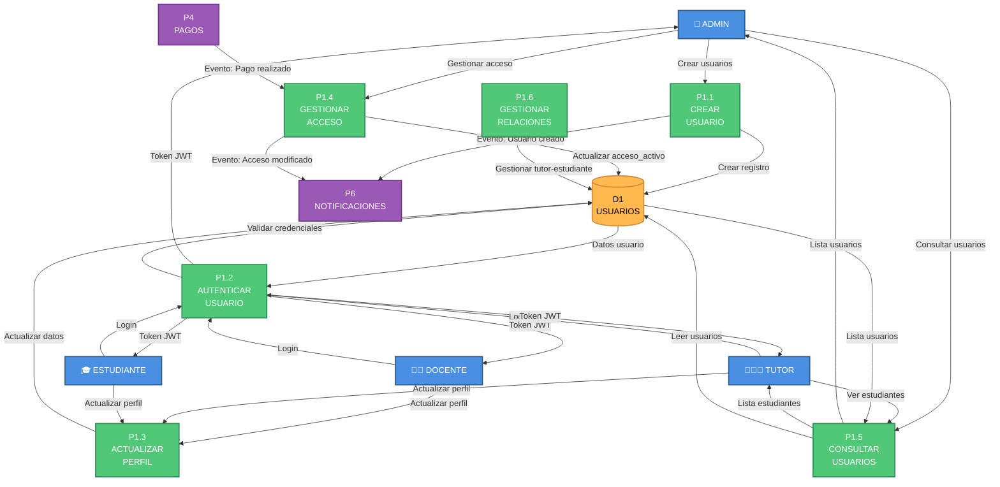

# DFD NIVEL 2 - P1: GESTIÓN DE USUARIOS

## Ecosistema Mateatletas

**Versión:** 1.0  
**Fecha:** 2025-10-24  
**Descripción:** Descomposición detallada del proceso P1 - Gestión de Usuarios

---

## Diagrama de Nivel 2 - P1: Gestión de Usuarios



---

## SUBPROCESO P1.1: CREAR USUARIO

### Descripción

Permite al ADMIN crear nuevos usuarios del sistema (Admins, Docentes, Tutores, Estudiantes).

### Entradas

**Crear Admin:**

```typescript
POST /api/admins
{
  email: string
  password: string
  nombre: string
  apellido?: string
}
```

**Crear Docente:**

```typescript
POST /api/docentes
{
  email: string
  password: string
  nombre: string
  apellido: string
  especialidades?: string[]
  telefono?: string
}
```

**Crear Tutor:**

```typescript
POST /api/tutores
{
  email: string
  password: string
  nombre: string
  apellido: string
  telefono: string
  direccion?: string
}
```

**Crear Estudiante:**

```typescript
POST /api/estudiantes
{
  email?: string
  password?: string // Opcional si es menor
  nombre: string
  apellido: string
  fecha_nacimiento: Date
  tutor_id: string // OBLIGATORIO
  equipo_id?: string
}
```

---

### Proceso Detallado

#### Paso 1: Validar Datos de Entrada

**Validaciones comunes:**

```typescript
// Usando Zod
const schema = z.object({
  email: z.string().email(),
  password: z.string().min(8), // Si aplica
  nombre: z.string().min(2),
  apellido: z.string().min(2),
  // ... otros campos según tipo
});
```

**Validaciones especiales por tipo:**

- **Admin/Docente/Tutor:** Email obligatorio y único
- **Estudiante:**
  - Email opcional (menores pueden no tener)
  - `tutor_id` OBLIGATORIO
  - Validar fecha_nacimiento (entre 5-18 años típicamente)

---

#### Paso 2: Verificar Email No Existe (Si Aplica)

```sql
-- Buscar en todas las tablas de usuarios
SELECT 'admins' as tabla, id FROM admins WHERE email = ?
UNION
SELECT 'docentes', id FROM docentes WHERE email = ?
UNION
SELECT 'tutores', id FROM tutores WHERE email = ?
UNION
SELECT 'estudiantes', id FROM estudiantes WHERE email = ?
```

**Validación:** COUNT = 0 (email no existe en ninguna tabla)

Si existe:

```typescript
throw new ConflictException('El email ya está registrado');
```

---

#### Paso 3: Hash de Contraseña

```typescript
import * as bcrypt from 'bcrypt';

const SALT_ROUNDS = 10;
const password_hash = await bcrypt.hash(password, SALT_ROUNDS);
```

**Nota:** Si es estudiante menor sin email/password, este paso se omite.

---

#### Paso 4: Validar Relaciones (Estudiante)

Si se está creando un **Estudiante**, validar que el tutor existe:

```sql
SELECT id, nombre, email FROM tutores
WHERE id = ? AND activo = true
```

**Validación:** Tutor existe

Si se proporciona `equipo_id`, validar que existe:

```sql
SELECT id, nombre FROM equipos WHERE id = ?
```

---

#### Paso 5: Crear Registro en Base de Datos

**Para Admin:**

```sql
INSERT INTO admins (
  id,
  email,
  password_hash,
  nombre,
  apellido,
  activo,
  createdAt,
  updatedAt
) VALUES (
  cuid(),
  ?,
  ?,
  ?,
  ?,
  true,
  NOW(),
  NOW()
)
```

**Para Docente:**

```sql
INSERT INTO docentes (
  id,
  email,
  password_hash,
  nombre,
  apellido,
  especialidades, -- JSON array
  telefono,
  activo,
  createdAt,
  updatedAt
) VALUES (
  cuid(), ?, ?, ?, ?, ?, ?, true, NOW(), NOW()
)
```

**Para Tutor:**

```sql
INSERT INTO tutores (
  id,
  email,
  password_hash,
  nombre,
  apellido,
  telefono,
  direccion,
  activo,
  createdAt,
  updatedAt
) VALUES (
  cuid(), ?, ?, ?, ?, ?, ?, true, NOW(), NOW()
)
```

**Para Estudiante:**

```sql
INSERT INTO estudiantes (
  id,
  email, -- Puede ser NULL
  password_hash, -- Puede ser NULL
  nombre,
  apellido,
  fecha_nacimiento,
  tutor_id,
  equipo_id, -- Puede ser NULL
  puntos_totales, -- DEFAULT 0
  nivel_actual, -- DEFAULT 1
  acceso_activo, -- DEFAULT false (hasta que pague)
  activo,
  createdAt,
  updatedAt
) VALUES (
  cuid(), ?, ?, ?, ?, ?, ?, ?, 0, 1, false, true, NOW(), NOW()
)
```

---

#### Paso 6: Enviar Notificación de Bienvenida

Enviar evento a **P6**:

```typescript
// Para Admin/Docente/Tutor:
{
  tipo: 'UsuarioCreado',
  destinatario_id: nuevo_usuario_id,
  destinatario_tipo: 'ADMIN' | 'DOCENTE' | 'TUTOR',
  metadata: {
    email,
    nombre,
    rol: tipo_usuario
  }
}

// Para Estudiante (notificar al tutor):
{
  tipo: 'EstudianteCreado',
  destinatario_id: tutor_id,
  destinatario_tipo: 'TUTOR',
  metadata: {
    estudiante: { nombre, apellido, id },
    acceso_activo: false
  }
}
```

---

#### Paso 7: Enviar Email de Bienvenida (Opcional)

Si el sistema tiene configurado envío de emails:

```typescript
// Vía P6 → Google Workspace
{
  tipo: 'EmailBienvenida',
  destinatario_email: email,
  template: 'bienvenida',
  datos: {
    nombre,
    rol,
    credenciales_temporales: password_temporal // Si aplica
  }
}
```

---

### Salidas

**Respuesta al ADMIN:**

```typescript
{
  id: string,
  email: string,
  nombre: string,
  apellido: string,
  rol: 'ADMIN' | 'DOCENTE' | 'TUTOR' | 'ESTUDIANTE',
  activo: true,
  // Para estudiante:
  tutor?: {
    id, nombre, email
  },
  equipo?: {
    id, nombre, icono
  },
  acceso_activo?: false // Solo estudiantes
}
```

**Efectos en BD:**

- D1: INSERT en tabla correspondiente (admins/docentes/tutores/estudiantes)
- Eventos a P6

---

### Validaciones Críticas

1. ✅ Email válido y único (si aplica)
2. ✅ Contraseña >= 8 caracteres (si aplica)
3. ✅ Nombre y apellido >= 2 caracteres
4. ✅ Estudiante: tutor_id existe y es válido
5. ✅ Estudiante: fecha_nacimiento válida
6. ✅ Equipo existe (si se proporciona)

---

### Casos Especiales

#### Crear Estudiante Sin Email/Password (Menor)

```typescript
// Para menores de edad sin email propio:
{
  email: null,
  password: null,
  nombre: 'Juan',
  apellido: 'Pérez',
  fecha_nacimiento: '2015-05-10',
  tutor_id: 'tutor-123'
}

// El estudiante usará el email del tutor para login inicial
// O el admin puede asignarle email después
```

---

#### Asignar Contraseña Temporal

```typescript
// Opción: generar contraseña temporal
const password_temporal = generarPasswordTemporal() // Ej: 'Mate2025!Abc'

// Enviar por email y forzar cambio en primer login
INSERT INTO usuarios VALUES (
  ...,
  password_hash: hash(password_temporal),
  debe_cambiar_password: true
)
```

---

### Estado de Implementación

- Backend: ✅ 100%
- Frontend: ✅ 100%

---

## SUBPROCESO P1.2: AUTENTICAR USUARIO

### Descripción

Valida credenciales y genera JWT token con roles para acceso al sistema.

### Entradas

```typescript
POST /api/auth/login
{
  email: string,
  password: string
}
```

---

### Proceso Detallado

#### Paso 1: Buscar Usuario por Email

Buscar en todas las tablas de usuarios:

```sql
-- Opción 1: Buscar en todas
SELECT 'ADMIN' as rol, id, email, password_hash, nombre, activo FROM admins WHERE email = ?
UNION
SELECT 'DOCENTE', id, email, password_hash, nombre, activo FROM docentes WHERE email = ?
UNION
SELECT 'TUTOR', id, email, password_hash, nombre, activo FROM tutores WHERE email = ?
UNION
SELECT 'ESTUDIANTE', id, email, password_hash, nombre, activo FROM estudiantes WHERE email = ?
LIMIT 1
```

**Validación:** Usuario encontrado

Si no se encuentra:

```typescript
throw new UnauthorizedException('Credenciales inválidas');
```

---

#### Paso 2: Verificar Usuario Activo

```typescript
if (!usuario.activo) {
  throw new ForbiddenException('Usuario desactivado');
}
```

---

#### Paso 3: Validar Contraseña

```typescript
import * as bcrypt from 'bcrypt';

const passwordValido = await bcrypt.compare(password, usuario.password_hash);

if (!passwordValido) {
  throw new UnauthorizedException('Credenciales inválidas');
}
```

**Nota de Seguridad:**

- Mismo mensaje de error para "usuario no existe" y "contraseña incorrecta"
- Evita dar información sobre qué emails están registrados

---

#### Paso 4: Verificar Acceso (Solo Estudiantes)

Si el usuario es ESTUDIANTE:

```sql
SELECT acceso_activo FROM estudiantes WHERE id = ?
```

```typescript
if (rol === 'ESTUDIANTE' && !estudiante.acceso_activo) {
  throw new ForbiddenException('Acceso inactivo - Contacta a tu tutor');
}
```

---

#### Paso 5: Generar JWT Token

```typescript
import { JwtService } from '@nestjs/jwt';

const payload = {
  sub: usuario.id, // Subject: ID del usuario
  email: usuario.email,
  role: usuario.rol, // 'ADMIN' | 'DOCENTE' | 'TUTOR' | 'ESTUDIANTE'
  nombre: usuario.nombre,
};

const token = await jwtService.sign(payload, {
  secret: process.env.JWT_SECRET,
  expiresIn: '7d', // Token válido por 7 días
});
```

**Estructura del Token JWT:**

```
Header: { alg: "HS256", typ: "JWT" }
Payload: {
  sub: "cuid-usuario",
  email: "usuario@email.com",
  role: "DOCENTE",
  nombre: "Carlos",
  iat: 1698237600,
  exp: 1698842400
}
Signature: ...
```

---

#### Paso 6: Registrar Login (Opcional)

Para auditoría:

```sql
INSERT INTO logs_login (
  usuario_id,
  rol,
  fecha,
  ip_address,
  user_agent
) VALUES (?, ?, NOW(), ?, ?)
```

---

#### Paso 7: Obtener Datos Adicionales del Usuario

Según el rol, obtener información adicional:

**Para Estudiante:**

```sql
SELECT
  e.*,
  t.nombre as tutor_nombre,
  t.email as tutor_email,
  eq.nombre as equipo_nombre,
  eq.icono as equipo_icono
FROM estudiantes e
JOIN tutores t ON e.tutor_id = t.id
LEFT JOIN equipos eq ON e.equipo_id = eq.id
WHERE e.id = ?
```

**Para Tutor:**

```sql
-- Obtener cantidad de estudiantes
SELECT COUNT(*) as cantidad_hijos
FROM estudiantes
WHERE tutor_id = ? AND activo = true
```

**Para Docente:**

```sql
-- Obtener próximas clases
SELECT COUNT(*) as clases_proximas
FROM clases
WHERE docente_id = ?
  AND fecha_hora_inicio > NOW()
  AND estado = 'Programada'
```

---

### Salidas

**Respuesta:**

```typescript
{
  access_token: string, // JWT
  user: {
    id: string,
    email: string,
    nombre: string,
    apellido: string,
    rol: 'ADMIN' | 'DOCENTE' | 'TUTOR' | 'ESTUDIANTE',

    // Datos adicionales según rol:

    // Si es ESTUDIANTE:
    puntos_totales?: number,
    nivel_actual?: number,
    acceso_activo?: boolean,
    tutor?: { nombre, email },
    equipo?: { nombre, icono },

    // Si es TUTOR:
    cantidad_hijos?: number,

    // Si es DOCENTE:
    especialidades?: string[],
    clases_proximas?: number
  }
}
```

---

### Validaciones Críticas

1. ✅ Email existe en alguna tabla de usuarios
2. ✅ Usuario activo
3. ✅ Contraseña correcta
4. ✅ Estudiante tiene acceso_activo (si aplica)
5. ✅ Token JWT válido y firmado correctamente

---

### Seguridad

**Rate Limiting:**

```typescript
// Limitar intentos de login por IP
// Ej: 5 intentos por minuto
@UseGuards(ThrottlerGuard)
@Throttle(5, 60)
```

**Protección contra Brute Force:**

```typescript
// Bloquear cuenta después de 10 intentos fallidos
if (intentos_fallidos >= 10) {
  await prisma.usuario.update({
    where: { id },
    data: { bloqueado_hasta: addMinutes(new Date(), 30) },
  });
  throw new ForbiddenException('Cuenta bloqueada temporalmente');
}
```

---

### Middleware de Autenticación

Todos los endpoints protegidos usan:

```typescript
@UseGuards(JwtAuthGuard, RolesGuard)
@Roles('ADMIN', 'DOCENTE') // Roles permitidos
async miEndpoint(@GetUser() user: User) {
  // user contiene payload del JWT decodificado
}
```

**JwtAuthGuard:** Valida token JWT  
**RolesGuard:** Valida roles permitidos  
**@GetUser():** Inyecta datos del usuario

---

### Estado de Implementación

- Backend: ✅ 100%
- Frontend: ✅ 100%

---

## SUBPROCESO P1.3: ACTUALIZAR PERFIL

### Descripción

Permite a usuarios actualizar su información de perfil.

### Entradas

**Actualizar Admin/Docente/Tutor:**

```typescript
PATCH /api/mi-perfil
{
  nombre?: string,
  apellido?: string,
  telefono?: string,
  // Docente específico:
  especialidades?: string[],
  // Tutor específico:
  direccion?: string
}
```

**Actualizar Estudiante:**

```typescript
PATCH /api/estudiantes/:id
{
  nombre?: string,
  apellido?: string,
  email?: string, // Si ya tiene edad suficiente
  fecha_nacimiento?: Date
}
```

---

### Proceso Detallado

#### Paso 1: Validar Ownership

```typescript
// Usuario solo puede actualizar su propio perfil
// O tutor puede actualizar perfil de sus estudiantes

if (user.rol !== 'ADMIN') {
  // Si es estudiante, validar que el ID coincida
  if (user.rol === 'ESTUDIANTE' && user.id !== estudiante_id) {
    throw new ForbiddenException('No puedes modificar este perfil');
  }

  // Si es tutor, validar que el estudiante le pertenece
  if (user.rol === 'TUTOR') {
    const estudiante = await prisma.estudiante.findUnique({
      where: { id: estudiante_id },
    });
    if (estudiante.tutor_id !== user.id) {
      throw new ForbiddenException('No puedes modificar este estudiante');
    }
  }
}
```

---

#### Paso 2: Validar Datos

```typescript
// Validaciones según campo:

if (email && email !== usuario_actual.email) {
  // Verificar que el nuevo email no exista
  const existe = await buscarEmailEnTodasTablas(email);
  if (existe) {
    throw new ConflictException('Email ya registrado');
  }
}

if (fecha_nacimiento) {
  // Validar rango de edad
  const edad = calcularEdad(fecha_nacimiento);
  if (edad < 5 || edad > 18) {
    throw new BadRequestException('Edad fuera de rango permitido');
  }
}
```

---

#### Paso 3: Actualizar en Base de Datos

**Para Admin:**

```sql
UPDATE admins
SET
  nombre = COALESCE(?, nombre),
  apellido = COALESCE(?, apellido),
  updatedAt = NOW()
WHERE id = ?
```

**Para Docente:**

```sql
UPDATE docentes
SET
  nombre = COALESCE(?, nombre),
  apellido = COALESCE(?, apellido),
  telefono = COALESCE(?, telefono),
  especialidades = COALESCE(?, especialidades),
  updatedAt = NOW()
WHERE id = ?
```

**Para Tutor:**

```sql
UPDATE tutores
SET
  nombre = COALESCE(?, nombre),
  apellido = COALESCE(?, apellido),
  telefono = COALESCE(?, telefono),
  direccion = COALESCE(?, direccion),
  updatedAt = NOW()
WHERE id = ?
```

**Para Estudiante:**

```sql
UPDATE estudiantes
SET
  nombre = COALESCE(?, nombre),
  apellido = COALESCE(?, apellido),
  email = COALESCE(?, email),
  fecha_nacimiento = COALESCE(?, fecha_nacimiento),
  updatedAt = NOW()
WHERE id = ?
```

**Nota:** `COALESCE(?, campo)` significa "actualizar solo si se proporciona valor nuevo"

---

#### Paso 4: Retornar Usuario Actualizado

```sql
SELECT * FROM [tabla_correspondiente]
WHERE id = ?
```

---

### Salidas

**Respuesta:**

```typescript
{
  id: string,
  email: string,
  nombre: string,
  apellido: string,
  telefono?: string,
  // Campos específicos según tipo...
  updatedAt: Date
}
```

---

### Validaciones Críticas

1. ✅ Usuario tiene ownership del perfil
2. ✅ Email único (si se cambia)
3. ✅ Datos válidos según tipo de usuario
4. ✅ No se pueden cambiar campos sensibles (rol, password) por esta vía

---

### Cambio de Contraseña (Suboperación)

**Endpoint separado:**

```typescript
POST /api/auth/cambiar-password
{
  password_actual: string,
  password_nuevo: string
}
```

**Proceso:**

1. Validar password_actual con hash guardado
2. Validar password_nuevo >= 8 caracteres
3. Hash de password_nuevo
4. Actualizar password_hash en BD
5. Invalidar tokens JWT previos (opcional)

---

### Estado de Implementación

- Backend: ✅ 100%
- Frontend: ✅ 95%

---

## SUBPROCESO P1.4: GESTIONAR ACCESO

### Descripción

Controla el estado `acceso_activo` de estudiantes (activar/desactivar acceso al sistema).

### Entradas

**Entrada desde ADMIN (Manual):**

```typescript
PATCH /api/estudiantes/:id/acceso
{
  acceso_activo: boolean,
  motivo?: string
}
```

**Entrada desde P4 (Automático - Pago):**

```typescript
{
  tipo: 'PagoRealizado',
  estudiante_id: string,
  activar_acceso: true
}
```

**Entrada desde P4 (Automático - Expiración):**

```typescript
{
  tipo: 'MembresiaExpirada',
  estudiante_id: string,
  desactivar_acceso: true
}
```

---

### Proceso Detallado

#### Paso 1: Validar Estudiante Existe

```sql
SELECT id, nombre, acceso_activo, tutor_id
FROM estudiantes
WHERE id = ?
```

---

#### Paso 2: Verificar Cambio Real

```typescript
if (estudiante.acceso_activo === nuevo_estado_acceso) {
  // No hay cambio, retornar sin hacer nada
  return { mensaje: 'Sin cambios' };
}
```

---

#### Paso 3: Actualizar Estado de Acceso

```sql
UPDATE estudiantes
SET
  acceso_activo = ?,
  fecha_ultimo_cambio_acceso = NOW(),
  updatedAt = NOW()
WHERE id = ?
```

---

#### Paso 4: Registrar Evento de Auditoría (Opcional)

```sql
INSERT INTO logs_cambio_acceso (
  estudiante_id,
  estado_anterior,
  estado_nuevo,
  motivo,
  realizado_por, -- 'ADMIN' | 'SISTEMA'
  fecha
) VALUES (?, ?, ?, ?, ?, NOW())
```

---

#### Paso 5: Enviar Notificación

Enviar evento a **P6**:

**Si se ACTIVA el acceso:**

```typescript
// A estudiante:
{
  tipo: 'AccesoActivado',
  destinatario_id: estudiante_id,
  destinatario_tipo: 'ESTUDIANTE',
  metadata: {
    mensaje: '¡Tu acceso ha sido activado!'
  }
}

// A tutor:
{
  tipo: 'AccesoEstudianteActivado',
  destinatario_id: tutor_id,
  destinatario_tipo: 'TUTOR',
  metadata: {
    estudiante: { nombre, id }
  }
}
```

**Si se DESACTIVA el acceso:**

```typescript
// A tutor:
{
  tipo: 'AccesoEstudianteDesactivado',
  destinatario_id: tutor_id,
  destinatario_tipo: 'TUTOR',
  metadata: {
    estudiante: { nombre, id },
    motivo: motivo || 'Membresía expirada'
  }
}
```

---

### Salidas

**Respuesta:**

```typescript
{
  estudiante_id: string,
  acceso_activo: boolean,
  fecha_cambio: Date,
  mensaje: string
}
```

---

### Efectos en Sistema

**Si acceso_activo = false:**

- Estudiante NO puede hacer login
- Estudiante NO puede acceder a cursos/actividades
- Estudiante NO aparece en clases (inscripciones futuras se mantienen pero no puede asistir)

**Si acceso_activo = true:**

- Estudiante puede hacer login
- Estudiante puede acceder a todo su contenido
- Estudiante puede participar en clases

---

### Validaciones Críticas

1. ✅ Estudiante existe
2. ✅ Solo ADMIN puede activar/desactivar manualmente
3. ✅ P4 puede activar automáticamente tras pago
4. ✅ No se pueden desactivar docentes/tutores por esta vía

---

### Estado de Implementación

- Backend: ✅ 100%
- Frontend: ⚠️ 85%

---

## SUBPROCESO P1.5: CONSULTAR USUARIOS

### Descripción

Permite consultar listados de usuarios según rol y permisos.

### Entradas

**Consultar Todos los Usuarios (Solo ADMIN):**

```typescript
GET /api/usuarios?tipo=ADMIN|DOCENTE|TUTOR|ESTUDIANTE&limite=20&pagina=1
```

**Consultar Estudiantes por Tutor:**

```typescript
GET / api / tutores / mis - estudiantes;
```

**Consultar Estudiantes por Docente:**

```typescript
GET /api/docentes/mis-estudiantes?clase_id=opcional
```

---

### Proceso Detallado

#### OPERACIÓN 1: Consultar Todos (ADMIN)

##### Paso 1: Validar Permisos

```typescript
@UseGuards(RolesGuard)
@Roles('ADMIN')
```

##### Paso 2: Consultar Según Tipo

**Admins:**

```sql
SELECT id, email, nombre, apellido, activo, createdAt
FROM admins
ORDER BY nombre ASC
LIMIT ? OFFSET ?
```

**Docentes:**

```sql
SELECT id, email, nombre, apellido, especialidades, telefono, activo
FROM docentes
ORDER BY nombre ASC
LIMIT ? OFFSET ?
```

**Tutores:**

```sql
SELECT
  t.id, t.email, t.nombre, t.apellido, t.telefono,
  COUNT(e.id) as cantidad_estudiantes
FROM tutores t
LEFT JOIN estudiantes e ON e.tutor_id = t.id AND e.activo = true
GROUP BY t.id
ORDER BY t.nombre ASC
LIMIT ? OFFSET ?
```

**Estudiantes:**

```sql
SELECT
  e.id, e.nombre, e.apellido, e.email,
  e.puntos_totales, e.nivel_actual, e.acceso_activo,
  t.nombre as tutor_nombre,
  eq.nombre as equipo_nombre, eq.icono as equipo_icono
FROM estudiantes e
JOIN tutores t ON e.tutor_id = t.id
LEFT JOIN equipos eq ON e.equipo_id = eq.id
WHERE e.activo = true
ORDER BY e.nombre ASC
LIMIT ? OFFSET ?
```

---

#### OPERACIÓN 2: Mis Estudiantes (TUTOR)

```sql
SELECT
  e.id, e.nombre, e.apellido, e.email,
  e.fecha_nacimiento, e.puntos_totales, e.nivel_actual,
  e.acceso_activo,
  eq.nombre as equipo_nombre, eq.icono as equipo_icono
FROM estudiantes e
LEFT JOIN equipos eq ON e.equipo_id = eq.id
WHERE e.tutor_id = ? -- Del JWT
  AND e.activo = true
ORDER BY e.nombre ASC
```

---

#### OPERACIÓN 3: Estudiantes de Docente

**Si se proporciona clase_id:**

```sql
SELECT
  e.id, e.nombre, e.apellido,
  e.puntos_totales, e.nivel_actual,
  ic.fecha_inscripcion
FROM inscripciones_clase ic
JOIN estudiantes e ON ic.estudiante_id = e.id
JOIN clases c ON ic.clase_id = c.id
WHERE c.id = ?
  AND c.docente_id = ? -- Del JWT
ORDER BY e.nombre ASC
```

**Si NO se proporciona clase_id (todos los estudiantes del docente):**

```sql
SELECT DISTINCT
  e.id, e.nombre, e.apellido,
  e.puntos_totales, e.nivel_actual
FROM estudiantes e
JOIN inscripciones_clase ic ON ic.estudiante_id = e.id
JOIN clases c ON ic.clase_id = c.id
WHERE c.docente_id = ? -- Del JWT
  AND e.activo = true
ORDER BY e.nombre ASC
```

---

### Salidas

**Lista de Usuarios:**

```typescript
{
  data: Array<{
    id: string,
    email?: string,
    nombre: string,
    apellido: string,
    // Campos específicos según tipo...
  }>,
  pagination: {
    total: number,
    pagina_actual: number,
    total_paginas: number,
    limite: number
  }
}
```

---

### Validaciones Críticas

1. ✅ Usuario tiene permisos para consultar
2. ✅ Tutor solo ve SUS estudiantes
3. ✅ Docente solo ve estudiantes de SUS clases
4. ✅ Admin ve todo

---

### Estado de Implementación

- Backend: ✅ 100%
- Frontend: ✅ 95%

---

## SUBPROCESO P1.6: GESTIONAR RELACIONES

### Descripción

Gestiona relaciones entre usuarios (principalmente Tutor-Estudiante).

### Operaciones

**1. Asignar Tutor a Estudiante:**

```typescript
PATCH /api/estudiantes/:id/tutor
{
  tutor_id: string
}
```

**2. Asignar Equipo a Estudiante:**

```typescript
PATCH /api/estudiantes/:id/equipo
{
  equipo_id: string
}
```

---

### Proceso Detallado

#### OPERACIÓN 1: Cambiar Tutor

##### Paso 1: Validar Nuevo Tutor Existe

```sql
SELECT id, nombre, email FROM tutores
WHERE id = ? AND activo = true
```

##### Paso 2: Actualizar Relación

```sql
UPDATE estudiantes
SET
  tutor_id = ?,
  updatedAt = NOW()
WHERE id = ?
```

##### Paso 3: Notificar Tutores

```typescript
// Notificar al tutor anterior (si aplica)
{
  tipo: 'EstudianteTransferido',
  destinatario_id: tutor_anterior_id,
  metadata: { estudiante: { nombre, id } }
}

// Notificar al tutor nuevo
{
  tipo: 'NuevoEstudianteAsignado',
  destinatario_id: tutor_nuevo_id,
  metadata: { estudiante: { nombre, id } }
}
```

---

#### OPERACIÓN 2: Asignar Equipo

##### Paso 1: Validar Equipo Existe

```sql
SELECT id, nombre, icono FROM equipos WHERE id = ?
```

##### Paso 2: Actualizar Relación

```sql
UPDATE estudiantes
SET
  equipo_id = ?,
  updatedAt = NOW()
WHERE id = ?
```

##### Paso 3: Recalcular Puntos del Equipo (Si Cambia)

```typescript
// Si tenía equipo anterior:
if (equipo_anterior_id) {
  // Restar puntos del equipo anterior
  UPDATE equipos
  SET puntos_totales = puntos_totales - estudiante.puntos_totales
  WHERE id = equipo_anterior_id
}

// Sumar puntos al equipo nuevo
UPDATE equipos
SET puntos_totales = puntos_totales + estudiante.puntos_totales
WHERE id = equipo_nuevo_id
```

---

### Salidas

**Respuesta:**

```typescript
{
  estudiante_id: string,
  tutor: { id, nombre, email },
  equipo: { id, nombre, icono }
}
```

---

### Validaciones Críticas

1. ✅ Tutor existe y está activo
2. ✅ Equipo existe (si se asigna)
3. ✅ Solo ADMIN puede cambiar estas relaciones
4. ✅ Recalcular puntos de equipos correctamente

---

### Estado de Implementación

- Backend: ✅ 100%
- Frontend: ⚠️ 70%

---

## ESTRUCTURA DE DATOS EN D1 (USUARIOS)

### Tabla: admins

```sql
CREATE TABLE admins (
  id TEXT PRIMARY KEY,
  email TEXT UNIQUE NOT NULL,
  password_hash TEXT NOT NULL,
  nombre TEXT NOT NULL,
  apellido TEXT,
  activo BOOLEAN DEFAULT true,
  createdAt DATETIME DEFAULT CURRENT_TIMESTAMP,
  updatedAt DATETIME DEFAULT CURRENT_TIMESTAMP
)

CREATE INDEX idx_admins_email ON admins(email)
```

---

### Tabla: docentes

```sql
CREATE TABLE docentes (
  id TEXT PRIMARY KEY,
  email TEXT UNIQUE NOT NULL,
  password_hash TEXT NOT NULL,
  nombre TEXT NOT NULL,
  apellido TEXT NOT NULL,
  especialidades JSON, -- Array de strings
  telefono TEXT,
  activo BOOLEAN DEFAULT true,
  createdAt DATETIME DEFAULT CURRENT_TIMESTAMP,
  updatedAt DATETIME DEFAULT CURRENT_TIMESTAMP
)

CREATE INDEX idx_docentes_email ON docentes(email)
```

---

### Tabla: tutores

```sql
CREATE TABLE tutores (
  id TEXT PRIMARY KEY,
  email TEXT UNIQUE NOT NULL,
  password_hash TEXT NOT NULL,
  nombre TEXT NOT NULL,
  apellido TEXT NOT NULL,
  telefono TEXT NOT NULL,
  direccion TEXT,
  activo BOOLEAN DEFAULT true,
  createdAt DATETIME DEFAULT CURRENT_TIMESTAMP,
  updatedAt DATETIME DEFAULT CURRENT_TIMESTAMP
)

CREATE INDEX idx_tutores_email ON tutores(email)
```

---

### Tabla: estudiantes

```sql
CREATE TABLE estudiantes (
  id TEXT PRIMARY KEY,
  email TEXT UNIQUE, -- Puede ser NULL
  password_hash TEXT, -- Puede ser NULL
  nombre TEXT NOT NULL,
  apellido TEXT NOT NULL,
  fecha_nacimiento DATE NOT NULL,
  tutor_id TEXT NOT NULL REFERENCES tutores(id),
  equipo_id TEXT REFERENCES equipos(id),
  puntos_totales INT DEFAULT 0,
  nivel_actual INT DEFAULT 1,
  acceso_activo BOOLEAN DEFAULT false,
  activo BOOLEAN DEFAULT true,
  fecha_ultimo_cambio_acceso DATETIME,
  createdAt DATETIME DEFAULT CURRENT_TIMESTAMP,
  updatedAt DATETIME DEFAULT CURRENT_TIMESTAMP
)

CREATE INDEX idx_estudiantes_email ON estudiantes(email)
CREATE INDEX idx_estudiantes_tutor ON estudiantes(tutor_id)
CREATE INDEX idx_estudiantes_equipo ON estudiantes(equipo_id)
CREATE INDEX idx_estudiantes_puntos ON estudiantes(puntos_totales DESC)
CREATE INDEX idx_estudiantes_activo ON estudiantes(activo, acceso_activo)
```

---

## EVENTOS EMITIDOS A OTROS PROCESOS

### A P6 (Notificaciones)

```typescript
// Usuario creado
{
  tipo: 'UsuarioCreado',
  destinatario_id,
  metadata: { email, nombre, rol }
}

// Estudiante creado (a tutor)
{
  tipo: 'EstudianteCreado',
  destinatario_id: tutor_id,
  metadata: { estudiante: { nombre, id } }
}

// Acceso activado
{
  tipo: 'AccesoActivado',
  destinatario_id: estudiante_id,
  metadata: { mensaje }
}

// Acceso desactivado (a tutor)
{
  tipo: 'AccesoEstudianteDesactivado',
  destinatario_id: tutor_id,
  metadata: { estudiante, motivo }
}

// Tutor cambiado
{
  tipo: 'EstudianteTransferido',
  destinatario_id: tutor_anterior_id,
  metadata: { estudiante }
}
```

---

## SEGURIDAD Y AUTORIZACIÓN

### Roles y Permisos

```typescript
// Matriz de permisos
const PERMISOS = {
  ADMIN: [
    'crear_usuarios',
    'ver_todos_usuarios',
    'modificar_usuarios',
    'gestionar_acceso',
    'cambiar_relaciones',
  ],
  DOCENTE: ['ver_mis_estudiantes', 'actualizar_mi_perfil'],
  TUTOR: ['ver_mis_estudiantes', 'actualizar_perfil_estudiantes', 'actualizar_mi_perfil'],
  ESTUDIANTE: ['ver_mi_perfil', 'actualizar_mi_perfil'],
};
```

---

### Guards de NestJS

```typescript
// JwtAuthGuard - Valida token JWT
@Injectable()
export class JwtAuthGuard extends AuthGuard('jwt') {}

// RolesGuard - Valida roles
@Injectable()
export class RolesGuard implements CanActivate {
  canActivate(context: ExecutionContext): boolean {
    const requiredRoles = this.reflector.get<string[]>('roles', context.getHandler())
    const { user } = context.switchToHttp().getRequest()
    return requiredRoles.some(role => user.role === role)
  }
}

// Uso:
@UseGuards(JwtAuthGuard, RolesGuard)
@Roles('ADMIN', 'DOCENTE')
async miEndpoint() {}
```

---

## CASOS DE ERROR Y MANEJO

### Error 1: Email Duplicado

```typescript
throw new ConflictException('El email ya está registrado');
```

### Error 2: Credenciales Inválidas

```typescript
throw new UnauthorizedException('Credenciales inválidas');
```

### Error 3: Usuario Inactivo

```typescript
throw new ForbiddenException('Usuario desactivado');
```

### Error 4: Sin Permisos

```typescript
throw new ForbiddenException('No tienes permisos para esta acción');
```

### Error 5: Tutor No Existe

```typescript
throw new NotFoundException('Tutor no encontrado');
```

---

## RESUMEN DE ESTADO DE IMPLEMENTACIÓN

| Subproceso                | Backend | Frontend |
| ------------------------- | ------- | -------- |
| P1.1 Crear Usuario        | ✅ 100% | ✅ 100%  |
| P1.2 Autenticar           | ✅ 100% | ✅ 100%  |
| P1.3 Actualizar Perfil    | ✅ 100% | ✅ 95%   |
| P1.4 Gestionar Acceso     | ✅ 100% | ⚠️ 85%   |
| P1.5 Consultar Usuarios   | ✅ 100% | ✅ 95%   |
| P1.6 Gestionar Relaciones | ✅ 100% | ⚠️ 70%   |

**Promedio:** Backend 100%, Frontend 91%

---

## PRÓXIMOS PASOS

### Para MVP (26 de Octubre)

1. ✅ Sistema de autenticación completo
2. ⚠️ Mejorar UI de gestión de relaciones tutor-estudiante
3. ⚠️ Panel de administración de usuarios mejorado

### Post-Lanzamiento

1. Autenticación con Google OAuth
2. Two-Factor Authentication (2FA)
3. Sistema de recuperación de contraseña
4. Logs de auditoría completos
5. Gestión de sesiones activas

---

**Fin del DFD Nivel 2 - P1: Gestión de Usuarios**
