# DFD NIVEL 2 - P3: SISTEMA DE GAMIFICACIÓN

## Ecosistema Mateatletas

**Versión:** 1.0  
**Fecha:** 2025-10-24  
**Descripción:** Descomposición detallada del proceso P3 - Sistema de Gamificación

---

## Diagrama de Nivel 2 - P3: Sistema de Gamificación

```mermaid
flowchart TB
    %% Entidades Externas
    DOCENTE[👨‍🏫 DOCENTE]
    ESTUDIANTE[🎓 ESTUDIANTE]
    TUTOR[👨‍👩‍👧 TUTOR]

    %% Subprocesos de P3
    P3_1[P3.1<br/>OTORGAR<br/>PUNTOS]
    P3_2[P3.2<br/>VERIFICAR Y<br/>ACTUALIZAR NIVEL]
    P3_3[P3.3<br/>GESTIONAR<br/>LOGROS]
    P3_4[P3.4<br/>ACTUALIZAR<br/>EQUIPOS]
    P3_5[P3.5<br/>CALCULAR<br/>RANKINGS]
    P3_6[P3.6<br/>CONSULTAR<br/>GAMIFICACIÓN]

    %% Almacenes de Datos
    D1[(D1<br/>USUARIOS)]
    D5[(D5<br/>GAMIFICACIÓN)]

    %% Procesos Externos
    P2[P2<br/>CLASES]
    P5[P5<br/>PLANIFICACIONES]
    P6[P6<br/>NOTIFICACIONES]

    %% === FLUJOS DESDE ENTIDADES EXTERNAS ===

    DOCENTE -->|Otorgar puntos manuales| P3_1
    DOCENTE -->|Desbloquear logro manual| P3_3
    ESTUDIANTE -->|Consultar gamificación| P3_6
    TUTOR -->|Consultar gamificación hijos| P3_6

    %% === FLUJOS DESDE PROCESOS EXTERNOS ===

    P2 -->|Evento: Asistencia registrada| P3_1
    P5 -->|Evento: Actividad completada| P3_1

    %% === FLUJOS HACIA ENTIDADES EXTERNAS ===

    P3_6 -->|Datos gamificación| ESTUDIANTE
    P3_6 -->|Datos gamificación hijos| TUTOR

    %% === FLUJOS HACIA PROCESOS EXTERNOS ===

    P3_1 -->|Evento: Puntos otorgados| P6
    P3_2 -->|Evento: Nivel subido| P6
    P3_3 -->|Evento: Logro desbloqueado| P6

    %% === P3.1: OTORGAR PUNTOS ===

    P3_1 -->|Validar estudiante| D1
    D1 -->|Datos estudiante| P3_1
    P3_1 -->|Validar acción puntuable| D5
    D5 -->|Datos acción| P3_1
    P3_1 -->|Crear punto obtenido| D5
    P3_1 -->|Actualizar puntos_totales| D1
    P3_1 -->|Trigger verificar nivel| P3_2
    P3_1 -->|Trigger actualizar equipo| P3_4

    %% === P3.2: VERIFICAR Y ACTUALIZAR NIVEL ===

    P3_2 -->|Leer puntos_totales| D1
    D1 -->|Puntos actuales| P3_2
    P3_2 -->|Consultar umbrales| D5
    D5 -->|Niveles config| P3_2
    P3_2 -->|Actualizar nivel_actual| D1
    P3_2 -->|Trigger logro automático| P3_3

    %% === P3.3: GESTIONAR LOGROS ===

    P3_3 -->|Validar logro| D5
    D5 -->|Datos logro| P3_3
    P3_3 -->|Verificar ya desbloqueado| D5
    D5 -->|Logros desbloqueados| P3_3
    P3_3 -->|Crear logro desbloqueado| D5

    %% === P3.4: ACTUALIZAR EQUIPOS ===

    P3_4 -->|Leer equipo estudiante| D1
    D1 -->|Equipo ID| P3_4
    P3_4 -->|Sumar puntos equipo| D5

    %% === P3.5: CALCULAR RANKINGS ===

    P3_5 -->|Leer todos estudiantes| D1
    D1 -->|Lista estudiantes| P3_5
    P3_5 -->|Leer equipos| D5
    D5 -->|Lista equipos| P3_5

    %% === P3.6: CONSULTAR GAMIFICACIÓN ===

    P3_6 -->|Leer puntos y nivel| D1
    D1 -->|Datos estudiante| P3_6
    P3_6 -->|Leer logros desbloqueados| D5
    D5 -->|Logros| P3_6
    P3_6 -->|Leer puntos obtenidos| D5
    D5 -->|Historial puntos| P3_6
    P3_6 -->|Calcular ranking| P3_5
    P3_5 -->|Posición ranking| P3_6

    %% Estilos
    classDef userExternal fill:#4A90E2,stroke:#2E5C8A,stroke-width:2px,color:#fff
    classDef subprocess fill:#50C878,stroke:#2E8A57,stroke-width:2px,color:#fff
    classDef datastore fill:#FFB84D,stroke:#CC8A3D,stroke-width:2px,color:#000
    classDef externalProcess fill:#9B59B6,stroke:#6C3483,stroke-width:2px,color:#fff

    class DOCENTE,ESTUDIANTE,TUTOR userExternal
    class P3_1,P3_2,P3_3,P3_4,P3_5,P3_6 subprocess
    class D1,D5 datastore
    class P2,P5,P6 externalProcess
```



---

## SUBPROCESO P3.1: OTORGAR PUNTOS

### Descripción

Otorga puntos a estudiantes por diversas acciones (asistencia, actividades, otorgamiento manual).

### Entradas

**Entrada Manual (desde DOCENTE):**

```typescript
POST /api/gamificacion/puntos
{
  estudianteId: string
  accionId: string // ID de AccionPuntuable
  claseId?: string
  contexto?: string
}
```

**Entrada Automática (desde P2 - Asistencia):**

```typescript
{
  tipo: 'AsistenciaRegistrada';
  estudiante_id: string;
  clase_id: string;
  estado: 'Presente';
}
```

**Entrada Automática (desde P5 - Actividad):**

```typescript
{
  tipo: 'ActividadCompletada'
  estudiante_id: string
  actividad_id: string
  puntos_base?: number
}
```

---

### Proceso Detallado

#### Paso 1: Obtener Acción Puntuable

```sql
SELECT id, nombre, puntos, tipo, activo
FROM acciones_puntuables
WHERE id = ? AND activo = true
```

**Validación:** Acción existe y está activa

**Datos comunes de AccionesPuntuables:**

- "Asistencia a Clase" → 10 puntos
- "Actividad Completada" → 15 puntos
- "Participación Destacada" → 5 puntos
- "Ayuda a Compañero" → 20 puntos

---

#### Paso 2: Obtener Estudiante

```sql
SELECT
  id, nombre, apellido,
  puntos_totales, nivel_actual, equipo_id,
  tutor_id
FROM estudiantes
WHERE id = ?
```

**Validación:** Estudiante existe

**Datos iniciales del estudiante:**

```typescript
{
  puntos_totales: 250, // Ejemplo
  nivel_actual: 3,
  equipo_id: 'equipo-dragones'
}
```

---

#### Paso 3: Validar Permisos (Si es Manual)

Si el otorgamiento es manual por docente:

```sql
-- Si se proporciona clase_id:
SELECT docente_id FROM clases WHERE id = ?

-- Validar: docente_id = req.user.id (del JWT)
```

---

#### Paso 4: Insertar Registro de Puntos Obtenidos

```sql
INSERT INTO puntos_obtenidos (
  id,
  estudiante_id,
  docente_id, -- NULL si automático
  accion_puntuable_id,
  clase_id, -- O actividad_id según contexto
  puntos,
  contexto,
  fecha_otorgado,
  createdAt
) VALUES (
  cuid(),
  ?,
  ?, -- req.user.id si manual, NULL si automático
  ?,
  ?,
  ?,
  ?,
  NOW(),
  NOW()
)
```

**Resultado:** Registro creado con ID único

---

#### Paso 5: Actualizar Puntos Totales del Estudiante

```sql
UPDATE estudiantes
SET
  puntos_totales = puntos_totales + ?,
  updatedAt = NOW()
WHERE id = ?
RETURNING puntos_totales
```

**Ejemplo:**

- Puntos anteriores: 250
- Puntos otorgados: 10
- **Nuevos puntos totales: 260**

---

#### Paso 6: Trigger - Verificar y Actualizar Nivel

Enviar evento interno a **P3.2**:

```typescript
{
  tipo: 'VerificarNivel',
  estudiante_id: string,
  puntos_totales_nuevo: 260,
  nivel_actual: 3
}
```

Este subproceso determinará si el estudiante subió de nivel.

---

#### Paso 7: Trigger - Actualizar Equipo (Si Existe)

Si `estudiante.equipo_id` existe:

```typescript
// Enviar evento interno a P3.4
{
  tipo: 'ActualizarEquipo',
  equipo_id: estudiante.equipo_id,
  puntos_adicionales: 10
}
```

---

#### Paso 8: Verificar Desbloqueo Automático de Logros

Llamar función: `checkAutoUnlockLogros(estudiante_id)`

Esta función verifica condiciones como:

- "Primera Asistencia" → Si es la primera vez que asiste
- "Racha de 7 días" → Si asistió 7 días consecutivos
- "100 puntos acumulados" → Si alcanzó cierto umbral

```typescript
// Si se cumple condición, enviar a P3.3
{
  tipo: 'DesbloquearLogroAutomatico',
  estudiante_id,
  logro_id: 'primera-asistencia'
}
```

---

#### Paso 9: Crear Notificación para Estudiante

Enviar evento a **P6**:

```typescript
{
  tipo: 'PuntosObtenidos',
  destinatario_id: estudiante_id,
  destinatario_tipo: 'ESTUDIANTE',
  metadata: {
    puntos_otorgados: 10,
    accion: 'Asistencia a Clase',
    puntos_totales: 260,
    nivel_actual: 3
  }
}
```

---

### Salidas

**Respuesta al DOCENTE (si manual):**

```typescript
{
  puntos: {
    otorgados: 10,
    totalEstudiante: 260,
    anterior: 250
  },
  nivel: {
    anterior: 3,
    nuevo: 3, // O 4 si subió
    cambio: false
  },
  equipo: {
    nombre: 'Dragones Rojos',
    puntosActuales: 1250
  },
  logrosDesbloqueados: [
    // Si se desbloqueó alguno
    { id, nombre, icono, puntos }
  ]
}
```

**Efectos en Base de Datos:**

- D5 (GAMIFICACIÓN): INSERT en `puntos_obtenidos`
- D1 (USUARIOS): UPDATE `puntos_totales` en `estudiantes`
- Triggers a P3.2, P3.4, P3.3, P6

---

### Validaciones Críticas

1. ✅ Acción puntuable existe y está activa
2. ✅ Estudiante existe
3. ✅ Docente tiene permisos (si manual)
4. ✅ Puntos > 0
5. ⚠️ Límite diario por acción (opcional, para evitar abuso)

---

### Estado de Implementación

- Backend: ✅ 100%
- Frontend: ✅ 100%

---

## SUBPROCESO P3.2: VERIFICAR Y ACTUALIZAR NIVEL

### Descripción

Verifica si el estudiante alcanzó el umbral de puntos para subir de nivel.

### Entradas

Evento interno desde **P3.1**:

```typescript
{
  tipo: 'VerificarNivel',
  estudiante_id: string,
  puntos_totales_nuevo: number,
  nivel_actual: number
}
```

---

### Proceso Detallado

#### Paso 1: Consultar Configuración de Niveles

```sql
SELECT nivel, puntos_minimos, puntos_maximos, nombre
FROM niveles_config
WHERE puntos_minimos <= ? AND puntos_maximos >= ?
ORDER BY nivel ASC
```

**Ejemplo de tabla `niveles_config`:**

```
nivel | puntos_minimos | puntos_maximos | nombre
------|----------------|----------------|------------
1     | 0              | 99             | Principiante
2     | 100            | 249            | Aprendiz
3     | 250            | 499            | Explorador
4     | 500            | 999            | Aventurero
5     | 1000           | 1999           | Maestro
6     | 2000           | 4999           | Experto
7     | 5000           | NULL           | Leyenda
```

---

#### Paso 2: Determinar Nuevo Nivel

```typescript
// Buscar nivel correspondiente a puntos_totales_nuevo
let nuevo_nivel = nivel_actual;

for (const config of niveles_config) {
  if (puntos_totales_nuevo >= config.puntos_minimos) {
    if (config.puntos_maximos === null || puntos_totales_nuevo <= config.puntos_maximos) {
      nuevo_nivel = config.nivel;
      break;
    }
  }
}
```

**Ejemplo:**

- `puntos_totales_nuevo = 260`
- Busca en niveles_config:
  - Nivel 1: 0-99 ❌
  - Nivel 2: 100-249 ❌
  - Nivel 3: 250-499 ✅
- **Resultado: nuevo_nivel = 3**

---

#### Paso 3: Verificar Si Hubo Cambio de Nivel

```typescript
if (nuevo_nivel > nivel_actual) {
  // ¡Subió de nivel!
  const cambio_nivel = true;
  const niveles_subidos = nuevo_nivel - nivel_actual;

  // Continuar al Paso 4
} else {
  // No subió, terminar proceso
  return { cambio: false };
}
```

---

#### Paso 4: Actualizar Nivel del Estudiante

```sql
UPDATE estudiantes
SET
  nivel_actual = ?,
  updatedAt = NOW()
WHERE id = ?
```

**Ejemplo:**

- `nivel_anterior = 3`
- `nuevo_nivel = 4`
- Se actualiza en la base de datos

---

#### Paso 5: Desbloquear Logro Automático por Nivel

Para **cada** nivel alcanzado, buscar si existe un logro asociado:

```sql
SELECT id, nombre, descripcion, icono
FROM logros
WHERE tipo = 'NivelAlcanzado'
  AND nivel_requerido = ?
```

Si existe, enviar evento a **P3.3**:

```typescript
{
  tipo: 'DesbloquearLogroAutomatico',
  estudiante_id,
  logro_id: 'logro-nivel-4'
}
```

**Logros por nivel pre-creados:**

```sql
INSERT INTO logros VALUES
  ('logro-nivel-2', 'Aprendiz', '...', '🎓', 'NivelAlcanzado', NULL, 2, ...),
  ('logro-nivel-3', 'Explorador', '...', '🔍', 'NivelAlcanzado', NULL, 3, ...),
  ('logro-nivel-4', 'Aventurero', '...', '⚔️', 'NivelAlcanzado', NULL, 4, ...)
```

---

#### Paso 6: Enviar Notificación de Nivel Subido

Enviar evento a **P6**:

```typescript
// A estudiante:
{
  tipo: 'NivelSubido',
  destinatario_id: estudiante_id,
  destinatario_tipo: 'ESTUDIANTE',
  metadata: {
    nivel_anterior: 3,
    nivel_nuevo: 4,
    nombre_nivel: 'Aventurero',
    puntos_totales: 510
  }
}

// A tutor:
{
  tipo: 'HijoSubioNivel',
  destinatario_id: tutor_id,
  destinatario_tipo: 'TUTOR',
  metadata: {
    estudiante: { nombre, id },
    nivel_nuevo: 4,
    nombre_nivel: 'Aventurero'
  }
}
```

---

### Salidas

**Actualización en D1:**

```sql
-- estudiantes.nivel_actual actualizado
```

**Eventos emitidos:**

- A **P3.3**: Desbloquear logros automáticos
- A **P6**: Notificaciones a estudiante y tutor

---

### Función Auxiliar: Calcular Progreso al Siguiente Nivel

Esta función se usa en consultas (P3.6) para mostrar al estudiante cuánto le falta:

```typescript
function calcularProgreso(puntos_actuales: number, nivel_actual: number) {
  const config_actual = niveles_config.find((c) => c.nivel === nivel_actual);
  const config_siguiente = niveles_config.find((c) => c.nivel === nivel_actual + 1);

  if (!config_siguiente) {
    // Es nivel máximo
    return { porcentaje: 100, puntos_faltantes: 0 };
  }

  const puntos_desde_nivel = puntos_actuales - config_actual.puntos_minimos;
  const puntos_necesarios = config_siguiente.puntos_minimos - config_actual.puntos_minimos;
  const porcentaje = (puntos_desde_nivel / puntos_necesarios) * 100;
  const faltantes = config_siguiente.puntos_minimos - puntos_actuales;

  return {
    porcentaje: Math.min(100, Math.max(0, porcentaje)),
    puntos_faltantes: Math.max(0, faltantes),
    puntos_siguiente_nivel: config_siguiente.puntos_minimos,
  };
}
```

**Ejemplo:**

- Estudiante con 260 puntos, nivel 3
- Nivel 3: 250-499
- Nivel 4: 500-999
- Progreso: `(260 - 250) / (500 - 250) = 10 / 250 = 4%`
- Faltantes: `500 - 260 = 240 puntos`

---

### Validaciones Críticas

1. ✅ Estudiante existe
2. ✅ `nuevo_nivel >= nivel_actual` (nunca bajar)
3. ✅ Niveles configurados correctamente

---

### Estado de Implementación

- Backend: ✅ 95%
- Frontend: ✅ 90%

---

## SUBPROCESO P3.3: GESTIONAR LOGROS

### Descripción

Desbloquea logros para estudiantes (manual o automático).

### Entradas

**Manual (desde DOCENTE):**

```typescript
POST / api / gamificacion / logros / desbloquear;
{
  estudiante_id: string;
  logro_id: string;
}
```

**Automático (desde P3.2 - Nivel):**

```typescript
{
  tipo: 'DesbloquearLogroAutomatico',
  estudiante_id: string,
  logro_id: string
}
```

**Automático (desde P3.1 - Condicional):**

```typescript
{
  tipo: 'DesbloquearLogroCondicional',
  estudiante_id: string,
  condicion: 'PrimeraAsistencia' | 'RachaDias'
}
```

---

### Proceso Detallado

#### Paso 1: Validar Logro Existe

```sql
SELECT
  id, nombre, descripcion, icono, tipo,
  puntos_requeridos, nivel_requerido
FROM logros
WHERE id = ?
```

**Validación:** Logro existe

---

#### Paso 2: Verificar No Está Ya Desbloqueado

```sql
SELECT COUNT(*) as existe
FROM logros_desbloqueados
WHERE estudiante_id = ? AND logro_id = ?
```

**Validación:** `existe = 0`

Si `existe > 0`:

```typescript
throw new ConflictException('El estudiante ya tiene este logro');
```

---

#### Paso 3: Verificar Requisitos del Logro (Opcional)

Si el logro tiene requisitos:

```typescript
const estudiante = await getEstudiante(estudiante_id);

if (logro.puntos_requeridos && estudiante.puntos_totales < logro.puntos_requeridos) {
  throw new BadRequestException('No cumple requisito de puntos');
}

if (logro.nivel_requerido && estudiante.nivel_actual < logro.nivel_requerido) {
  throw new BadRequestException('No cumple requisito de nivel');
}
```

---

#### Paso 4: Crear Registro de Logro Desbloqueado

```sql
INSERT INTO logros_desbloqueados (
  id,
  estudiante_id,
  logro_id,
  fecha_desbloqueo,
  desbloqueado_por, -- 'DOCENTE' | 'SISTEMA'
  createdAt
) VALUES (
  cuid(),
  ?,
  ?,
  NOW(),
  ?, -- 'DOCENTE' si manual, 'SISTEMA' si automático
  NOW()
)
```

---

#### Paso 5: Enviar Notificación

Enviar evento a **P6**:

```typescript
// A estudiante:
{
  tipo: 'LogroDesbloqueado',
  destinatario_id: estudiante_id,
  destinatario_tipo: 'ESTUDIANTE',
  metadata: {
    logro: {
      id, nombre, descripcion, icono
    },
    fecha_desbloqueo: NOW()
  }
}

// A tutor:
{
  tipo: 'HijoDesbloqueologro',
  destinatario_id: tutor_id,
  destinatario_tipo: 'TUTOR',
  metadata: {
    estudiante: { nombre, id },
    logro: { nombre, icono }
  }
}
```

---

### Salidas

**Respuesta (si manual):**

```typescript
{
  estudiante: { id, nombre },
  logro: { id, nombre, icono, descripcion },
  fecha_desbloqueo: Date
}
```

**Efectos en BD:**

- D5: INSERT en `logros_desbloqueados`
- Eventos a P6

---

### Tipos de Logros

#### 1. Logros por Nivel (Automáticos)

Desbloqueados por **P3.2** al alcanzar cierto nivel:

```sql
INSERT INTO logros VALUES
  ('nivel-2', 'Aprendiz', 'Alcanzaste nivel 2', '🎓', 'NivelAlcanzado', NULL, 2),
  ('nivel-3', 'Explorador', 'Alcanzaste nivel 3', '🔍', 'NivelAlcanzado', NULL, 3),
  ('nivel-4', 'Aventurero', 'Alcanzaste nivel 4', '⚔️', 'NivelAlcanzado', NULL, 4)
```

---

#### 2. Logros por Puntos (Condicionales)

Desbloqueados al alcanzar X puntos totales:

```sql
INSERT INTO logros VALUES
  ('puntos-500', 'Coleccionista', 'Acumulaste 500 puntos', '💎', 'PuntosTotales', 500, NULL),
  ('puntos-1000', 'Acumulador', 'Acumulaste 1000 puntos', '💰', 'PuntosTotales', 1000, NULL)
```

Verificados en **P3.1** o **P3.2** después de actualizar puntos.

---

#### 3. Logros por Acciones (Condicionales)

Requieren lógica especial:

```sql
INSERT INTO logros VALUES
  ('primera-asistencia', 'Primera Clase', 'Asististe por primera vez', '🎉', 'Accion', NULL, NULL),
  ('racha-7-dias', 'Racha de Fuego', 'Asististe 7 días seguidos', '🔥', 'Accion', NULL, NULL),
  ('perfecto-mes', 'Perfecto', 'Completaste todas las actividades del mes', '⭐', 'Accion', NULL, NULL)
```

**Ejemplo de verificación (Racha de 7 días):**

En **P3.1**, después de otorgar puntos por asistencia:

```typescript
const ultimasSieteAsistencias = await prisma.asistencia.findMany({
  where: {
    estudiante_id,
    estado: 'Presente',
    fecha: {
      gte: subDays(new Date(), 7),
    },
  },
  orderBy: { fecha: 'desc' },
});

if (ultimasSieteAsistencias.length === 7) {
  // Verificar que sean días consecutivos
  const consecutivos = verificarConsecutivos(ultimasSieteAsistencias);

  if (consecutivos) {
    // Desbloquear logro
    P3_3.desbloquear({
      estudiante_id,
      logro_id: 'racha-7-dias',
    });
  }
}
```

---

#### 4. Logros Especiales (Manuales)

Otorgados solo por docentes:

```sql
INSERT INTO logros VALUES
  ('participacion', 'Participación Destacada', '...', '🌟', 'Especial', NULL, NULL),
  ('ayuda', 'Solidario', 'Ayudó a un compañero', '🤝', 'Especial', NULL, NULL),
  ('creatividad', 'Creativo', 'Proyecto creativo excepcional', '🎨', 'Especial', NULL, NULL)
```

---

### Validaciones Críticas

1. ✅ Estudiante existe
2. ✅ Logro existe
3. ✅ Logro no está ya desbloqueado
4. ⚠️ Requisitos cumplidos (puntos, nivel)

---

### Estado de Implementación

- Backend: ✅ 90% (básico completo, condicionales parcial)
- Frontend: ⚠️ 70%

---

## SUBPROCESO P3.4: ACTUALIZAR EQUIPOS

### Descripción

Actualiza puntos totales de equipos cuando un miembro gana puntos.

### Entradas

Evento interno desde **P3.1**:

```typescript
{
  tipo: 'ActualizarEquipo',
  equipo_id: string,
  puntos_adicionales: number
}
```

---

### Proceso Detallado

#### Paso 1: Validar Equipo Existe

```sql
SELECT id, nombre, puntos_totales
FROM equipos
WHERE id = ?
```

---

#### Paso 2: Sumar Puntos al Equipo

```sql
UPDATE equipos
SET
  puntos_totales = puntos_totales + ?,
  updatedAt = NOW()
WHERE id = ?
RETURNING puntos_totales
```

**Ejemplo:**

- Equipo "Dragones Rojos" tenía 1240 puntos
- Estudiante gana 10 puntos
- **Nuevo total del equipo: 1250 puntos**

---

### Salidas

**Actualización en BD:**

- D5: UPDATE `equipos.puntos_totales`

**No se emiten eventos** (el ranking se calcula bajo demanda en P3.5)

---

### Estructura de Equipos

```sql
CREATE TABLE equipos (
  id TEXT PRIMARY KEY,
  nombre TEXT NOT NULL,
  color TEXT, -- Hex: '#FF5733'
  icono TEXT, -- Emoji: '🐉', '🦅'
  puntos_totales INT DEFAULT 0,
  createdAt DATETIME DEFAULT CURRENT_TIMESTAMP,
  updatedAt DATETIME DEFAULT CURRENT_TIMESTAMP
)

-- Relación en estudiantes:
ALTER TABLE estudiantes
ADD COLUMN equipo_id TEXT REFERENCES equipos(id)
```

**Ejemplos de equipos:**

```sql
INSERT INTO equipos VALUES
  ('dragones', 'Dragones Rojos', '#FF5733', '🐉', 0),
  ('aguilas', 'Águilas Azules', '#3498DB', '🦅', 0),
  ('lobos', 'Lobos Grises', '#7F8C8D', '🐺', 0),
  ('leones', 'Leones Dorados', '#F39C12', '🦁', 0)
```

---

### Validaciones Críticas

1. ✅ Equipo existe
2. ✅ Puntos adicionales > 0

---

### Estado de Implementación

- Backend: ✅ 95%
- Frontend: ⚠️ 60%

---

## SUBPROCESO P3.5: CALCULAR RANKINGS

### Descripción

Calcula rankings de estudiantes y equipos ordenados por puntos.

### Entradas

**1. Ranking Individual:**

```typescript
GET /api/gamificacion/ranking/estudiantes?limite=10&grupo_id=opcional
```

**2. Ranking de Equipos:**

```typescript
GET /api/gamificacion/ranking/equipos?limite=5
```

**3. Posición Individual:**

```typescript
GET /api/gamificacion/ranking/posicion/:estudiante_id
```

---

### Proceso Detallado

#### OPERACIÓN 1: Ranking Individual

##### Paso 1: Obtener Estudiantes Ordenados

```sql
SELECT
  e.id,
  e.nombre,
  e.apellido,
  e.puntos_totales,
  e.nivel_actual,
  eq.nombre as equipo_nombre,
  eq.icono as equipo_icono
FROM estudiantes e
LEFT JOIN equipos eq ON e.equipo_id = eq.id
WHERE e.acceso_activo = true
ORDER BY e.puntos_totales DESC
LIMIT ?
```

##### Paso 2: Asignar Posiciones

```typescript
const ranking = estudiantes.map((estudiante, index) => ({
  posicion: index + 1,
  estudiante: {
    id: estudiante.id,
    nombre: `${estudiante.nombre} ${estudiante.apellido}`,
    puntos_totales: estudiante.puntos_totales,
    nivel_actual: estudiante.nivel_actual,
    equipo: estudiante.equipo_nombre
      ? {
          nombre: estudiante.equipo_nombre,
          icono: estudiante.equipo_icono,
        }
      : null,
  },
}));
```

---

#### OPERACIÓN 2: Ranking de Equipos

```sql
SELECT
  eq.id,
  eq.nombre,
  eq.icono,
  eq.color,
  eq.puntos_totales,
  COUNT(e.id) as cantidad_miembros
FROM equipos eq
LEFT JOIN estudiantes e ON e.equipo_id = eq.id AND e.acceso_activo = true
GROUP BY eq.id
ORDER BY eq.puntos_totales DESC
LIMIT ?
```

---

#### OPERACIÓN 3: Posición Individual

```sql
SELECT COUNT(*) + 1 as posicion
FROM estudiantes
WHERE puntos_totales > (
  SELECT puntos_totales FROM estudiantes WHERE id = ?
)
AND acceso_activo = true
```

**Ejemplo:**

- Estudiante X tiene 350 puntos
- 15 estudiantes tienen más de 350 puntos
- **Posición de X = 16**

---

### Salidas

**Ranking Individual:**

```typescript
{
  ranking: [
    {
      posicion: 1,
      estudiante: {
        id, nombre,
        puntos_totales: 1250,
        nivel_actual: 6,
        equipo: { nombre: 'Dragones Rojos', icono: '🐉' }
      }
    },
    ...
  ],
  total_estudiantes: 120
}
```

**Ranking Equipos:**

```typescript
{
  ranking: [
    {
      posicion: 1,
      equipo: {
        id, nombre: 'Dragones Rojos',
        icono: '🐉', color: '#FF5733',
        puntos_totales: 15240,
        cantidad_miembros: 30
      }
    },
    ...
  ],
  total_equipos: 4
}
```

**Posición Individual:**

```typescript
{
  estudiante_id: string,
  posicion: 16,
  puntos_totales: 350,
  percentil: 87 // Top 13%
}
```

---

### Optimizaciones

1. **Cacheo:** Rankings se cachean 5-10 minutos
2. **Índices:**

   ```sql
   CREATE INDEX idx_estudiantes_puntos_desc
   ON estudiantes(puntos_totales DESC)

   CREATE INDEX idx_equipos_puntos_desc
   ON equipos(puntos_totales DESC)
   ```

---

### Validaciones Críticas

1. ✅ Límite > 0 y <= 100
2. ✅ Solo estudiantes con `acceso_activo = true`

---

### Estado de Implementación

- Backend: ✅ 90%
- Frontend: ✅ 85%

---

## SUBPROCESO P3.6: CONSULTAR GAMIFICACIÓN

### Descripción

Retorna datos completos de gamificación de un estudiante.

### Entradas

**Desde ESTUDIANTE:**

```typescript
GET / api / gamificacion / mi - gamificacion;
// user.id extraído del JWT
```

**Desde TUTOR:**

```typescript
GET /api/gamificacion/estudiante/:estudiante_id
```

---

### Proceso Detallado

#### Paso 1: Validar Ownership (Si es TUTOR)

```sql
SELECT * FROM estudiantes
WHERE id = ? AND tutor_id = ?
```

**Validación:** Estudiante pertenece al tutor

---

#### Paso 2: Obtener Datos del Estudiante

```sql
SELECT
  e.id, e.nombre, e.apellido,
  e.puntos_totales, e.nivel_actual,
  e.equipo_id,
  eq.nombre as equipo_nombre,
  eq.icono as equipo_icono,
  eq.puntos_totales as equipo_puntos
FROM estudiantes e
LEFT JOIN equipos eq ON e.equipo_id = eq.id
WHERE e.id = ?
```

---

#### Paso 3: Calcular Progreso al Siguiente Nivel

```typescript
const progreso = calcularProgreso(
  estudiante.puntos_totales,
  estudiante.nivel_actual
)

// Resultado:
{
  porcentaje: 12,
  puntos_faltantes: 220,
  puntos_siguiente_nivel: 500
}
```

---

#### Paso 4: Obtener Logros Desbloqueados

```sql
SELECT
  ld.id,
  ld.fecha_desbloqueo,
  l.nombre,
  l.descripcion,
  l.icono,
  l.tipo
FROM logros_desbloqueados ld
JOIN logros l ON ld.logro_id = l.id
WHERE ld.estudiante_id = ?
ORDER BY ld.fecha_desbloqueo DESC
```

---

#### Paso 5: Obtener Historial de Puntos (Últimos 30 días)

```sql
SELECT
  po.puntos,
  po.fecha_otorgado,
  ap.nombre as accion,
  po.contexto
FROM puntos_obtenidos po
JOIN acciones_puntuables ap ON po.accion_puntuable_id = ap.id
WHERE po.estudiante_id = ?
  AND po.fecha_otorgado >= DATE_SUB(NOW(), INTERVAL 30 DAY)
ORDER BY po.fecha_otorgado DESC
LIMIT 50
```

---

#### Paso 6: Calcular Posición en Ranking

Llamar a **P3.5**:

```typescript
const { posicion, percentil } = await calcularPosicionIndividual({
  estudiante_id,
});
```

---

#### Paso 7: Obtener Logros Disponibles (No Desbloqueados)

```sql
SELECT
  l.id, l.nombre, l.descripcion, l.icono,
  l.puntos_requeridos, l.nivel_requerido
FROM logros l
WHERE l.id NOT IN (
  SELECT logro_id FROM logros_desbloqueados
  WHERE estudiante_id = ?
)
ORDER BY
  COALESCE(l.puntos_requeridos, 999999) ASC,
  COALESCE(l.nivel_requerido, 999) ASC
LIMIT 10
```

---

### Salidas

**Respuesta Completa:**

```typescript
{
  estudiante: {
    id: string,
    nombre: string,
    apellido: string,
    puntos_totales: 280,
    nivel_actual: 3,
    progreso_siguiente_nivel: {
      porcentaje: 12,
      puntos_faltantes: 220,
      puntos_siguiente_nivel: 500
    },
    equipo: {
      id, nombre: 'Dragones Rojos',
      icono: '🐉',
      puntos_totales: 12450
    }
  },
  ranking: {
    posicion: 16,
    percentil: 87 // Top 13%
  },
  logros_desbloqueados: [
    {
      id, nombre: 'Explorador',
      descripcion: 'Alcanzaste nivel 3',
      icono: '🔍',
      fecha_desbloqueo: '2025-10-20T10:30:00Z'
    },
    ...
  ],
  historial_puntos: [
    {
      puntos: 10,
      fecha_otorgado: '2025-10-24T09:00:00Z',
      accion: 'Asistencia a Clase',
      contexto: 'Clase de Álgebra'
    },
    ...
  ],
  logros_disponibles: [
    {
      id, nombre: 'Aventurero',
      descripcion: 'Alcanza nivel 4',
      icono: '⚔️',
      nivel_requerido: 4
    },
    ...
  ]
}
```

---

### Validaciones Críticas

1. ✅ Estudiante existe
2. ✅ Tutor tiene ownership (si aplica)

---

### Estado de Implementación

- Backend: ✅ 95%
- Frontend: ✅ 90%

---

## ESTRUCTURA DE DATOS EN D5 (GAMIFICACIÓN)

### Tabla: acciones_puntuables

```sql
CREATE TABLE acciones_puntuables (
  id TEXT PRIMARY KEY,
  nombre TEXT NOT NULL,
  puntos INT NOT NULL,
  tipo TEXT NOT NULL, -- 'Asistencia', 'Actividad', 'Manual'
  descripcion TEXT,
  activo BOOLEAN DEFAULT true,
  createdAt DATETIME DEFAULT CURRENT_TIMESTAMP
)

-- Datos iniciales:
INSERT INTO acciones_puntuables VALUES
  ('asistencia', 'Asistencia a Clase', 10, 'Asistencia', '', true),
  ('actividad', 'Actividad Completada', 15, 'Actividad', '', true),
  ('participacion', 'Participación en Clase', 5, 'Manual', '', true)
```

---

### Tabla: puntos_obtenidos

```sql
CREATE TABLE puntos_obtenidos (
  id TEXT PRIMARY KEY,
  estudiante_id TEXT NOT NULL REFERENCES estudiantes(id) ON DELETE CASCADE,
  docente_id TEXT REFERENCES docentes(id), -- NULL si automático
  accion_puntuable_id TEXT NOT NULL REFERENCES acciones_puntuables(id),
  clase_id TEXT REFERENCES clases(id), -- O actividad_id
  puntos INT NOT NULL,
  contexto TEXT,
  fecha_otorgado DATETIME DEFAULT CURRENT_TIMESTAMP,
  createdAt DATETIME DEFAULT CURRENT_TIMESTAMP
)

CREATE INDEX idx_puntos_estudiante ON puntos_obtenidos(estudiante_id)
CREATE INDEX idx_puntos_fecha ON puntos_obtenidos(fecha_otorgado DESC)
```

---

### Tabla: logros

```sql
CREATE TABLE logros (
  id TEXT PRIMARY KEY,
  nombre TEXT NOT NULL,
  descripcion TEXT,
  icono TEXT,
  tipo TEXT NOT NULL, -- 'NivelAlcanzado', 'PuntosTotales', 'Accion', 'Especial'
  puntos_requeridos INT,
  nivel_requerido INT,
  activo BOOLEAN DEFAULT true,
  createdAt DATETIME DEFAULT CURRENT_TIMESTAMP
)
```

---

### Tabla: logros_desbloqueados

```sql
CREATE TABLE logros_desbloqueados (
  id TEXT PRIMARY KEY,
  estudiante_id TEXT NOT NULL REFERENCES estudiantes(id) ON DELETE CASCADE,
  logro_id TEXT NOT NULL REFERENCES logros(id) ON DELETE CASCADE,
  fecha_desbloqueo DATETIME DEFAULT CURRENT_TIMESTAMP,
  desbloqueado_por TEXT NOT NULL, -- 'DOCENTE' | 'SISTEMA'
  createdAt DATETIME DEFAULT CURRENT_TIMESTAMP,

  UNIQUE(estudiante_id, logro_id)
)

CREATE INDEX idx_logros_estudiante ON logros_desbloqueados(estudiante_id)
```

---

### Tabla: equipos

```sql
CREATE TABLE equipos (
  id TEXT PRIMARY KEY,
  nombre TEXT NOT NULL,
  color TEXT,
  icono TEXT,
  puntos_totales INT DEFAULT 0,
  createdAt DATETIME DEFAULT CURRENT_TIMESTAMP,
  updatedAt DATETIME DEFAULT CURRENT_TIMESTAMP
)

CREATE INDEX idx_equipos_puntos ON equipos(puntos_totales DESC)
```

---

### Tabla: niveles_config

```sql
CREATE TABLE niveles_config (
  nivel INT PRIMARY KEY,
  puntos_minimos INT NOT NULL,
  puntos_maximos INT, -- NULL para nivel máximo
  nombre TEXT NOT NULL
)

INSERT INTO niveles_config VALUES
  (1, 0, 99, 'Principiante'),
  (2, 100, 249, 'Aprendiz'),
  (3, 250, 499, 'Explorador'),
  (4, 500, 999, 'Aventurero'),
  (5, 1000, 1999, 'Maestro'),
  (6, 2000, 4999, 'Experto'),
  (7, 5000, NULL, 'Leyenda')
```

---

## EVENTOS EMITIDOS A OTROS PROCESOS

### A P6 (Notificaciones)

```typescript
// Puntos otorgados
{
  tipo: 'PuntosObtenidos',
  destinatario_id: estudiante_id,
  metadata: { puntos, accion, puntos_totales }
}

// Nivel subido
{
  tipo: 'NivelSubido',
  destinatario_id: estudiante_id,
  metadata: { nivel_anterior, nivel_nuevo, nombre_nivel }
}

// A tutor también
{
  tipo: 'HijoSubioNivel',
  destinatario_id: tutor_id,
  metadata: { estudiante, nivel_nuevo }
}

// Logro desbloqueado
{
  tipo: 'LogroDesbloqueado',
  destinatario_id: estudiante_id,
  metadata: { logro }
}

// A tutor
{
  tipo: 'HijoDesbloqueologro',
  destinatario_id: tutor_id,
  metadata: { estudiante, logro }
}
```

---

## RESUMEN DE ESTADO DE IMPLEMENTACIÓN

| Subproceso                  | Backend | Frontend |
| --------------------------- | ------- | -------- |
| P3.1 Otorgar Puntos         | ✅ 100% | ✅ 100%  |
| P3.2 Verificar Nivel        | ✅ 95%  | ✅ 90%   |
| P3.3 Gestionar Logros       | ✅ 90%  | ⚠️ 70%   |
| P3.4 Actualizar Equipos     | ✅ 95%  | ⚠️ 60%   |
| P3.5 Calcular Rankings      | ✅ 90%  | ✅ 85%   |
| P3.6 Consultar Gamificación | ✅ 95%  | ✅ 90%   |

**Promedio:** Backend 94%, Frontend 82%

---

## PRÓXIMOS PASOS

### Para MVP (26 de Octubre)

1. ✅ Completar logros automáticos por nivel
2. ⚠️ Mejorar UI de equipos en Portal Estudiante
3. ⚠️ Cacheo de rankings (5-10 min)

### Post-Lanzamiento

1. Logros condicionales avanzados (rachas, perfección mensual)
2. Sistema de insignias adicionales
3. Tabla de líderes por período (semanal, mensual)
4. Recompensas tangibles por puntos
5. Misiones y desafíos especiales

---

**Fin del DFD Nivel 2 - P3: Sistema de Gamificación**
