# DFD NIVEL 2 - P4: SISTEMA DE PAGOS
## Ecosistema Mateatletas

**Versión:** 1.0  
**Fecha:** 2025-10-24

---

## Diagrama de Nivel 2 - P4: Sistema de Pagos

```mermaid
flowchart TB
    ADMIN[👤 ADMIN]
    TUTOR[👨‍👩‍👧 TUTOR]
    MERCADOPAGO[💳 MercadoPago]
    
    P4_1[P4.1<br/>CALCULAR<br/>PRECIO]
    P4_2[P4.2<br/>CREAR INSCRIPCIÓN<br/>MENSUAL]
    P4_3[P4.3<br/>PROCESAR<br/>PAGO]
    P4_4[P4.4<br/>GESTIONAR<br/>MEMBRESÍAS]
    P4_5[P4.5<br/>CONFIGURAR<br/>PRECIOS]
    
    D1[(D1<br/>USUARIOS)]
    D6[(D6<br/>PAGOS)]
    D9[(D9<br/>CONTENIDO)]
    
    P1[P1<br/>USUARIOS]
    P6[P6<br/>NOTIFICACIONES]
    
    ADMIN -->|Crear inscripción| P4_2
    ADMIN -->|Configurar precios| P4_5
    TUTOR -->|Solicitar cálculo| P4_1
    TUTOR -->|Realizar pago| P4_3
    
    P4_1 -->|Leer precios| D6
    P4_1 -->|Leer estudiantes| D1
    P4_2 -->|Crear inscripción| D6
    P4_3 <-->|Procesar pago| MERCADOPAGO
    P4_3 -->|Activar acceso| P1
    P4_3 -->|Notificar| P6
    P4_4 -->|Gestionar membresías| D6
    P4_5 -->|Actualizar config| D6
    
    classDef userExternal fill:#4A90E2,stroke:#2E5C8A,stroke-width:2px,color:#fff
    classDef systemExternal fill:#E24A4A,stroke:#8A2E2E,stroke-width:2px,color:#fff
    classDef subprocess fill:#50C878,stroke:#2E8A57,stroke-width:2px,color:#fff
    classDef datastore fill:#FFB84D,stroke:#CC8A3D,stroke-width:2px,color:#000
    classDef externalProcess fill:#9B59B6,stroke:#6C3483,stroke-width:2px,color:#fff
    
    class ADMIN,TUTOR userExternal
    class MERCADOPAGO systemExternal
    class P4_1,P4_2,P4_3,P4_4,P4_5 subprocess
    class D1,D6,D9 datastore
    class P1,P6 externalProcess
```



---

## P4.1: CALCULAR PRECIO

### Descripción
Calcula el precio final de una inscripción aplicando descuentos por cantidad de estudiantes, productos múltiples y becas.

### Entrada
```typescript
{
  estudiantes_ids: string[]
  productos_ids: string[]
  periodo: string // "2025-11"
}
```

### Proceso

1. **Obtener precios base**
```sql
SELECT producto_id, precio_base, descuento_multiple
FROM configuracion_precios
WHERE producto_id IN (?)
```

2. **Calcular descuento por hermanos**
```
Si cantidad_estudiantes = 1: 0%
Si cantidad_estudiantes = 2: 10%
Si cantidad_estudiantes >= 3: 15%
```

3. **Aplicar becas**
```sql
SELECT porcentaje_descuento
FROM becas
WHERE estudiante_id IN (?) AND activo = true
```

4. **Calcular total**
```typescript
precio_subtotal = sum(precios_base)
descuento_hermanos = precio_subtotal * porcentaje_hermanos
descuento_becas = precio_subtotal * porcentaje_becas
precio_final = precio_subtotal - descuento_hermanos - descuento_becas
```

### Salida
```typescript
{
  subtotal: number
  descuentos: {
    hermanos: number
    becas: number
    total: number
  }
  precio_final: number
  desglose: Array<{
    producto, precio_base, descuento_aplicado
  }>
}
```

---

## P4.2: CREAR INSCRIPCIÓN MENSUAL

### Proceso

1. **Validar no existe inscripción**
```sql
SELECT COUNT(*) FROM inscripciones_mensuales
WHERE estudiante_id = ? AND producto_id = ? AND periodo = ?
```

2. **Calcular precio**
```
Llamar a P4.1
```

3. **Crear inscripción**
```sql
INSERT INTO inscripciones_mensuales (
  id, estudiante_id, producto_id, periodo,
  monto, estado_pago, fecha_vencimiento
) VALUES (?, ?, ?, ?, ?, 'Pendiente', ?)
```

4. **Notificar tutor**
```
Evento a P6: InscripcionCreada
```

---

## P4.3: PROCESAR PAGO

### Flujo Completo

1. **Crear preferencia MercadoPago**
```javascript
const preference = {
  items: [{
    title: `Inscripción ${producto.nombre} - ${periodo}`,
    quantity: 1,
    unit_price: monto
  }],
  back_urls: {
    success: `${BASE_URL}/pagos/success`,
    failure: `${BASE_URL}/pagos/failure`
  },
  notification_url: `${BASE_URL}/webhooks/mercadopago`
}
```

2. **Webhook recibe confirmación**
```typescript
POST /webhooks/mercadopago
{
  type: 'payment',
  data: { id: payment_id }
}
```

3. **Verificar pago**
```javascript
const payment = await mercadopago.payment.get(payment_id)
if (payment.status === 'approved') {
  // Actualizar inscripción
}
```

4. **Actualizar estado**
```sql
UPDATE inscripciones_mensuales
SET estado_pago = 'Pagado', fecha_pago = NOW()
WHERE id = ?
```

5. **Activar acceso**
```sql
UPDATE estudiantes
SET acceso_activo = true
WHERE id IN (?)
```

6. **Crear membresía**
```sql
INSERT INTO membresias (
  estudiante_id, producto_id,
  fecha_inicio, fecha_fin, activo
) VALUES (?, ?, NOW(), DATE_ADD(NOW(), INTERVAL 30 DAY), true)
```

---

## P4.4: GESTIONAR MEMBRESÍAS

### Verificación de Expiración (Cron Job Diario)

```sql
-- Buscar membresías vencidas
SELECT * FROM membresias
WHERE activo = true AND fecha_fin < NOW()

-- Desactivar acceso
UPDATE estudiantes
SET acceso_activo = false
WHERE id IN (estudiantes_vencidos)

-- Marcar membresía como inactiva
UPDATE membresias
SET activo = false
WHERE fecha_fin < NOW()

-- Crear alertas para tutores
INSERT INTO notificaciones (tipo, destinatario_id, mensaje)
VALUES ('MembresiaPorVencer', tutor_id, 'La membresía de tu hijo vence en 3 días')
```

---

## P4.5: CONFIGURAR PRECIOS

### Actualización de Precios

```sql
-- Guardar configuración nueva
INSERT INTO configuracion_precios (producto_id, precio_base, descuentos)
VALUES (?, ?, ?)

-- Registrar historial
INSERT INTO historial_cambio_precios (
  producto_id, precio_anterior, precio_nuevo, fecha
) VALUES (?, ?, ?, NOW())
```

---

## ESTRUCTURA DE DATOS

### configuracion_precios
```sql
CREATE TABLE configuracion_precios (
  id TEXT PRIMARY KEY,
  producto_id TEXT REFERENCES productos(id),
  precio_base DECIMAL(10,2),
  descuento_hermanos_2 DECIMAL(5,2) DEFAULT 0.10,
  descuento_hermanos_3plus DECIMAL(5,2) DEFAULT 0.15,
  activo BOOLEAN DEFAULT true
)
```

### inscripciones_mensuales
```sql
CREATE TABLE inscripciones_mensuales (
  id TEXT PRIMARY KEY,
  estudiante_id TEXT REFERENCES estudiantes(id),
  producto_id TEXT REFERENCES productos(id),
  periodo TEXT, -- "YYYY-MM"
  monto DECIMAL(10,2),
  estado_pago TEXT, -- 'Pendiente', 'Pagado', 'Vencido'
  fecha_pago DATETIME,
  fecha_vencimiento DATETIME,
  mercadopago_payment_id TEXT,
  UNIQUE(estudiante_id, producto_id, periodo)
)
```

### membresias
```sql
CREATE TABLE membresias (
  id TEXT PRIMARY KEY,
  estudiante_id TEXT REFERENCES estudiantes(id),
  producto_id TEXT REFERENCES productos(id),
  fecha_inicio DATETIME,
  fecha_fin DATETIME,
  activo BOOLEAN DEFAULT true
)
```

### becas
```sql
CREATE TABLE becas (
  id TEXT PRIMARY KEY,
  estudiante_id TEXT REFERENCES estudiantes(id),
  porcentaje_descuento DECIMAL(5,2),
  motivo TEXT,
  fecha_inicio DATETIME,
  fecha_fin DATETIME,
  activo BOOLEAN DEFAULT true
)
```

---

## VALIDACIONES CRÍTICAS

1. No inscripciones duplicadas (UNIQUE constraint)
2. Monto > 0
3. Período formato válido "YYYY-MM"
4. Verificar ownership tutor-estudiante
5. Webhook signature de MercadoPago válida

---

## EVENTOS EMITIDOS

### A P1 (Usuarios)
- `ActivarAcceso`: estudiante_id
- `DesactivarAcceso`: estudiante_id

### A P6 (Notificaciones)
- `InscripcionCreada`: tutor
- `PagoRealizado`: tutor, estudiante, admin
- `MembresiaPorVencer`: tutor
- `MembresiaVencida`: tutor

---

## ESTADO DE IMPLEMENTACIÓN

| Subproceso | Backend | Frontend |
|------------|---------|----------|
| P4.1 Calcular Precio | ✅ 100% | ✅ 100% |
| P4.2 Crear Inscripción | ✅ 100% | ✅ 95% |
| P4.3 Procesar Pago | ✅ 100% | ✅ 90% |
| P4.4 Gestionar Membresías | ✅ 95% | ⚠️ 70% |
| P4.5 Configurar Precios | ✅ 100% | ⚠️ 60% |

---

**Fin del DFD Nivel 2 - P4**
