# DFD NIVEL 2 - P5: GESTIÓN DE PLANIFICACIONES
## Ecosistema Mateatletas

**Versión:** 2.0
**Fecha:** 2025-10-24
**Actualización:** Mejorado con schema Prisma completo y flujos detallados

---

## Diagrama de Nivel 2 - P5: Gestión de Planificaciones

```mermaid
flowchart TB
    ADMIN[👤 ADMIN]
    DOCENTE[👨‍🏫 DOCENTE]
    ESTUDIANTE[🎓 ESTUDIANTE]
    TUTOR[👨‍👩‍👧 TUTOR]

    P5_1[P5.1<br/>CREAR<br/>PLANIFICACIÓN]
    P5_2[P5.2<br/>CREAR<br/>ACTIVIDADES]
    P5_3[P5.3<br/>PUBLICAR<br/>PLANIFICACIÓN]
    P5_4[P5.4<br/>ASIGNAR<br/>A GRUPO]
    P5_5[P5.5<br/>ASIGNAR<br/>ACTIVIDAD]
    P5_6[P5.6<br/>REGISTRAR<br/>PROGRESO]
    P5_7[P5.7<br/>ARCHIVAR<br/>PLANIFICACIÓN]

    D1[(D1<br/>USUARIOS)]
    D2[(D2<br/>CLASES)]
    D7[(D7<br/>PLANIFICACIONES)]

    P3[P3<br/>GAMIFICACIÓN]
    P6[P6<br/>NOTIFICACIONES]

    ADMIN -->|Crear planificación| P5_1
    ADMIN -->|Crear actividades| P5_2
    ADMIN -->|Publicar| P5_3
    ADMIN -->|Archivar| P5_7
    DOCENTE -->|Asignar a grupo| P5_4
    DOCENTE -->|Asignar individual| P5_5
    DOCENTE -->|Consultar progreso| P5_6
    ESTUDIANTE -->|Completar actividad| P5_6
    TUTOR -->|Consultar progreso hijos| P5_6

    P5_1 -->|Crear plan| D7
    P5_1 -->|Leer docentes| D1
    P5_2 -->|Crear actividades| D7
    P5_2 -->|Leer planificación| D7
    P5_3 -->|Actualizar estado| D7
    P5_3 -->|Notificar docentes| P6
    P5_4 -->|Crear asignación| D7
    P5_4 -->|Leer grupo| D2
    P5_4 -->|Leer estudiantes| D1
    P5_4 -->|Notificar estudiantes/tutores| P6
    P5_5 -->|Crear asignación individual| D7
    P5_5 -->|Notificar| P6
    P5_6 -->|Actualizar progreso| D7
    P5_6 -->|Otorgar puntos| P3
    P5_6 -->|Notificar tutor| P6
    P5_7 -->|Actualizar estado| D7

    P5_6 -->|Dashboard progreso| DOCENTE
    P5_6 -->|Actividades pendientes| ESTUDIANTE
    P5_6 -->|Métricas hijos| TUTOR

    classDef userExternal fill:#4A90E2,stroke:#2E5C8A,stroke-width:2px,color:#fff
    classDef subprocess fill:#50C878,stroke:#2E8A57,stroke-width:2px,color:#fff
    classDef datastore fill:#FFB84D,stroke:#CC8A3D,stroke-width:2px,color:#000
    classDef externalProcess fill:#9B59B6,stroke:#6C3483,stroke-width:2px,color:#fff

    class ADMIN,DOCENTE,ESTUDIANTE,TUTOR userExternal
    class P5_1,P5_2,P5_3,P5_4,P5_5,P5_6,P5_7 subprocess
    class D1,D2,D7 datastore
    class P3,P6 externalProcess
```



---

## P5.1: CREAR PLANIFICACIÓN MENSUAL

### Descripción
Admin crea una planificación mensual para un código de grupo específico (B1, B2, B3, etc.) con contenido educativo estructurado por semanas.

### Entrada
```typescript
{
  codigo_grupo: string         // "B1", "B2", "B3", "A1", "OLIMP-2025"
  mes: number                  // 1-12
  anio: number                 // 2025, 2026
  titulo: string               // "Multiplicaciones - Marzo 2025"
  descripcion: string          // Descripción general del mes
  tematica_principal: string   // "Multiplicaciones", "Fracciones", "Geometría"
  objetivos_aprendizaje: string[]  // ["Dominar tablas del 1-10", ...]
  notas_docentes?: string      // Instrucciones para docentes
}
```

### Proceso

1. **Validar código de grupo**
```typescript
// Verificar que el código siga el patrón correcto
const validPatterns = /^(B[1-3]|A[1-2]|OLIMP-\d{4})$/
if (!validPatterns.test(codigo_grupo)) {
  throw new Error('Código de grupo inválido')
}
```

2. **Validar período único**
```sql
SELECT COUNT(*) FROM planificaciones_mensuales
WHERE codigo_grupo = ? AND mes = ? AND anio = ?
```
- Si COUNT > 0: Error "Ya existe planificación para este grupo/mes/año"

3. **Crear planificación**
```sql
INSERT INTO planificaciones_mensuales (
  id, codigo_grupo, mes, anio, titulo,
  descripcion, tematica_principal, objetivos_aprendizaje,
  notas_docentes, estado, created_by_admin_id, created_at
) VALUES (
  cuid(), ?, ?, ?, ?,
  ?, ?, ?, ?, 'BORRADOR', ?, NOW()
)
```

### Salida
```typescript
{
  id: string
  codigo_grupo: string
  mes: number
  anio: number
  titulo: string
  estado: 'BORRADOR'
  created_at: DateTime
}
```

### Validaciones
- Mes: 1-12
- Año: >= 2025
- Código de grupo: patrón válido
- Única planificación por código/mes/año

---

## P5.2: CREAR ACTIVIDADES SEMANALES

### Descripción
Admin crea actividades semanales (1-4) dentro de una planificación. Cada actividad es un componente React interactivo con configuración pedagógica.

### Entrada
```typescript
{
  planificacion_id: string
  semana_numero: number               // 1, 2, 3, 4
  titulo: string                      // "Semana 1: Tablas del 1 al 3"
  descripcion: string
  componente_nombre: string           // "JuegoTablasMultiplicar", "JuegoFracciones"
  componente_props: Json              // { "tablas": [1,2,3], "nivel": "basico" }
  nivel_dificultad: 'BASICO' | 'INTERMEDIO' | 'AVANZADO' | 'OLIMPICO'
  tiempo_estimado_minutos: number
  puntos_gamificacion: number
  instrucciones_docente: string
  instrucciones_estudiante: string
  recursos_url?: Json                 // [{ "tipo": "pdf", "titulo": "Guía", "url": "..." }]
  orden?: number                      // Para futuras expansiones (default: 1)
}
```

### Proceso

1. **Validar planificación existe**
```sql
SELECT id, estado FROM planificaciones_mensuales
WHERE id = ?
```
- Si estado = 'ARCHIVADA': Error "No se puede modificar planificación archivada"

2. **Validar semana**
```typescript
if (semana_numero < 1 || semana_numero > 4) {
  throw new Error('Semana debe ser entre 1 y 4')
}
```

3. **Validar componente existe**
```typescript
const validComponents = [
  'JuegoTablasMultiplicar',
  'JuegoFracciones',
  'JuegoGeometria',
  'JuegoAlgebra'
]
if (!validComponents.includes(componente_nombre)) {
  throw new Error('Componente no válido')
}
```

4. **Crear actividad**
```sql
INSERT INTO actividades_semanales (
  id, planificacion_id, semana_numero, titulo, descripcion,
  componente_nombre, componente_props, nivel_dificultad,
  tiempo_estimado_minutos, puntos_gamificacion,
  instrucciones_docente, instrucciones_estudiante,
  recursos_url, orden, created_at
) VALUES (
  cuid(), ?, ?, ?, ?,
  ?, ?, ?,
  ?, ?,
  ?, ?,
  ?, ?, NOW()
)
```

### Salida
```typescript
{
  id: string
  semana_numero: number
  titulo: string
  componente_nombre: string
  nivel_dificultad: string
  puntos_gamificacion: number
  tiempo_estimado_minutos: number
}
```

### Validaciones
- Planificación existe y no está archivada
- Semana: 1-4
- Componente React válido y registrado
- Nivel de dificultad: enum válido
- Puntos y tiempo > 0

---

## P5.3: PUBLICAR PLANIFICACIÓN

### Descripción
Admin marca la planificación como PUBLICADA, haciéndola visible para docentes que enseñan grupos con ese código.

### Entrada
```typescript
{
  planificacion_id: string
}
```

### Proceso

1. **Validar planificación existe**
```sql
SELECT id, estado, codigo_grupo, titulo, mes, anio
FROM planificaciones_mensuales
WHERE id = ?
```
- Si estado != 'BORRADOR': Error "Solo se pueden publicar planificaciones en borrador"

2. **Validar tiene actividades**
```sql
SELECT COUNT(*) as count
FROM actividades_semanales
WHERE planificacion_id = ?
```
- Si count = 0: Error "Debe crear al menos una actividad antes de publicar"

3. **Actualizar estado**
```sql
UPDATE planificaciones_mensuales
SET estado = 'PUBLICADA', fecha_publicacion = NOW()
WHERE id = ?
```

4. **Buscar docentes que tienen grupos con ese código**
```sql
SELECT DISTINCT d.id, d.nombre, d.apellido, d.email
FROM docentes d
JOIN clase_grupos cg ON d.id = cg.docente_id
WHERE cg.codigo = ? AND cg.activo = true
```

5. **Crear notificaciones para cada docente**
```typescript
for (const docente of docentes) {
  await crearNotificacion({
    tipo: 'General',
    titulo: 'Nueva planificación disponible',
    mensaje: `Planificación "${titulo}" de ${mes}/${anio} está disponible para asignar`,
    docente_id: docente.id,
    metadata: { planificacion_id, codigo_grupo, mes, anio },
    leida: false
  })
}
```

### Salida
```typescript
{
  id: string
  estado: 'PUBLICADA'
  fecha_publicacion: DateTime
  docentesNotificados: number
}
```

---

## P5.4: ASIGNAR PLANIFICACIÓN A GRUPO

### Descripción
Docente asigna una planificación publicada a su grupo (ClaseGrupo), activando el contenido del mes para todos los estudiantes inscritos.

### Entrada
```typescript
{
  planificacion_id: string
  clase_grupo_id: string
  docente_id: string            // Del JWT (req.user.id)
  mensaje_docente?: string
  fecha_inicio_custom?: DateTime
}
```

### Proceso

1. **Validar planificación publicada**
```sql
SELECT id, estado, codigo_grupo, titulo
FROM planificaciones_mensuales
WHERE id = ? AND estado = 'PUBLICADA'
```
- Si no existe o estado != 'PUBLICADA': Error

2. **Validar docente titular del grupo**
```sql
SELECT id, codigo, nombre, docente_id
FROM clase_grupos
WHERE id = ? AND docente_id = ? AND activo = true
```
- Si docente_id no coincide: Error "Solo el docente titular puede asignar planificaciones"

3. **Validar código de grupo coincide**
```typescript
if (clase_grupo.codigo !== planificacion.codigo_grupo) {
  throw new Error('El código del grupo no coincide con la planificación')
}
```

4. **Validar no existe asignación duplicada**
```sql
SELECT COUNT(*) FROM asignaciones_docente
WHERE planificacion_id = ? AND clase_grupo_id = ?
```
- Si COUNT > 0: Error "Ya existe una asignación de esta planificación a este grupo"

5. **Crear asignación docente**
```sql
INSERT INTO asignaciones_docente (
  id, planificacion_id, clase_grupo_id, docente_id,
  activo, fecha_asignacion, mensaje_docente, fecha_inicio_custom
) VALUES (
  cuid(), ?, ?, ?,
  true, NOW(), ?, ?
)
```

6. **Obtener estudiantes del grupo**
```sql
SELECT e.id, e.nombre, e.apellido, e.tutor_id
FROM estudiantes e
JOIN inscripciones_clase_grupo icg ON e.id = icg.estudiante_id
WHERE icg.clase_grupo_id = ? AND icg.activo = true
```

7. **Obtener actividades de la planificación**
```sql
SELECT id, titulo, semana_numero, puntos_gamificacion
FROM actividades_semanales
WHERE planificacion_id = ?
ORDER BY semana_numero ASC
```

8. **Crear asignaciones individuales (por actividad, por estudiante)**
```sql
-- Para CADA actividad y CADA estudiante
INSERT INTO asignaciones_actividad_estudiante (
  id, asignacion_docente_id, actividad_id, clase_grupo_id,
  fecha_inicio, estado, notificado_estudiantes, notificado_tutores
) VALUES (
  cuid(), ?, ?, ?,
  ?, 'ACTIVA', false, false
)
```

9. **Crear registros de progreso inicial**
```sql
-- Para CADA asignación creada
INSERT INTO progreso_estudiante_actividad (
  id, estudiante_id, actividad_id, asignacion_id,
  iniciado, completado, puntos_obtenidos, intentos
) VALUES (
  cuid(), ?, ?, ?,
  false, false, 0, 0
)
```

10. **Notificar estudiantes y tutores**
```typescript
const tutoresUnicos = [...new Set(estudiantes.map(e => e.tutor_id))]

// Notificar estudiantes
for (const estudiante of estudiantes) {
  await crearNotificacion({
    tipo: 'Recordatorio',
    titulo: 'Nuevas actividades disponibles',
    mensaje: `Tienes ${actividades.length} actividades nuevas en ${clase_grupo.nombre}`,
    estudiante_id: estudiante.id,
    metadata: { planificacion_id, clase_grupo_id }
  })
}

// Notificar tutores
for (const tutor_id of tutoresUnicos) {
  await crearNotificacion({
    tipo: 'General',
    titulo: 'Actividades asignadas',
    mensaje: `Se asignaron actividades del mes a tu(s) estudiante(s) en ${clase_grupo.nombre}`,
    tutor_id,
    metadata: { planificacion_id, cantidad_actividades: actividades.length }
  })
}
```

11. **Actualizar flags de notificación**
```sql
UPDATE asignaciones_actividad_estudiante
SET notificado_estudiantes = true,
    notificado_tutores = true,
    fecha_notificacion_estudiantes = NOW(),
    fecha_notificacion_tutores = NOW()
WHERE asignacion_docente_id = ?
```

### Salida
```typescript
{
  asignacion: {
    id: string
    planificacion: { titulo, mes, anio }
    clase_grupo: { codigo, nombre }
    fecha_asignacion: DateTime
  }
  estudiantes_asignados: number
  actividades_creadas: number
  notificaciones_enviadas: number
}
```

---

## P5.5: ASIGNAR ACTIVIDAD INDIVIDUAL

### Descripción
Docente asigna una actividad específica a estudiantes seleccionados (sin asignar la planificación completa).

### Entrada
```typescript
{
  actividad_id: string
  estudiante_ids: string[]
  clase_grupo_id: string
  docente_id: string            // Del JWT
  fecha_inicio: DateTime
  fecha_fin?: DateTime
  mensaje_semana?: string
}
```

### Proceso

1. **Validar actividad existe**
```sql
SELECT a.id, a.titulo, a.puntos_gamificacion, p.titulo as planificacion_titulo
FROM actividades_semanales a
JOIN planificaciones_mensuales p ON a.planificacion_id = p.id
WHERE a.id = ?
```

2. **Validar docente titular del grupo**
```sql
SELECT id FROM clase_grupos
WHERE id = ? AND docente_id = ? AND activo = true
```

3. **Validar estudiantes pertenecen al grupo**
```sql
SELECT e.id, e.tutor_id
FROM estudiantes e
JOIN inscripciones_clase_grupo icg ON e.id = icg.estudiante_id
WHERE icg.clase_grupo_id = ?
  AND e.id IN (?)
  AND icg.activo = true
```
- Si no todos los IDs existen: Error "Algunos estudiantes no pertenecen al grupo"

4. **Crear o recuperar asignación docente ficticia**
```sql
-- Si no existe asignación docente para esta planificación y grupo, crear una
INSERT INTO asignaciones_docente (...)
ON CONFLICT (planificacion_id, clase_grupo_id) DO NOTHING
RETURNING id
```

5. **Crear asignaciones individuales**
```sql
INSERT INTO asignaciones_actividad_estudiante (
  id, asignacion_docente_id, actividad_id, clase_grupo_id,
  fecha_inicio, fecha_fin, estado, mensaje_semana
) VALUES (cuid(), ?, ?, ?, ?, ?, 'ACTIVA', ?)
-- Para cada estudiante (inserta mediante loop o bulk insert)
```

6. **Crear progreso inicial**
```sql
INSERT INTO progreso_estudiante_actividad (
  id, estudiante_id, actividad_id, asignacion_id,
  iniciado, completado
) VALUES (cuid(), ?, ?, ?, false, false)
```

7. **Notificar**
```typescript
for (const estudiante of estudiantes) {
  await crearNotificacion({
    tipo: 'Recordatorio',
    titulo: 'Nueva actividad asignada',
    mensaje: `${actividad.titulo}${mensaje_semana ? ': ' + mensaje_semana : ''}`,
    estudiante_id: estudiante.id
  })

  await crearNotificacion({
    tipo: 'General',
    titulo: 'Actividad asignada a tu hijo',
    mensaje: `${estudiante.nombre} tiene una nueva actividad: ${actividad.titulo}`,
    tutor_id: estudiante.tutor_id
  })
}
```

### Salida
```typescript
{
  asignaciones_creadas: number
  estudiantes_asignados: number
  actividad: { titulo, puntos_gamificacion }
}
```

---

## P5.6: REGISTRAR PROGRESO

### Descripción
Estudiante actualiza su progreso en una actividad semanal (inicio, completado, puntaje, tiempo).

### Entrada
```typescript
{
  asignacion_id: string
  estudiante_id: string         // Del JWT
  iniciado?: boolean
  completado?: boolean
  intentos?: number
  tiempo_invertido_minutos?: number
  mejor_puntaje?: number
  estado_juego?: Json           // { "nivel": 5, "vidas": 2 }
  respuestas_detalle?: Json     // [{ "pregunta": 1, "correcta": true }]
}
```

### Proceso

1. **Obtener asignación y actividad**
```sql
SELECT
  aa.id, aa.actividad_id, aa.estado,
  a.titulo, a.puntos_gamificacion, a.componente_nombre,
  e.id as estudiante_id, e.tutor_id
FROM asignaciones_actividad_estudiante aa
JOIN actividades_semanales a ON aa.actividad_id = a.id
JOIN progreso_estudiante_actividad p ON p.asignacion_id = aa.id
JOIN estudiantes e ON p.estudiante_id = e.id
WHERE aa.id = ? AND p.estudiante_id = ?
```
- Si no existe: Error "Asignación no encontrada o no pertenece al estudiante"

2. **Validar estado de asignación**
```typescript
if (asignacion.estado !== 'ACTIVA') {
  throw new Error('La actividad no está activa')
}
```

3. **Actualizar progreso**
```sql
UPDATE progreso_estudiante_actividad
SET
  iniciado = COALESCE(?, iniciado),
  fecha_inicio = CASE WHEN ? = true AND fecha_inicio IS NULL THEN NOW() ELSE fecha_inicio END,
  completado = COALESCE(?, completado),
  fecha_completado = CASE WHEN ? = true AND completado = false THEN NOW() ELSE fecha_completado END,
  intentos = intentos + COALESCE(?, 0),
  tiempo_total_minutos = tiempo_total_minutos + COALESCE(?, 0),
  mejor_puntaje = GREATEST(mejor_puntaje, COALESCE(?, mejor_puntaje)),
  estado_juego = COALESCE(?, estado_juego),
  respuestas_detalle = COALESCE(?, respuestas_detalle),
  updated_at = NOW()
WHERE asignacion_id = ? AND estudiante_id = ?
RETURNING *
```

4. **Si completado = true, otorgar puntos de gamificación**
```typescript
if (completado && !progresoAnterior.completado) {
  // Enviar evento a P3 (Gamificación)
  await otorgarPuntos({
    estudiante_id,
    accion: 'ActividadCompletada',
    puntos: actividad.puntos_gamificacion,
    contexto: {
      actividad_id: actividad.id,
      actividad_titulo: actividad.titulo,
      asignacion_id
    }
  })

  // Actualizar progreso con puntos
  await actualizarProgreso({
    asignacion_id,
    puntos_obtenidos: actividad.puntos_gamificacion
  })
}
```

5. **Notificar tutor**
```typescript
if (completado && !progresoAnterior.completado) {
  await crearNotificacion({
    tipo: 'LogroEstudiante',
    titulo: 'Actividad completada',
    mensaje: `${estudiante.nombre} completó "${actividad.titulo}" y ganó ${actividad.puntos_gamificacion} puntos`,
    tutor_id: estudiante.tutor_id,
    metadata: {
      estudiante_id,
      actividad_id: actividad.id,
      puntos: actividad.puntos_gamificacion,
      tiempo_empleado: tiempo_total_minutos
    }
  })
}
```

### Salida
```typescript
{
  progreso: {
    asignacion_id: string
    estudiante_id: string
    actividad: { titulo, componente_nombre }
    iniciado: boolean
    completado: boolean
    fecha_completado?: DateTime
    intentos: number
    tiempo_total_minutos: number
    mejor_puntaje: number
    puntos_obtenidos: number
  }
  puntos?: {
    otorgados: number
    total_ahora: number
  }
}
```

---

## P5.7: ARCHIVAR PLANIFICACIÓN

### Descripción
Admin marca una planificación como ARCHIVADA cuando el mes ya pasó (solo lectura).

### Entrada
```typescript
{
  planificacion_id: string
}
```

### Proceso

1. **Validar planificación existe**
```sql
SELECT id, estado, mes, anio
FROM planificaciones_mensuales
WHERE id = ?
```

2. **Validar puede archivarse**
```typescript
const now = new Date()
const planMes = planificacion.mes
const planAnio = planificacion.anio

if (now.getFullYear() < planAnio || (now.getFullYear() === planAnio && now.getMonth() + 1 <= planMes)) {
  throw new Error('Solo se pueden archivar planificaciones de meses pasados')
}
```

3. **Actualizar estado**
```sql
UPDATE planificaciones_mensuales
SET estado = 'ARCHIVADA', updated_at = NOW()
WHERE id = ?
```

### Salida
```typescript
{
  id: string
  estado: 'ARCHIVADA'
  mes: number
  anio: number
}
```

---

## ESTRUCTURA DE DATOS (Schema Prisma Real)

### PlanificacionMensual
```prisma
model PlanificacionMensual {
  id                    String   @id @default(cuid())
  codigo_grupo          String   // B1, B2, B3, A1, OLIMP-2025
  mes                   Int      // 1-12
  anio                  Int      // 2025, 2026
  titulo                String   // "Multiplicaciones - Marzo 2025"
  descripcion           String
  tematica_principal    String   // "Multiplicaciones", "Fracciones"
  objetivos_aprendizaje String[] // Array de objetivos
  estado                EstadoPlanificacion @default(BORRADOR)
  fecha_publicacion     DateTime?
  notas_docentes        String?

  actividades           ActividadSemanal[]
  asignaciones          AsignacionDocente[]

  created_by_admin_id   String
  created_at            DateTime @default(now())
  updated_at            DateTime @updatedAt

  @@unique([codigo_grupo, mes, anio])
  @@index([codigo_grupo, mes, anio])
  @@index([estado])
  @@map("planificaciones_mensuales")
}

enum EstadoPlanificacion {
  BORRADOR   // Admin armándola
  PUBLICADA  // Visible para docentes
  ARCHIVADA  // Mes pasado, solo lectura
}
```

### ActividadSemanal
```prisma
model ActividadSemanal {
  id                          String @id @default(cuid())
  planificacion_id            String
  semana_numero               Int    // 1-4
  titulo                      String // "Semana 1: Tablas del 1 al 3"
  descripcion                 String
  componente_nombre           String // "JuegoTablasMultiplicar"
  componente_props            Json   // { "tablas": [1,2,3] }
  nivel_dificultad            NivelDificultad
  tiempo_estimado_minutos     Int
  puntos_gamificacion         Int
  instrucciones_docente       String
  instrucciones_estudiante    String
  recursos_url                Json?
  orden                       Int @default(1)

  planificacion               PlanificacionMensual @relation(...)
  asignacionesActividad       AsignacionActividadEstudiante[]
  progresosEstudiantes        ProgresoEstudianteActividad[]

  created_at                  DateTime @default(now())
  updated_at                  DateTime @updatedAt

  @@index([planificacion_id, semana_numero])
  @@map("actividades_semanales")
}

enum NivelDificultad {
  BASICO
  INTERMEDIO
  AVANZADO
  OLIMPICO
}
```

### AsignacionDocente
```prisma
model AsignacionDocente {
  id                      String @id @default(cuid())
  planificacion_id        String
  clase_grupo_id          String
  docente_id              String
  activo                  Boolean @default(true)
  fecha_asignacion        DateTime @default(now())
  mensaje_docente         String?
  fecha_inicio_custom     DateTime?

  planificacion           PlanificacionMensual @relation(...)
  claseGrupo              ClaseGrupo @relation(...)
  docente                 Docente @relation(...)
  asignacionesActividades AsignacionActividadEstudiante[]

  created_at              DateTime @default(now())
  updated_at              DateTime @updatedAt

  @@unique([planificacion_id, clase_grupo_id])
  @@index([clase_grupo_id, docente_id])
  @@map("asignaciones_docente")
}
```

### AsignacionActividadEstudiante
```prisma
model AsignacionActividadEstudiante {
  id                           String @id @default(cuid())
  asignacion_docente_id        String
  actividad_id                 String
  clase_grupo_id               String
  fecha_inicio                 DateTime
  fecha_fin                    DateTime?
  estado                       EstadoAsignacion @default(ACTIVA)
  mensaje_semana               String?
  notificado_estudiantes       Boolean @default(false)
  fecha_notificacion_estudiantes DateTime?
  notificado_tutores           Boolean @default(false)
  fecha_notificacion_tutores   DateTime?

  asignacionDocente            AsignacionDocente @relation(...)
  actividad                    ActividadSemanal @relation(...)
  claseGrupo                   ClaseGrupo @relation(...)
  progresosEstudiantes         ProgresoEstudianteActividad[]

  created_at                   DateTime @default(now())
  updated_at                   DateTime @updatedAt

  @@index([clase_grupo_id, fecha_inicio])
  @@index([asignacion_docente_id])
  @@map("asignaciones_actividad_estudiante")
}

enum EstadoAsignacion {
  ACTIVA      // Disponible
  PAUSADA     // Pausada por docente
  FINALIZADA  // Fecha límite pasó
  CANCELADA   // Cancelada por docente
}
```

### ProgresoEstudianteActividad
```prisma
model ProgresoEstudianteActividad {
  id                   String @id @default(cuid())
  estudiante_id        String
  actividad_id         String
  asignacion_id        String
  iniciado             Boolean @default(false)
  fecha_inicio         DateTime?
  completado           Boolean @default(false)
  fecha_completado     DateTime?
  puntos_obtenidos     Int @default(0)
  tiempo_total_minutos Int @default(0)
  intentos             Int @default(0)
  mejor_puntaje        Int @default(0)
  estado_juego         Json?    // Estado para continuar después
  respuestas_detalle   Json?    // Para análisis del docente

  estudiante           Estudiante @relation(...)
  actividad            ActividadSemanal @relation(...)
  asignacion           AsignacionActividadEstudiante @relation(...)

  created_at           DateTime @default(now())
  updated_at           DateTime @updatedAt

  @@unique([estudiante_id, actividad_id, asignacion_id])
  @@index([estudiante_id])
  @@index([actividad_id])
  @@index([asignacion_id])
  @@map("progreso_estudiante_actividad")
}
```

---

## VALIDACIONES CRÍTICAS

### Nivel Planificación
1. ✅ Solo UNA planificación por código_grupo/mes/año (UNIQUE constraint)
2. ✅ Solo Admin puede crear/publicar/archivar
3. ✅ No modificar planificaciones archivadas
4. ✅ Mes: 1-12, Año: >= 2025

### Nivel Actividad
5. ✅ Semana: 1-4
6. ✅ Componente React válido y registrado en sistema
7. ✅ Puntos y tiempo > 0
8. ✅ Nivel de dificultad: enum válido

### Nivel Asignación
9. ✅ Solo docente titular puede asignar
10. ✅ Código de grupo debe coincidir
11. ✅ No duplicar asignaciones (UNIQUE constraint)
12. ✅ Solo planificaciones PUBLICADAS

### Nivel Progreso
13. ✅ Solo el estudiante puede actualizar su progreso
14. ✅ Validar asignación pertenece al estudiante
15. ✅ Puntos se otorgan UNA SOLA VEZ al completar

---

## EVENTOS EMITIDOS

### A P3 (Gamificación)
- `ActividadCompletada`:
  - Trigger: estudiante completa actividad
  - Datos: { estudiante_id, actividad_id, puntos }

### A P6 (Notificaciones)
- `PlanificacionPublicada`:
  - Trigger: admin publica planificación
  - Destinatarios: docentes con grupos del código

- `ActividadesAsignadas`:
  - Trigger: docente asigna planificación a grupo
  - Destinatarios: estudiantes del grupo + tutores

- `ActividadAsignada`:
  - Trigger: docente asigna actividad individual
  - Destinatarios: estudiante + tutor

- `ActividadCompletada`:
  - Trigger: estudiante completa actividad
  - Destinatarios: tutor del estudiante

---

## CONSULTAS COMUNES

### Actividades Pendientes del Estudiante
```sql
SELECT
  a.id,
  a.titulo,
  a.descripcion,
  a.semana_numero,
  a.nivel_dificultad,
  a.tiempo_estimado_minutos,
  a.puntos_gamificacion,
  aa.fecha_inicio,
  aa.fecha_fin,
  aa.estado as estado_asignacion,
  COALESCE(p.completado, false) as completado,
  COALESCE(p.intentos, 0) as intentos,
  COALESCE(p.mejor_puntaje, 0) as mejor_puntaje
FROM asignaciones_actividad_estudiante aa
JOIN actividades_semanales a ON aa.actividad_id = a.id
JOIN progreso_estudiante_actividad p ON p.asignacion_id = aa.id
WHERE p.estudiante_id = ?
  AND aa.estado = 'ACTIVA'
  AND p.completado = false
ORDER BY aa.fecha_fin ASC NULLS LAST, a.semana_numero ASC
```

### Progreso de Grupo en Planificación
```sql
SELECT
  e.id,
  e.nombre,
  e.apellido,
  COUNT(DISTINCT a.id) as total_actividades,
  COUNT(DISTINCT CASE WHEN p.completado = true THEN a.id END) as completadas,
  ROUND(
    (COUNT(DISTINCT CASE WHEN p.completado = true THEN a.id END)::float /
     NULLIF(COUNT(DISTINCT a.id), 0)) * 100, 2
  ) as porcentaje_completado,
  SUM(COALESCE(p.puntos_obtenidos, 0)) as puntos_totales
FROM estudiantes e
JOIN inscripciones_clase_grupo icg ON e.id = icg.estudiante_id
JOIN asignaciones_docente ad ON icg.clase_grupo_id = ad.clase_grupo_id
JOIN actividades_semanales a ON a.planificacion_id = ad.planificacion_id
LEFT JOIN asignaciones_actividad_estudiante aa ON aa.actividad_id = a.id AND aa.clase_grupo_id = ad.clase_grupo_id
LEFT JOIN progreso_estudiante_actividad p ON p.asignacion_id = aa.id AND p.estudiante_id = e.id
WHERE ad.planificacion_id = ?
  AND icg.activo = true
GROUP BY e.id, e.nombre, e.apellido
ORDER BY porcentaje_completado DESC, e.nombre ASC
```

### Dashboard de Docente (Actividades Asignadas)
```sql
SELECT
  p.id,
  p.titulo as planificacion_titulo,
  p.mes,
  p.anio,
  cg.codigo,
  cg.nombre as grupo_nombre,
  ad.fecha_asignacion,
  COUNT(DISTINCT a.id) as total_actividades,
  COUNT(DISTINCT aa.id) as asignaciones_creadas,
  COUNT(DISTINCT CASE WHEN prog.completado = true THEN prog.id END) as actividades_completadas,
  COUNT(DISTINCT e.id) as total_estudiantes
FROM asignaciones_docente ad
JOIN planificaciones_mensuales p ON ad.planificacion_id = p.id
JOIN clase_grupos cg ON ad.clase_grupo_id = cg.id
JOIN actividades_semanales a ON a.planificacion_id = p.id
LEFT JOIN asignaciones_actividad_estudiante aa ON aa.asignacion_docente_id = ad.id
LEFT JOIN progreso_estudiante_actividad prog ON prog.asignacion_id = aa.id
LEFT JOIN inscripciones_clase_grupo icg ON icg.clase_grupo_id = cg.id AND icg.activo = true
LEFT JOIN estudiantes e ON e.id = icg.estudiante_id
WHERE ad.docente_id = ? AND ad.activo = true
GROUP BY p.id, p.titulo, p.mes, p.anio, cg.codigo, cg.nombre, ad.fecha_asignacion
ORDER BY p.anio DESC, p.mes DESC
```

---

## ESTADO DE IMPLEMENTACIÓN

| Subproceso | Backend | Frontend | Observaciones |
|------------|---------|----------|---------------|
| P5.1 Crear Planificación | ✅ 100% | ⚠️ 70% | UI básica en admin |
| P5.2 Crear Actividades | ✅ 100% | ⚠️ 60% | Formulario complejo pendiente |
| P5.3 Publicar | ✅ 100% | ⚠️ 50% | Botón existe, falta confirmación |
| P5.4 Asignar a Grupo | ✅ 100% | ⚠️ 40% | Backend listo, UI mínima |
| P5.5 Asignar Individual | ✅ 100% | ⚠️ 30% | Endpoint existe, sin UI |
| P5.6 Registrar Progreso | ✅ 95% | ⚠️ 50% | Hook existe, falta integración |
| P5.7 Archivar | ✅ 100% | ❌ 0% | Backend listo, sin UI |

---

## PRÓXIMOS PASOS

### Corto Plazo (1-2 semanas)
1. Completar UI de creación de actividades en Portal Admin
2. Implementar vista de actividades en Portal Estudiante
3. Dashboard de progreso en Portal Docente
4. Asignación de planificaciones en Portal Docente

### Mediano Plazo (3-4 semanas)
5. Recordatorios automáticos para actividades con fecha límite
6. Reportes de progreso por planificación
7. Exportación de datos de progreso a CSV/Excel
8. Archivar planificaciones automáticamente

### Futuras Mejoras
9. Múltiples actividades por semana
10. Actividades opcionales vs obligatorias
11. Prerequisitos entre actividades
12. Badges y certificados por completar planificación completa

---

**Fin del DFD Nivel 2 - P5 (Versión Mejorada)**
