# DFD NIVEL 2 - P6: SISTEMA DE NOTIFICACIONES

## Ecosistema Mateatletas

**Versión:** 1.0  
**Fecha:** 2025-10-24  
**Descripción:** Descomposición detallada del proceso P6 - Sistema de Notificaciones

---

## Diagrama de Nivel 2 - P6: Sistema de Notificaciones

```mermaid
flowchart TB
    %% Entidades Externas
    ADMIN[👤 ADMIN]
    DOCENTE[👨‍🏫 DOCENTE]
    TUTOR[👨‍👩‍👧 TUTOR]
    ESTUDIANTE[🎓 ESTUDIANTE]
    GOOGLE[📧 Google]

    %% Subprocesos de P6
    P6_1[P6.1<br/>CREAR<br/>NOTIFICACIÓN]
    P6_2[P6.2<br/>DISTRIBUIR<br/>NOTIFICACIONES]
    P6_3[P6.3<br/>CONSULTAR<br/>NOTIFICACIONES]
    P6_4[P6.4<br/>MARCAR<br/>COMO LEÍDA]
    P6_5[P6.5<br/>ENVIAR<br/>EMAIL]
    P6_6[P6.6<br/>GESTIONAR<br/>PREFERENCIAS]

    %% Almacenes de Datos
    D1[(D1<br/>USUARIOS)]
    D8[(D8<br/>NOTIFICACIONES)]

    %% Procesos Externos
    P1[P1<br/>USUARIOS]
    P2[P2<br/>CLASES]
    P3[P3<br/>GAMIFICACIÓN]
    P4[P4<br/>PAGOS]
    P5[P5<br/>PLANIFICACIONES]

    %% === FLUJOS DESDE PROCESOS EXTERNOS ===

    P1 -->|Evento: Usuario creado| P6_1
    P1 -->|Evento: Acceso modificado| P6_1
    P2 -->|Evento: Clase creada| P6_1
    P2 -->|Evento: Inscripción| P6_1
    P2 -->|Evento: Asistencia| P6_1
    P3 -->|Evento: Puntos otorgados| P6_1
    P3 -->|Evento: Nivel subido| P6_1
    P3 -->|Evento: Logro desbloqueado| P6_1
    P4 -->|Evento: Pago realizado| P6_1
    P4 -->|Evento: Membresía vencida| P6_1
    P5 -->|Evento: Actividad asignada| P6_1
    P5 -->|Evento: Actividad completada| P6_1

    %% === FLUJOS HACIA ENTIDADES EXTERNAS ===

    P6_3 -->|Notificaciones| ADMIN
    P6_3 -->|Notificaciones| DOCENTE
    P6_3 -->|Notificaciones| TUTOR
    P6_3 -->|Notificaciones| ESTUDIANTE

    P6_5 -->|Enviar email| GOOGLE

    %% === FLUJOS INTERNOS ENTRE SUBPROCESOS ===

    P6_1 -->|Notificación creada| P6_2
    P6_2 -->|Determinar destinatarios| D1
    D1 -->|Datos usuarios| P6_2
    P6_2 -->|Guardar notificaciones| D8
    P6_2 -->|Trigger email| P6_5

    P6_3 -->|Leer notificaciones| D8
    D8 -->|Lista notificaciones| P6_3

    P6_4 -->|Actualizar estado| D8

    P6_5 -->|Leer preferencias| D8
    P6_5 -->|Leer datos usuario| D1

    P6_6 -->|Guardar preferencias| D8

    %% === CONSULTAS DESDE USUARIOS ===

    ADMIN -->|Ver notificaciones| P6_3
    DOCENTE -->|Ver notificaciones| P6_3
    TUTOR -->|Ver notificaciones| P6_3
    ESTUDIANTE -->|Ver notificaciones| P6_3

    ADMIN -->|Marcar leída| P6_4
    DOCENTE -->|Marcar leída| P6_4
    TUTOR -->|Marcar leída| P6_4
    ESTUDIANTE -->|Marcar leída| P6_4

    TUTOR -->|Configurar preferencias| P6_6

    %% Estilos
    classDef userExternal fill:#4A90E2,stroke:#2E5C8A,stroke-width:2px,color:#fff
    classDef systemExternal fill:#E24A4A,stroke:#8A2E2E,stroke-width:2px,color:#fff
    classDef subprocess fill:#50C878,stroke:#2E8A57,stroke-width:2px,color:#fff
    classDef datastore fill:#FFB84D,stroke:#CC8A3D,stroke-width:2px,color:#000
    classDef externalProcess fill:#9B59B6,stroke:#6C3483,stroke-width:2px,color:#fff

    class ADMIN,DOCENTE,TUTOR,ESTUDIANTE userExternal
    class GOOGLE systemExternal
    class P6_1,P6_2,P6_3,P6_4,P6_5,P6_6 subprocess
    class D1,D8 datastore
    class P1,P2,P3,P4,P5 externalProcess
```



---

## SUBPROCESO P6.1: CREAR NOTIFICACIÓN

### Descripción

Recibe eventos de otros procesos y crea registros de notificaciones en formato estandarizado.

### Entradas

Eventos de diversos procesos del sistema:

**Desde P1 (Usuarios):**

```typescript
{
  tipo: 'UsuarioCreado',
  destinatario_id: string,
  destinatario_tipo: 'ADMIN' | 'DOCENTE' | 'TUTOR',
  metadata: { email, nombre, rol }
}
```

**Desde P2 (Clases):**

```typescript
{
  tipo: 'ClaseCreada',
  destinatario_id: string, // docente_id
  destinatario_tipo: 'DOCENTE',
  metadata: {
    clase_id, nombre, fecha_hora_inicio, duracion_minutos
  }
}

{
  tipo: 'NuevaInscripcion',
  destinatario_id: string, // docente_id
  destinatario_tipo: 'DOCENTE',
  metadata: {
    clase_id, estudiante: { nombre, id }, cupos_ocupados, cupos_maximo
  }
}

{
  tipo: 'AsistenciaRegistrada',
  destinatario_id: string, // tutor_id
  destinatario_tipo: 'TUTOR',
  metadata: {
    estudiante: { nombre, id },
    clase: { nombre, fecha },
    estado: 'Presente' | 'Ausente' | 'Justificado'
  }
}
```

**Desde P3 (Gamificación):**

```typescript
{
  tipo: 'PuntosObtenidos',
  destinatario_id: string, // estudiante_id
  destinatario_tipo: 'ESTUDIANTE',
  metadata: {
    puntos_otorgados: number,
    accion: string,
    puntos_totales: number,
    nivel_actual: number
  }
}

{
  tipo: 'NivelSubido',
  destinatario_id: string, // estudiante_id
  destinatario_tipo: 'ESTUDIANTE',
  metadata: {
    nivel_anterior: number,
    nivel_nuevo: number,
    nombre_nivel: string,
    puntos_totales: number
  }
}

{
  tipo: 'LogroDesbloqueado',
  destinatario_id: string, // estudiante_id
  destinatario_tipo: 'ESTUDIANTE',
  metadata: {
    logro: { id, nombre, descripcion, icono },
    fecha_desbloqueo: Date
  }
}
```

**Desde P4 (Pagos):**

```typescript
{
  tipo: 'PagoRealizado',
  destinatarios: [tutor_id, estudiante_id, admin_id],
  metadata: {
    monto: number,
    estudiante: { nombre, id },
    producto: { nombre },
    periodo: string
  }
}

{
  tipo: 'MembresiaPorVencer',
  destinatario_id: string, // tutor_id
  destinatario_tipo: 'TUTOR',
  metadata: {
    estudiante: { nombre, id },
    fecha_vencimiento: Date,
    dias_restantes: number
  }
}
```

**Desde P5 (Planificaciones):**

```typescript
{
  tipo: 'ActividadAsignada',
  destinatarios: [estudiante_id, tutor_id],
  metadata: {
    actividad: { nombre, tipo },
    fecha_limite: Date,
    planificacion: { nombre }
  }
}

{
  tipo: 'ActividadCompletada',
  destinatario_id: string, // tutor_id
  destinatario_tipo: 'TUTOR',
  metadata: {
    estudiante: { nombre, id },
    actividad: { nombre },
    puntos_ganados: number
  }
}
```

---

### Proceso Detallado

#### Paso 1: Validar Estructura del Evento

```typescript
// Validación con Zod
const EventoSchema = z.object({
  tipo: z.string(),
  destinatario_id: z.string().optional(),
  destinatarios: z.array(z.string()).optional(),
  destinatario_tipo: z.enum(['ADMIN', 'DOCENTE', 'TUTOR', 'ESTUDIANTE']).optional(),
  metadata: z.record(z.any()),
});

const evento = EventoSchema.parse(eventoRecibido);
```

**Validación:** Al menos uno de `destinatario_id` o `destinatarios[]` debe existir

---

#### Paso 2: Generar Título y Mensaje

Según el tipo de evento, generar título y mensaje personalizados:

```typescript
function generarContenido(tipo: string, metadata: any): { titulo: string; mensaje: string } {
  switch (tipo) {
    case 'ClaseCreada':
      return {
        titulo: 'Nueva clase asignada',
        mensaje: `Se te asignó la clase "${metadata.nombre}" para el ${formatearFecha(metadata.fecha_hora_inicio)}`,
      };

    case 'PuntosObtenidos':
      return {
        titulo: '¡Ganaste puntos!',
        mensaje: `Ganaste ${metadata.puntos_otorgados} puntos por ${metadata.accion}. Total: ${metadata.puntos_totales}`,
      };

    case 'NivelSubido':
      return {
        titulo: '🎉 ¡Subiste de nivel!',
        mensaje: `¡Felicidades! Ahora eres ${metadata.nombre_nivel} (Nivel ${metadata.nivel_nuevo})`,
      };

    case 'LogroDesbloqueado':
      return {
        titulo: `🏆 Logro desbloqueado: ${metadata.logro.nombre}`,
        mensaje: metadata.logro.descripcion,
      };

    case 'PagoRealizado':
      return {
        titulo: '✅ Pago confirmado',
        mensaje: `Tu pago de $${metadata.monto} fue confirmado. Acceso activado para ${metadata.estudiante.nombre}`,
      };

    case 'ActividadAsignada':
      return {
        titulo: 'Nueva actividad asignada',
        mensaje: `Tienes una nueva actividad: ${metadata.actividad.nombre}. Fecha límite: ${formatearFecha(metadata.fecha_limite)}`,
      };

    case 'AsistenciaRegistrada':
      return {
        titulo:
          metadata.estado === 'Presente' ? '✅ Asistencia registrada' : '❌ Ausencia registrada',
        mensaje: `${metadata.estudiante.nombre} ${metadata.estado === 'Presente' ? 'asistió a' : 'faltó a'} ${metadata.clase.nombre}`,
      };

    // ... más casos

    default:
      return {
        titulo: 'Notificación',
        mensaje: 'Tienes una nueva notificación',
      };
  }
}
```

---

#### Paso 3: Determinar Prioridad

```typescript
function determinarPrioridad(tipo: string): 'ALTA' | 'MEDIA' | 'BAJA' {
  const prioridadAlta = [
    'PagoRealizado',
    'MembresiaPorVencer',
    'AccesoDesactivado',
    'AlertaAsistencia',
  ];

  const prioridadMedia = ['ClaseCreada', 'NivelSubido', 'LogroDesbloqueado', 'ActividadAsignada'];

  if (prioridadAlta.includes(tipo)) return 'ALTA';
  if (prioridadMedia.includes(tipo)) return 'MEDIA';
  return 'BAJA';
}
```

---

#### Paso 4: Determinar Si Requiere Email

```typescript
function requiereEmail(tipo: string): boolean {
  const tiposConEmail = [
    'UsuarioCreado',
    'PagoRealizado',
    'MembresiaPorVencer',
    'AccesoDesactivado',
    'ClaseCreada', // Clases próximas (24h antes)
  ];

  return tiposConEmail.includes(tipo);
}
```

---

#### Paso 5: Preparar Objeto de Notificación

```typescript
const notificacion = {
  tipo: evento.tipo,
  titulo: contenido.titulo,
  mensaje: contenido.mensaje,
  prioridad: determinarPrioridad(evento.tipo),
  metadata: evento.metadata, // JSON completo
  requiere_email: requiereEmail(evento.tipo),
  leida: false,
  fecha_creacion: new Date(),
};
```

---

### Salidas

**A P6.2 (Distribuir):**

```typescript
{
  notificacion: {
    tipo, titulo, mensaje, prioridad, metadata, requiere_email
  },
  destinatarios: string[] | { id: string, tipo: string }
}
```

---

### Validaciones Críticas

1. ✅ Evento tiene estructura válida
2. ✅ Al menos un destinatario especificado
3. ✅ Tipo de evento reconocido
4. ✅ Metadata contiene datos necesarios

---

### Estado de Implementación

- Backend: ✅ 90%
- Frontend: N/A (proceso interno)

---

## SUBPROCESO P6.2: DISTRIBUIR NOTIFICACIONES

### Descripción

Toma la notificación creada y la distribuye a todos los destinatarios, creando registros individuales.

### Entradas

Desde **P6.1**:

```typescript
{
  notificacion: {
    tipo: string,
    titulo: string,
    mensaje: string,
    prioridad: 'ALTA' | 'MEDIA' | 'BAJA',
    metadata: any,
    requiere_email: boolean
  },
  destinatarios: Array<{
    id: string,
    tipo: 'ADMIN' | 'DOCENTE' | 'TUTOR' | 'ESTUDIANTE'
  }>
}
```

---

### Proceso Detallado

#### Paso 1: Validar Destinatarios Existen

```typescript
// Para cada destinatario, validar que existe
for (const dest of destinatarios) {
  const tabla = dest.tipo.toLowerCase() + 's'; // 'estudiantes', 'tutores', etc.

  const usuario = await prisma[tabla].findUnique({
    where: { id: dest.id },
    select: { id: true, activo: true, email: true },
  });

  if (!usuario || !usuario.activo) {
    console.warn(`Destinatario ${dest.id} no existe o está inactivo`);
    continue; // Saltar este destinatario
  }

  destinatariosValidos.push({ ...dest, email: usuario.email });
}
```

---

#### Paso 2: Crear Registros de Notificación

Para **cada destinatario válido**:

```sql
INSERT INTO notificaciones (
  id,
  tipo,
  titulo,
  mensaje,
  prioridad,
  destinatario_id,
  destinatario_tipo,
  metadata,
  leida,
  fecha_creacion,
  createdAt
) VALUES (
  cuid(),
  ?,
  ?,
  ?,
  ?,
  ?, -- dest.id
  ?, -- dest.tipo
  ?, -- JSON
  false,
  NOW(),
  NOW()
)
```

**Resultado:** Un registro por cada destinatario

---

#### Paso 3: Verificar Preferencias de Email

Si `requiere_email = true`, verificar preferencias del usuario:

```sql
SELECT
  notificaciones_email,
  frecuencia_email -- 'INMEDIATA', 'DIARIA', 'SEMANAL', 'NUNCA'
FROM preferencias_notificaciones
WHERE usuario_id = ? AND usuario_tipo = ?
```

**Lógica:**

```typescript
if (notificacion.requiere_email) {
  const pref = await getPreferencias(dest.id, dest.tipo);

  if (pref.notificaciones_email && pref.frecuencia_email === 'INMEDIATA') {
    // Enviar email ahora
    await P6_5.enviarEmail({
      destinatario: dest,
      notificacion,
    });
  } else if (pref.frecuencia_email === 'DIARIA' || pref.frecuencia_email === 'SEMANAL') {
    // Encolar para resumen posterior
    await encolarParaResumen(dest.id, notificacion);
  }
  // Si es 'NUNCA', no enviar email
}
```

---

#### Paso 4: Incrementar Contador de No Leídas (Cache)

```typescript
// Opcional: mantener contador en cache (Redis)
await redis.incr(`notificaciones_no_leidas:${dest.tipo}:${dest.id}`);
```

---

#### Paso 5: Emitir Evento Real-Time (Futuro)

```typescript
// Si WebSocket está implementado:
if (websocketServer) {
  websocketServer.to(`user:${dest.id}`).emit('nueva_notificacion', {
    id: notificacion.id,
    tipo: notificacion.tipo,
    titulo: notificacion.titulo,
    prioridad: notificacion.prioridad,
  });
}
```

**Nota:** Actualmente NO implementado. Se usa polling desde el frontend.

---

### Salidas

**Registros creados en D8:**

- Múltiples registros en `notificaciones` (uno por destinatario)

**Eventos a P6.5:**

- Solicitudes de envío de email (si aplica)

---

### Validaciones Críticas

1. ✅ Destinatarios existen y están activos
2. ✅ Preferencias de usuario respetadas
3. ✅ No duplicar notificaciones

---

### Estado de Implementación

- Backend: ✅ 85%
- Frontend: N/A

---

## SUBPROCESO P6.3: CONSULTAR NOTIFICACIONES

### Descripción

Permite a usuarios consultar sus notificaciones, con filtros y paginación.

### Entradas

```typescript
GET /api/notificaciones?
  limite=20&
  pagina=1&
  leida=false&
  tipo=opcional&
  prioridad=opcional&
  desde=fecha_opcional
```

---

### Proceso Detallado

#### Paso 1: Obtener Usuario del JWT

```typescript
const { id: usuario_id, role: usuario_tipo } = req.user; // Del JWT
```

---

#### Paso 2: Construir Query con Filtros

```sql
SELECT
  n.id,
  n.tipo,
  n.titulo,
  n.mensaje,
  n.prioridad,
  n.metadata,
  n.leida,
  n.fecha_creacion
FROM notificaciones n
WHERE n.destinatario_id = ?
  AND n.destinatario_tipo = ?
  AND (? IS NULL OR n.leida = ?) -- Filtro opcional leida
  AND (? IS NULL OR n.tipo = ?) -- Filtro opcional tipo
  AND (? IS NULL OR n.prioridad = ?) -- Filtro opcional prioridad
  AND (? IS NULL OR n.fecha_creacion >= ?) -- Filtro opcional desde
ORDER BY n.fecha_creacion DESC
LIMIT ? OFFSET ?
```

---

#### Paso 3: Obtener Contador de No Leídas

```sql
SELECT COUNT(*) as no_leidas
FROM notificaciones
WHERE destinatario_id = ?
  AND destinatario_tipo = ?
  AND leida = false
```

---

#### Paso 4: Formatear Respuesta

```typescript
const notificaciones = results.map((n) => ({
  id: n.id,
  tipo: n.tipo,
  titulo: n.titulo,
  mensaje: n.mensaje,
  prioridad: n.prioridad,
  metadata: JSON.parse(n.metadata),
  leida: n.leida,
  fecha_creacion: n.fecha_creacion,
  tiempo_relativo: calcularTiempoRelativo(n.fecha_creacion), // "Hace 2 horas"
}));
```

---

### Salidas

**Respuesta:**

```typescript
{
  notificaciones: Array<{
    id: string,
    tipo: string,
    titulo: string,
    mensaje: string,
    prioridad: 'ALTA' | 'MEDIA' | 'BAJA',
    metadata: any,
    leida: boolean,
    fecha_creacion: Date,
    tiempo_relativo: string
  }>,
  contador: {
    no_leidas: number,
    total: number
  },
  pagination: {
    pagina_actual: number,
    total_paginas: number,
    limite: number
  }
}
```

---

### Casos Especiales

#### Marcar Como Leídas al Consultar (Opcional)

```typescript
// Opción: marcar automáticamente como leídas al consultar
if (auto_marcar_leidas) {
  await prisma.notificacion.updateMany({
    where: {
      destinatario_id: usuario_id,
      destinatario_tipo: usuario_tipo,
      leida: false,
    },
    data: {
      leida: true,
      fecha_lectura: new Date(),
    },
  });
}
```

---

### Validaciones Críticas

1. ✅ Usuario autenticado
2. ✅ Solo puede ver SUS notificaciones
3. ✅ Filtros válidos

---

### Estado de Implementación

- Backend: ✅ 90%
- Frontend: ✅ 85%

---

## SUBPROCESO P6.4: MARCAR COMO LEÍDA

### Descripción

Marca una o varias notificaciones como leídas.

### Entradas

**Marcar Una:**

```typescript
PATCH /api/notificaciones/:id/leer
```

**Marcar Todas:**

```typescript
POST / api / notificaciones / marcar - todas - leidas;
```

**Marcar Múltiples:**

```typescript
POST /api/notificaciones/marcar-leidas
{
  ids: string[]
}
```

---

### Proceso Detallado

#### Paso 1: Validar Ownership

```typescript
// Verificar que la notificación pertenece al usuario
const notificacion = await prisma.notificacion.findUnique({
  where: { id },
});

if (!notificacion) {
  throw new NotFoundException('Notificación no encontrada');
}

if (notificacion.destinatario_id !== req.user.id) {
  throw new ForbiddenException('No puedes modificar esta notificación');
}
```

---

#### Paso 2: Actualizar Estado

**Una notificación:**

```sql
UPDATE notificaciones
SET
  leida = true,
  fecha_lectura = NOW()
WHERE id = ?
  AND destinatario_id = ? -- Seguridad adicional
```

**Todas las notificaciones:**

```sql
UPDATE notificaciones
SET
  leida = true,
  fecha_lectura = NOW()
WHERE destinatario_id = ?
  AND destinatario_tipo = ?
  AND leida = false
```

**Múltiples específicas:**

```sql
UPDATE notificaciones
SET
  leida = true,
  fecha_lectura = NOW()
WHERE id IN (?)
  AND destinatario_id = ? -- Seguridad
```

---

#### Paso 3: Actualizar Contador (Cache)

```typescript
// Actualizar contador en cache
const no_leidas = await prisma.notificacion.count({
  where: {
    destinatario_id: req.user.id,
    destinatario_tipo: req.user.role,
    leida: false,
  },
});

await redis.set(`notificaciones_no_leidas:${req.user.role}:${req.user.id}`, no_leidas);
```

---

### Salidas

**Respuesta:**

```typescript
{
  mensaje: 'Notificación(es) marcada(s) como leída(s)',
  cantidad_actualizada: number,
  no_leidas_restantes: number
}
```

---

### Validaciones Críticas

1. ✅ Notificación existe
2. ✅ Usuario tiene ownership
3. ✅ IDs válidos (si múltiples)

---

### Estado de Implementación

- Backend: ✅ 95%
- Frontend: ✅ 90%

---

## SUBPROCESO P6.5: ENVIAR EMAIL

### Descripción

Envía emails usando Google Workspace para notificaciones críticas.

### Entradas

Desde **P6.2** o trigger manual:

```typescript
{
  destinatario: {
    id: string,
    tipo: string,
    email: string
  },
  notificacion: {
    tipo: string,
    titulo: string,
    mensaje: string,
    metadata: any
  }
}
```

---

### Proceso Detallado

#### Paso 1: Obtener Template de Email

```typescript
function getTemplateEmail(tipo: string): string {
  const templates = {
    UsuarioCreado: 'bienvenida',
    PagoRealizado: 'confirmacion_pago',
    MembresiaPorVencer: 'recordatorio_pago',
    ClaseCreada: 'nueva_clase',
    ActividadAsignada: 'nueva_actividad',
  };

  return templates[tipo] || 'notificacion_generica';
}
```

---

#### Paso 2: Renderizar Template con Datos

```typescript
import Handlebars from 'handlebars';

const templateHTML = await fs.readFile(`templates/${templateName}.hbs`, 'utf-8');
const template = Handlebars.compile(templateHTML);

const html = template({
  titulo: notificacion.titulo,
  mensaje: notificacion.mensaje,
  destinatario_nombre: destinatario.nombre,
  ...notificacion.metadata,
  // Variables globales:
  logo_url: 'https://mateatletas.com/logo.png',
  año_actual: new Date().getFullYear(),
  link_dashboard: `https://mateatletas.com/${destinatario.tipo.toLowerCase()}`,
});
```

---

#### Paso 3: Enviar Email via Google Workspace

```typescript
import { google } from 'googleapis';

const gmail = google.gmail({ version: 'v1', auth: oauth2Client });

const message = [
  `To: ${destinatario.email}`,
  `From: Mateatletas <notificaciones@mateatletas.com>`,
  `Subject: ${notificacion.titulo}`,
  `Content-Type: text/html; charset=utf-8`,
  '',
  html,
].join('\n');

const encodedMessage = Buffer.from(message)
  .toString('base64')
  .replace(/\+/g, '-')
  .replace(/\//g, '_');

await gmail.users.messages.send({
  userId: 'me',
  requestBody: {
    raw: encodedMessage,
  },
});
```

---

#### Paso 4: Registrar Envío

```sql
INSERT INTO emails_enviados (
  id,
  notificacion_id,
  destinatario_email,
  asunto,
  estado, -- 'ENVIADO', 'FALLIDO'
  fecha_envio,
  createdAt
) VALUES (
  cuid(), ?, ?, ?, 'ENVIADO', NOW(), NOW()
)
```

---

#### Paso 5: Manejar Errores

```typescript
try {
  await enviarEmail(...)
} catch (error) {
  console.error('Error enviando email:', error)

  // Registrar error
  await prisma.emailEnviado.create({
    data: {
      notificacion_id,
      destinatario_email,
      estado: 'FALLIDO',
      error_mensaje: error.message
    }
  })

  // Reintentar después (opcional)
  await encolarReintento(notificacion, destinatario)
}
```

---

### Salidas

**Registro en D8:**

- INSERT en `emails_enviados`

**Email enviado a destinatario**

---

### Templates de Email

#### Template: bienvenida.hbs

```html
<!DOCTYPE html>
<html>
  <head>
    <meta charset="utf-8" />
  </head>
  <body style="font-family: Arial, sans-serif;">
    <div style="max-width: 600px; margin: 0 auto; padding: 20px;">
      

      <h1>¡Bienvenido a Mateatletas, {{destinatario_nombre}}!</h1>

      <p>{{mensaje}}</p>

      <p>Tu email: <strong>{{email}}</strong></p>
      <p>Tu rol: <strong>{{rol}}</strong></p>

      <a
        href="{{link_dashboard}}"
        style="display: inline-block; padding: 10px 20px; background: #4A90E2; color: white; text-decoration: none; border-radius: 5px;"
      >
        Ir a mi portal
      </a>

      <p style="margin-top: 40px; color: #666; font-size: 12px;">
        © {{año_actual}} Mateatletas. Todos los derechos reservados.
      </p>
    </div>
  </body>
</html>
```

#### Template: confirmacion_pago.hbs

```html
<!DOCTYPE html>
<html>
  <body>
    <h1>✅ Pago Confirmado</h1>

    <p>Hola {{destinatario_nombre}},</p>

    <p>Tu pago de <strong>${{monto}}</strong> ha sido confirmado exitosamente.</p>

    <h3>Detalles:</h3>
    <ul>
      <li>Estudiante: {{estudiante.nombre}}</li>
      <li>Producto: {{producto.nombre}}</li>
      <li>Período: {{periodo}}</li>
      <li>Fecha: {{fecha_pago}}</li>
    </ul>

    <p>El acceso para {{estudiante.nombre}} ha sido activado.</p>

    <a href="{{link_dashboard}}">Ver mi dashboard</a>
  </body>
</html>
```

---

### Validaciones Críticas

1. ✅ Email del destinatario válido
2. ✅ Template existe
3. ✅ Credenciales de Google configuradas
4. ✅ Manejo de errores y reintentos

---

### Estado de Implementación

- Backend: ⚠️ 70% (básico funcional, templates en desarrollo)
- Frontend: N/A

---

## SUBPROCESO P6.6: GESTIONAR PREFERENCIAS

### Descripción

Permite a usuarios configurar sus preferencias de notificaciones.

### Entradas

```typescript
PATCH /api/notificaciones/preferencias
{
  notificaciones_email: boolean,
  frecuencia_email: 'INMEDIATA' | 'DIARIA' | 'SEMANAL' | 'NUNCA',
  notificaciones_push: boolean, // Futuro
  tipos_notificaciones: {
    'ClaseCreada': { email: true, push: true },
    'PuntosObtenidos': { email: false, push: true },
    'PagoRealizado': { email: true, push: true },
    // ... otros tipos
  }
}
```

---

### Proceso Detallado

#### Paso 1: Obtener Usuario

```typescript
const { id: usuario_id, role: usuario_tipo } = req.user;
```

---

#### Paso 2: Buscar o Crear Preferencias

```sql
-- Verificar si existen preferencias
SELECT * FROM preferencias_notificaciones
WHERE usuario_id = ? AND usuario_tipo = ?

-- Si no existen, crear con valores por defecto
INSERT INTO preferencias_notificaciones (
  id, usuario_id, usuario_tipo,
  notificaciones_email, frecuencia_email,
  notificaciones_push, tipos_notificaciones,
  createdAt, updatedAt
) VALUES (
  cuid(), ?, ?, true, 'INMEDIATA', false, '{}', NOW(), NOW()
)
```

---

#### Paso 3: Actualizar Preferencias

```sql
UPDATE preferencias_notificaciones
SET
  notificaciones_email = COALESCE(?, notificaciones_email),
  frecuencia_email = COALESCE(?, frecuencia_email),
  notificaciones_push = COALESCE(?, notificaciones_push),
  tipos_notificaciones = COALESCE(?, tipos_notificaciones),
  updatedAt = NOW()
WHERE usuario_id = ? AND usuario_tipo = ?
```

---

### Salidas

**Respuesta:**

```typescript
{
  preferencias: {
    notificaciones_email: boolean,
    frecuencia_email: string,
    notificaciones_push: boolean,
    tipos_notificaciones: object
  },
  mensaje: 'Preferencias actualizadas'
}
```

---

### Preferencias por Defecto

```typescript
const PREFERENCIAS_DEFAULT = {
  ADMIN: {
    notificaciones_email: true,
    frecuencia_email: 'INMEDIATA',
    tipos_notificaciones: {
      PagoRealizado: { email: true, push: true },
      UsuarioCreado: { email: true, push: false },
    },
  },
  DOCENTE: {
    notificaciones_email: true,
    frecuencia_email: 'DIARIA',
    tipos_notificaciones: {
      ClaseCreada: { email: true, push: true },
      NuevaInscripcion: { email: false, push: true },
    },
  },
  TUTOR: {
    notificaciones_email: true,
    frecuencia_email: 'INMEDIATA',
    tipos_notificaciones: {
      PagoRealizado: { email: true, push: true },
      AsistenciaRegistrada: { email: false, push: true },
      ActividadCompletada: { email: false, push: true },
      MembresiaPorVencer: { email: true, push: true },
    },
  },
  ESTUDIANTE: {
    notificaciones_email: false, // Menores sin email
    frecuencia_email: 'NUNCA',
    tipos_notificaciones: {
      PuntosObtenidos: { email: false, push: true },
      NivelSubido: { email: false, push: true },
      LogroDesbloqueado: { email: false, push: true },
    },
  },
};
```

---

### Validaciones Críticas

1. ✅ Usuario autenticado
2. ✅ Frecuencia válida
3. ✅ Tipos de notificaciones válidos

---

### Estado de Implementación

- Backend: ⚠️ 60%
- Frontend: ⚠️ 40%

---

## ESTRUCTURA DE DATOS EN D8 (NOTIFICACIONES)

### Tabla: notificaciones

```sql
CREATE TABLE notificaciones (
  id TEXT PRIMARY KEY,
  tipo TEXT NOT NULL,
  titulo TEXT NOT NULL,
  mensaje TEXT NOT NULL,
  prioridad TEXT DEFAULT 'MEDIA', -- 'ALTA', 'MEDIA', 'BAJA'
  destinatario_id TEXT NOT NULL,
  destinatario_tipo TEXT NOT NULL, -- 'ADMIN', 'DOCENTE', 'TUTOR', 'ESTUDIANTE'
  metadata JSON,
  leida BOOLEAN DEFAULT false,
  fecha_lectura DATETIME,
  fecha_creacion DATETIME DEFAULT CURRENT_TIMESTAMP,
  createdAt DATETIME DEFAULT CURRENT_TIMESTAMP
)

CREATE INDEX idx_notif_destinatario ON notificaciones(destinatario_id, destinatario_tipo)
CREATE INDEX idx_notif_leida ON notificaciones(leida, fecha_creacion DESC)
CREATE INDEX idx_notif_tipo ON notificaciones(tipo)
CREATE INDEX idx_notif_prioridad ON notificaciones(prioridad)
```

---

### Tabla: preferencias_notificaciones

```sql
CREATE TABLE preferencias_notificaciones (
  id TEXT PRIMARY KEY,
  usuario_id TEXT NOT NULL,
  usuario_tipo TEXT NOT NULL,
  notificaciones_email BOOLEAN DEFAULT true,
  frecuencia_email TEXT DEFAULT 'INMEDIATA', -- 'INMEDIATA', 'DIARIA', 'SEMANAL', 'NUNCA'
  notificaciones_push BOOLEAN DEFAULT false,
  tipos_notificaciones JSON, -- Config específica por tipo
  createdAt DATETIME DEFAULT CURRENT_TIMESTAMP,
  updatedAt DATETIME DEFAULT CURRENT_TIMESTAMP,

  UNIQUE(usuario_id, usuario_tipo)
)

CREATE INDEX idx_pref_usuario ON preferencias_notificaciones(usuario_id, usuario_tipo)
```

---

### Tabla: emails_enviados

```sql
CREATE TABLE emails_enviados (
  id TEXT PRIMARY KEY,
  notificacion_id TEXT REFERENCES notificaciones(id),
  destinatario_email TEXT NOT NULL,
  asunto TEXT NOT NULL,
  estado TEXT NOT NULL, -- 'ENVIADO', 'FALLIDO', 'PENDIENTE'
  error_mensaje TEXT,
  intentos INT DEFAULT 1,
  fecha_envio DATETIME,
  createdAt DATETIME DEFAULT CURRENT_TIMESTAMP
)

CREATE INDEX idx_emails_notif ON emails_enviados(notificacion_id)
CREATE INDEX idx_emails_estado ON emails_enviados(estado)
```

---

## TIPOS DE NOTIFICACIONES

### Categorías Principales

```typescript
enum TipoNotificacion {
  // Usuarios
  UsuarioCreado = 'UsuarioCreado',
  AccesoActivado = 'AccesoActivado',
  AccesoDesactivado = 'AccesoDesactivado',

  // Clases
  ClaseCreada = 'ClaseCreada',
  NuevaInscripcion = 'NuevaInscripcion',
  InscripcionCancelada = 'InscripcionCancelada',
  ClaseProxima = 'ClaseProxima', // 24h antes
  AsistenciaRegistrada = 'AsistenciaRegistrada',

  // Gamificación
  PuntosObtenidos = 'PuntosObtenidos',
  NivelSubido = 'NivelSubido',
  LogroDesbloqueado = 'LogroDesbloqueado',

  // Pagos
  PagoRealizado = 'PagoRealizado',
  MembresiaPorVencer = 'MembresiaPorVencer', // 7 días antes
  MembresiaVencida = 'MembresiaVencida',

  // Planificaciones
  PlanificacionPublicada = 'PlanificacionPublicada',
  ActividadAsignada = 'ActividadAsignada',
  ActividadCompletada = 'ActividadCompletada',
  ActividadProximaVencer = 'ActividadProximaVencer', // 2 días antes

  // Alertas
  AlertaAsistenciaBaja = 'AlertaAsistenciaBaja',
  AlertaPagoPendiente = 'AlertaPagoPendiente',
}
```

---

## CRON JOBS Y TAREAS PROGRAMADAS

### Job 1: Enviar Resúmenes Diarios

```typescript
// Ejecutar a las 8:00 AM todos los días
@Cron('0 8 * * *')
async enviarResumenesDiarios() {
  // Obtener usuarios con frecuencia_email = 'DIARIA'
  const usuarios = await prisma.preferenciasNotificaciones.findMany({
    where: { frecuencia_email: 'DIARIA' }
  })

  for (const usuario of usuarios) {
    // Obtener notificaciones no enviadas por email del día anterior
    const notificaciones = await prisma.notificacion.findMany({
      where: {
        destinatario_id: usuario.usuario_id,
        fecha_creacion: {
          gte: subDays(new Date(), 1)
        }
      }
    })

    if (notificaciones.length > 0) {
      await enviarEmailResumen(usuario, notificaciones)
    }
  }
}
```

---

### Job 2: Enviar Resúmenes Semanales

```typescript
// Ejecutar los domingos a las 10:00 AM
@Cron('0 10 * * 0')
async enviarResumenesSemanales() {
  // Similar a diarios pero para la semana
}
```

---

### Job 3: Notificar Clases Próximas

```typescript
// Ejecutar cada hora
@Cron('0 * * * *')
async notificarClasesProximas() {
  // Buscar clases en las próximas 24 horas
  const clasesProximas = await prisma.clase.findMany({
    where: {
      fecha_hora_inicio: {
        gte: new Date(),
        lte: addHours(new Date(), 24)
      },
      estado: 'Programada'
    },
    include: {
      docente: true,
      inscripciones: {
        include: {
          estudiante: {
            include: { tutor: true }
          }
        }
      }
    }
  })

  for (const clase of clasesProximas) {
    // Notificar docente
    await P6_1.crearNotificacion({
      tipo: 'ClaseProxima',
      destinatario_id: clase.docente_id,
      destinatario_tipo: 'DOCENTE',
      metadata: { clase }
    })

    // Notificar estudiantes y tutores
    for (const inscripcion of clase.inscripciones) {
      await P6_1.crearNotificacion({
        tipo: 'ClaseProxima',
        destinatarios: [
          inscripcion.estudiante_id,
          inscripcion.estudiante.tutor_id
        ],
        metadata: { clase }
      })
    }
  }
}
```

---

### Job 4: Alertar Membresías por Vencer

```typescript
// Ejecutar diariamente a las 9:00 AM
@Cron('0 9 * * *')
async alertarMembresiasProximasVencer() {
  // Buscar membresías que vencen en 7 días
  const membresias = await prisma.membresia.findMany({
    where: {
      fecha_fin: {
        gte: new Date(),
        lte: addDays(new Date(), 7)
      },
      activo: true
    },
    include: {
      estudiante: {
        include: { tutor: true }
      }
    }
  })

  for (const membresia of membresias) {
    await P6_1.crearNotificacion({
      tipo: 'MembresiaPorVencer',
      destinatario_id: membresia.estudiante.tutor_id,
      destinatario_tipo: 'TUTOR',
      metadata: {
        estudiante: membresia.estudiante,
        fecha_vencimiento: membresia.fecha_fin,
        dias_restantes: differenceInDays(membresia.fecha_fin, new Date())
      }
    })
  }
}
```

---

## POLLING DEL FRONTEND (IMPLEMENTACIÓN ACTUAL)

### Estrategia de Polling

```typescript
// En el frontend, cada 30 segundos
useEffect(() => {
  const interval = setInterval(async () => {
    const response = await fetch('/api/notificaciones?leida=false&limite=10');
    const data = await response.json();

    setNotificaciones(data.notificaciones);
    setBadgeCount(data.contador.no_leidas);
  }, 30000); // 30 segundos

  return () => clearInterval(interval);
}, []);
```

**Nota:** En el futuro se migrará a WebSocket para notificaciones real-time.

---

## RESUMEN DE ESTADO DE IMPLEMENTACIÓN

| Subproceso              | Backend | Frontend |
| ----------------------- | ------- | -------- |
| P6.1 Crear Notificación | ✅ 90%  | N/A      |
| P6.2 Distribuir         | ✅ 85%  | N/A      |
| P6.3 Consultar          | ✅ 90%  | ✅ 85%   |
| P6.4 Marcar Leída       | ✅ 95%  | ✅ 90%   |
| P6.5 Enviar Email       | ⚠️ 70%  | N/A      |
| P6.6 Preferencias       | ⚠️ 60%  | ⚠️ 40%   |

**Promedio:** Backend 82%, Frontend 72%

---

## PRÓXIMOS PASOS

### Para MVP (26 de Octubre)

1. ⚠️ Completar templates de email básicos
2. ⚠️ Implementar polling optimizado (30s)
3. ⚠️ Mejorar UI de notificaciones en todos los portales

### Post-Lanzamiento

1. WebSocket para notificaciones real-time
2. Push notifications (PWA)
3. Más templates de email personalizados
4. Sistema de preferencias avanzado
5. Notificaciones de escritorio (Desktop)

---

**Fin del DFD Nivel 2 - P6: Sistema de Notificaciones**
