# DFD NIVEL 2 - P7: GESTIÓN DE CONTENIDO

## Ecosistema Mateatletas

**Versión:** 1.0  
**Fecha:** 2025-10-24  
**Descripción:** Descomposición detallada del proceso P7 - Gestión de Contenido Educativo

---

## Diagrama de Nivel 2 - P7: Gestión de Contenido

```mermaid
flowchart TB
    %% Entidades Externas
    ADMIN[👤 ADMIN]
    DOCENTE[👨‍🏫 DOCENTE]
    ESTUDIANTE[🎓 ESTUDIANTE]

    %% Subprocesos de P7
    P7_1[P7.1<br/>GESTIONAR<br/>SECTORES Y RUTAS]
    P7_2[P7.2<br/>GESTIONAR<br/>PRODUCTOS]
    P7_3[P7.3<br/>GESTIONAR<br/>CURSOS]
    P7_4[P7.4<br/>GESTIONAR<br/>ACTIVIDADES]
    P7_5[P7.5<br/>CONSULTAR<br/>CATÁLOGO]
    P7_6[P7.6<br/>GESTIONAR<br/>COMPONENTES]

    %% Almacenes de Datos
    D7[(D7<br/>CONTENIDO<br/>EDUCATIVO)]
    D1[(D1<br/>USUARIOS)]

    %% Procesos Externos
    P5[P5<br/>PLANIFICACIONES]
    P6[P6<br/>NOTIFICACIONES]

    %% === FLUJOS DESDE ENTIDADES EXTERNAS ===

    ADMIN -->|Crear/editar sectores| P7_1
    ADMIN -->|Crear/editar rutas| P7_1
    ADMIN -->|Crear/editar productos| P7_2
    ADMIN -->|Crear/editar cursos| P7_3
    ADMIN -->|Crear/editar actividades| P7_4
    ADMIN -->|Gestionar componentes| P7_6

    DOCENTE -->|Ver catálogo| P7_5
    ESTUDIANTE -->|Ver catálogo disponible| P7_5

    %% === FLUJOS HACIA ENTIDADES EXTERNAS ===

    P7_5 -->|Catálogo| DOCENTE
    P7_5 -->|Contenido asignado| ESTUDIANTE

    %% === FLUJOS CON ALMACENES ===

    P7_1 -->|Crear/actualizar| D7
    P7_2 -->|Crear/actualizar| D7
    P7_3 -->|Crear/actualizar| D7
    P7_4 -->|Crear/actualizar| D7
    P7_6 -->|Crear/actualizar| D7

    P7_5 -->|Leer contenido| D7
    D7 -->|Datos contenido| P7_5

    %% === FLUJOS CON OTROS PROCESOS ===

    P5 -->|Solicitar actividades| P7_5
    P7_5 -->|Lista actividades| P5

    P7_2 -->|Evento: Producto creado| P6
    P7_3 -->|Evento: Curso publicado| P6

    %% === RELACIONES ENTRE SUBPROCESOS ===

    P7_1 -->|Rutas disponibles| P7_2
    P7_2 -->|Productos disponibles| P7_3
    P7_3 -->|Cursos disponibles| P7_4
    P7_4 -->|Actividades| P7_6

    %% Estilos
    classDef userExternal fill:#4A90E2,stroke:#2E5C8A,stroke-width:2px,color:#fff
    classDef subprocess fill:#50C878,stroke:#2E8A57,stroke-width:2px,color:#fff
    classDef datastore fill:#FFB84D,stroke:#CC8A3D,stroke-width:2px,color:#000
    classDef externalProcess fill:#9B59B6,stroke:#6C3483,stroke-width:2px,color:#fff

    class ADMIN,DOCENTE,ESTUDIANTE userExternal
    class P7_1,P7_2,P7_3,P7_4,P7_5,P7_6 subprocess
    class D7,D1 datastore
    class P5,P6 externalProcess
```



---

## SUBPROCESO P7.1: GESTIONAR SECTORES Y RUTAS

### Descripción

Gestiona la taxonomía del contenido: Sectores (Matemática, Programación) y Rutas Curriculares (Álgebra, Lógica).

### Entradas

**Crear Sector:**

```typescript
POST /api/sectores
{
  nombre: string, // "Matemática", "Programación", "Ciencias"
  descripcion: string,
  icono: string, // Emoji o nombre de ícono
  color: string, // Hex color
  orden: number // Para ordenamiento
}
```

**Crear Ruta Curricular:**

```typescript
POST /api/rutas-curriculares
{
  sector_id: string,
  nombre: string, // "Álgebra", "Geometría", "Lógica"
  descripcion: string,
  nivel_educativo: string, // "Primaria", "Secundaria", "Preparatoria"
  orden: number,
  objetivos_aprendizaje: string[]
}
```

---

### Proceso Detallado

#### OPERACIÓN 1: Crear Sector

##### Paso 1: Validar Datos

```typescript
const schema = z.object({
  nombre: z.string().min(3).max(50),
  descripcion: z.string().min(10),
  icono: z.string(),
  color: z.string().regex(/^#[0-9A-F]{6}$/i), // Hex color
  orden: z.number().int().positive(),
});
```

##### Paso 2: Verificar Nombre Único

```sql
SELECT COUNT(*) as existe FROM sectores WHERE nombre = ?
```

**Validación:** `existe = 0`

##### Paso 3: Crear Sector

```sql
INSERT INTO sectores (
  id,
  nombre,
  descripcion,
  icono,
  color,
  orden,
  activo,
  createdAt,
  updatedAt
) VALUES (
  cuid(),
  ?,
  ?,
  ?,
  ?,
  ?,
  true,
  NOW(),
  NOW()
)
```

---

#### OPERACIÓN 2: Crear Ruta Curricular

##### Paso 1: Validar Sector Existe

```sql
SELECT id, nombre FROM sectores WHERE id = ? AND activo = true
```

##### Paso 2: Verificar Nombre Único en Sector

```sql
SELECT COUNT(*) as existe
FROM rutas_curriculares
WHERE sector_id = ? AND nombre = ?
```

##### Paso 3: Crear Ruta

```sql
INSERT INTO rutas_curriculares (
  id,
  sector_id,
  nombre,
  descripcion,
  nivel_educativo,
  orden,
  objetivos_aprendizaje, -- JSON array
  activo,
  createdAt,
  updatedAt
) VALUES (
  cuid(), ?, ?, ?, ?, ?, ?, true, NOW(), NOW()
)
```

---

#### OPERACIÓN 3: Actualizar Sector/Ruta

**Actualizar Sector:**

```sql
UPDATE sectores
SET
  nombre = COALESCE(?, nombre),
  descripcion = COALESCE(?, descripcion),
  icono = COALESCE(?, icono),
  color = COALESCE(?, color),
  orden = COALESCE(?, orden),
  updatedAt = NOW()
WHERE id = ?
```

**Actualizar Ruta:**

```sql
UPDATE rutas_curriculares
SET
  nombre = COALESCE(?, nombre),
  descripcion = COALESCE(?, descripcion),
  nivel_educativo = COALESCE(?, nivel_educativo),
  objetivos_aprendizaje = COALESCE(?, objetivos_aprendizaje),
  updatedAt = NOW()
WHERE id = ?
```

---

#### OPERACIÓN 4: Desactivar (Soft Delete)

```sql
UPDATE sectores SET activo = false WHERE id = ?
UPDATE rutas_curriculares SET activo = false WHERE id = ?
```

**Validación antes de desactivar:**

- Verificar que no haya productos activos asociados

---

### Salidas

**Sector creado:**

```typescript
{
  id: string,
  nombre: string,
  descripcion: string,
  icono: string,
  color: string,
  orden: number,
  activo: true
}
```

**Ruta creada:**

```typescript
{
  id: string,
  sector: { id, nombre, icono },
  nombre: string,
  descripcion: string,
  nivel_educativo: string,
  objetivos_aprendizaje: string[]
}
```

---

### Ejemplos de Datos

**Sectores:**

```sql
INSERT INTO sectores VALUES
  ('sector-mate', 'Matemática', 'Ciencia del razonamiento...', '🔢', '#4A90E2', 1, true),
  ('sector-prog', 'Programación', 'Desarrollo de software...', '💻', '#50C878', 2, true),
  ('sector-fisi', 'Física', 'Estudio de la materia...', '⚛️', '#E24A4A', 3, true)
```

**Rutas Curriculares:**

```sql
INSERT INTO rutas_curriculares VALUES
  ('ruta-algebra', 'sector-mate', 'Álgebra', 'Variables y ecuaciones...', 'Secundaria', 1, '["Resolver ecuaciones", "Factorización"]', true),
  ('ruta-geometria', 'sector-mate', 'Geometría', 'Formas y espacios...', 'Primaria', 2, '["Áreas y perímetros", "Teorema de Pitágoras"]', true),
  ('ruta-logica', 'sector-prog', 'Lógica de Programación', 'Pensamiento computacional...', 'Primaria', 1, '["Algoritmos", "Condicionales"]', true)
```

---

### Validaciones Críticas

1. ✅ Solo ADMIN puede crear/editar
2. ✅ Nombres únicos por contexto
3. ✅ Sectores activos antes de crear rutas
4. ✅ Color válido (hex)

---

### Estado de Implementación

- Backend: ✅ 100%
- Frontend: ✅ 95%

---

## SUBPROCESO P7.2: GESTIONAR PRODUCTOS

### Descripción

Gestiona productos (suscripciones, cursos individuales) que los tutores pueden comprar.

### Entradas

**Crear Producto:**

```typescript
POST /api/productos
{
  tipo: 'SUSCRIPCION' | 'CURSO_INDIVIDUAL' | 'PAQUETE',
  nombre: string, // "Suscripción Mensual Matemática"
  descripcion: string,
  ruta_curricular_id?: string,
  sector_id?: string,
  precio: number, // En moneda local (pesos, dólares)
  precio_usd?: number, // Opcional para internacionalización
  duracion_dias?: number, // Null = ilimitado
  caracteristicas: string[], // ["Acceso a todas las clases", "Soporte 24/7"]
  activo: boolean
}
```

---

### Proceso Detallado

#### Paso 1: Validar Datos

```typescript
const schema = z.object({
  tipo: z.enum(['SUSCRIPCION', 'CURSO_INDIVIDUAL', 'PAQUETE']),
  nombre: z.string().min(5).max(100),
  descripcion: z.string().min(20),
  precio: z.number().positive(),
  duracion_dias: z.number().int().positive().nullable(),
  caracteristicas: z.array(z.string()).min(1),
});
```

---

#### Paso 2: Validar Ruta/Sector (Si Aplica)

```sql
-- Si ruta_curricular_id se proporciona:
SELECT id FROM rutas_curriculares WHERE id = ? AND activo = true

-- Si sector_id se proporciona:
SELECT id FROM sectores WHERE id = ? AND activo = true
```

---

#### Paso 3: Crear Producto

```sql
INSERT INTO productos (
  id,
  tipo,
  nombre,
  descripcion,
  ruta_curricular_id,
  sector_id,
  precio,
  precio_usd,
  duracion_dias,
  caracteristicas, -- JSON array
  activo,
  createdAt,
  updatedAt
) VALUES (
  cuid(), ?, ?, ?, ?, ?, ?, ?, ?, ?, true, NOW(), NOW()
)
```

---

#### Paso 4: Crear Configuración de Precios (Histórico)

```sql
INSERT INTO configuracion_precios (
  id,
  producto_id,
  precio,
  moneda,
  fecha_inicio,
  fecha_fin, -- NULL (vigente)
  createdAt
) VALUES (
  cuid(), ?, ?, 'ARS', NOW(), NULL, NOW()
)
```

**Propósito:** Mantener historial de precios para reportes

---

#### Paso 5: Notificar Nuevo Producto (Opcional)

Enviar evento a **P6**:

```typescript
{
  tipo: 'ProductoCreado',
  destinatarios: [admins],
  metadata: { producto }
}
```

---

### Operaciones Adicionales

#### Actualizar Precio

```typescript
PATCH /api/productos/:id/precio
{
  nuevo_precio: number
}
```

**Proceso:**

1. Cerrar precio anterior:

   ```sql
   UPDATE configuracion_precios
   SET fecha_fin = NOW()
   WHERE producto_id = ? AND fecha_fin IS NULL
   ```

2. Crear nuevo precio:

   ```sql
   INSERT INTO configuracion_precios
   VALUES (cuid(), producto_id, nuevo_precio, 'ARS', NOW(), NULL)
   ```

3. Actualizar producto:
   ```sql
   UPDATE productos SET precio = ? WHERE id = ?
   ```

---

### Salidas

**Producto creado:**

```typescript
{
  id: string,
  tipo: string,
  nombre: string,
  descripcion: string,
  precio: number,
  duracion_dias: number | null,
  caracteristicas: string[],
  ruta_curricular?: {
    id, nombre,
    sector: { id, nombre, icono }
  },
  activo: true
}
```

---

### Ejemplos de Productos

```sql
-- Suscripción mensual general
INSERT INTO productos VALUES (
  'prod-sub-mate-mensual',
  'SUSCRIPCION',
  'Suscripción Mensual Matemática',
  'Acceso completo a todas las clases de matemática',
  NULL, -- Aplica a todo el sector
  'sector-mate',
  15000, -- ARS
  20, -- USD
  30, -- 30 días
  '["Clases ilimitadas", "Soporte docente", "Gamificación"]',
  true
)

-- Curso individual específico
INSERT INTO productos VALUES (
  'prod-curso-algebra',
  'CURSO_INDIVIDUAL',
  'Curso de Álgebra Básica',
  'Aprende álgebra desde cero',
  'ruta-algebra',
  'sector-mate',
  8000,
  10,
  60, -- 60 días de acceso
  '["12 lecciones", "Certificado", "Examen final"]',
  true
)

-- Paquete
INSERT INTO productos VALUES (
  'prod-paquete-trimestral',
  'PAQUETE',
  'Paquete Trimestral Completo',
  '3 meses de acceso total',
  NULL,
  NULL, -- Todos los sectores
  40000,
  50,
  90,
  '["Acceso total", "Soporte prioritario", "Descuento 15%"]',
  true
)
```

---

### Validaciones Críticas

1. ✅ Solo ADMIN puede crear productos
2. ✅ Precio > 0
3. ✅ Ruta/Sector existen (si se especifican)
4. ✅ Nombre único
5. ✅ Tipo válido

---

### Estado de Implementación

- Backend: ✅ 100%
- Frontend: ✅ 90%

---

## SUBPROCESO P7.3: GESTIONAR CURSOS

### Descripción

Gestiona cursos estructurados con módulos y lecciones (contenido B2C asíncrono).

### Entradas

**Crear Curso:**

```typescript
POST /api/cursos
{
  nombre: string,
  descripcion: string,
  ruta_curricular_id: string,
  nivel_dificultad: 'BASICO' | 'INTERMEDIO' | 'AVANZADO' | 'OLIMPICO',
  imagen_portada_url?: string,
  duracion_estimada_horas: number,
  objetivos_aprendizaje: string[],
  prerequisitos?: string[],
  estado: 'BORRADOR' | 'PUBLICADO'
}
```

**Crear Módulo:**

```typescript
POST /api/cursos/:curso_id/modulos
{
  titulo: string,
  descripcion: string,
  orden: number,
  duracion_estimada_minutos: number
}
```

**Crear Lección:**

```typescript
POST /api/modulos/:modulo_id/lecciones
{
  titulo: string,
  descripcion: string,
  orden: number,
  tipo: 'VIDEO' | 'LECTURA' | 'EJERCICIO' | 'EVALUACION',
  contenido: string | object, // Varía según tipo
  duracion_minutos: number,
  puntos_gamificacion: number,
  recursos_url?: Array<{ tipo, url }>
}
```

---

### Proceso Detallado

#### OPERACIÓN 1: Crear Curso

##### Paso 1: Validar Ruta Curricular

```sql
SELECT id, nombre FROM rutas_curriculares
WHERE id = ? AND activo = true
```

##### Paso 2: Crear Curso

```sql
INSERT INTO cursos (
  id,
  nombre,
  descripcion,
  ruta_curricular_id,
  nivel_dificultad,
  imagen_portada_url,
  duracion_estimada_horas,
  objetivos_aprendizaje, -- JSON
  prerequisitos, -- JSON
  estado,
  createdAt,
  updatedAt
) VALUES (
  cuid(), ?, ?, ?, ?, ?, ?, ?, ?, 'BORRADOR', NOW(), NOW()
)
```

---

#### OPERACIÓN 2: Crear Módulo

##### Paso 1: Validar Curso Existe

```sql
SELECT id, estado FROM cursos WHERE id = ?
```

##### Paso 2: Validar Orden Único

```sql
SELECT COUNT(*) as existe
FROM modulos
WHERE curso_id = ? AND orden = ?
```

##### Paso 3: Crear Módulo

```sql
INSERT INTO modulos (
  id,
  curso_id,
  titulo,
  descripcion,
  orden,
  duracion_estimada_minutos,
  createdAt,
  updatedAt
) VALUES (
  cuid(), ?, ?, ?, ?, ?, NOW(), NOW()
)
```

---

#### OPERACIÓN 3: Crear Lección

##### Paso 1: Validar Módulo Existe

```sql
SELECT id, curso_id FROM modulos WHERE id = ?
```

##### Paso 2: Preparar Contenido Según Tipo

**Si tipo = VIDEO:**

```typescript
contenido = {
  video_url: string, // URL de YouTube, Vimeo, o bucket S3
  transcripcion?: string
}
```

**Si tipo = LECTURA:**

```typescript
contenido = {
  texto_html: string, // HTML con formato
  imagenes?: string[]
}
```

**Si tipo = EJERCICIO:**

```typescript
contenido = {
  componente_nombre: 'JuegoTablasMultiplicar',
  componente_props: {
    tabla: 5,
    cantidad_preguntas: 10,
  },
};
```

**Si tipo = EVALUACION:**

```typescript
contenido = {
  preguntas: [
    {
      pregunta: string,
      tipo: 'multiple_choice' | 'abierta',
      opciones?: string[],
      respuesta_correcta: string | number
    }
  ],
  puntos_aprobacion: number
}
```

##### Paso 3: Crear Lección

```sql
INSERT INTO lecciones (
  id,
  modulo_id,
  titulo,
  descripcion,
  orden,
  tipo,
  contenido, -- JSON
  duracion_minutos,
  puntos_gamificacion,
  recursos_url, -- JSON
  createdAt,
  updatedAt
) VALUES (
  cuid(), ?, ?, ?, ?, ?, ?, ?, ?, ?, NOW(), NOW()
)
```

---

#### OPERACIÓN 4: Publicar Curso

```typescript
PATCH /api/cursos/:id/publicar
```

**Proceso:**

1. Validar que el curso tiene al menos 1 módulo
2. Validar que cada módulo tiene al menos 1 lección
3. Actualizar estado:
   ```sql
   UPDATE cursos SET estado = 'PUBLICADO', updatedAt = NOW() WHERE id = ?
   ```
4. Notificar (opcional):
   ```typescript
   P6.crearNotificacion({
     tipo: 'CursoPublicado',
     destinatarios: [estudiantes_interesados],
     metadata: { curso },
   });
   ```

---

### Salidas

**Curso completo:**

```typescript
{
  id: string,
  nombre: string,
  descripcion: string,
  nivel_dificultad: string,
  duracion_estimada_horas: number,
  estado: 'PUBLICADO',
  ruta_curricular: {
    id, nombre,
    sector: { nombre, icono }
  },
  modulos: [
    {
      id, titulo, orden,
      lecciones: [
        {
          id, titulo, tipo, orden,
          duracion_minutos,
          puntos_gamificacion
        }
      ]
    }
  ]
}
```

---

### Validaciones Críticas

1. ✅ Solo ADMIN puede crear cursos
2. ✅ Orden de módulos/lecciones único
3. ✅ Contenido válido según tipo
4. ✅ Curso tiene módulos antes de publicar
5. ✅ No editar cursos publicados sin crear versión

---

### Estado de Implementación

- Backend: ⚠️ 85%
- Frontend: ⚠️ 70%

---

## SUBPROCESO P7.4: GESTIONAR ACTIVIDADES

### Descripción

Gestiona actividades semanales interactivas (juegos, simuladores) usadas en planificaciones.

### Entradas

**Crear Actividad:**

```typescript
POST /api/actividades
{
  nombre: string,
  descripcion: string,
  tipo: 'JUEGO' | 'SIMULADOR' | 'EVALUACION' | 'PROYECTO',
  ruta_curricular_id: string,
  nivel_dificultad: 'BASICO' | 'INTERMEDIO' | 'AVANZADO' | 'OLIMPICO',
  componente_nombre: string, // Nombre del componente React
  componente_props: object, // Props dinámicos
  duracion_estimada_minutos: number,
  puntos_gamificacion: number,
  instrucciones_docente: string,
  instrucciones_estudiante: string,
  recursos_url?: Array<{ tipo, titulo, url }>,
  tags?: string[]
}
```

---

### Proceso Detallado

#### Paso 1: Validar Ruta Curricular

```sql
SELECT id FROM rutas_curriculares WHERE id = ? AND activo = true
```

#### Paso 2: Validar Componente Existe

```typescript
// Verificar que el componente React está registrado
const COMPONENTES_DISPONIBLES = [
  'JuegoTablasMultiplicar',
  'JuegoFracciones',
  'SimuladorFisica3D',
  'EvaluacionAlgebra',
  'JuegoGeometria',
];

if (!COMPONENTES_DISPONIBLES.includes(componente_nombre)) {
  throw new BadRequestException('Componente no registrado');
}
```

#### Paso 3: Validar Props del Componente

```typescript
// Cada componente tiene un schema de validación
const schemas = {
  JuegoTablasMultiplicar: z.object({
    tabla: z.number().min(1).max(12),
    cantidad_preguntas: z.number().min(5).max(50),
    modo: z.enum(['practica', 'desafio']),
  }),
  JuegoFracciones: z.object({
    operacion: z.enum(['suma', 'resta', 'multiplicacion']),
    nivel: z.enum(['basico', 'intermedio']),
  }),
  // ... más schemas
};

const schema = schemas[componente_nombre];
schema.parse(componente_props);
```

#### Paso 4: Crear Actividad

```sql
INSERT INTO actividades_semanales (
  id,
  nombre,
  descripcion,
  tipo,
  ruta_curricular_id,
  nivel_dificultad,
  componente_nombre,
  componente_props, -- JSON
  duracion_estimada_minutos,
  puntos_gamificacion,
  instrucciones_docente,
  instrucciones_estudiante,
  recursos_url, -- JSON
  tags, -- JSON array
  activo,
  createdAt,
  updatedAt
) VALUES (
  cuid(), ?, ?, ?, ?, ?, ?, ?, ?, ?, ?, ?, ?, ?, true, NOW(), NOW()
)
```

---

### Tipos de Actividades

#### 1. JUEGO

Actividades gamificadas interactivas.

**Ejemplo: Tablas de Multiplicar**

```typescript
{
  componente_nombre: 'JuegoTablasMultiplicar',
  componente_props: {
    tabla: 5,
    cantidad_preguntas: 10,
    tiempo_limite_segundos: 300,
    modo: 'desafio'
  }
}
```

---

#### 2. SIMULADOR

Simulaciones 3D o interactivas de conceptos.

**Ejemplo: Simulador de Física**

```typescript
{
  componente_nombre: 'SimuladorFisica3D',
  componente_props: {
    tema: 'movimiento_parabolico',
    variables_editables: ['velocidad_inicial', 'angulo'],
    mostrar_vectores: true
  }
}
```

---

#### 3. EVALUACION

Evaluaciones formativas o sumativas.

**Ejemplo: Evaluación de Álgebra**

```typescript
{
  componente_nombre: 'EvaluacionAlgebra',
  componente_props: {
    preguntas: [
      {
        id: 1,
        pregunta: 'Resuelve: 2x + 5 = 15',
        tipo: 'abierta',
        respuesta_correcta: '5'
      }
    ],
    tiempo_limite_minutos: 30,
    puntos_aprobacion: 70
  }
}
```

---

#### 4. PROYECTO

Proyectos guiados a largo plazo.

**Ejemplo: Construir Calculadora**

```typescript
{
  componente_nombre: 'ProyectoCalculadora',
  componente_props: {
    pasos: [
      { titulo: 'Diseñar interfaz', descripcion: '...' },
      { titulo: 'Implementar suma', descripcion: '...' }
    ],
    lenguaje: 'javascript',
    entregables: ['codigo', 'demo']
  }
}
```

---

### Salidas

**Actividad creada:**

```typescript
{
  id: string,
  nombre: string,
  descripcion: string,
  tipo: string,
  nivel_dificultad: string,
  componente_nombre: string,
  componente_props: object,
  duracion_estimada_minutos: number,
  puntos_gamificacion: number,
  ruta_curricular: {
    id, nombre,
    sector: { nombre, icono }
  },
  tags: string[]
}
```

---

### Validaciones Críticas

1. ✅ Solo ADMIN puede crear actividades
2. ✅ Componente registrado
3. ✅ Props válidos para componente
4. ✅ Ruta curricular existe
5. ✅ Puntos > 0

---

### Estado de Implementación

- Backend: ⚠️ 80%
- Frontend: ⚠️ 75%

---

## SUBPROCESO P7.5: CONSULTAR CATÁLOGO

### Descripción

Permite consultar el catálogo de contenido disponible según permisos.

### Entradas

**Consultar Sectores y Rutas:**

```typescript
GET /api/catalogo/sectores
GET /api/catalogo/rutas?sector_id=opcional
```

**Consultar Productos:**

```typescript
GET /api/catalogo/productos?tipo=opcional&sector_id=opcional
```

**Consultar Cursos:**

```typescript
GET /api/catalogo/cursos?ruta_id=opcional&nivel=opcional&estado=PUBLICADO
```

**Consultar Actividades:**

```typescript
GET /api/catalogo/actividades?ruta_id=opcional&tipo=opcional&nivel=opcional
```

---

### Proceso Detallado

#### OPERACIÓN 1: Consultar Sectores

```sql
SELECT
  s.id,
  s.nombre,
  s.descripcion,
  s.icono,
  s.color,
  s.orden,
  COUNT(DISTINCT rc.id) as cantidad_rutas,
  COUNT(DISTINCT p.id) as cantidad_productos
FROM sectores s
LEFT JOIN rutas_curriculares rc ON rc.sector_id = s.id AND rc.activo = true
LEFT JOIN productos p ON p.sector_id = s.id AND p.activo = true
WHERE s.activo = true
GROUP BY s.id
ORDER BY s.orden ASC
```

---

#### OPERACIÓN 2: Consultar Rutas Curriculares

```sql
SELECT
  rc.id,
  rc.nombre,
  rc.descripcion,
  rc.nivel_educativo,
  rc.objetivos_aprendizaje,
  s.nombre as sector_nombre,
  s.icono as sector_icono,
  COUNT(DISTINCT c.id) as cantidad_cursos,
  COUNT(DISTINCT a.id) as cantidad_actividades
FROM rutas_curriculares rc
JOIN sectores s ON rc.sector_id = s.id
LEFT JOIN cursos c ON c.ruta_curricular_id = rc.id AND c.estado = 'PUBLICADO'
LEFT JOIN actividades_semanales a ON a.ruta_curricular_id = rc.id AND a.activo = true
WHERE rc.activo = true
  AND (? IS NULL OR rc.sector_id = ?) -- Filtro opcional
GROUP BY rc.id
ORDER BY rc.orden ASC
```

---

#### OPERACIÓN 3: Consultar Productos

```sql
SELECT
  p.id,
  p.tipo,
  p.nombre,
  p.descripcion,
  p.precio,
  p.precio_usd,
  p.duracion_dias,
  p.caracteristicas,
  rc.nombre as ruta_nombre,
  s.nombre as sector_nombre,
  s.icono as sector_icono
FROM productos p
LEFT JOIN rutas_curriculares rc ON p.ruta_curricular_id = rc.id
LEFT JOIN sectores s ON p.sector_id = s.id OR rc.sector_id = s.id
WHERE p.activo = true
  AND (? IS NULL OR p.tipo = ?) -- Filtro tipo
  AND (? IS NULL OR p.sector_id = ? OR rc.sector_id = ?) -- Filtro sector
ORDER BY p.precio ASC
```

---

#### OPERACIÓN 4: Consultar Cursos (Con Estructura)

```sql
-- Obtener cursos
SELECT
  c.id,
  c.nombre,
  c.descripcion,
  c.nivel_dificultad,
  c.imagen_portada_url,
  c.duracion_estimada_horas,
  c.objetivos_aprendizaje,
  rc.nombre as ruta_nombre,
  s.nombre as sector_nombre,
  s.icono as sector_icono,
  COUNT(DISTINCT m.id) as cantidad_modulos,
  COUNT(DISTINCT l.id) as cantidad_lecciones
FROM cursos c
JOIN rutas_curriculares rc ON c.ruta_curricular_id = rc.id
JOIN sectores s ON rc.sector_id = s.id
LEFT JOIN modulos m ON m.curso_id = c.id
LEFT JOIN lecciones l ON l.modulo_id = m.id
WHERE c.estado = 'PUBLICADO'
  AND (? IS NULL OR c.ruta_curricular_id = ?)
  AND (? IS NULL OR c.nivel_dificultad = ?)
GROUP BY c.id
ORDER BY c.createdAt DESC

-- Para cada curso, obtener módulos y lecciones:
SELECT m.id, m.titulo, m.orden
FROM modulos m
WHERE m.curso_id = ?
ORDER BY m.orden ASC

SELECT l.id, l.titulo, l.tipo, l.orden, l.duracion_minutos
FROM lecciones l
WHERE l.modulo_id = ?
ORDER BY l.orden ASC
```

---

#### OPERACIÓN 5: Consultar Actividades

```sql
SELECT
  a.id,
  a.nombre,
  a.descripcion,
  a.tipo,
  a.nivel_dificultad,
  a.componente_nombre,
  a.duracion_estimada_minutos,
  a.puntos_gamificacion,
  a.tags,
  rc.nombre as ruta_nombre,
  s.nombre as sector_nombre,
  s.icono as sector_icono
FROM actividades_semanales a
JOIN rutas_curriculares rc ON a.ruta_curricular_id = rc.id
JOIN sectores s ON rc.sector_id = s.id
WHERE a.activo = true
  AND (? IS NULL OR a.ruta_curricular_id = ?)
  AND (? IS NULL OR a.tipo = ?)
  AND (? IS NULL OR a.nivel_dificultad = ?)
ORDER BY a.nombre ASC
```

---

### Salidas

**Catálogo completo:**

```typescript
{
  sectores: Array<{
    id, nombre, icono, color,
    cantidad_rutas, cantidad_productos
  }>,
  rutas: Array<{
    id, nombre, nivel_educativo,
    sector: { nombre, icono },
    cantidad_cursos, cantidad_actividades
  }>,
  productos: Array<{
    id, tipo, nombre, precio,
    sector: { nombre, icono }
  }>,
  cursos: Array<{
    id, nombre, nivel_dificultad,
    cantidad_modulos, cantidad_lecciones,
    ruta: { nombre, sector }
  }>,
  actividades: Array<{
    id, nombre, tipo, nivel_dificultad,
    duracion_minutos, puntos,
    ruta: { nombre, sector }
  }>
}
```

---

### Control de Acceso

**ADMIN:** Ve todo (incluidos borradores)  
**DOCENTE:** Ve todo publicado  
**TUTOR:** Ve productos y cursos publicados  
**ESTUDIANTE:** Ve solo contenido asignado o de sus productos activos

---

### Validaciones Críticas

1. ✅ Filtros válidos
2. ✅ Solo contenido publicado para no-admins
3. ✅ Estudiantes ven solo contenido asignado

---

### Estado de Implementación

- Backend: ✅ 95%
- Frontend: ✅ 90%

---

## SUBPROCESO P7.6: GESTIONAR COMPONENTES

### Descripción

Registra y configura componentes React interactivos disponibles para actividades.

### Entradas

**Registrar Componente:**

```typescript
POST /api/componentes
{
  nombre: string, // 'JuegoTablasMultiplicar'
  descripcion: string,
  tipo: 'JUEGO' | 'SIMULADOR' | 'EVALUACION',
  props_schema: object, // Schema Zod en JSON
  ejemplo_props: object,
  imagen_preview_url?: string,
  documentacion_url?: string
}
```

---

### Proceso Detallado

#### Paso 1: Validar Nombre Único

```sql
SELECT COUNT(*) as existe FROM componentes WHERE nombre = ?
```

#### Paso 2: Crear Registro

```sql
INSERT INTO componentes (
  id,
  nombre,
  descripcion,
  tipo,
  props_schema, -- JSON
  ejemplo_props, -- JSON
  imagen_preview_url,
  documentacion_url,
  activo,
  createdAt
) VALUES (
  cuid(), ?, ?, ?, ?, ?, ?, ?, true, NOW()
)
```

---

### Componentes Pre-registrados

```sql
INSERT INTO componentes VALUES
  ('comp-tablas', 'JuegoTablasMultiplicar', 'Juego interactivo...', 'JUEGO',
   '{"tabla": "number", "cantidad_preguntas": "number"}',
   '{"tabla": 5, "cantidad_preguntas": 10}',
   NULL, NULL, true),

  ('comp-fracciones', 'JuegoFracciones', 'Aprende fracciones...', 'JUEGO',
   '{"operacion": "string", "nivel": "string"}',
   '{"operacion": "suma", "nivel": "basico"}',
   NULL, NULL, true),

  ('comp-fisica', 'SimuladorFisica3D', 'Simulador de física 3D', 'SIMULADOR',
   '{"tema": "string", "variables_editables": "array"}',
   '{"tema": "movimiento_parabolico", "variables_editables": ["velocidad"]}',
   NULL, NULL, true)
```

---

### Salidas

**Componente registrado:**

```typescript
{
  id: string,
  nombre: string,
  descripcion: string,
  tipo: string,
  props_schema: object,
  ejemplo_props: object
}
```

---

### Validaciones Críticas

1. ✅ Solo ADMIN puede registrar componentes
2. ✅ Nombre único
3. ✅ Props schema válido

---

### Estado de Implementación

- Backend: ⚠️ 70%
- Frontend: ⚠️ 60%

---

## ESTRUCTURA DE DATOS EN D7 (CONTENIDO EDUCATIVO)

### Tabla: sectores

```sql
CREATE TABLE sectores (
  id TEXT PRIMARY KEY,
  nombre TEXT UNIQUE NOT NULL,
  descripcion TEXT,
  icono TEXT,
  color TEXT,
  orden INT,
  activo BOOLEAN DEFAULT true,
  createdAt DATETIME DEFAULT CURRENT_TIMESTAMP,
  updatedAt DATETIME DEFAULT CURRENT_TIMESTAMP
)

CREATE INDEX idx_sectores_activo ON sectores(activo, orden)
```

---

### Tabla: rutas_curriculares

```sql
CREATE TABLE rutas_curriculares (
  id TEXT PRIMARY KEY,
  sector_id TEXT NOT NULL REFERENCES sectores(id),
  nombre TEXT NOT NULL,
  descripcion TEXT,
  nivel_educativo TEXT,
  orden INT,
  objetivos_aprendizaje JSON,
  activo BOOLEAN DEFAULT true,
  createdAt DATETIME DEFAULT CURRENT_TIMESTAMP,
  updatedAt DATETIME DEFAULT CURRENT_TIMESTAMP,

  UNIQUE(sector_id, nombre)
)

CREATE INDEX idx_rutas_sector ON rutas_curriculares(sector_id, activo)
```

---

### Tabla: productos

```sql
CREATE TABLE productos (
  id TEXT PRIMARY KEY,
  tipo TEXT NOT NULL, -- 'SUSCRIPCION', 'CURSO_INDIVIDUAL', 'PAQUETE'
  nombre TEXT UNIQUE NOT NULL,
  descripcion TEXT,
  ruta_curricular_id TEXT REFERENCES rutas_curriculares(id),
  sector_id TEXT REFERENCES sectores(id),
  precio DECIMAL(10,2) NOT NULL,
  precio_usd DECIMAL(10,2),
  duracion_dias INT,
  caracteristicas JSON,
  activo BOOLEAN DEFAULT true,
  createdAt DATETIME DEFAULT CURRENT_TIMESTAMP,
  updatedAt DATETIME DEFAULT CURRENT_TIMESTAMP
)

CREATE INDEX idx_productos_tipo ON productos(tipo, activo)
CREATE INDEX idx_productos_sector ON productos(sector_id)
```

---

### Tabla: cursos

```sql
CREATE TABLE cursos (
  id TEXT PRIMARY KEY,
  nombre TEXT NOT NULL,
  descripcion TEXT,
  ruta_curricular_id TEXT NOT NULL REFERENCES rutas_curriculares(id),
  nivel_dificultad TEXT,
  imagen_portada_url TEXT,
  duracion_estimada_horas INT,
  objetivos_aprendizaje JSON,
  prerequisitos JSON,
  estado TEXT DEFAULT 'BORRADOR', -- 'BORRADOR', 'PUBLICADO'
  createdAt DATETIME DEFAULT CURRENT_TIMESTAMP,
  updatedAt DATETIME DEFAULT CURRENT_TIMESTAMP
)

CREATE INDEX idx_cursos_ruta ON cursos(ruta_curricular_id, estado)
```

---

### Tabla: modulos

```sql
CREATE TABLE modulos (
  id TEXT PRIMARY KEY,
  curso_id TEXT NOT NULL REFERENCES cursos(id) ON DELETE CASCADE,
  titulo TEXT NOT NULL,
  descripcion TEXT,
  orden INT NOT NULL,
  duracion_estimada_minutos INT,
  createdAt DATETIME DEFAULT CURRENT_TIMESTAMP,
  updatedAt DATETIME DEFAULT CURRENT_TIMESTAMP,

  UNIQUE(curso_id, orden)
)

CREATE INDEX idx_modulos_curso ON modulos(curso_id, orden)
```

---

### Tabla: lecciones

```sql
CREATE TABLE lecciones (
  id TEXT PRIMARY KEY,
  modulo_id TEXT NOT NULL REFERENCES modulos(id) ON DELETE CASCADE,
  titulo TEXT NOT NULL,
  descripcion TEXT,
  orden INT NOT NULL,
  tipo TEXT NOT NULL, -- 'VIDEO', 'LECTURA', 'EJERCICIO', 'EVALUACION'
  contenido JSON NOT NULL,
  duracion_minutos INT,
  puntos_gamificacion INT DEFAULT 0,
  recursos_url JSON,
  createdAt DATETIME DEFAULT CURRENT_TIMESTAMP,
  updatedAt DATETIME DEFAULT CURRENT_TIMESTAMP,

  UNIQUE(modulo_id, orden)
)

CREATE INDEX idx_lecciones_modulo ON lecciones(modulo_id, orden)
```

---

### Tabla: actividades_semanales

```sql
CREATE TABLE actividades_semanales (
  id TEXT PRIMARY KEY,
  nombre TEXT NOT NULL,
  descripcion TEXT,
  tipo TEXT NOT NULL, -- 'JUEGO', 'SIMULADOR', 'EVALUACION', 'PROYECTO'
  ruta_curricular_id TEXT NOT NULL REFERENCES rutas_curriculares(id),
  nivel_dificultad TEXT,
  componente_nombre TEXT NOT NULL,
  componente_props JSON NOT NULL,
  duracion_estimada_minutos INT,
  puntos_gamificacion INT DEFAULT 0,
  instrucciones_docente TEXT,
  instrucciones_estudiante TEXT,
  recursos_url JSON,
  tags JSON,
  activo BOOLEAN DEFAULT true,
  createdAt DATETIME DEFAULT CURRENT_TIMESTAMP,
  updatedAt DATETIME DEFAULT CURRENT_TIMESTAMP
)

CREATE INDEX idx_actividades_ruta ON actividades_semanales(ruta_curricular_id, activo)
CREATE INDEX idx_actividades_tipo ON actividades_semanales(tipo, nivel_dificultad)
```

---

### Tabla: componentes

```sql
CREATE TABLE componentes (
  id TEXT PRIMARY KEY,
  nombre TEXT UNIQUE NOT NULL,
  descripcion TEXT,
  tipo TEXT NOT NULL,
  props_schema JSON NOT NULL,
  ejemplo_props JSON,
  imagen_preview_url TEXT,
  documentacion_url TEXT,
  activo BOOLEAN DEFAULT true,
  createdAt DATETIME DEFAULT CURRENT_TIMESTAMP
)

CREATE INDEX idx_componentes_tipo ON componentes(tipo, activo)
```

---

## EVENTOS EMITIDOS A OTROS PROCESOS

### A P6 (Notificaciones)

```typescript
// Producto creado
{
  tipo: 'ProductoCreado',
  destinatarios: [admin_ids],
  metadata: { producto }
}

// Curso publicado
{
  tipo: 'CursoPublicado',
  destinatarios: [estudiantes_interesados],
  metadata: { curso }
}
```

---

## RESUMEN DE ESTADO DE IMPLEMENTACIÓN

| Subproceso              | Backend | Frontend |
| ----------------------- | ------- | -------- |
| P7.1 Sectores y Rutas   | ✅ 100% | ✅ 95%   |
| P7.2 Productos          | ✅ 100% | ✅ 90%   |
| P7.3 Cursos             | ⚠️ 85%  | ⚠️ 70%   |
| P7.4 Actividades        | ⚠️ 80%  | ⚠️ 75%   |
| P7.5 Consultar Catálogo | ✅ 95%  | ✅ 90%   |
| P7.6 Componentes        | ⚠️ 70%  | ⚠️ 60%   |

**Promedio:** Backend 88%, Frontend 80%

---

## PRÓXIMOS PASOS

### Para MVP (26 de Octubre)

1. ✅ Sectores y rutas completos
2. ✅ Productos funcionales
3. ⚠️ Mejorar editor de cursos
4. ⚠️ Registrar más componentes interactivos

### Post-Lanzamiento

1. Editor visual de actividades (drag & drop)
2. Sistema de versionado de contenido
3. Preview de componentes en admin
4. Importación masiva de contenido
5. Marketplace de componentes de terceros
6. Analytics de uso de contenido

---

**Fin del DFD Nivel 2 - P7: Gestión de Contenido**
