# DFD NIVEL 2 - P8: REPORTES Y MÉTRICAS

## Ecosistema Mateatletas

**Versión:** 1.0  
**Fecha:** 2025-10-24  
**Descripción:** Descomposición detallada del proceso P8 - Reportes y Métricas

---

## Diagrama de Nivel 2 - P8: Reportes y Métricas

```mermaid
flowchart TB
    %% Entidades Externas
    ADMIN[👤 ADMIN]
    DOCENTE[👨‍🏫 DOCENTE]
    TUTOR[👨‍👩‍👧 TUTOR]

    %% Subprocesos de P8
    P8_1[P8.1<br/>DASHBOARD<br/>ADMIN]
    P8_2[P8.2<br/>DASHBOARD<br/>DOCENTE]
    P8_3[P8.3<br/>DASHBOARD<br/>TUTOR]
    P8_4[P8.4<br/>REPORTES<br/>ACADÉMICOS]
    P8_5[P8.5<br/>REPORTES<br/>FINANCIEROS]
    P8_6[P8.6<br/>MÉTRICAS<br/>OPERACIONALES]

    %% Almacenes de Datos
    D1[(D1<br/>USUARIOS)]
    D2[(D2<br/>CLASES)]
    D3[(D3<br/>ASISTENCIA)]
    D4[(D4<br/>PAGOS)]
    D5[(D5<br/>GAMIFICACIÓN)]
    D6[(D6<br/>PLANIFICACIONES)]

    %% === FLUJOS DESDE ENTIDADES EXTERNAS ===

    ADMIN -->|Ver dashboard| P8_1
    ADMIN -->|Generar reportes| P8_4
    ADMIN -->|Generar reportes| P8_5
    ADMIN -->|Ver métricas| P8_6

    DOCENTE -->|Ver dashboard| P8_2
    DOCENTE -->|Ver reportes alumnos| P8_4

    TUTOR -->|Ver dashboard| P8_3
    TUTOR -->|Ver reportes hijos| P8_4

    %% === FLUJOS HACIA ENTIDADES EXTERNAS ===

    P8_1 -->|Dashboard data| ADMIN
    P8_2 -->|Dashboard data| DOCENTE
    P8_3 -->|Dashboard data| TUTOR
    P8_4 -->|Reporte PDF/Excel| ADMIN
    P8_4 -->|Reporte PDF/Excel| DOCENTE
    P8_4 -->|Reporte PDF/Excel| TUTOR
    P8_5 -->|Reporte financiero| ADMIN
    P8_6 -->|Métricas| ADMIN

    %% === FLUJOS CON ALMACENES (P8.1 - Dashboard Admin) ===

    P8_1 -->|Leer estudiantes| D1
    D1 -->|Total estudiantes| P8_1
    P8_1 -->|Leer clases| D2
    D2 -->|Clases programadas| P8_1
    P8_1 -->|Leer asistencias| D3
    D3 -->|Tasa asistencia| P8_1
    P8_1 -->|Leer pagos| D4
    D4 -->|Ingresos mensuales| P8_1
    P8_1 -->|Leer gamificación| D5
    D5 -->|Puntos totales| P8_1

    %% === FLUJOS CON ALMACENES (P8.2 - Dashboard Docente) ===

    P8_2 -->|Leer mis clases| D2
    D2 -->|Próximas clases| P8_2
    P8_2 -->|Leer asistencias| D3
    D3 -->|Asistencia por clase| P8_2
    P8_2 -->|Leer estudiantes| D1
    D1 -->|Mis estudiantes| P8_2

    %% === FLUJOS CON ALMACENES (P8.3 - Dashboard Tutor) ===

    P8_3 -->|Leer mis hijos| D1
    D1 -->|Datos estudiantes| P8_3
    P8_3 -->|Leer gamificación| D5
    D5 -->|Puntos y niveles| P8_3
    P8_3 -->|Leer asistencias| D3
    D3 -->|Historial asistencia| P8_3
    P8_3 -->|Leer pagos| D4
    D4 -->|Estado pagos| P8_3
    P8_3 -->|Leer clases| D2
    D2 -->|Próximas clases| P8_3

    %% === FLUJOS CON ALMACENES (P8.4 - Reportes Académicos) ===

    P8_4 -->|Leer estudiantes| D1
    P8_4 -->|Leer asistencias| D3
    P8_4 -->|Leer gamificación| D5
    P8_4 -->|Leer progreso| D6

    %% === FLUJOS CON ALMACENES (P8.5 - Reportes Financieros) ===

    P8_5 -->|Leer pagos| D4
    P8_5 -->|Leer inscripciones| D4
    P8_5 -->|Leer becas| D4
    P8_5 -->|Leer estudiantes| D1

    %% === FLUJOS CON ALMACENES (P8.6 - Métricas Operacionales) ===

    P8_6 -->|Leer todas las tablas| D1
    P8_6 -->|Leer todas las tablas| D2
    P8_6 -->|Leer todas las tablas| D3
    P8_6 -->|Leer todas las tablas| D4
    P8_6 -->|Leer todas las tablas| D5
    P8_6 -->|Leer todas las tablas| D6

    %% Estilos
    classDef userExternal fill:#4A90E2,stroke:#2E5C8A,stroke-width:2px,color:#fff
    classDef subprocess fill:#50C878,stroke:#2E8A57,stroke-width:2px,color:#fff
    classDef datastore fill:#FFB84D,stroke:#CC8A3D,stroke-width:2px,color:#000

    class ADMIN,DOCENTE,TUTOR userExternal
    class P8_1,P8_2,P8_3,P8_4,P8_5,P8_6 subprocess
    class D1,D2,D3,D4,D5,D6 datastore
```



---

## SUBPROCESO P8.1: DASHBOARD ADMIN

### Descripción

Dashboard principal del ADMIN con métricas clave del ecosistema.

### Entradas

```typescript
GET /api/dashboard/admin?periodo=mes_actual
```

---

### Proceso Detallado

#### KPI 1: Total Estudiantes Activos

```sql
SELECT COUNT(*) as total_activos
FROM estudiantes
WHERE activo = true AND acceso_activo = true
```

**Comparación mes anterior:**

```sql
SELECT COUNT(*) as total_mes_anterior
FROM estudiantes
WHERE activo = true
  AND acceso_activo = true
  AND createdAt < DATE_SUB(NOW(), INTERVAL 1 MONTH)
```

**Cálculo:**

```typescript
const crecimiento_porcentaje = ((total_activos - total_mes_anterior) / total_mes_anterior) * 100;
```

---

#### KPI 2: Ingresos Mensuales

```sql
SELECT
  SUM(monto_pagado) as ingresos_mes,
  COUNT(*) as cantidad_pagos
FROM inscripciones_mensuales
WHERE estado_pago = 'Pagado'
  AND MONTH(fecha_pago) = MONTH(NOW())
  AND YEAR(fecha_pago) = YEAR(NOW())
```

**Comparación mes anterior:**

```sql
SELECT SUM(monto_pagado) as ingresos_mes_anterior
FROM inscripciones_mensuales
WHERE estado_pago = 'Pagado'
  AND MONTH(fecha_pago) = MONTH(DATE_SUB(NOW(), INTERVAL 1 MONTH))
  AND YEAR(fecha_pago) = YEAR(DATE_SUB(NOW(), INTERVAL 1 MONTH))
```

---

#### KPI 3: Tasa de Asistencia Global

```sql
SELECT
  COUNT(CASE WHEN estado = 'Presente' THEN 1 END) as presentes,
  COUNT(*) as total_registros,
  (COUNT(CASE WHEN estado = 'Presente' THEN 1 END) * 100.0 / COUNT(*)) as tasa_asistencia
FROM asistencias
WHERE MONTH(fecha) = MONTH(NOW())
  AND YEAR(fecha) = YEAR(NOW())
```

---

#### KPI 4: Clases Programadas (Próximos 7 días)

```sql
SELECT
  COUNT(*) as clases_proximas,
  SUM(cupos_maximo) as cupos_totales,
  SUM(cupos_ocupados) as cupos_ocupados
FROM clases
WHERE fecha_hora_inicio BETWEEN NOW() AND DATE_ADD(NOW(), INTERVAL 7 DAY)
  AND estado = 'Programada'
```

---

#### KPI 5: Pagos Pendientes

```sql
SELECT
  COUNT(*) as cantidad_pendientes,
  SUM(monto_pendiente) as monto_total_pendiente
FROM inscripciones_mensuales
WHERE estado_pago IN ('Pendiente', 'Vencido')
```

**Desglose por estado:**

```sql
SELECT
  estado_pago,
  COUNT(*) as cantidad,
  SUM(monto_pendiente) as monto
FROM inscripciones_mensuales
WHERE estado_pago IN ('Pendiente', 'Vencido')
GROUP BY estado_pago
```

---

#### KPI 6: Estudiantes con Alertas

```sql
SELECT COUNT(DISTINCT estudiante_id) as estudiantes_con_alertas
FROM alertas
WHERE estado = 'Activa'
  AND tipo IN ('AsistenciaBaja', 'SinProgreso', 'PagoVencido')
```

---

#### Métrica 7: Distribución de Estudiantes por Nivel

```sql
SELECT
  nivel_actual,
  COUNT(*) as cantidad_estudiantes,
  (COUNT(*) * 100.0 / (SELECT COUNT(*) FROM estudiantes WHERE activo = true)) as porcentaje
FROM estudiantes
WHERE activo = true AND acceso_activo = true
GROUP BY nivel_actual
ORDER BY nivel_actual ASC
```

---

#### Métrica 8: Top 5 Docentes por Clases Impartidas

```sql
SELECT
  d.nombre,
  d.apellido,
  COUNT(DISTINCT c.id) as clases_impartidas,
  COUNT(DISTINCT a.id) as total_asistencias,
  AVG(CASE WHEN a.estado = 'Presente' THEN 100 ELSE 0 END) as tasa_asistencia_promedio
FROM docentes d
LEFT JOIN clases c ON c.docente_id = d.id AND c.estado = 'Finalizada'
LEFT JOIN asistencias a ON a.clase_id = c.id
WHERE MONTH(c.fecha_hora_inicio) = MONTH(NOW())
GROUP BY d.id
ORDER BY clases_impartidas DESC
LIMIT 5
```

---

#### Métrica 9: Gráfico de Ingresos (Últimos 6 meses)

```sql
SELECT
  YEAR(fecha_pago) as anio,
  MONTH(fecha_pago) as mes,
  SUM(monto_pagado) as ingresos,
  COUNT(*) as cantidad_pagos
FROM inscripciones_mensuales
WHERE estado_pago = 'Pagado'
  AND fecha_pago >= DATE_SUB(NOW(), INTERVAL 6 MONTH)
GROUP BY YEAR(fecha_pago), MONTH(fecha_pago)
ORDER BY anio DESC, mes DESC
```

---

#### Métrica 10: Estudiantes Nuevos vs Retención

```sql
-- Nuevos este mes
SELECT COUNT(*) as nuevos_mes
FROM estudiantes
WHERE MONTH(createdAt) = MONTH(NOW())
  AND YEAR(createdAt) = YEAR(NOW())

-- Activos del mes anterior que siguen activos
SELECT COUNT(*) as retenidos
FROM estudiantes
WHERE createdAt < DATE_SUB(NOW(), INTERVAL 1 MONTH)
  AND acceso_activo = true
```

---

### Salidas

**Dashboard Admin:**

```typescript
{
  resumen: {
    estudiantes_activos: {
      total: 120,
      crecimiento_porcentaje: 15.5,
      nuevos_mes: 18
    },
    ingresos_mensuales: {
      total: 1800000, // ARS
      crecimiento_porcentaje: 12.3,
      cantidad_pagos: 120
    },
    tasa_asistencia: {
      porcentaje: 87.5,
      presentes: 1050,
      total_registros: 1200
    },
    clases_proximas: {
      cantidad: 25,
      cupos_disponibles: 150,
      cupos_ocupados: 98
    },
    pagos_pendientes: {
      cantidad: 8,
      monto_total: 120000
    },
    alertas_activas: {
      estudiantes: 12,
      tipos: {
        'AsistenciaBaja': 5,
        'PagoVencido': 4,
        'SinProgreso': 3
      }
    }
  },
  graficos: {
    ingresos_ultimos_6_meses: [
      { mes: 'Mayo 2025', ingresos: 1500000, pagos: 100 },
      { mes: 'Junio 2025', ingresos: 1650000, pagos: 110 },
      // ...
    ],
    distribucion_niveles: [
      { nivel: 1, cantidad: 20, porcentaje: 16.7 },
      { nivel: 2, cantidad: 35, porcentaje: 29.2 },
      // ...
    ],
    top_docentes: [
      { nombre: 'Carlos Pérez', clases: 42, tasa_asistencia: 92 },
      // ...
    ]
  },
  comparacion_mes_anterior: {
    estudiantes: { diferencia: +18, porcentaje: +15.5 },
    ingresos: { diferencia: +200000, porcentaje: +12.3 },
    tasa_asistencia: { diferencia: -2.1, porcentaje: -2.3 }
  }
}
```

---

### Validaciones Críticas

1. ✅ Solo ADMIN puede acceder
2. ✅ Datos en tiempo real o con caché de 5 min
3. ✅ Filtros de período válidos

---

### Estado de Implementación

- Backend: ✅ 90%
- Frontend: ⚠️ 75%

---

## SUBPROCESO P8.2: DASHBOARD DOCENTE

### Descripción

Dashboard personalizado para DOCENTES con sus clases y estudiantes.

### Entradas

```typescript
GET / api / dashboard / docente;
// user.id extraído del JWT
```

---

### Proceso Detallado

#### KPI 1: Mis Clases Próximas (7 días)

```sql
SELECT
  c.id,
  c.nombre,
  c.fecha_hora_inicio,
  c.duracion_minutos,
  c.cupos_maximo,
  c.cupos_ocupados,
  (c.cupos_maximo - c.cupos_ocupados) as cupos_disponibles
FROM clases c
WHERE c.docente_id = ? -- Del JWT
  AND c.fecha_hora_inicio BETWEEN NOW() AND DATE_ADD(NOW(), INTERVAL 7 DAY)
  AND c.estado = 'Programada'
ORDER BY c.fecha_hora_inicio ASC
```

---

#### KPI 2: Mis Estudiantes Activos

```sql
SELECT COUNT(DISTINCT e.id) as total_estudiantes
FROM estudiantes e
JOIN inscripciones_clase ic ON ic.estudiante_id = e.id
JOIN clases c ON ic.clase_id = c.id
WHERE c.docente_id = ?
  AND e.activo = true
  AND e.acceso_activo = true
```

---

#### KPI 3: Tasa de Asistencia de Mis Clases

```sql
SELECT
  COUNT(CASE WHEN a.estado = 'Presente' THEN 1 END) as presentes,
  COUNT(*) as total,
  (COUNT(CASE WHEN a.estado = 'Presente' THEN 1 END) * 100.0 / COUNT(*)) as tasa_asistencia
FROM asistencias a
JOIN clases c ON a.clase_id = c.id
WHERE c.docente_id = ?
  AND MONTH(a.fecha) = MONTH(NOW())
```

---

#### KPI 4: Clases Completadas Este Mes

```sql
SELECT COUNT(*) as clases_completadas
FROM clases
WHERE docente_id = ?
  AND estado = 'Finalizada'
  AND MONTH(fecha_hora_inicio) = MONTH(NOW())
```

---

#### Métrica 5: Próximas Clases con Detalle

```sql
SELECT
  c.id,
  c.nombre,
  c.fecha_hora_inicio,
  c.duracion_minutos,
  c.cupos_ocupados,
  c.cupos_maximo,
  COUNT(ic.id) as inscritos,
  GROUP_CONCAT(e.nombre SEPARATOR ', ') as estudiantes_nombres
FROM clases c
LEFT JOIN inscripciones_clase ic ON ic.clase_id = c.id
LEFT JOIN estudiantes e ON ic.estudiante_id = e.id
WHERE c.docente_id = ?
  AND c.fecha_hora_inicio >= NOW()
  AND c.estado = 'Programada'
GROUP BY c.id
ORDER BY c.fecha_hora_inicio ASC
LIMIT 5
```

---

#### Métrica 6: Estudiantes con Baja Asistencia

```sql
SELECT
  e.id,
  e.nombre,
  e.apellido,
  COUNT(a.id) as total_clases,
  COUNT(CASE WHEN a.estado = 'Presente' THEN 1 END) as asistencias,
  (COUNT(CASE WHEN a.estado = 'Presente' THEN 1 END) * 100.0 / COUNT(a.id)) as tasa_asistencia
FROM estudiantes e
JOIN inscripciones_clase ic ON ic.estudiante_id = e.id
JOIN clases c ON ic.clase_id = c.id
JOIN asistencias a ON a.clase_id = c.id AND a.estudiante_id = e.id
WHERE c.docente_id = ?
  AND MONTH(a.fecha) = MONTH(NOW())
GROUP BY e.id
HAVING tasa_asistencia < 70
ORDER BY tasa_asistencia ASC
```

---

#### Métrica 7: Puntos Otorgados por Mí

```sql
SELECT
  SUM(puntos) as puntos_totales_otorgados,
  COUNT(*) as veces_otorgados,
  COUNT(DISTINCT estudiante_id) as estudiantes_beneficiados
FROM puntos_obtenidos
WHERE docente_id = ?
  AND MONTH(fecha_otorgado) = MONTH(NOW())
```

---

### Salidas

**Dashboard Docente:**

```typescript
{
  resumen: {
    clases_proximas: 5,
    estudiantes_activos: 45,
    tasa_asistencia_mes: 88.5,
    clases_completadas_mes: 18
  },
  proximas_clases: [
    {
      id, nombre,
      fecha_hora_inicio: '2025-10-26T10:00:00Z',
      duracion_minutos: 60,
      inscritos: 12,
      cupos_disponibles: 3,
      estudiantes: 'Juan, María, Pedro...'
    }
  ],
  alertas: {
    estudiantes_baja_asistencia: [
      {
        id, nombre: 'Juan Pérez',
        tasa_asistencia: 55,
        total_clases: 20,
        asistencias: 11
      }
    ]
  },
  gamificacion: {
    puntos_otorgados_mes: 1250,
    estudiantes_beneficiados: 35,
    veces_otorgados: 78
  }
}
```

---

### Validaciones Críticas

1. ✅ Solo DOCENTE puede acceder a su dashboard
2. ✅ Solo ve sus clases y estudiantes

---

### Estado de Implementación

- Backend: ✅ 95%
- Frontend: ✅ 85%

---

## SUBPROCESO P8.3: DASHBOARD TUTOR

### Descripción

Dashboard personalizado para TUTORES con información de sus hijos.

### Entradas

```typescript
GET / api / dashboard / tutor;
// user.id extraído del JWT
```

---

### Proceso Detallado

#### KPI 1: Mis Hijos (Resumen)

```sql
SELECT
  e.id,
  e.nombre,
  e.apellido,
  e.puntos_totales,
  e.nivel_actual,
  e.acceso_activo,
  eq.nombre as equipo_nombre,
  eq.icono as equipo_icono
FROM estudiantes e
LEFT JOIN equipos eq ON e.equipo_id = eq.id
WHERE e.tutor_id = ? -- Del JWT
  AND e.activo = true
ORDER BY e.nombre ASC
```

**Para cada hijo, calcular:**

- Tasa de asistencia del mes
- Próximas clases
- Actividades pendientes

---

#### KPI 2: Próximas Clases de Mis Hijos

```sql
SELECT
  c.id,
  c.nombre,
  c.fecha_hora_inicio,
  c.duracion_minutos,
  e.nombre as estudiante_nombre,
  e.id as estudiante_id,
  d.nombre as docente_nombre
FROM clases c
JOIN inscripciones_clase ic ON ic.clase_id = c.id
JOIN estudiantes e ON ic.estudiante_id = e.id
JOIN docentes d ON c.docente_id = d.id
WHERE e.tutor_id = ?
  AND c.fecha_hora_inicio >= NOW()
  AND c.estado = 'Programada'
ORDER BY c.fecha_hora_inicio ASC
LIMIT 10
```

---

#### KPI 3: Estado de Pagos

```sql
SELECT
  im.id,
  im.periodo,
  im.monto_pendiente,
  im.fecha_vencimiento,
  im.estado_pago,
  e.nombre as estudiante_nombre,
  p.nombre as producto_nombre
FROM inscripciones_mensuales im
JOIN estudiantes e ON im.estudiante_id = e.id
JOIN productos p ON im.producto_id = p.id
WHERE e.tutor_id = ?
  AND im.estado_pago IN ('Pendiente', 'Vencido')
ORDER BY im.fecha_vencimiento ASC
```

---

#### Métrica 4: Progreso en Gamificación

Para cada hijo:

```sql
-- Puntos ganados este mes
SELECT
  SUM(puntos) as puntos_mes,
  COUNT(*) as acciones_mes
FROM puntos_obtenidos
WHERE estudiante_id = ?
  AND MONTH(fecha_otorgado) = MONTH(NOW())

-- Logros desbloqueados este mes
SELECT COUNT(*) as logros_mes
FROM logros_desbloqueados
WHERE estudiante_id = ?
  AND MONTH(fecha_desbloqueo) = MONTH(NOW())

-- Progreso al siguiente nivel
SELECT
  nivel_actual,
  puntos_totales
FROM estudiantes WHERE id = ?

-- Calcular puntos faltantes para siguiente nivel
SELECT puntos_minimos
FROM niveles_config
WHERE nivel = (SELECT nivel_actual + 1 FROM estudiantes WHERE id = ?)
```

---

#### Métrica 5: Asistencia por Hijo

```sql
SELECT
  e.id,
  e.nombre,
  COUNT(a.id) as total_clases,
  COUNT(CASE WHEN a.estado = 'Presente' THEN 1 END) as asistencias,
  COUNT(CASE WHEN a.estado = 'Ausente' THEN 1 END) as ausencias,
  (COUNT(CASE WHEN a.estado = 'Presente' THEN 1 END) * 100.0 / COUNT(a.id)) as tasa_asistencia
FROM estudiantes e
JOIN asistencias a ON a.estudiante_id = e.id
WHERE e.tutor_id = ?
  AND MONTH(a.fecha) = MONTH(NOW())
GROUP BY e.id
```

---

#### Métrica 6: Actividades Pendientes

```sql
SELECT
  aa.id,
  a.nombre as actividad_nombre,
  a.duracion_estimada_minutos,
  aa.fecha_limite,
  e.nombre as estudiante_nombre,
  pa.completado,
  pa.progreso_porcentaje
FROM asignaciones_actividad_estudiante aa
JOIN actividades_semanales a ON aa.actividad_id = a.id
JOIN estudiantes e ON aa.estudiante_id = e.id
LEFT JOIN progreso_estudiante_actividad pa ON pa.asignacion_id = aa.id
WHERE e.tutor_id = ?
  AND aa.fecha_limite >= NOW()
  AND (pa.completado = false OR pa.completado IS NULL)
ORDER BY aa.fecha_limite ASC
```

---

### Salidas

**Dashboard Tutor:**

```typescript
{
  mis_hijos: [
    {
      id: string,
      nombre: string,
      puntos_totales: 350,
      nivel_actual: 3,
      nivel_nombre: 'Explorador',
      acceso_activo: true,
      equipo: { nombre: 'Dragones', icono: '🐉' },
      tasa_asistencia_mes: 92,
      puntos_ganados_mes: 85,
      logros_desbloqueados_mes: 2,
      progreso_siguiente_nivel: {
        porcentaje: 40,
        puntos_faltantes: 150
      }
    }
  ],
  proximas_clases: [
    {
      id, nombre: 'Álgebra Básica',
      fecha_hora: '2025-10-26T15:00:00Z',
      estudiante: 'Juan',
      docente: 'Prof. Carlos'
    }
  ],
  pagos_pendientes: [
    {
      id, periodo: 'Octubre 2025',
      monto: 15000,
      fecha_vencimiento: '2025-10-31',
      estado: 'Pendiente',
      estudiante: 'Juan',
      producto: 'Suscripción Mensual'
    }
  ],
  actividades_pendientes: [
    {
      id, nombre: 'Tablas del 5',
      estudiante: 'Juan',
      fecha_limite: '2025-10-28',
      progreso: 60
    }
  ],
  alertas: {
    pagos_por_vencer: 1,
    baja_asistencia: 0,
    actividades_vencidas: 0
  }
}
```

---

### Validaciones Críticas

1. ✅ Solo TUTOR puede acceder a su dashboard
2. ✅ Solo ve información de SUS hijos
3. ✅ Protección de datos sensibles

---

### Estado de Implementación

- Backend: ✅ 90%
- Frontend: ✅ 85%

---

## SUBPROCESO P8.4: REPORTES ACADÉMICOS

### Descripción

Genera reportes académicos en PDF o Excel.

### Entradas

**Reporte Individual de Estudiante:**

```typescript
POST /api/reportes/academico/estudiante
{
  estudiante_id: string,
  periodo_inicio: Date,
  periodo_fin: Date,
  formato: 'PDF' | 'EXCEL'
}
```

**Reporte Grupal:**

```typescript
POST /api/reportes/academico/grupo
{
  grupo_id?: string, // Opcional
  ruta_curricular_id?: string,
  periodo_inicio: Date,
  periodo_fin: Date,
  formato: 'PDF' | 'EXCEL'
}
```

---

### Proceso Detallado

#### OPERACIÓN 1: Reporte Individual de Estudiante

##### Paso 1: Validar Ownership

```typescript
// Si es tutor, validar que es su hijo
if (user.role === 'TUTOR') {
  const estudiante = await prisma.estudiante.findUnique({
    where: { id: estudiante_id },
  });
  if (estudiante.tutor_id !== user.id) {
    throw new ForbiddenException();
  }
}

// Si es docente, validar que es su estudiante
if (user.role === 'DOCENTE') {
  const esEstudianteDelDocente = await verificarEstudianteDocente(estudiante_id, user.id);
  if (!esEstudianteDelDocente) {
    throw new ForbiddenException();
  }
}
```

---

##### Paso 2: Obtener Datos del Estudiante

```sql
SELECT
  e.nombre,
  e.apellido,
  e.fecha_nacimiento,
  e.puntos_totales,
  e.nivel_actual,
  t.nombre as tutor_nombre,
  t.email as tutor_email,
  eq.nombre as equipo_nombre
FROM estudiantes e
JOIN tutores t ON e.tutor_id = t.id
LEFT JOIN equipos eq ON e.equipo_id = eq.id
WHERE e.id = ?
```

---

##### Paso 3: Obtener Asistencias del Período

```sql
SELECT
  a.fecha,
  a.estado,
  c.nombre as clase_nombre,
  d.nombre as docente_nombre
FROM asistencias a
JOIN clases c ON a.clase_id = c.id
JOIN docentes d ON c.docente_id = d.id
WHERE a.estudiante_id = ?
  AND a.fecha BETWEEN ? AND ?
ORDER BY a.fecha ASC
```

**Calcular estadísticas:**

```typescript
const total_clases = asistencias.length;
const presentes = asistencias.filter((a) => a.estado === 'Presente').length;
const ausentes = asistencias.filter((a) => a.estado === 'Ausente').length;
const tasa_asistencia = (presentes / total_clases) * 100;
```

---

##### Paso 4: Obtener Progreso en Gamificación

```sql
-- Puntos obtenidos en el período
SELECT
  po.fecha_otorgado,
  po.puntos,
  ap.nombre as accion,
  c.nombre as clase_nombre
FROM puntos_obtenidos po
JOIN acciones_puntuables ap ON po.accion_puntuable_id = ap.id
LEFT JOIN clases c ON po.clase_id = c.id
WHERE po.estudiante_id = ?
  AND po.fecha_otorgado BETWEEN ? AND ?
ORDER BY po.fecha_otorgado DESC

-- Logros desbloqueados en el período
SELECT
  l.nombre,
  l.descripcion,
  l.icono,
  ld.fecha_desbloqueo
FROM logros_desbloqueados ld
JOIN logros l ON ld.logro_id = l.id
WHERE ld.estudiante_id = ?
  AND ld.fecha_desbloqueo BETWEEN ? AND ?
ORDER BY ld.fecha_desbloqueo DESC
```

---

##### Paso 5: Obtener Actividades Completadas

```sql
SELECT
  a.nombre as actividad_nombre,
  pa.fecha_completado,
  pa.tiempo_invertido_minutos,
  po.puntos as puntos_ganados
FROM progreso_estudiante_actividad pa
JOIN asignaciones_actividad_estudiante aa ON pa.asignacion_id = aa.id
JOIN actividades_semanales a ON aa.actividad_id = a.id
LEFT JOIN puntos_obtenidos po ON po.estudiante_id = pa.estudiante_id
  AND po.contexto LIKE CONCAT('%', a.id, '%')
WHERE pa.estudiante_id = ?
  AND pa.completado = true
  AND pa.fecha_completado BETWEEN ? AND ?
ORDER BY pa.fecha_completado DESC
```

---

##### Paso 6: Generar Reporte PDF

```typescript
import PDFDocument from 'pdfkit';

const doc = new PDFDocument();

// Encabezado
doc.fontSize(20).text('Reporte Académico', { align: 'center' });
doc.fontSize(12).text(`Estudiante: ${estudiante.nombre} ${estudiante.apellido}`);
doc.text(`Período: ${formatearFecha(periodo_inicio)} - ${formatearFecha(periodo_fin)}`);
doc.moveDown();

// Sección 1: Datos Generales
doc.fontSize(16).text('Datos Generales');
doc
  .fontSize(10)
  .text(`Nivel Actual: ${estudiante.nivel_actual}`)
  .text(`Puntos Totales: ${estudiante.puntos_totales}`)
  .text(`Equipo: ${estudiante.equipo_nombre || 'Sin equipo'}`);
doc.moveDown();

// Sección 2: Asistencia
doc.fontSize(16).text('Asistencia');
doc
  .fontSize(10)
  .text(`Total de clases: ${total_clases}`)
  .text(`Presentes: ${presentes}`)
  .text(`Ausentes: ${ausentes}`)
  .text(`Tasa de asistencia: ${tasa_asistencia.toFixed(1)}%`);
doc.moveDown();

// Sección 3: Gamificación
doc.fontSize(16).text('Gamificación');
doc
  .fontSize(10)
  .text(`Puntos ganados en el período: ${puntos_periodo}`)
  .text(`Logros desbloqueados: ${logros.length}`);

if (logros.length > 0) {
  logros.forEach((logro) => {
    doc.text(`  - ${logro.nombre} (${formatearFecha(logro.fecha_desbloqueo)})`);
  });
}
doc.moveDown();

// Sección 4: Actividades
doc.fontSize(16).text('Actividades Completadas');
doc.fontSize(10).text(`Total completadas: ${actividades_completadas.length}`);

actividades_completadas.forEach((act) => {
  doc.text(`  - ${act.actividad_nombre} (${formatearFecha(act.fecha_completado)})`);
});

// Finalizar
doc.end();
```

---

##### Paso 7: Generar Reporte Excel (Alternativa)

```typescript
import * as ExcelJS from 'exceljs';

const workbook = new ExcelJS.Workbook();
const worksheet = workbook.addWorksheet('Reporte Académico');

// Encabezado
worksheet.getCell('A1').value = 'Reporte Académico';
worksheet.getCell('A2').value = `Estudiante: ${estudiante.nombre} ${estudiante.apellido}`;

// Tabla de Asistencias
worksheet.addRow(['Fecha', 'Clase', 'Estado', 'Docente']);
asistencias.forEach((a) => {
  worksheet.addRow([formatearFecha(a.fecha), a.clase_nombre, a.estado, a.docente_nombre]);
});

// Tabla de Gamificación
worksheet.addRow([]); // Separador
worksheet.addRow(['Fecha', 'Acción', 'Puntos']);
puntos.forEach((p) => {
  worksheet.addRow([formatearFecha(p.fecha_otorgado), p.accion, p.puntos]);
});

// Guardar
await workbook.xlsx.writeFile(`reporte_${estudiante.id}.xlsx`);
```

---

### Salidas

**Archivo generado:**

- PDF: `reporte_academico_Juan_Perez_Oct2025.pdf`
- Excel: `reporte_academico_Juan_Perez_Oct2025.xlsx`

**Respuesta API:**

```typescript
{
  mensaje: 'Reporte generado exitosamente',
  url_descarga: 'https://mateatletas.com/downloads/reportes/...',
  formato: 'PDF',
  tamanio_kb: 245
}
```

---

### Validaciones Críticas

1. ✅ Ownership verificado
2. ✅ Período válido
3. ✅ Formato soportado
4. ✅ Datos sensibles protegidos

---

### Estado de Implementación

- Backend: ⚠️ 70%
- Frontend: ⚠️ 60%

---

## SUBPROCESO P8.5: REPORTES FINANCIEROS

### Descripción

Genera reportes financieros detallados (solo ADMIN).

### Entradas

**Reporte de Ingresos:**

```typescript
POST /api/reportes/financiero/ingresos
{
  periodo_inicio: Date,
  periodo_fin: Date,
  formato: 'PDF' | 'EXCEL',
  agrupar_por: 'mes' | 'producto' | 'estudiante'
}
```

**Reporte de Pagos Pendientes:**

```typescript
POST / api / reportes / financiero / pendientes;
{
  formato: 'PDF' | 'EXCEL';
}
```

---

### Proceso Detallado

#### OPERACIÓN 1: Reporte de Ingresos

##### Paso 1: Obtener Pagos del Período

```sql
SELECT
  im.id,
  im.periodo,
  im.monto_pagado,
  im.fecha_pago,
  im.metodo_pago,
  e.nombre as estudiante_nombre,
  e.apellido as estudiante_apellido,
  t.nombre as tutor_nombre,
  p.nombre as producto_nombre,
  p.tipo as producto_tipo
FROM inscripciones_mensuales im
JOIN estudiantes e ON im.estudiante_id = e.id
JOIN tutores t ON e.tutor_id = t.id
JOIN productos p ON im.producto_id = p.id
WHERE im.estado_pago = 'Pagado'
  AND im.fecha_pago BETWEEN ? AND ?
ORDER BY im.fecha_pago ASC
```

---

##### Paso 2: Calcular Totales

```typescript
const total_ingresos = pagos.reduce((sum, p) => sum + p.monto_pagado, 0);
const total_pagos = pagos.length;
const promedio_pago = total_ingresos / total_pagos;

// Agrupar por mes
const por_mes = pagos.reduce((acc, p) => {
  const mes = formatearMes(p.fecha_pago);
  if (!acc[mes]) acc[mes] = { total: 0, cantidad: 0 };
  acc[mes].total += p.monto_pagado;
  acc[mes].cantidad++;
  return acc;
}, {});

// Agrupar por producto
const por_producto = pagos.reduce((acc, p) => {
  const prod = p.producto_nombre;
  if (!acc[prod]) acc[prod] = { total: 0, cantidad: 0 };
  acc[prod].total += p.monto_pagado;
  acc[prod].cantidad++;
  return acc;
}, {});
```

---

##### Paso 3: Generar PDF

```typescript
const doc = new PDFDocument();

doc.fontSize(20).text('Reporte de Ingresos', { align: 'center' });
doc.fontSize(12).text(`Período: ${periodo_inicio} - ${periodo_fin}`);
doc.moveDown();

// Resumen
doc.fontSize(16).text('Resumen');
doc
  .fontSize(10)
  .text(`Total de ingresos: $${total_ingresos.toLocaleString()}`)
  .text(`Cantidad de pagos: ${total_pagos}`)
  .text(`Promedio por pago: $${promedio_pago.toFixed(2)}`);
doc.moveDown();

// Por mes
doc.fontSize(16).text('Ingresos por Mes');
Object.entries(por_mes).forEach(([mes, datos]) => {
  doc.fontSize(10).text(`${mes}: $${datos.total.toLocaleString()} (${datos.cantidad} pagos)`);
});
doc.moveDown();

// Por producto
doc.fontSize(16).text('Ingresos por Producto');
Object.entries(por_producto).forEach(([producto, datos]) => {
  doc.fontSize(10).text(`${producto}: $${datos.total.toLocaleString()} (${datos.cantidad} pagos)`);
});
doc.moveDown();

// Tabla detallada
doc.fontSize(16).text('Detalle de Pagos');
doc.fontSize(8);
doc.text('Fecha | Estudiante | Producto | Monto');
pagos.forEach((p) => {
  doc.text(
    `${formatearFecha(p.fecha_pago)} | ${p.estudiante_nombre} | ${p.producto_nombre} | $${p.monto_pagado}`,
  );
});

doc.end();
```

---

#### OPERACIÓN 2: Reporte de Pagos Pendientes

##### Paso 1: Obtener Pagos Pendientes

```sql
SELECT
  im.id,
  im.periodo,
  im.monto_pendiente,
  im.fecha_vencimiento,
  im.estado_pago,
  DATEDIFF(im.fecha_vencimiento, NOW()) as dias_restantes,
  e.nombre as estudiante_nombre,
  t.nombre as tutor_nombre,
  t.email as tutor_email,
  t.telefono as tutor_telefono,
  p.nombre as producto_nombre
FROM inscripciones_mensuales im
JOIN estudiantes e ON im.estudiante_id = e.id
JOIN tutores t ON e.tutor_id = t.id
JOIN productos p ON im.producto_id = p.id
WHERE im.estado_pago IN ('Pendiente', 'Vencido')
ORDER BY im.fecha_vencimiento ASC
```

---

##### Paso 2: Clasificar por Urgencia

```typescript
const urgente = pendientes.filter((p) => p.dias_restantes <= 3);
const proximo_vencer = pendientes.filter((p) => p.dias_restantes > 3 && p.dias_restantes <= 7);
const vencidos = pendientes.filter((p) => p.estado_pago === 'Vencido');
```

---

##### Paso 3: Generar Reporte

```typescript
doc.fontSize(20).text('Reporte de Pagos Pendientes');
doc.fontSize(12).text(`Fecha: ${new Date().toLocaleDateString()}`);
doc.moveDown();

// Resumen
doc.fontSize(16).text('Resumen');
doc
  .fontSize(10)
  .text(`Total pendiente: $${total_pendiente.toLocaleString()}`)
  .text(`Cantidad de pagos pendientes: ${pendientes.length}`)
  .text(`  - Vencidos: ${vencidos.length}`)
  .text(`  - Urgentes (≤3 días): ${urgente.length}`)
  .text(`  - Próximos a vencer (4-7 días): ${proximo_vencer.length}`);
doc.moveDown();

// Vencidos (crítico)
if (vencidos.length > 0) {
  doc.fontSize(16).fillColor('red').text('⚠️ PAGOS VENCIDOS');
  doc.fillColor('black').fontSize(8);
  vencidos.forEach((p) => {
    doc.text(
      `${p.estudiante_nombre} - ${p.tutor_nombre} (${p.tutor_telefono}) - $${p.monto_pendiente} - Vencido`,
    );
  });
  doc.moveDown();
}

// Urgentes
if (urgente.length > 0) {
  doc.fontSize(16).fillColor('orange').text('⚡ PAGOS URGENTES');
  doc.fillColor('black').fontSize(8);
  urgente.forEach((p) => {
    doc.text(`${p.estudiante_nombre} - Vence en ${p.dias_restantes} días - $${p.monto_pendiente}`);
  });
}

doc.end();
```

---

### Salidas

**Reportes generados:**

- `reporte_ingresos_Oct2025.pdf`
- `reporte_pagos_pendientes_2025-10-24.pdf`

---

### Validaciones Críticas

1. ✅ Solo ADMIN puede generar reportes financieros
2. ✅ Datos sensibles protegidos
3. ✅ Período válido

---

### Estado de Implementación

- Backend: ⚠️ 65%
- Frontend: ⚠️ 55%

---

## SUBPROCESO P8.6: MÉTRICAS OPERACIONALES

### Descripción

Métricas técnicas y operacionales del sistema (solo ADMIN).

### Entradas

```typescript
GET / api / metricas / operacionales;
```

---

### Métricas

#### 1. Crecimiento de Usuarios

```sql
SELECT
  DATE(createdAt) as fecha,
  COUNT(*) as nuevos_usuarios
FROM (
  SELECT createdAt FROM estudiantes
  UNION ALL
  SELECT createdAt FROM tutores
  UNION ALL
  SELECT createdAt FROM docentes
) usuarios
WHERE createdAt >= DATE_SUB(NOW(), INTERVAL 30 DAY)
GROUP BY DATE(createdAt)
ORDER BY fecha ASC
```

---

#### 2. Uso de la Plataforma (Últimos 7 días)

```sql
-- Simulado (requeriría logs)
SELECT
  DATE(fecha) as dia,
  COUNT(DISTINCT estudiante_id) as estudiantes_activos,
  COUNT(*) as acciones_totales
FROM logs_actividad
WHERE fecha >= DATE_SUB(NOW(), INTERVAL 7 DAY)
GROUP BY DATE(fecha)
```

---

#### 3. Clases por Estado

```sql
SELECT
  estado,
  COUNT(*) as cantidad
FROM clases
WHERE MONTH(fecha_hora_inicio) = MONTH(NOW())
GROUP BY estado
```

---

#### 4. Tasa de Completitud de Actividades

```sql
SELECT
  COUNT(*) as total_asignaciones,
  COUNT(CASE WHEN completado = true THEN 1 END) as completadas,
  (COUNT(CASE WHEN completado = true THEN 1 END) * 100.0 / COUNT(*)) as tasa_completitud
FROM progreso_estudiante_actividad pa
JOIN asignaciones_actividad_estudiante aa ON pa.asignacion_id = aa.id
WHERE aa.fecha_asignacion >= DATE_SUB(NOW(), INTERVAL 30 DAY)
```

---

#### 5. Top 10 Actividades Más Populares

```sql
SELECT
  a.nombre,
  COUNT(DISTINCT aa.estudiante_id) as estudiantes_asignados,
  COUNT(CASE WHEN pa.completado = true THEN 1 END) as veces_completada,
  AVG(pa.tiempo_invertido_minutos) as tiempo_promedio
FROM actividades_semanales a
JOIN asignaciones_actividad_estudiante aa ON aa.actividad_id = a.id
LEFT JOIN progreso_estudiante_actividad pa ON pa.asignacion_id = aa.id
GROUP BY a.id
ORDER BY veces_completada DESC
LIMIT 10
```

---

#### 6. Distribución de Estudiantes por Equipo

```sql
SELECT
  eq.nombre,
  eq.icono,
  COUNT(e.id) as cantidad_estudiantes,
  SUM(e.puntos_totales) as puntos_totales_equipo
FROM equipos eq
LEFT JOIN estudiantes e ON e.equipo_id = eq.id AND e.activo = true
GROUP BY eq.id
ORDER BY puntos_totales_equipo DESC
```

---

#### 7. Eficiencia de Docentes

```sql
SELECT
  d.nombre,
  d.apellido,
  COUNT(DISTINCT c.id) as clases_impartidas,
  AVG(c.cupos_ocupados * 100.0 / c.cupos_maximo) as tasa_ocupacion_promedio,
  COUNT(DISTINCT e.id) as estudiantes_unicos
FROM docentes d
LEFT JOIN clases c ON c.docente_id = d.id AND c.estado IN ('Finalizada', 'Programada')
LEFT JOIN inscripciones_clase ic ON ic.clase_id = c.id
LEFT JOIN estudiantes e ON ic.estudiante_id = e.id
WHERE MONTH(c.fecha_hora_inicio) = MONTH(NOW())
GROUP BY d.id
ORDER BY clases_impartidas DESC
```

---

### Salidas

**Métricas Operacionales:**

```typescript
{
  crecimiento: {
    ultimos_30_dias: [
      { fecha: '2025-09-25', nuevos: 5 },
      // ...
    ],
    total_usuarios_mes: 45
  },
  uso_plataforma: {
    usuarios_activos_7_dias: 95,
    promedio_acciones_por_dia: 320
  },
  clases: {
    por_estado: {
      'Programada': 45,
      'Finalizada': 120,
      'Cancelada': 3
    }
  },
  actividades: {
    tasa_completitud: 78.5,
    top_10: [
      { nombre: 'Tablas del 5', completadas: 85, tiempo_promedio: 12 },
      // ...
    ]
  },
  equipos: {
    distribucion: [
      { nombre: 'Dragones', estudiantes: 30, puntos: 12450 },
      // ...
    ]
  },
  docentes: {
    eficiencia: [
      {
        nombre: 'Carlos Pérez',
        clases: 42,
        tasa_ocupacion: 85.5,
        estudiantes_unicos: 35
      },
      // ...
    ]
  }
}
```

---

### Validaciones Críticas

1. ✅ Solo ADMIN puede ver métricas operacionales
2. ✅ Cache de 10 minutos para queries pesadas
3. ✅ Paginación en listados largos

---

### Estado de Implementación

- Backend: ⚠️ 60%
- Frontend: ⚠️ 50%

---

## RESUMEN DE ESTADO DE IMPLEMENTACIÓN

| Subproceso                  | Backend | Frontend |
| --------------------------- | ------- | -------- |
| P8.1 Dashboard Admin        | ✅ 90%  | ⚠️ 75%   |
| P8.2 Dashboard Docente      | ✅ 95%  | ✅ 85%   |
| P8.3 Dashboard Tutor        | ✅ 90%  | ✅ 85%   |
| P8.4 Reportes Académicos    | ⚠️ 70%  | ⚠️ 60%   |
| P8.5 Reportes Financieros   | ⚠️ 65%  | ⚠️ 55%   |
| P8.6 Métricas Operacionales | ⚠️ 60%  | ⚠️ 50%   |

**Promedio:** Backend 78%, Frontend 68%

---

## OPTIMIZACIONES DE PERFORMANCE

### 1. Índices Críticos

```sql
-- Para dashboards
CREATE INDEX idx_estudiantes_activo_acceso ON estudiantes(activo, acceso_activo)
CREATE INDEX idx_clases_docente_fecha ON clases(docente_id, fecha_hora_inicio, estado)
CREATE INDEX idx_asistencias_fecha ON asistencias(fecha, estado)
CREATE INDEX idx_pagos_fecha_estado ON inscripciones_mensuales(fecha_pago, estado_pago)

-- Para reportes
CREATE INDEX idx_puntos_estudiante_fecha ON puntos_obtenidos(estudiante_id, fecha_otorgado)
CREATE INDEX idx_progreso_completado ON progreso_estudiante_actividad(completado, fecha_completado)
```

---

### 2. Vistas Materializadas (Futuro)

```sql
-- Vista para dashboard admin (actualización cada hora)
CREATE MATERIALIZED VIEW dashboard_admin_kpis AS
SELECT
  (SELECT COUNT(*) FROM estudiantes WHERE activo = true AND acceso_activo = true) as estudiantes_activos,
  (SELECT SUM(monto_pagado) FROM inscripciones_mensuales
   WHERE estado_pago = 'Pagado' AND MONTH(fecha_pago) = MONTH(NOW())) as ingresos_mes,
  (SELECT COUNT(CASE WHEN estado = 'Presente' THEN 1 END) * 100.0 / COUNT(*)
   FROM asistencias WHERE MONTH(fecha) = MONTH(NOW())) as tasa_asistencia_mes
```

---

### 3. Cache con Redis

```typescript
// Cachear dashboards por 5 minutos
@UseInterceptors(CacheInterceptor)
@CacheTTL(300) // 5 minutos
@Get('dashboard/admin')
async getDashboardAdmin() {
  // ...
}
```

---

## PRÓXIMOS PASOS

### Para MVP (26 de Octubre)

1. ✅ Dashboards funcionales para todos los roles
2. ⚠️ Implementar cache en queries pesadas
3. ⚠️ Mejorar UI de dashboards

### Post-Lanzamiento

1. Reportes automatizados (envío semanal/mensual por email)
2. Gráficos interactivos avanzados (Chart.js/Recharts)
3. Exportación a más formatos (CSV, JSON)
4. Dashboards personalizables por usuario
5. Alertas automáticas por métricas críticas
6. Analytics avanzados con IA (predicciones, tendencias)
7. Integración con Google Data Studio

---

## 🎉 ¡FELICITACIONES! 🎉

**Has completado los 8 DFD Nivel 2:**

1. ✅ P1 - Gestión de Usuarios
2. ✅ P2 - Gestión de Clases
3. ✅ P3 - Sistema de Gamificación
4. ✅ P4 - Sistema de Pagos
5. ✅ P5 - Gestión de Planificaciones
6. ✅ P6 - Sistema de Notificaciones
7. ✅ P7 - Gestión de Contenido
8. ✅ P8 - Reportes y Métricas

**Documentación completa del Ecosistema Mateatletas** 🚀

---

**Fin del DFD Nivel 2 - P8: Reportes y Métricas**
