```mermaid
flowchart TB
    ADMIN[👤 ADMIN]

    P2_1_1[P2.1.1<br/>VALIDAR<br/>ENTRADA]
    P2_1_2[P2.1.2<br/>VERIFICAR<br/>DISPONIBILIDAD]
    P2_1_3[P2.1.3<br/>CREAR<br/>CLASE]
    P2_1_4[P2.1.4<br/>NOTIFICAR<br/>DOCENTE]
    P2_1_5[P2.1.5<br/>REGISTRAR<br/>EVENTO]

    D1[(D1<br/>USUARIOS)]
    D2[(D2<br/>CLASES)]
    D8[(D8<br/>NOTIFICACIONES)]
    D10[(D10<br/>EVENTOS)]

    P6[P6<br/>NOTIFICACIONES]

    ADMIN -->|Datos clase| P2_1_1

    P2_1_1 -->|Validar docente| D1
    P2_1_1 -->|Validar producto| D9
    P2_1_1 -->|Si válido| P2_1_2
    P2_1_1 -.->|Si error| ADMIN

    P2_1_2 -->|Consultar clases| D2
    P2_1_2 -->|Si disponible| P2_1_3
    P2_1_2 -.->|Si conflicto| ADMIN

    P2_1_3 -->|INSERT| D2
    P2_1_3 -->|Clase creada| P2_1_4
    P2_1_3 -->|Log| P2_1_5

    P2_1_4 -->|Crear notif| P6
    P2_1_4 -.->|Enviar email| GOOGLE[📧 Google]

    P2_1_5 -->|INSERT| D10

    P2_1_3 -->|Clase creada| ADMIN

    classDef userExternal fill:#4A90E2,stroke:#2E5C8A,stroke-width:2px,color:#fff
    classDef subprocess fill:#50C878,stroke:#2E8A57,stroke-width:2px,color:#fff
    classDef datastore fill:#FFB84D,stroke:#CC8A3D,stroke-width:2px,color:#000
    classDef externalProcess fill:#9B59B6,stroke:#6C3483,stroke-width:2px,color:#fff
    classDef externalSystem fill:#E24A4A,stroke:#8A2E2E,stroke-width:2px,color:#fff

    class ADMIN userExternal
    class P2_1_1,P2_1_2,P2_1_3,P2_1_4,P2_1_5 subprocess
    class D1,D2,D8,D9,D10 datastore
    class P6 externalProcess
    class GOOGLE externalSystem
```

```mermaid
flowchart TB
    DOCENTE[👨‍🏫 DOCENTE]

    P2_7_1[P2.7.1<br/>VALIDAR<br/>CLASE]
    P2_7_2[P2.7.2<br/>VALIDAR<br/>ESTUDIANTES]
    P2_7_3[P2.7.3<br/>REGISTRAR<br/>ASISTENCIA]
    P2_7_4[P2.7.4<br/>OTORGAR<br/>PUNTOS]
    P2_7_5[P2.7.5<br/>DETECTAR<br/>ALERTAS]
    P2_7_6[P2.7.6<br/>NOTIFICAR<br/>TUTORES]

    D1[(D1<br/>USUARIOS)]
    D2[(D2<br/>CLASES)]
    D3[(D3<br/>INSCRIPCIONES)]
    D4[(D4<br/>ASISTENCIAS)]
    D5[(D5<br/>GAMIFICACIÓN)]

    P3[P3<br/>GAMIFICACIÓN]
    P6[P6<br/>NOTIFICACIONES]

    DOCENTE -->|Asistencias| P2_7_1

    P2_7_1 -->|Validar clase| D2
    P2_7_1 -->|Si válida| P2_7_2

    P2_7_2 -->|Validar inscritos| D3
    P2_7_2 -->|Si OK| P2_7_3

    P2_7_3 -->|INSERT| D4
    P2_7_3 -->|Por cada Presente| P2_7_4
    P2_7_3 -->|Analizar| P2_7_5

    P2_7_4 -->|Otorgar puntos| P3
    P2_7_4 -->|Actualizar| D5

    P2_7_5 -->|Si alerta| P2_7_6
    P2_7_6 -->|Notificar| P6

    P2_7_3 -->|Resultado| DOCENTE

    classDef userExternal fill:#4A90E2,stroke:#2E5C8A,stroke-width:2px,color:#fff
    classDef subprocess fill:#50C878,stroke:#2E8A57,stroke-width:2px,color:#fff
    classDef datastore fill:#FFB84D,stroke:#CC8A3D,stroke-width:2px,color:#000
    classDef externalProcess fill:#9B59B6,stroke:#6C3483,stroke-width:2px,color:#fff

    class DOCENTE userExternal
    class P2_7_1,P2_7_2,P2_7_3,P2_7_4,P2_7_5,P2_7_6 subprocess
    class D1,D2,D3,D4,D5 datastore
    class P3,P6 externalProcess
```

# DFD NIVEL 3 - PROCESOS CRÍTICOS DETALLADOS

## Ecosistema Mateatletas

**Versión:** 1.0
**Fecha:** 2025-10-24
**Descripción:** Descomposición detallada de los subprocesos más críticos del sistema

---

## ÍNDICE DE PROCESOS NIVEL 3

1. [P2.1 - Creación de Clase Individual](#p21-creación-de-clase-individual)
2. [P2.7 - Registro de Asistencia](#p27-registro-de-asistencia)
3. [P5.4 - Asignación de Planificación a Grupo](#p54-asignación-de-planificación-a-grupo)

---

# P2.1: CREACIÓN DE CLASE INDIVIDUAL

## Diagrama de Nivel 3



---

## P2.1.1: VALIDAR ENTRADA

### Entrada

```typescript
{
  docente_id: string
  fecha_hora_inicio: DateTime
  duracion_minutos: number
  cupos_maximo: number
  nombre: string
  descripcion?: string
  ruta_curricular_id?: string
  sector_id?: string
  producto_id?: string
  modalidad?: 'Presencial' | 'Virtual'
  url_meet?: string
}
```

### Proceso

1. **Validar campos requeridos**

```typescript
const errores = [];

if (!docente_id) errores.push('docente_id es requerido');
if (!fecha_hora_inicio) errores.push('fecha_hora_inicio es requerido');
if (!duracion_minutos || duracion_minutos <= 0) errores.push('duracion_minutos debe ser > 0');
if (!cupos_maximo || cupos_maximo <= 0) errores.push('cupos_maximo debe ser > 0');
if (!nombre || nombre.trim().length === 0) errores.push('nombre es requerido');

if (errores.length > 0) {
  throw new BadRequestException(errores);
}
```

2. **Validar fecha futura**

```typescript
const ahora = new Date();
const fechaClase = new Date(fecha_hora_inicio);

if (fechaClase <= ahora) {
  throw new BadRequestException('La fecha debe ser futura');
}

// Validar no más de 6 meses en el futuro
const maxFecha = new Date();
maxFecha.setMonth(maxFecha.getMonth() + 6);

if (fechaClase > maxFecha) {
  throw new BadRequestException('No se pueden crear clases con más de 6 meses de anticipación');
}
```

3. **Validar docente existe y está activo**

```sql
SELECT id, nombre, apellido, activo
FROM docentes
WHERE id = ? AND activo = true
```

- Si no existe o activo = false: Error "Docente no encontrado o inactivo"

4. **Validar relaciones opcionales**

```typescript
if (ruta_curricular_id) {
  const ruta = await validarRutaCurricular(ruta_curricular_id);
  if (!ruta) throw new NotFoundException('Ruta curricular no encontrada');
}

if (sector_id) {
  const sector = await validarSector(sector_id);
  if (!sector) throw new NotFoundException('Sector no encontrado');
}

if (producto_id) {
  const producto = await validarProducto(producto_id);
  if (!producto) throw new NotFoundException('Producto no encontrado');
}
```

5. **Validar modalidad y URL**

```typescript
if (modalidad === 'Virtual' && !url_meet) {
  throw new BadRequestException('URL de Google Meet es requerida para clases virtuales');
}

if (url_meet && !url_meet.startsWith('https://meet.google.com/')) {
  throw new BadRequestException('URL de Meet inválida');
}
```

### Salida

```typescript
{
  datosValidados: {
    docente_id: string
    docente: { nombre, apellido, email }
    fecha_hora_inicio: DateTime
    fecha_hora_fin: DateTime  // Calculado
    duracion_minutos: number
    cupos_maximo: number
    nombre: string
    descripcion: string
    ruta_curricular_id?: string
    sector_id?: string
    producto_id?: string
    modalidad: string
    url_meet?: string
  }
  valido: true
}
```

---

## P2.1.2: VERIFICAR DISPONIBILIDAD

### Entrada

```typescript
{
  docente_id: string;
  fecha_hora_inicio: DateTime;
  fecha_hora_fin: DateTime;
}
```

### Proceso

1. **Buscar clases del docente en ese horario**

```sql
SELECT id, nombre, fecha_hora_inicio, duracion_minutos
FROM clases
WHERE docente_id = ?
  AND estado IN ('Programada', 'EnCurso')
  AND (
    -- La nueva clase empieza durante una clase existente
    (fecha_hora_inicio BETWEEN ? AND ?) OR
    -- La nueva clase termina durante una clase existente
    (? BETWEEN fecha_hora_inicio AND (fecha_hora_inicio + INTERVAL duracion_minutos MINUTE)) OR
    -- La nueva clase envuelve completamente una clase existente
    (fecha_hora_inicio <= ? AND (fecha_hora_inicio + INTERVAL duracion_minutos MINUTE) >= ?)
  )
```

2. **Análisis de conflictos**

```typescript
if (clasesConflicto.length > 0) {
  const detalles = clasesConflicto.map((c) => ({
    id: c.id,
    nombre: c.nombre,
    inicio: c.fecha_hora_inicio,
    fin: new Date(c.fecha_hora_inicio.getTime() + c.duracion_minutos * 60000),
  }));

  return {
    disponible: false,
    conflictos: detalles,
    mensaje: `El docente tiene ${clasesConflicto.length} clase(s) programadas en ese horario`,
  };
}
```

3. **Validar límite de clases por día**

```sql
SELECT COUNT(*) as total
FROM clases
WHERE docente_id = ?
  AND DATE(fecha_hora_inicio) = DATE(?)
  AND estado IN ('Programada', 'EnCurso')
```

```typescript
const LIMITE_CLASES_DIA = 8;

if (total >= LIMITE_CLASES_DIA) {
  return {
    disponible: false,
    mensaje: `El docente ya tiene ${total} clases ese día (límite: ${LIMITE_CLASES_DIA})`,
  };
}
```

### Salida

```typescript
{
  disponible: boolean
  conflictos?: Array<{
    id: string
    nombre: string
    inicio: DateTime
    fin: DateTime
  }>
  mensaje?: string
  total_clases_dia: number
}
```

---

## P2.1.3: CREAR CLASE

### Entrada

```typescript
{
  datosValidados: ValidatedClassData;
}
```

### Proceso

1. **Generar ID y timestamps**

```typescript
const id = cuid();
const fecha_hora_fin = new Date(fecha_hora_inicio.getTime() + duracion_minutos * 60000);
```

2. **Insertar clase**

```sql
INSERT INTO clases (
  id, docente_id, fecha_hora_inicio, fecha_hora_fin,
  duracion_minutos, cupos_maximo, cupos_ocupados,
  nombre, descripcion, estado, modalidad, url_meet,
  ruta_curricular_id, sector_id, producto_id,
  created_at, updated_at
) VALUES (
  ?, ?, ?, ?,
  ?, ?, 0,
  ?, ?, 'Programada', ?, ?,
  ?, ?, ?,
  NOW(), NOW()
)
RETURNING *
```

3. **Crear índices automáticos**

```sql
-- Los índices ya están definidos en el schema:
-- @@index([docente_id])
-- @@index([fecha_hora_inicio])
-- @@index([estado])
```

4. **Sincronizar con Google Calendar (opcional)**

```typescript
if (modalidad === 'Virtual') {
  try {
    await googleCalendarService.createEvent({
      summary: nombre,
      description: descripcion,
      start: fecha_hora_inicio,
      end: fecha_hora_fin,
      attendees: [{ email: docente.email }],
      conferenceData: {
        createRequest: { requestId: id },
      },
    });
  } catch (error) {
    // Log error pero no fallar la creación
    logger.warn('No se pudo sincronizar con Google Calendar', error);
  }
}
```

### Salida

```typescript
{
  clase: {
    id: string
    docente_id: string
    nombre: string
    fecha_hora_inicio: DateTime
    fecha_hora_fin: DateTime
    duracion_minutos: number
    cupos_maximo: number
    cupos_ocupados: 0
    estado: 'Programada'
    modalidad: string
    url_meet?: string
    docente: { nombre, apellido, email }
    ruta_curricular?: { nombre, color }
    sector?: { nombre }
    producto?: { nombre }
  }
}
```

---

## P2.1.4: NOTIFICAR DOCENTE

### Entrada

```typescript
{
  clase: CreatedClass;
  docente: Docente;
}
```

### Proceso

1. **Crear notificación en BD**

```sql
INSERT INTO notificaciones (
  id, tipo, titulo, mensaje,
  docente_id, metadata, leida,
  created_at
) VALUES (
  cuid(), 'ClaseProxima',
  'Nueva clase programada',
  'Se te ha asignado una nueva clase: ' || ?,
  ?,
  json_build_object(
    'clase_id', ?,
    'fecha_hora', ?,
    'nombre', ?,
    'cupos', ?
  ),
  false,
  NOW()
)
```

2. **Enviar email al docente**

```typescript
const emailData = {
  to: docente.email,
  subject: `Nueva clase: ${clase.nombre}`,
  template: 'nueva-clase-docente',
  context: {
    docente_nombre: docente.nombre,
    clase_nombre: clase.nombre,
    fecha: formatFecha(clase.fecha_hora_inicio),
    hora: formatHora(clase.fecha_hora_inicio),
    duracion: clase.duracion_minutos,
    cupos: clase.cupos_maximo,
    modalidad: clase.modalidad,
    url_meet: clase.url_meet,
    url_clase: `${BASE_URL}/docente/clases/${clase.id}`,
  },
};

await emailService.sendEmail(emailData);
```

3. **Programar recordatorio (24 horas antes)**

```typescript
const recordatorioFecha = new Date(clase.fecha_hora_inicio.getTime() - 24 * 60 * 60 * 1000);

if (recordatorioFecha > new Date()) {
  await jobQueue.add(
    'enviar-recordatorio-clase',
    {
      clase_id: clase.id,
      docente_id: docente.id,
      tipo: 'recordatorio-24h',
    },
    {
      delay: recordatorioFecha.getTime() - Date.now(),
    },
  );
}
```

### Salida

```typescript
{
  notificacion_id: string;
  email_enviado: boolean;
  recordatorio_programado: boolean;
}
```

---

## P2.1.5: REGISTRAR EVENTO

### Entrada

```typescript
{
  clase: CreatedClass;
  admin_id: string; // Del JWT
}
```

### Proceso

1. **Crear evento del sistema**

```sql
INSERT INTO eventos (
  id, tipo, titulo, descripcion,
  fecha_inicio, fecha_fin, ubicacion,
  metadata, created_by, created_at
) VALUES (
  cuid(), 'Clase',
  ?,  -- clase.nombre
  ?,  -- clase.descripcion
  ?,  -- clase.fecha_hora_inicio
  ?,  -- clase.fecha_hora_fin
  ?,  -- clase.modalidad
  json_build_object(
    'clase_id', ?,
    'docente_id', ?,
    'cupos_maximo', ?,
    'ruta_curricular_id', ?,
    'producto_id', ?
  ),
  ?,  -- admin_id
  NOW()
)
```

2. **Log de auditoría**

```typescript
await auditLog.create({
  accion: 'CREAR_CLASE',
  entidad: 'Clase',
  entidad_id: clase.id,
  usuario_id: admin_id,
  usuario_rol: 'ADMIN',
  datos_anteriores: null,
  datos_nuevos: clase,
  timestamp: new Date(),
});
```

### Salida

```typescript
{
  evento_id: string;
  audit_log_id: string;
}
```

---

## MÉTRICAS DE RENDIMIENTO

| Subproceso       | Tiempo Esperado | Criticidad |
| ---------------- | --------------- | ---------- |
| P2.1.1 Validar   | < 50ms          | ALTA       |
| P2.1.2 Verificar | < 100ms         | ALTA       |
| P2.1.3 Crear     | < 150ms         | CRÍTICA    |
| P2.1.4 Notificar | < 500ms         | MEDIA      |
| P2.1.5 Registrar | < 50ms          | BAJA       |
| **TOTAL**        | **< 850ms**     | -          |

---

## PUNTOS DE FALLO Y RECUPERACIÓN

### P2.1.1 - Validación falla

**Acción:** Retornar error 400 con detalles
**Rollback:** No necesario (no hay cambios)

### P2.1.2 - Conflicto de horario

**Acción:** Retornar error 409 con clases conflictivas
**Rollback:** No necesario

### P2.1.3 - Error al insertar

**Acción:** Retornar error 500
**Rollback:** Automático (transacción)

### P2.1.4 - Email falla

**Acción:** Log warning, NO fallar el proceso
**Recuperación:** Job en cola para reintentar

### P2.1.5 - Error en evento

**Acción:** Log warning, NO fallar el proceso
**Recuperación:** Eventual consistency

---

# P2.7: REGISTRO DE ASISTENCIA

## Diagrama de Nivel 3



---

## P2.7.1: VALIDAR CLASE

### Entrada

```typescript
{
  clase_id: string;
  docente_id: string; // Del JWT
}
```

### Proceso

1. **Obtener clase**

```sql
SELECT
  c.id, c.nombre, c.fecha_hora_inicio,
  c.duracion_minutos, c.estado, c.docente_id,
  d.nombre as docente_nombre
FROM clases c
JOIN docentes d ON c.docente_id = d.id
WHERE c.id = ?
```

- Si no existe: Error 404 "Clase no encontrada"

2. **Validar docente titular**

```typescript
if (clase.docente_id !== docente_id) {
  throw new ForbiddenException('Solo el docente titular puede registrar asistencia');
}
```

3. **Validar estado de clase**

```typescript
if (clase.estado === 'Cancelada') {
  throw new BadRequestException('No se puede registrar asistencia en clase cancelada');
}

if (clase.estado === 'Finalizada') {
  // Permitir pero advertir
  logger.warn(`Registrando asistencia en clase ya finalizada: ${clase.id}`);
}
```

4. **Validar ventana de tiempo**

```typescript
const ahora = new Date();
const inicio = new Date(clase.fecha_hora_inicio);
const fin = new Date(inicio.getTime() + clase.duracion_minutos * 60000);

// Permitir desde 15 min antes hasta 48h después
const ventanaInicio = new Date(inicio.getTime() - 15 * 60000);
const ventanaFin = new Date(fin.getTime() + 48 * 60 * 60000);

if (ahora < ventanaInicio) {
  throw new BadRequestException(
    'La clase aún no comenzó. Podrás registrar asistencia 15 minutos antes.',
  );
}

if (ahora > ventanaFin) {
  throw new BadRequestException(
    'La ventana para registrar asistencia ha cerrado (48h después de finalizar)',
  );
}
```

### Salida

```typescript
{
  clase: {
    id: string;
    nombre: string;
    fecha_hora_inicio: DateTime;
    docente_id: string;
    estado: string;
  }
  puede_registrar: boolean;
}
```

---

## P2.7.2: VALIDAR ESTUDIANTES

### Entrada

```typescript
{
  clase_id: string;
  asistencias: Array<{
    estudiante_id: string;
    estado: 'Presente' | 'Ausente' | 'Justificado';
    observaciones?: string;
  }>;
}
```

### Proceso

1. **Obtener estudiantes inscritos**

```sql
SELECT
  e.id, e.nombre, e.apellido, e.tutor_id,
  ic.id as inscripcion_id
FROM inscripciones_clase ic
JOIN estudiantes e ON ic.estudiante_id = e.id
WHERE ic.clase_id = ?
```

2. **Validar todos están inscritos**

```typescript
const inscritosIds = new Set(inscritos.map((e) => e.id));
const asistenciasIds = new Set(asistencias.map((a) => a.estudiante_id));

const noInscritos = [...asistenciasIds].filter((id) => !inscritosIds.has(id));

if (noInscritos.length > 0) {
  throw new BadRequestException(
    `Los siguientes estudiantes no están inscritos: ${noInscritos.join(', ')}`,
  );
}
```

3. **Validar no duplicados**

```sql
SELECT COUNT(*) as registros_existentes
FROM asistencias
WHERE clase_id = ?
```

```typescript
if (registros_existentes > 0) {
  throw new ConflictException('Ya existe registro de asistencia para esta clase');
}
```

4. **Enriquecer datos**

```typescript
const asistenciasEnriquecidas = asistencias.map((a) => {
  const estudiante = inscritos.find((e) => e.id === a.estudiante_id);
  return {
    ...a,
    estudiante_nombre: `${estudiante.nombre} ${estudiante.apellido}`,
    tutor_id: estudiante.tutor_id,
    inscripcion_id: estudiante.inscripcion_id,
  };
});
```

### Salida

```typescript
{
  asistencias_validadas: Array<{
    estudiante_id: string;
    estudiante_nombre: string;
    tutor_id: string;
    inscripcion_id: string;
    estado: string;
    observaciones?: string;
  }>;
  total: number;
}
```

---

## P2.7.3: REGISTRAR ASISTENCIA

### Entrada

```typescript
{
  clase_id: string
  asistencias_validadas: ValidatedAttendance[]
  docente_id: string
}
```

### Proceso

1. **Determinar puntos por asistencia**

```sql
SELECT puntos
FROM acciones_puntuables
WHERE codigo = 'ASISTENCIA_CLASE' AND activo = true
LIMIT 1
```

- Default: 10 puntos si no existe configuración

2. **Insertar registros de asistencia (bulk)**

```sql
INSERT INTO asistencias (
  id, clase_id, estudiante_id, estado,
  observaciones, puntos_otorgados, fecha_registro
)
SELECT
  gen_random_uuid(),
  ?,  -- clase_id
  unnest(ARRAY[?]),  -- estudiante_ids
  unnest(ARRAY[?]),  -- estados
  unnest(ARRAY[?]),  -- observaciones
  CASE unnest(ARRAY[?])
    WHEN 'Presente' THEN ?  -- puntos_base
    ELSE 0
  END,
  NOW()
FROM generate_series(1, ?)  -- cantidad de asistencias
RETURNING *
```

3. **Actualizar estado de clase**

```sql
UPDATE clases
SET estado = 'Finalizada', updated_at = NOW()
WHERE id = ? AND estado = 'Programada'
```

4. **Calcular estadísticas**

```typescript
const presentes = asistencias.filter((a) => a.estado === 'Presente').length;
const ausentes = asistencias.filter((a) => a.estado === 'Ausente').length;
const justificados = asistencias.filter((a) => a.estado === 'Justificado').length;
const total = asistencias.length;

const tasaAsistencia = (presentes / total) * 100;
```

### Salida

```typescript
{
  asistencias_registradas: Array<{
    id: string;
    estudiante_id: string;
    estado: string;
    puntos_otorgados: number;
  }>;
  resumen: {
    total: number;
    presentes: number;
    ausentes: number;
    justificados: number;
    tasa_asistencia: number;
  }
}
```

---

## P2.7.4: OTORGAR PUNTOS

### Entrada

```typescript
{
  asistencias: AsistenciaRegistrada[]
  puntos_base: number
}
```

### Proceso

**Para CADA asistencia con estado = 'Presente':**

1. **Crear registro de puntos**

```sql
INSERT INTO puntos_obtenidos (
  id, estudiante_id, docente_id, accion_id,
  clase_id, puntos, fecha_otorgado, contexto
) VALUES (
  cuid(), ?, ?, ?,
  ?, ?, NOW(), json_build_object('tipo', 'asistencia')
)
```

2. **Actualizar totales del estudiante**

```sql
UPDATE estudiantes
SET puntos_totales = puntos_totales + ?,
    fecha_ultimo_cambio = NOW()
WHERE id = ?
RETURNING puntos_totales
```

3. **Verificar cambio de nivel**

```sql
SELECT id, nombre, puntos_minimos, puntos_maximos
FROM niveles_config
WHERE puntos_minimos <= ? AND puntos_maximos >= ?
ORDER BY puntos_minimos DESC
LIMIT 1
```

```typescript
const estudiante = await getEstudiante(estudiante_id);

if (nuevoNivel.id !== estudiante.nivel_actual) {
  await actualizarNivel({
    estudiante_id,
    nivel_anterior: estudiante.nivel_actual,
    nivel_nuevo: nuevoNivel.id,
  });

  // Notificar cambio de nivel
  await notificarCambioNivel(estudiante_id, nuevoNivel);
}
```

4. **Verificar desbloqueo de logros automáticos**

```typescript
// Logro: "Asistencia Perfecta" (5 clases seguidas)
const asistenciasRecientes = await contarAsistenciasConsecutivas(estudiante_id);

if (asistenciasRecientes >= 5) {
  await desbloquearLogro({
    estudiante_id,
    logro_codigo: 'ASISTENCIA_PERFECTA_5',
    docente_id,
  });
}
```

5. **Actualizar equipo (si existe)**

```sql
UPDATE equipos
SET puntos_totales = puntos_totales + ?,
    updated_at = NOW()
WHERE id = (
  SELECT equipo_id FROM estudiantes WHERE id = ?
)
```

### Salida

```typescript
{
  puntos_otorgados: Array<{
    estudiante_id: string;
    puntos: number;
    total_ahora: number;
    nivel_anterior?: number;
    nivel_nuevo?: number;
    logros_desbloqueados?: string[];
  }>;
}
```

---

## P2.7.5: DETECTAR ALERTAS

### Entrada

```typescript
{
  asistencias: AsistenciaRegistrada[]
  estudiantes: Estudiante[]
}
```

### Proceso

**Para CADA estudiante:**

1. **Calcular tasa de asistencia histórica**

```sql
SELECT
  COUNT(*) as total_clases,
  COUNT(CASE WHEN estado = 'Presente' THEN 1 END) as asistencias,
  ROUND(
    (COUNT(CASE WHEN estado = 'Presente' THEN 1 END)::float / COUNT(*)) * 100,
    2
  ) as tasa_asistencia
FROM asistencias
WHERE estudiante_id = ?
  AND fecha_registro >= NOW() - INTERVAL '30 days'
```

2. **Detectar alerta por baja asistencia**

```typescript
const UMBRAL_ALERTA = 70; // %

if (tasa_asistencia < UMBRAL_ALERTA) {
  await crearAlerta({
    tipo: 'AsistenciaBaja',
    estudiante_id,
    severidad: tasa_asistencia < 50 ? 'ALTA' : 'MEDIA',
    descripcion: `Asistencia baja: ${tasa_asistencia}% en últimos 30 días`,
    metadata: {
      tasa_asistencia,
      total_clases,
      asistencias,
      periodo: '30_dias',
    },
    resuelta: false,
  });
}
```

3. **Detectar observaciones críticas**

```typescript
const observacionesCriticas = asistencias.filter(
  (a) =>
    a.observaciones &&
    (a.observaciones.toLowerCase().includes('problema') ||
      a.observaciones.toLowerCase().includes('alerta') ||
      a.observaciones.toLowerCase().includes('urgente')),
);

for (const obs of observacionesCriticas) {
  await crearAlerta({
    tipo: 'ObservacionCritica',
    estudiante_id: obs.estudiante_id,
    severidad: 'ALTA',
    descripcion: obs.observaciones,
    metadata: {
      clase_id: obs.clase_id,
      docente_id,
    },
    resuelta: false,
  });
}
```

### Salida

```typescript
{
  alertas_creadas: Array<{
    id: string;
    tipo: string;
    estudiante_id: string;
    severidad: string;
    descripcion: string;
  }>;
}
```

---

## P2.7.6: NOTIFICAR TUTORES

### Entrada

```typescript
{
  asistencias: AsistenciaRegistrada[]
  alertas: Alerta[]
}
```

### Proceso

1. **Agrupar por tutor**

```typescript
const notificacionesPorTutor = {};

for (const asistencia of asistencias) {
  const tutorId = asistencia.tutor_id;

  if (!notificacionesPorTutor[tutorId]) {
    notificacionesPorTutor[tutorId] = {
      tutor_id: tutorId,
      estudiantes: [],
    };
  }

  notificacionesPorTutor[tutorId].estudiantes.push({
    nombre: asistencia.estudiante_nombre,
    estado: asistencia.estado,
    puntos: asistencia.puntos_otorgados,
    observaciones: asistencia.observaciones,
  });
}
```

2. **Crear notificaciones**

```typescript
for (const [tutorId, data] of Object.entries(notificacionesPorTutor)) {
  const presentes = data.estudiantes.filter((e) => e.estado === 'Presente');
  const ausentes = data.estudiantes.filter((e) => e.estado === 'Ausente');

  let titulo, mensaje, tipo;

  if (ausentes.length > 0) {
    tipo = 'AsistenciaPendiente';
    titulo = 'Reporte de asistencia';
    mensaje = `${ausentes.map((e) => e.nombre).join(', ')} estuvo(vieron) ausente(s) en clase`;
  } else {
    tipo = 'General';
    titulo = 'Asistencia registrada';
    mensaje = `${presentes.map((e) => e.nombre).join(', ')} asistió/asistieron a clase`;
  }

  await crearNotificacion({
    tipo,
    titulo,
    mensaje,
    tutor_id: tutorId,
    metadata: {
      estudiantes: data.estudiantes,
      clase_id: asistencias[0].clase_id,
    },
    leida: false,
  });
}
```

3. **Notificar alertas críticas**

```typescript
for (const alerta of alertas.filter((a) => a.severidad === 'ALTA')) {
  const estudiante = await getEstudiante(alerta.estudiante_id);

  await crearNotificacion({
    tipo: 'EstudianteAlerta',
    titulo: `Alerta: ${estudiante.nombre}`,
    mensaje: alerta.descripcion,
    tutor_id: estudiante.tutor_id,
    metadata: {
      alerta_id: alerta.id,
      tipo_alerta: alerta.tipo,
      severidad: alerta.severidad,
    },
    leida: false,
  });
}
```

### Salida

```typescript
{
  notificaciones_enviadas: number;
  tutores_notificados: number;
  alertas_notificadas: number;
}
```

---

## CASCADA COMPLETA: ASISTENCIA → GAMIFICACIÓN

```
1. DOCENTE registra asistencia
   ↓
2. P2.7.3: INSERT en asistencias
   ↓
3. P2.7.4: Por cada PRESENTE:
   ├─ INSERT puntos_obtenidos
   ├─ UPDATE estudiantes.puntos_totales
   ├─ CALCULAR nuevo nivel
   │  └─ Si cambió: UPDATE estudiantes.nivel_actual
   ├─ VERIFICAR logros automáticos
   │  └─ Si aplica: INSERT logros_desbloqueados
   └─ UPDATE equipos.puntos_totales (si tiene equipo)
   ↓
4. P2.7.5: ANALIZAR alertas
   └─ Si tasa < 70%: INSERT alerta
   ↓
5. P2.7.6: NOTIFICAR tutores
   ├─ INSERT notificaciones (general)
   └─ INSERT notificaciones (alertas críticas)
```

---

## MÉTRICAS DE RENDIMIENTO

| Subproceso                 | Tiempo Esperado | Estudiantes |
| -------------------------- | --------------- | ----------- |
| P2.7.1 Validar Clase       | < 50ms          | -           |
| P2.7.2 Validar Estudiantes | < 100ms         | 1-30        |
| P2.7.3 Registrar           | < 200ms         | 1-30        |
| P2.7.4 Otorgar Puntos      | < 300ms         | 1-30        |
| P2.7.5 Detectar Alertas    | < 150ms         | 1-30        |
| P2.7.6 Notificar           | < 400ms         | 1-30        |
| **TOTAL**                  | **< 1.2s**      | 30 max      |

---

# P5.4: ASIGNACIÓN DE PLANIFICACIÓN A GRUPO

## Diagrama de Nivel 3


---

## P5.4.1: VALIDAR PLANIFICACIÓN

### Entrada

```typescript
{
  planificacion_id: string;
}
```

### Proceso

1. **Obtener planificación**

```sql
SELECT
  id, codigo_grupo, mes, anio, titulo,
  estado, fecha_publicacion, tematica_principal
FROM planificaciones_mensuales
WHERE id = ?
```

- Si no existe: Error 404

2. **Validar estado**

```typescript
if (plan.estado !== 'PUBLICADA') {
  throw new BadRequestException('Solo se pueden asignar planificaciones publicadas');
}
```

3. **Obtener actividades**

```sql
SELECT
  id, semana_numero, titulo, puntos_gamificacion,
  tiempo_estimado_minutos, nivel_dificultad
FROM actividades_semanales
WHERE planificacion_id = ?
ORDER BY semana_numero ASC
```

```typescript
if (actividades.length === 0) {
  throw new BadRequestException('La planificación no tiene actividades asignadas');
}
```

### Salida

```typescript
{
  planificacion: {
    id: string;
    codigo_grupo: string;
    titulo: string;
    mes: number;
    anio: number;
  }
  actividades: Array<{
    id: string;
    semana_numero: number;
    titulo: string;
    puntos: number;
  }>;
}
```

---

## P5.4.2: VALIDAR GRUPO

### Entrada

```typescript
{
  clase_grupo_id: string;
  docente_id: string; // Del JWT
  planificacion: ValidatedPlan;
}
```

### Proceso

1. **Obtener grupo**

```sql
SELECT
  id, codigo, nombre, docente_id, activo,
  dia_semana, hora_inicio, hora_fin
FROM clase_grupos
WHERE id = ? AND activo = true
```

- Si no existe o activo = false: Error 404

2. **Validar docente titular**

```typescript
if (grupo.docente_id !== docente_id) {
  throw new ForbiddenException('Solo el docente titular puede asignar planificaciones a su grupo');
}
```

3. **Validar código coincide**

```typescript
if (grupo.codigo !== planificacion.codigo_grupo) {
  throw new BadRequestException(
    `La planificación es para grupo ${planificacion.codigo_grupo}, pero el grupo es ${grupo.codigo}`,
  );
}
```

4. **Validar no existe asignación duplicada**

```sql
SELECT COUNT(*) as count
FROM asignaciones_docente
WHERE planificacion_id = ? AND clase_grupo_id = ?
```

```typescript
if (count > 0) {
  throw new ConflictException('Ya existe una asignación de esta planificación a este grupo');
}
```

### Salida

```typescript
{
  grupo: {
    id: string;
    codigo: string;
    nombre: string;
    docente_id: string;
  }
  puede_asignar: boolean;
}
```

---

## P5.4.3: CREAR ASIGNACIÓN

### Entrada

```typescript
{
  planificacion_id: string
  clase_grupo_id: string
  docente_id: string
  mensaje_docente?: string
  fecha_inicio_custom?: DateTime
}
```

### Proceso

1. **Insertar asignación docente**

```sql
INSERT INTO asignaciones_docente (
  id, planificacion_id, clase_grupo_id, docente_id,
  activo, fecha_asignacion, mensaje_docente, fecha_inicio_custom,
  created_at, updated_at
) VALUES (
  cuid(), ?, ?, ?,
  true, NOW(), ?, ?,
  NOW(), NOW()
)
RETURNING *
```

2. **Constraint check automático**

```sql
-- El schema ya tiene:
-- @@unique([planificacion_id, clase_grupo_id])
-- Si hay conflicto, PostgreSQL retorna error automáticamente
```

### Salida

```typescript
{
  asignacion_docente: {
    id: string;
    planificacion_id: string;
    clase_grupo_id: string;
    docente_id: string;
    fecha_asignacion: DateTime;
    activo: boolean;
  }
}
```

---

## P5.4.4: OBTENER ESTUDIANTES

### Entrada

```typescript
{
  clase_grupo_id: string;
}
```

### Proceso

1. **Obtener estudiantes activos del grupo**

```sql
SELECT
  e.id, e.nombre, e.apellido, e.tutor_id,
  icg.id as inscripcion_id,
  icg.fecha_inscripcion
FROM estudiantes e
JOIN inscripciones_clase_grupo icg ON e.id = icg.estudiante_id
WHERE icg.clase_grupo_id = ?
  AND icg.activo = true
ORDER BY e.nombre, e.apellido
```

2. **Validar hay estudiantes**

```typescript
if (estudiantes.length === 0) {
  throw new BadRequestException('El grupo no tiene estudiantes inscritos activos');
}
```

### Salida

```typescript
{
  estudiantes: Array<{
    id: string;
    nombre: string;
    apellido: string;
    tutor_id: string;
    inscripcion_id: string;
  }>;
  total: number;
}
```

---

## P5.4.5: CREAR ASIGNACIONES INDIVIDUALES

### Entrada

```typescript
{
  asignacion_docente_id: string
  actividades: Actividad[]
  clase_grupo_id: string
  fecha_inicio_custom?: DateTime
}
```

### Proceso

1. **Calcular fechas de inicio por semana**

```typescript
const fechaBase = fecha_inicio_custom || new Date();

const fechasPorSemana = actividades.map((act) => {
  const diasAgregar = (act.semana_numero - 1) * 7;
  const fecha = new Date(fechaBase);
  fecha.setDate(fecha.getDate() + diasAgregar);
  return {
    actividad_id: act.id,
    fecha_inicio: fecha,
    fecha_fin: new Date(fecha.getTime() + 7 * 24 * 60 * 60 * 1000), // +7 días
  };
});
```

2. **Insertar asignaciones (bulk)**

```sql
INSERT INTO asignaciones_actividad_estudiante (
  id, asignacion_docente_id, actividad_id, clase_grupo_id,
  fecha_inicio, fecha_fin, estado,
  notificado_estudiantes, notificado_tutores,
  created_at, updated_at
)
SELECT
  gen_random_uuid(),
  ?,  -- asignacion_docente_id (mismo para todos)
  unnest(ARRAY[?]),  -- actividad_ids
  ?,  -- clase_grupo_id
  unnest(ARRAY[?]),  -- fechas_inicio
  unnest(ARRAY[?]),  -- fechas_fin
  'ACTIVA',
  false, false,
  NOW(), NOW()
FROM generate_series(1, ?)  -- cantidad de actividades
RETURNING *
```

### Salida

```typescript
{
  asignaciones_creadas: Array<{
    id: string;
    actividad_id: string;
    fecha_inicio: DateTime;
    fecha_fin: DateTime;
  }>;
  total: number;
}
```

---

## P5.4.6: CREAR PROGRESOS

### Entrada

```typescript
{
  asignaciones: AsignacionActividad[]
  estudiantes: Estudiante[]
  actividades: Actividad[]
}
```

### Proceso

1. **Generar registros de progreso (cartesiano: estudiantes × asignaciones)**

```typescript
const progresos = [];

for (const estudiante of estudiantes) {
  for (const asignacion of asignaciones) {
    progresos.push({
      estudiante_id: estudiante.id,
      actividad_id: asignacion.actividad_id,
      asignacion_id: asignacion.id,
    });
  }
}

// Total: estudiantes.length * asignaciones.length
```

2. **Insertar progresos (bulk)**

```sql
INSERT INTO progreso_estudiante_actividad (
  id, estudiante_id, actividad_id, asignacion_id,
  iniciado, completado,
  puntos_obtenidos, intentos, tiempo_total_minutos,
  created_at, updated_at
)
SELECT
  gen_random_uuid(),
  unnest(ARRAY[?]),  -- estudiante_ids (repetidos por actividad)
  unnest(ARRAY[?]),  -- actividad_ids (repetidos por estudiante)
  unnest(ARRAY[?]),  -- asignacion_ids
  false, false,
  0, 0, 0,
  NOW(), NOW()
FROM generate_series(1, ?)  -- total de registros
RETURNING *
```

3. **Constraint check automático**

```sql
-- El schema tiene:
-- @@unique([estudiante_id, actividad_id, asignacion_id])
```

### Salida

```typescript
{
  progresos_creados: number; // estudiantes.length × actividades.length
  detalle: {
    estudiantes: number;
    actividades: number;
    registros_totales: number;
  }
}
```

---

## P5.4.7: NOTIFICAR TODOS

### Entrada

```typescript
{
  planificacion: Planificacion
  grupo: ClaseGrupo
  estudiantes: Estudiante[]
  actividades: Actividad[]
  asignaciones: AsignacionActividad[]
}
```

### Proceso

1. **Notificar estudiantes**

```typescript
for (const estudiante of estudiantes) {
  await crearNotificacion({
    tipo: 'Recordatorio',
    titulo: 'Nuevas actividades disponibles',
    mensaje: `Tienes ${actividades.length} actividades nuevas en ${grupo.nombre} (${planificacion.titulo})`,
    estudiante_id: estudiante.id,
    metadata: {
      planificacion_id: planificacion.id,
      clase_grupo_id: grupo.id,
      actividades_count: actividades.length,
      mes: planificacion.mes,
      anio: planificacion.anio,
    },
    leida: false,
  });
}
```

2. **Agrupar tutores únicos**

```typescript
const tutoresUnicos = [...new Set(estudiantes.map((e) => e.tutor_id))];
```

3. **Notificar tutores**

```typescript
for (const tutor_id of tutoresUnicos) {
  const estudiantesDelTutor = estudiantes.filter((e) => e.tutor_id === tutor_id);
  const nombres = estudiantesDelTutor.map((e) => e.nombre).join(', ');

  await crearNotificacion({
    tipo: 'General',
    titulo: 'Actividades asignadas a tu(s) hijo(s)',
    mensaje: `Se asignaron ${actividades.length} actividades del mes a ${nombres} en ${grupo.nombre}`,
    tutor_id,
    metadata: {
      planificacion_id: planificacion.id,
      clase_grupo_id: grupo.id,
      estudiantes_ids: estudiantesDelTutor.map((e) => e.id),
      actividades_count: actividades.length,
    },
    leida: false,
  });
}
```

4. **Actualizar flags de notificación**

```sql
UPDATE asignaciones_actividad_estudiante
SET
  notificado_estudiantes = true,
  notificado_tutores = true,
  fecha_notificacion_estudiantes = NOW(),
  fecha_notificacion_tutores = NOW()
WHERE asignacion_docente_id = ?
```

### Salida

```typescript
{
  notificaciones_enviadas: {
    estudiantes: number;
    tutores: number;
    total: number;
  }
}
```

---

## TRANSACCIÓN COMPLETA

Todo el proceso P5.4 se ejecuta en UNA SOLA TRANSACCIÓN:

```sql
BEGIN TRANSACTION;

-- P5.4.3: Crear asignación docente
INSERT INTO asignaciones_docente (...) RETURNING id INTO asignacion_id;

-- P5.4.5: Crear asignaciones individuales
INSERT INTO asignaciones_actividad_estudiante (...);

-- P5.4.6: Crear progresos
INSERT INTO progreso_estudiante_actividad (...);

-- P5.4.7: Crear notificaciones
INSERT INTO notificaciones (...);

COMMIT;
```

**Si CUALQUIER paso falla:** ROLLBACK automático, NO se guarda nada.

---

## MÉTRICAS DE RENDIMIENTO

| Subproceso                 | Tiempo     | Complejidad |
| -------------------------- | ---------- | ----------- |
| P5.4.1 Validar Plan        | < 50ms     | O(1)        |
| P5.4.2 Validar Grupo       | < 100ms    | O(1)        |
| P5.4.3 Crear Asignación    | < 50ms     | O(1)        |
| P5.4.4 Obtener Estudiantes | < 100ms    | O(n)        |
| P5.4.5 Crear Asignaciones  | < 300ms    | O(a)        |
| P5.4.6 Crear Progresos     | < 500ms    | O(n × a)    |
| P5.4.7 Notificar           | < 600ms    | O(n + t)    |
| **TOTAL**                  | **< 1.7s** | O(n × a)    |

**Donde:**

- n = estudiantes (típicamente 10-30)
- a = actividades (típicamente 4-8)
- t = tutores únicos (típicamente 10-25)

**Registros creados:**

- 1 asignación docente
- a asignaciones de actividad
- n × a progresos (ej: 25 × 4 = 100 registros)
- n + t notificaciones (ej: 25 + 20 = 45 notificaciones)

---

**Fin del DFD Nivel 3 - Procesos Críticos**
