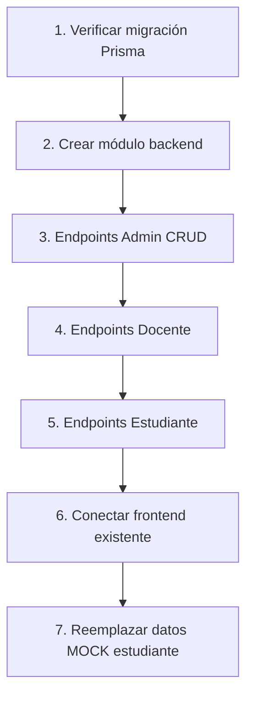

# AUDITORÍA SISTEMA DE PLANIFICACIONES

**Fecha:** 2025-11-26
**Branch:** `feature/planificaciones-v2`
**Objetivo:** Mapear estado actual antes de implementar planificaciones v2

---

## RESUMEN EJECUTIVO

El sistema de planificaciones tiene **dos implementaciones parciales incompatibles**:

1. **Sistema "Planificaciones Mensuales"** - Definido en Prisma pero sin backend
2. **Sistema "Planificaciones Simples"** - Con frontend pero sin backend ni schema

Ambos sistemas están **desconectados** - el frontend existe pero no hay APIs que lo soporten.

---

## 1. EXISTE Y FUNCIONA

### 1.1 Schema Prisma (Modelos definidos correctamente)

| Modelo                          | Ubicación                                                 | Estado             |
| ------------------------------- | --------------------------------------------------------- | ------------------ |
| `PlanificacionMensual`          | [schema.prisma:1617](apps/api/prisma/schema.prisma#L1617) | Definido, sin usar |
| `ActividadSemanal`              | [schema.prisma:1697](apps/api/prisma/schema.prisma#L1697) | Definido, sin usar |
| `AsignacionDocente`             | [schema.prisma:1763](apps/api/prisma/schema.prisma#L1763) | Definido, sin usar |
| `AsignacionActividadEstudiante` | [schema.prisma:1808](apps/api/prisma/schema.prisma#L1808) | Definido, sin usar |
| `ProgresoEstudianteActividad`   | [schema.prisma:1871](apps/api/prisma/schema.prisma#L1871) | Definido, sin usar |

**Enums definidos:**

- `EstadoPlanificacion` (BORRADOR, PUBLICADA, ARCHIVADA)
- `NivelDificultad` (BASICO, INTERMEDIO, AVANZADO, OLIMPICO)
- `EstadoAsignacion` (ACTIVA, PAUSADA, FINALIZADA, CANCELADA)

### 1.2 Frontend Admin - UI Completa

| Archivo           | Ubicación                                                                                                                                                        | Estado      |
| ----------------- | ---------------------------------------------------------------------------------------------------------------------------------------------------------------- | ----------- |
| Página principal  | [apps/web/src/app/admin/planificaciones/page.tsx](apps/web/src/app/admin/planificaciones/page.tsx)                                                               | UI completa |
| Tabla de listado  | [apps/web/src/app/admin/planificaciones/components/PlanificacionesTable.tsx](apps/web/src/app/admin/planificaciones/components/PlanificacionesTable.tsx)         | UI completa |
| Modal de creación | [apps/web/src/app/admin/planificaciones/components/CreatePlanificacionModal.tsx](apps/web/src/app/admin/planificaciones/components/CreatePlanificacionModal.tsx) | UI completa |
| Filtros           | [apps/web/src/app/admin/planificaciones/components/PlanificacionFilters.tsx](apps/web/src/app/admin/planificaciones/components/PlanificacionFilters.tsx)         | UI completa |

### 1.3 Frontend Estudiante - Estructura Base

| Archivo               | Ubicación                                                                                                                                                        | Estado                          |
| --------------------- | ---------------------------------------------------------------------------------------------------------------------------------------------------------------- | ------------------------------- |
| Vista entrenamientos  | [apps/web/src/app/estudiante/gimnasio/views/EntrenamientosView.tsx](apps/web/src/app/estudiante/gimnasio/views/EntrenamientosView.tsx)                           | Usa datos MOCK                  |
| Cliente planificación | [apps/web/src/app/estudiante/planificaciones/[codigo]/PlanificacionClient.tsx](apps/web/src/app/estudiante/planificaciones/%5Bcodigo%5D/PlanificacionClient.tsx) | Carga dinámicamente             |
| Datos mock 2025       | [apps/web/src/app/estudiante/gimnasio/data/planificaciones.ts](apps/web/src/app/estudiante/gimnasio/data/planificaciones.ts)                                     | 12 planificaciones hardcodeadas |

### 1.4 Frontend Docente - UI Completa

| Archivo                | Ubicación                                                                                              | Estado      |
| ---------------------- | ------------------------------------------------------------------------------------------------------ | ----------- |
| Página planificaciones | [apps/web/src/app/docente/planificaciones/page.tsx](apps/web/src/app/docente/planificaciones/page.tsx) | UI completa |

---

## 2. EXISTE PERO NO FUNCIONA

### 2.1 API Clients (Frontend) - Sin Backend

| Archivo                        | Ubicación                                                                                                  | Problema                                           |
| ------------------------------ | ---------------------------------------------------------------------------------------------------------- | -------------------------------------------------- |
| planificaciones.api.ts         | [apps/web/src/lib/api/planificaciones.api.ts](apps/web/src/lib/api/planificaciones.api.ts)                 | Endpoints `/planificaciones` NO EXISTEN en backend |
| planificaciones-simples.api.ts | [apps/web/src/lib/api/planificaciones-simples.api.ts](apps/web/src/lib/api/planificaciones-simples.api.ts) | Endpoints NO EXISTEN en backend                    |
| planificaciones.store.ts       | [apps/web/src/stores/planificaciones.store.ts](apps/web/src/stores/planificaciones.store.ts)               | Store completo pero sin API                        |

**Endpoints que el frontend espera pero NO EXISTEN:**

```
GET    /api/planificaciones           - Listar planificaciones
GET    /api/planificaciones/:id       - Obtener planificación
POST   /api/planificaciones           - Crear planificación
PATCH  /api/planificaciones/:id       - Actualizar planificación
DELETE /api/planificaciones/:id       - Eliminar planificación
POST   /api/planificaciones/:id/actividades - Agregar actividad

GET    /api/planificaciones/mis-planificaciones     - Para estudiantes
GET    /api/planificaciones/mis-asignaciones        - Para docentes
POST   /api/planificaciones/:codigo/progreso        - Guardar progreso
POST   /api/planificaciones/asignacion/:id/semana/:num/activar
```

### 2.2 Referencia a Modelo Inexistente

| Archivo                                                                                  | Línea | Problema                                                          |
| ---------------------------------------------------------------------------------------- | ----- | ----------------------------------------------------------------- |
| [docente-stats.service.ts](apps/api/src/docentes/services/docente-stats.service.ts#L635) | 635   | Usa `progresoEstudiantePlanificacion` que **NO EXISTE** en schema |

```typescript
// LÍNEA PROBLEMÁTICA - El modelo no existe
const progresoPlanificaciones = await this.prisma.progresoEstudiantePlanificacion.findMany({
```

---

## 3. NO EXISTE - Falta Crear

### 3.1 Backend - Módulo Planificaciones COMPLETO

```
apps/api/src/planificaciones/
├── planificaciones.module.ts           # Módulo NestJS
├── planificaciones.controller.ts       # Endpoints REST
├── planificaciones.service.ts          # Lógica de negocio
├── dto/
│   ├── create-planificacion.dto.ts
│   ├── update-planificacion.dto.ts
│   ├── create-actividad.dto.ts
│   └── asignar-planificacion.dto.ts
└── guards/
    └── planificacion-access.guard.ts   # Permisos por rol
```

### 3.2 Endpoints Necesarios

**Admin:**

- `GET /planificaciones` - Listar con filtros y paginación
- `GET /planificaciones/:id` - Detalle con actividades
- `POST /planificaciones` - Crear planificación
- `PATCH /planificaciones/:id` - Actualizar
- `DELETE /planificaciones/:id` - Eliminar
- `POST /planificaciones/:id/actividades` - Agregar actividad

**Docente:**

- `GET /planificaciones/mis-asignaciones` - Sus planificaciones asignadas
- `POST /planificaciones/asignacion/:id/semana/:num/activar`
- `POST /planificaciones/asignacion/:id/semana/:num/desactivar`
- `GET /planificaciones/asignacion/:id/progreso` - Ver progreso estudiantes

**Estudiante:**

- `GET /planificaciones/mis-planificaciones` - Planificaciones asignadas
- `GET /planificaciones/:codigo/progreso` - Su progreso
- `PUT /planificaciones/:codigo/progreso` - Guardar estado
- `POST /planificaciones/:codigo/progreso/completar-semana`

### 3.3 Migración Prisma

Aunque los modelos están definidos, hay que verificar si las tablas existen en la base de datos de producción:

```bash
npx prisma migrate status
```

---

## 4. DEPENDENCIAS - Orden de Implementación



### Orden Recomendado:

1. **Verificar/aplicar migración** - Asegurar que las tablas existan
2. **Crear planificaciones.module.ts** - Configurar módulo NestJS
3. **Crear planificaciones.service.ts** - CRUD básico
4. **Crear planificaciones.controller.ts** - Endpoints admin
5. **Agregar endpoints docente** - Asignaciones y semanas
6. **Agregar endpoints estudiante** - Progreso y estado
7. **Conectar frontend** - El frontend ya está listo, solo conectar
8. **Eliminar datos MOCK** - Reemplazar [planificaciones.ts](apps/web/src/app/estudiante/gimnasio/data/planificaciones.ts)

---

## 5. INCONSISTENCIAS DETECTADAS

### 5.1 Dos Sistemas Incompatibles

| Sistema                     | Frontend                                                                              | Backend | Schema                 |
| --------------------------- | ------------------------------------------------------------------------------------- | ------- | ---------------------- |
| "Planificaciones Mensuales" | [planificaciones.api.ts](apps/web/src/lib/api/planificaciones.api.ts)                 | NO      | `PlanificacionMensual` |
| "Planificaciones Simples"   | [planificaciones-simples.api.ts](apps/web/src/lib/api/planificaciones-simples.api.ts) | NO      | NO                     |

**Decisión necesaria:** Unificar en un solo sistema. El schema de `PlanificacionMensual` es más completo.

### 5.2 Tipos Diferentes

El frontend tiene tipos que no coinciden exactamente con el schema Prisma:

| Frontend Type           | Prisma Model           | Diferencias                                     |
| ----------------------- | ---------------------- | ----------------------------------------------- |
| `PlanificacionListItem` | `PlanificacionMensual` | `total_actividades` calculado vs relation count |
| `Actividad`             | `ActividadSemanal`     | `componente` vs `componente_nombre`             |

### 5.3 Datos Mock Hardcodeados

El estudiante ve datos fake de [planificaciones.ts](apps/web/src/app/estudiante/gimnasio/data/planificaciones.ts):

- 12 planificaciones 2025 hardcodeadas
- Estado `bloqueada` / `en-progreso` fijo
- No conectado a ninguna API

---

## 6. ARCHIVOS RELEVANTES (REFERENCIA RÁPIDA)

### Schema Prisma

- [apps/api/prisma/schema.prisma](apps/api/prisma/schema.prisma) - Modelos L1617-L1928

### Frontend Admin

- [apps/web/src/app/admin/planificaciones/](apps/web/src/app/admin/planificaciones/)
- [apps/web/src/app/admin/planificaciones-simples/](apps/web/src/app/admin/planificaciones-simples/)

### Frontend Estudiante

- [apps/web/src/app/estudiante/gimnasio/](apps/web/src/app/estudiante/gimnasio/)
- [apps/web/src/app/estudiante/planificaciones/](apps/web/src/app/estudiante/planificaciones/)

### Frontend Docente

- [apps/web/src/app/docente/planificaciones/](apps/web/src/app/docente/planificaciones/)

### API Clients

- [apps/web/src/lib/api/planificaciones.api.ts](apps/web/src/lib/api/planificaciones.api.ts)
- [apps/web/src/lib/api/planificaciones-simples.api.ts](apps/web/src/lib/api/planificaciones-simples.api.ts)

### Store

- [apps/web/src/stores/planificaciones.store.ts](apps/web/src/stores/planificaciones.store.ts)

### Types

- [apps/web/src/types/planificacion.types.ts](apps/web/src/types/planificacion.types.ts)

---

## 7. PRÓXIMOS PASOS

1. **DECIDIR** - ¿Usar `PlanificacionMensual` del schema o crear sistema nuevo?
2. **MIGRAR** - Verificar que las tablas existan en producción
3. **BACKEND** - Crear módulo `planificaciones` en NestJS
4. **CONECTAR** - El frontend ya existe, solo conectar APIs
5. **LIMPIAR** - Eliminar datos mock y sistema "simples" si no se usa

---

_Generado automáticamente - Branch: feature/planificaciones-v2_
