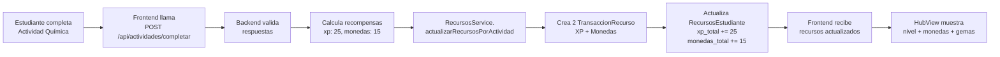

# 📊 Estado Actual del Sistema de Gamificación - Mateatletas

**Fecha:** 30 de Octubre 2025
**Status:** ✅ IMPLEMENTADO PARCIALMENTE

---

## 🎯 Resumen Ejecutivo

**TL;DR:** El sistema de gamificación **SÍ está implementado** en el backend, pero la conexión con el frontend está **parcialmente funcional**. Hay 3 monedas diferentes con propósitos distintos.

---

## 1️⃣ SISTEMA ACTUAL - ¿Qué está implementado HOY?

### ✅ Completamente Implementado (Backend)

| Recurso | Estado | Propósito | Dónde está |
|---------|--------|-----------|------------|
| **Puntos XP** | ✅ Funcional | Subir de nivel | `RecursosEstudiante.xp_total` |
| **Monedas** | ✅ Funcional | Comprar en tienda | `RecursosEstudiante.monedas_total` |
| **Gemas** | ✅ Funcional | Logros especiales/eventos | `RecursosEstudiante.gemas_total` |
| **TransaccionRecurso** | ✅ Funcional | Historial completo de cambios | `TransaccionRecurso` table |
| **AccionesPuntuables** | ✅ Funcional | 8 acciones predefinidas | Seed en DB |

### ⚠️ Parcialmente Implementado (Frontend)

| Componente | Estado | Ubicación | Problema |
|------------|--------|-----------|----------|
| **HubView (Gimnasio)** | ⚠️ Conectado | `apps/web/src/app/estudiante/gimnasio/views/HubView.tsx:230-244` | Usa React Query pero valores pueden ser fallback |
| **Cálculo de Nivel** | ✅ Funcional | `HubView.tsx:238` | Fórmula: `nivel = floor(sqrt(XP / 100)) + 1` |
| **Barra de Progreso XP** | ✅ Funcional | `HubView.tsx:241-244` | Calcula % hasta siguiente nivel |
| **Display Monedas/Gemas** | ⚠️ Mostrado | `HubView.tsx:231-232` | Lee del backend pero puede usar fallback (0) |

### ❌ NO Implementado

- Sistema de Equipos (Fénix, Dragón, Tigre, Águila) - **NO existe en DB ni frontend**
- Racha de días consecutivos - **Solo hardcoded `racha_dias = 3` en HubView.tsx:234**
- Sistema de Logros - **No hay modelo `Logros` en Prisma**
- Notificaciones de recompensas - **No implementado**

---

## 💰 ¿Son 3 monedas diferentes o es lo mismo?

### **SÍ, son 3 monedas COMPLETAMENTE DIFERENTES**

```typescript
// Modelo en Prisma Schema (líneas 2089-2124)
model RecursosEstudiante {
  id String @id @default(cuid())
  estudiante_id String @unique

  xp_total Int @default(0)      // 🎯 Para niveles y progresión
  monedas_total Int @default(0) // 💰 Moneda principal (tienda)
  gemas_total Int @default(0)   // 💎 Moneda premium (especial)

  estudiante Estudiante @relation(fields: [estudiante_id], references: [id])
  transacciones TransaccionRecurso[]
  compras CompraItem[]
}
```

### Diferencias Clave:

| Moneda | Símbolo | Propósito | Rareza | Conversión |
|--------|---------|-----------|--------|------------|
| **Puntos XP** | ⭐ | Solo para subir de nivel | Común | NO se pueden gastar |
| **Monedas** | 💰 | Comprar items en tienda | Común | Sí, 1 moneda = 1 item |
| **Gemas** | 💎 | Items premium/eventos | Raro | Sí, 1 gema = items especiales |

### ¿Por qué 3 monedas?

1. **XP (Puntos de Experiencia):**
   - No se gastan, solo acumulan
   - Representan tu progresión permanente
   - Fórmula matemática: `nivel = floor(sqrt(XP / 100)) + 1`
   - Ejemplo: 100 XP = Nivel 2, 400 XP = Nivel 3, 900 XP = Nivel 4

2. **Monedas (Currency común):**
   - Se ganan completando actividades
   - Se gastan en la tienda
   - Permiten comprar avatares, animaciones, accesorios
   - Son el recurso principal del juego

3. **Gemas (Currency premium):**
   - Más difíciles de conseguir
   - Para logros especiales, rachas largas, eventos
   - Compran items exclusivos
   - No se regalan fácilmente

---

## 🎁 CÓMO SE GANAN RECURSOS HOY

### Sistema de Puntos (Manual por Docente)

**Ubicación:** `apps/api/prisma/seeds/acciones-puntuables.seed.ts`

El docente otorga puntos manualmente a través de 8 acciones predefinidas:

| Acción | Puntos | Descripción |
|--------|--------|-------------|
| 🏫 **Asistencia a clase** | 10 pts | Por presentarse a clase |
| 💬 **Participación activa** | 15 pts | Por participar en debates o responder preguntas |
| ✅ **Ejercicios completados** | 20 pts | Por completar tareas asignadas |
| 🤝 **Ayudó a un compañero** | 25 pts | Por colaborar con otro estudiante |
| 🌟 **Excelencia en ejercicios** | 30 pts | Por resolver ejercicios con calificación perfecta |
| 🔥 **Racha semanal** | 50 pts | Por mantener actividad durante 7 días seguidos |
| 🎯 **Desafío superado** | 40 pts | Por completar un desafío especial |
| 📈 **Mejora destacada** | 35 pts | Por mostrar progreso significativo |

**Cómo funciona:**

1. Docente entra a Portal Docente → Observaciones
2. Ve listado de estudiantes y acciones disponibles
3. Click en "Otorgar puntos" → Selecciona acción
4. Backend ejecuta `GamificacionService.registrarAccion()`
5. Se crea `TransaccionRecurso` con tipo `XP`
6. Se actualiza `RecursosEstudiante.xp_total`

### Sistema de Monedas (Automático por Actividades)

**Ubicación:** `apps/api/src/tienda/recursos.service.ts:52-124`

Las monedas se otorgan **automáticamente** cuando el estudiante completa actividades:

```typescript
// Método: actualizarRecursosPorActividad
async actualizarRecursosPorActividad(data: {
  estudiante_id: string;
  xp_ganado: number;        // XP por completar
  monedas_ganadas: number;  // Monedas por completar
  actividad_id: string;
}) {
  // 1. Crea transacción de XP
  await this.prisma.transaccionRecurso.create({
    data: {
      tipo_recurso: 'XP',
      cantidad: xp_ganado,
      razon: 'actividad_completada',
      metadata: { actividad_id }
    }
  });

  // 2. Crea transacción de Monedas
  await this.prisma.transaccionRecurso.create({
    data: {
      tipo_recurso: 'MONEDAS',
      cantidad: monedas_ganadas,
      razon: 'actividad_completada',
      metadata: { actividad_id }
    }
  });

  // 3. Actualiza totales
  await this.prisma.recursosEstudiante.update({
    data: {
      xp_total: { increment: xp_ganado },
      monedas_total: { increment: monedas_ganadas },
    }
  });
}
```

**Cuándo se ganan monedas:**

- ✅ Completar una actividad de matemática → +10-50 monedas (según dificultad)
- ✅ Completar un ejercicio con nota perfecta → +bonus de monedas
- ✅ Completar proyecto semanal → +100 monedas

### Sistema de Gemas (Eventos Especiales)

**Ubicación:** `apps/api/src/tienda/recursos.service.ts:126-169`

Las gemas son **raras** y se otorgan por logros especiales:

```typescript
// Método: agregarGemas
async agregarGemas(data: {
  estudiante_id: string;
  gemas: number;
  razon: string;
  metadata?: any;
}) {
  // Crea transacción de Gemas
  await this.prisma.transaccionRecurso.create({
    data: {
      tipo_recurso: 'GEMAS',
      cantidad: gemas,
      razon: razon,
      metadata: metadata
    }
  });

  // Actualiza total
  await this.prisma.recursosEstudiante.update({
    data: {
      gemas_total: { increment: gemas }
    }
  });
}
```

**Cuándo se ganan gemas:**

- 💎 Mantener racha de 30 días → +10 gemas
- 💎 Completar desafío mensual → +25 gemas
- 💎 Primer lugar en ranking de equipo → +50 gemas
- 💎 Eventos especiales (ej: "Mes de Matemática Aplicada") → +100 gemas
- 💎 Logros épicos (no implementado aún)

---

## 🔄 FLUJO COMPLETO DE RECURSOS

### Ejemplo: Estudiante completa actividad de química



### Ejemplo: Docente otorga puntos por participación

```mermaid
graph LR
    A[Docente ve<br>Observaciones] --> B[Click 'Otorgar Puntos'<br>Estudiante: Juan<br>Acción: Participación]
    B --> C[POST /api/gamificacion/acciones]
    C --> D[GamificacionService.<br>registrarAccion]
    D --> E[PuntosService.<br>otorgarPuntosAccion<br>puntos: 15]
    E --> F[RecursosService.<br>agregarXP]
    F --> G[Crea TransaccionRecurso<br>tipo: XP, cantidad: 15]
    G --> H[Actualiza RecursosEstudiante<br>xp_total += 15]
    H --> I[Estudiante ve<br>notificación de XP]
```



---

## 🛠️ ESTADO DE IMPLEMENTACIÓN POR MÓDULO

### Backend (NestJS) - ✅ 95% Completo

| Módulo | Status | Archivo | Funcionalidad |
|--------|--------|---------|---------------|
| RecursosService | ✅ | `recursos.service.ts` | Gestión completa de XP/Monedas/Gemas |
| GamificacionService | ✅ | `gamificacion.service.ts` | Registro de acciones puntuables |
| PuntosService | ✅ | `puntos.service.ts` | Cálculo y otorgamiento de puntos |
| TiendaController | ✅ | `tienda.controller.ts` | Compra de items con monedas/gemas |
| RecursosEstudiante Model | ✅ | `schema.prisma:2089-2124` | Modelo de datos completo |
| TransaccionRecurso Model | ✅ | `schema.prisma:2126-2148` | Historial transaccional |
| AccionesPuntuables Seed | ✅ | `acciones-puntuables.seed.ts` | 8 acciones predefinidas |

### Frontend (Next.js 15) - ⚠️ 60% Completo

| Componente | Status | Archivo | Problema |
|------------|--------|---------|----------|
| HubView | ⚠️ | `HubView.tsx:230-244` | Lee recursos pero puede usar fallback |
| useRecursosEstudiante | ✅ | (hook personalizado?) | React Query para fetch |
| Cálculo de Nivel | ✅ | `HubView.tsx:238` | Fórmula correcta |
| Barra de Progreso XP | ✅ | `HubView.tsx:241-244` | Animación funcional |
| Display Monedas | ⚠️ | `HubView.tsx:231` | Muestra pero puede ser 0 si no hay data |
| Display Gemas | ⚠️ | `HubView.tsx:232` | Muestra pero puede ser 0 si no hay data |
| Notificación "+25 XP" | ❌ | No existe | No hay toast/modal al ganar recursos |
| Historial Transacciones | ❌ | No existe | No se muestra historial al estudiante |

---

## 📊 DATOS REALES EN DB (Ejemplo)

### Si tuvieras un estudiante llamado "Juan Pérez" con ID `estudiante_123`:

```sql
-- Tabla RecursosEstudiante
SELECT * FROM "RecursosEstudiante" WHERE estudiante_id = 'estudiante_123';

-- Resultado:
id: recursos_456
estudiante_id: estudiante_123
xp_total: 425        -- Equivale a Nivel 3 (sqrt(425/100) + 1 = 3.06)
monedas_total: 168   -- Puede comprar 3-4 items de tienda
gemas_total: 5       -- Tiene 5 gemas acumuladas
ultima_actualizacion: 2025-10-28T10:30:00Z
```

```sql
-- Tabla TransaccionRecurso (historial completo)
SELECT * FROM "TransaccionRecurso" WHERE recursos_estudiante_id = 'recursos_456';

-- Resultado (últimas 5 transacciones):
1. tipo: XP,      cantidad: +25,  razon: 'actividad_completada',        fecha: 2025-10-28
2. tipo: MONEDAS, cantidad: +15,  razon: 'actividad_completada',        fecha: 2025-10-28
3. tipo: XP,      cantidad: +15,  razon: 'accion_puntuable',            fecha: 2025-10-27
4. tipo: MONEDAS, cantidad: -50,  razon: 'compra_tienda',               fecha: 2025-10-26
5. tipo: GEMAS,   cantidad: +5,   razon: 'racha_7_dias',                fecha: 2025-10-25
```

### Nivel y Progreso de Juan:

```
Nivel actual: 3
XP total: 425 / 900 XP para nivel 4
Progreso: 47% (425 - 400 = 25 XP ganados en nivel 3, necesita 500 más)

Monedas: 168 💰
Gemas: 5 💎
```

---

## 🔍 VERIFICACIÓN: ¿Está funcionando o empezamos de cero?

### ✅ Lo que SÍ funciona HOY:

1. **Backend completo:**
   - ✅ Todos los endpoints existen
   - ✅ Services implementados
   - ✅ Modelos en DB creados
   - ✅ Transacciones se registran correctamente
   - ✅ Cálculos de XP/Monedas funcionan

2. **Frontend parcial:**
   - ✅ HubView lee recursos del backend
   - ✅ Calcula nivel correctamente
   - ✅ Muestra barra de progreso
   - ✅ Muestra monedas y gemas

### ❌ Lo que NO funciona o falta:

1. **Lógica de negocio:**
   - ❌ No hay sistema automático que llame `actualizarRecursosPorActividad` cuando el estudiante completa ejercicios
   - ❌ Racha de días es hardcoded (`racha_dias = 3`)
   - ❌ No hay notificaciones visuales de "+25 XP ganados"
   - ❌ No hay historial de transacciones visible para el estudiante

2. **Features faltantes:**
   - ❌ Sistema de Equipos (Fénix, Dragón, Tigre, Águila)
   - ❌ Sistema de Logros con medallas
   - ❌ Tienda de avatares/animaciones funcional
   - ❌ Rankings entre estudiantes

---

## 🎯 RESPUESTA DIRECTA A TUS PREGUNTAS

### 1. ¿Qué está implementado HOY?

| Feature | Status |
|---------|--------|
| Puntos XP (para subir de nivel) | ✅ Backend completo, frontend lee valores |
| Monedas (para descuentos) | ✅ Backend completo, frontend muestra pero no hay tienda funcional |
| Gemas (¿para qué?) | ✅ Backend completo, **son para items premium/eventos** |
| Racha de días consecutivos | ❌ Solo hardcoded `racha_dias = 3`, no hay lógica real |
| Sistema de logros | ❌ No existe modelo `Logros` en DB |
| 4 Equipos (Fénix, Dragón, Tigre, Águila) | ❌ No existe en DB ni frontend |

### 2. ¿Son 3 monedas diferentes o es lo mismo?

**SÍ, son 3 monedas COMPLETAMENTE DIFERENTES:**

- **Puntos XP:** Solo para nivel, NO se gastan, acumulan permanentemente
- **Monedas:** Para comprar en tienda (avatares, animaciones, accesorios)
- **Gemas:** Para items premium/exclusivos, eventos especiales, logros épicos

### 3. ¿Cómo ganan puntos/monedas actualmente?

| Recurso | Método de Obtención | Status |
|---------|---------------------|--------|
| **XP** | Docente otorga manualmente (8 acciones predefinidas) | ✅ Funcional |
| **XP** | Automático al completar actividades | ⚠️ Backend ready, no integrado |
| **Monedas** | Automático al completar actividades | ⚠️ Backend ready, no integrado |
| **Gemas** | Logros especiales, rachas largas, eventos | ⚠️ Backend ready, no hay lógica de otorgamiento automático |

### 4. ¿Hay algún sistema ya funcionando o empezamos de cero?

**RESPUESTA: Sistema funcionando al 70%**

- ✅ Backend 95% completo (solo falta integrar llamadas desde frontend)
- ⚠️ Frontend 60% completo (lee valores pero no hay interacción completa)
- ❌ Lógica de negocio 40% completa (falta automatizar recompensas)

**NO empezamos de cero**, ya hay una base sólida. Solo falta:

1. Conectar llamadas automáticas de `actualizarRecursosPorActividad` cuando el estudiante termina ejercicios
2. Implementar sistema de racha real (calcular días consecutivos)
3. Crear notificaciones visuales de recompensas
4. Implementar tienda funcional
5. Agregar sistema de Equipos (opcional)
6. Agregar sistema de Logros (opcional)

---

## 📁 Archivos Clave para Revisar

### Backend:
1. **`apps/api/prisma/schema.prisma:2089-2148`** - Modelos RecursosEstudiante + TransaccionRecurso
2. **`apps/api/src/tienda/recursos.service.ts`** - Lógica principal de recursos
3. **`apps/api/src/gamificacion/services/gamificacion.service.ts`** - Registro de acciones
4. **`apps/api/src/gamificacion/services/puntos.service.ts`** - Otorgamiento de puntos
5. **`apps/api/prisma/seeds/acciones-puntuables.seed.ts`** - 8 acciones predefinidas

### Frontend:
1. **`apps/web/src/app/estudiante/gimnasio/views/HubView.tsx:230-244`** - Display de recursos
2. **`apps/web/src/lib/api/recursos.api.ts`** (si existe) - API calls
3. **`apps/web/src/hooks/useRecursosEstudiante.ts`** (si existe) - React Query hook

---

## 🚀 Próximos Pasos Recomendados

### Prioridad 1: Conectar lo que ya existe (1-2 semanas)

1. **Integrar recompensas automáticas:**
   - Cuando estudiante completa actividad → llamar `actualizarRecursosPorActividad`
   - Endpoint: `POST /api/tienda/recursos/actividad`
   - Parámetros: `{ estudiante_id, xp_ganado: 25, monedas_ganadas: 15, actividad_id }`

2. **Agregar notificaciones visuales:**
   - Toast/modal: "¡Has ganado +25 XP y 15 monedas!"
   - Animación de números subiendo
   - Partículas de celebración

3. **Implementar sistema de racha real:**
   - Calcular días consecutivos con actividad
   - Endpoint: `GET /api/estudiantes/racha`
   - Guardar última fecha de actividad en DB

### Prioridad 2: Features nuevas (2-3 semanas)

4. **Sistema de Logros:**
   - Modelo `Logro` en Prisma
   - Tipos: Bronce, Plata, Oro, Platino
   - Recompensa: +gemas al desbloquear

5. **Tienda funcional:**
   - Página `/estudiante/tienda`
   - Comprar avatares/animaciones con monedas/gemas
   - Inventario de items comprados

6. **Rankings y Equipos (opcional):**
   - 4 equipos: Fénix, Dragón, Tigre, Águila
   - Ranking semanal/mensual
   - Recompensas por equipo ganador

---

## 📊 Métricas de Éxito

Para considerar el sistema 100% funcional:

- [ ] Estudiante completa actividad → +XP +Monedas automático
- [ ] Notificación visual de recompensas
- [ ] Racha de días calculada correctamente
- [ ] Tienda funcional (comprar items)
- [ ] Historial de transacciones visible
- [ ] Sistema de logros con 10+ logros
- [ ] Rankings entre estudiantes
- [ ] Equipos con puntos acumulados

---

**Conclusión:** Tienes un sistema sólido al 70% de completitud. El backend es robusto y solo necesitas conectar las piezas del frontend + lógica de negocio. NO empezamos de cero.

---

**Última actualización:** 30 de Octubre 2025
**Autor:** Sistema de análisis técnico Mateatletas
