# 🎯 ARQUITECTURA COMPLETA - FLUJO DOCENTE

**Fecha**: 27 de Octubre 2025
**Autor**: Claude Code
**Estado**: En Implementación

---

## 📋 TABLA DE CONTENIDOS

1. [Resumen Ejecutivo](#resumen-ejecutivo)
2. [Schema de Base de Datos](#schema-de-base-de-datos)
3. [Endpoints Existentes](#endpoints-existentes)
4. [Endpoints a Crear](#endpoints-a-crear)
5. [Flujo de Usuario](#flujo-de-usuario)
6. [Plan de Implementación](#plan-de-implementación)

---

## 🎯 RESUMEN EJECUTIVO

### Objetivo
Crear un sistema COMPLETO y ROBUSTO para que los docentes puedan:
1. Ver detalles completos de sus grupos
2. Tomar asistencia en tiempo real durante la clase
3. Agregar observaciones (grupo e individuales)
4. Asignar puntos a estudiantes
5. Ver tareas asignadas y completadas
6. Gestionar todo el ciclo de vida de una clase

### Principios de Diseño
- ✅ **NO `any` NI `unknown`**: TypeScript estricto
- ✅ **BRUTAL**: Información concreta, no ambigua
- ✅ **DRY**: No duplicar código
- ✅ **Escalable**: Preparado para Admin → Docente → Estudiante → Tutor
- ✅ **Performante**: Queries optimizados con Prisma

---

## 🗄️ SCHEMA DE BASE DE DATOS

### Modelos Clave para el Flujo Docente

#### 1. **ClaseGrupo** (`clase_grupos`)
```prisma
model ClaseGrupo {
  id                  String     @id @default(cuid())
  codigo              String     // "L4", "ROBLOX1", etc.
  nombre              String     @unique
  tipo                TipoClaseGrupo
  dia_semana          DiaSemana
  hora_inicio         String     // "19:30"
  hora_fin            String     // "21:00"
  cupo_maximo         Int
  docente_id          String
  grupo_id            String
  ruta_curricular_id  String?
  sector_id           String?
  activo              Boolean

  // Relaciones
  docente             Docente
  inscripciones       InscripcionClaseGrupo[]
  asistencias         AsistenciaClaseGrupo[]
}
```

#### 2. **InscripcionClaseGrupo** (`inscripciones_clase_grupo`)
```prisma
model InscripcionClaseGrupo {
  id                String      @id @default(cuid())
  clase_grupo_id    String
  estudiante_id     String
  tutor_id          String
  fecha_inscripcion DateTime
  activo            Boolean

  // Relaciones
  claseGrupo        ClaseGrupo
  estudiante        Estudiante
  tutor             Tutor
}
```

#### 3. **AsistenciaClaseGrupo** (`asistencias_clase_grupo`)
```prisma
model AsistenciaClaseGrupo {
  id                String            @id @default(cuid())
  clase_grupo_id    String
  estudiante_id     String
  fecha             DateTime          // Fecha específica de la clase
  estado            EstadoAsistencia  // Presente, Ausente, Justificado
  observaciones     String?           // ⭐ OBSERVACIONES INDIVIDUALES
  feedback          String?

  @@unique([clase_grupo_id, estudiante_id, fecha])
}
```

#### 4. **PuntoObtenido** (`puntos_obtenidos`)
```prisma
model PuntoObtenido {
  id             String   @id @default(cuid())
  estudiante_id  String
  docente_id     String
  accion_id      String   // Referencia a AccionPuntuable
  puntos         Int
  contexto       String?  // Descripción adicional
  fecha          DateTime

  // Relaciones
  estudiante     Estudiante
  docente        Docente
  accion         AccionPuntuable
}
```

#### 5. **AccionPuntuable** (`acciones_puntuables`)
```prisma
model AccionPuntuable {
  id          String  @id @default(cuid())
  nombre      String  @unique  // "Participación activa", "Tarea completada"
  descripcion String
  puntos      Int
  activo      Boolean
}
```

#### 6. **Tarea** (`tareas`)
```prisma
model Tarea {
  id                        String      @id @default(cuid())
  evento_id                 String      @unique
  estado                    EstadoTarea // PENDIENTE, EN_PROGRESO, COMPLETADA
  porcentaje_completado     Int
  clase_relacionada_id      String?
  estudiante_relacionado_id String?

  evento                    Evento
}
```

---

## ✅ ENDPOINTS EXISTENTES

### 1. **Grupos** (`/api/grupos`)
- ✅ `GET /grupos` - Listar todos los grupos
- ✅ `GET /grupos/:id` - Obtener un grupo específico
- ✅ `POST /grupos` - Crear grupo (Admin)
- ✅ `PUT /grupos/:id` - Actualizar grupo (Admin)
- ✅ `DELETE /grupos/:id` - Eliminar grupo (Admin)

### 2. **Asistencia** (`/api/asistencia`)
- ✅ `POST /asistencia/clases/:claseId/estudiantes/:estudianteId` - Marcar asistencia individual
- ✅ `GET /asistencia/clases/:claseId` - Obtener roster de asistencia
- ✅ `GET /asistencia/clases/:claseId/estadisticas` - Estadísticas de clase
- ✅ `GET /asistencia/estudiantes/:estudianteId` - Historial estudiante
- ✅ `GET /asistencia/docente/resumen` - Resumen del docente
- ✅ `GET /asistencia/docente/observaciones` - Observaciones del docente
- ✅ `GET /asistencia/docente/reportes` - Reportes del docente

### 3. **Gamificación** (`/api/gamificacion`)
- ✅ `GET /gamificacion/acciones` - Lista de acciones puntuables
- ✅ `POST /gamificacion/puntos` - Otorgar puntos a estudiante
- ✅ `GET /gamificacion/dashboard/:estudianteId` - Dashboard del estudiante
- ✅ `GET /gamificacion/puntos/:estudianteId` - Puntos del estudiante
- ✅ `GET /gamificacion/historial/:estudianteId` - Historial de puntos

### 4. **Docentes** (`/api/docentes`)
- ✅ `GET /docentes/me/dashboard` - Dashboard BRUTAL con datos concretos
- ✅ `GET /docentes/me` - Perfil del docente
- ✅ `PATCH /docentes/me` - Actualizar perfil

---

## 🚀 ENDPOINTS A CREAR

### 1. **GET `/api/clase-grupos/:id/detalle-completo`**
**Descripción**: Obtiene TODA la información necesaria para la vista de detalles del grupo

**Response**:
```typescript
interface GrupoDetalleCompleto {
  // Info básica del grupo
  id: string;
  nombre: string;
  codigo: string;
  dia_semana: string;
  hora_inicio: string;
  hora_fin: string;
  cupo_maximo: number;
  rutaCurricular: {
    id: string;
    nombre: string;
    color: string;
  } | null;

  // Estudiantes inscritos CON STATS
  estudiantes: Array<{
    id: string;
    nombre: string;
    apellido: string;
    avatar_url: string | null;
    equipo: {
      nombre: string;
      color: string;
    } | null;
    stats: {
      puntosTotal number;
      clasesAsistidas: number;
      porcentajeAsistencia: number;
      tareasCompletadas: number;
      tareasTotal: number;
      ultimaAsistencia: string | null;
    };
  }>;

  // Tareas del grupo
  tareas: Array<{
    id: string;
    titulo: string;
    descripcion: string;
    fecha_entrega: string;
    estado: string;
    estudiantesCompletaron: string[]; // IDs de estudiantes que completaron
    estudiantesPendientes: string[];  // IDs de estudiantes pendientes
  }>;

  // Observaciones recientes del grupo
  observacionesRecientes: Array<{
    id: string;
    estudiante: {
      id: string;
      nombre: string;
      apellido: string;
    };
    observacion: string;
    fecha: string;
    tipo: 'positiva' | 'neutral' | 'atencion';
  }>;

  // Stats del grupo
  stats: {
    totalEstudiantes: number;
    asistenciaPromedio: number;
    puntosPromedio: number;
    tareasCompletadasPromedio: number;
  };

  // Próxima clase
  proximaClase: {
    fecha: string;
    hora: string;
    minutosParaEmpezar: number | null;
  } | null;
}
```

### 2. **POST `/api/asistencia/clase-grupo/batch`**
**Descripción**: Tomar asistencia de múltiples estudiantes en una sola request (para modo "En Vivo")

**Body**:
```typescript
interface TomarAsistenciaBatchDto {
  clase_grupo_id: string;
  fecha: string; // ISO date
  asistencias: Array<{
    estudiante_id: string;
    estado: 'Presente' | 'Ausente' | 'Justificado';
    observaciones?: string;
  }>;
}
```

**Response**:
```typescript
interface AsistenciaBatchResponse {
  success: true;
  registrosCreados: number;
  registrosActualizados: number;
  estudiantes: Array<{
    estudiante_id: string;
    estado: string;
    observaciones: string | null;
  }>;
}
```

### 3. **POST `/api/clase-grupos/:id/observacion-grupo`**
**Descripción**: Agregar observación general del grupo (no de estudiante individual)

**Body**:
```typescript
interface ObservacionGrupoDto {
  fecha: string; // ISO date
  observacion: string;
  tipo: 'general' | 'academica' | 'comportamiento';
}
```

### 4. **GET `/api/clase-grupos/:id/proxima-clase`**
**Descripción**: Obtener información sobre la próxima clase del grupo

**Response**:
```typescript
interface ProximaClaseInfo {
  grupoId: string;
  grupoNombre: string;
  fecha: string; // Próximo día que coincide con dia_semana
  hora_inicio: string;
  hora_fin: string;
  minutosParaEmpezar: number | null; // null si no es hoy
  estudiantesInscritos: number;
  estudiantesPresentes: number; // Si ya se tomó asistencia hoy
  yaTomoAsistencia: boolean;
}
```

---

## 👤 FLUJO DE USUARIO

### FLUJO COMPLETO DEL DOCENTE

```mermaid
graph TD
    A[Dashboard Docente] --> B{Ve sus 6 grupos}
    B --> C[Click en 'Ver Detalles' de un grupo]
    C --> D[Página: Detalles del Grupo]

    D --> E[Ve lista de estudiantes con stats]
    D --> F[Ve tareas asignadas]
    D --> G[Ve observaciones recientes]
    D --> H[Ve stats del grupo]

    D --> I{Hay clase HOY?}
    I -->|SÍ| J[Botón 'INICIAR CLASE AHORA' visible]
    I -->|NO| K[Botón deshabilitado]

    J --> L[Click en 'INICIAR CLASE']
    L --> M[Modal: Toma de Asistencia EN VIVO]

    M --> N[Ve lista de estudiantes del grupo]
    N --> O[Marca Presente/Ausente/Justificado]
    N --> P[Agrega observaciones individuales]
    N --> Q[Asigna puntos rápidos]

    O --> R[Click 'GUARDAR ASISTENCIA']
    R --> S[POST /asistencia/clase-grupo/batch]
    S --> T[Asistencia guardada ✅]

    T --> U[Vuelve a Detalles del Grupo]
    U --> V[Ve asistencia actualizada]
```



---

## 🛠️ PLAN DE IMPLEMENTACIÓN

### FASE 1: BACKEND - Endpoints Nuevos (1-2 horas)

#### Paso 1.1: Crear endpoint `GET /clase-grupos/:id/detalle-completo`
**Archivo**: `apps/api/src/planificaciones/infrastructure/grupos.controller.ts`

```typescript
@Get(':id/detalle-completo')
@Roles(Role.Docente, Role.Admin)
async getDetalleCompleto(
  @Param('id') id: string,
  @GetUser() user: AuthUser,
) {
  // Query complejo con Prisma
  // Include: estudiantes, inscripciones, asistencias, puntos, tareas
  // Calcular stats en el servicio
}
```

#### Paso 1.2: Crear endpoint `POST /asistencia/clase-grupo/batch`
**Archivo**: `apps/api/src/asistencia/asistencia.controller.ts`

```typescript
@Post('clase-grupo/batch')
@Roles(Role.Docente)
async tomarAsistenciaBatch(
  @Body() dto: TomarAsistenciaBatchDto,
  @GetUser() user: AuthUser,
) {
  // Usar transaction de Prisma
  // Crear o actualizar múltiples registros de asistencia
  // Verificar que el docente es el titular del grupo
}
```

#### Paso 1.3: Crear DTOs TypeScript
**Archivo**: `apps/api/src/asistencia/dto/tomar-asistencia-batch.dto.ts`

```typescript
import { IsString, IsArray, ValidateNested, IsEnum, IsOptional } from 'class-validator';
import { Type } from 'class-transformer';
import { EstadoAsistencia } from '@prisma/client';

export class AsistenciaItemDto {
  @IsString()
  estudiante_id!: string;

  @IsEnum(EstadoAsistencia)
  estado!: EstadoAsistencia;

  @IsOptional()
  @IsString()
  observaciones?: string;
}

export class TomarAsistenciaBatchDto {
  @IsString()
  clase_grupo_id!: string;

  @IsString()
  fecha!: string;

  @IsArray()
  @ValidateNested({ each: true })
  @Type(() => AsistenciaItemDto)
  asistencias!: AsistenciaItemDto[];
}
```

---

### FASE 2: FRONTEND - API Client (30 min)

#### Paso 2.1: Crear tipos TypeScript
**Archivo**: `apps/web/src/lib/api/grupos.api.ts`

```typescript
export interface EstudianteConStats {
  id: string;
  nombre: string;
  apellido: string;
  avatar_url: string | null;
  equipo: {
    nombre: string;
    color: string;
  } | null;
  stats: {
    puntosTotal: number;
    clasesAsistidas: number;
    porcentajeAsistencia: number;
    tareasCompletadas: number;
    tareasTotal: number;
    ultimaAsistencia: string | null;
  };
}

export interface TareaGrupo {
  id: string;
  titulo: string;
  descripcion: string;
  fecha_entrega: string;
  estado: string;
  estudiantesCompletaron: string[];
  estudiantesPendientes: string[];
}

export interface GrupoDetalleCompleto {
  id: string;
  nombre: string;
  codigo: string;
  dia_semana: string;
  hora_inicio: string;
  hora_fin: string;
  cupo_maximo: number;
  rutaCurricular: {
    id: string;
    nombre: string;
    color: string;
  } | null;
  estudiantes: EstudianteConStats[];
  tareas: TareaGrupo[];
  observacionesRecientes: Array<{
    id: string;
    estudiante: {
      id: string;
      nombre: string;
      apellido: string;
    };
    observacion: string;
    fecha: string;
    tipo: 'positiva' | 'neutral' | 'atencion';
  }>;
  stats: {
    totalEstudiantes: number;
    asistenciaPromedio: number;
    puntosPromedio: number;
    tareasCompletadasPromedio: number;
  };
  proximaClase: {
    fecha: string;
    hora: string;
    minutosParaEmpezar: number | null;
  } | null;
}

// Funciones API
export const gruposApi = {
  getDetalleCompleto: async (id: string): Promise<GrupoDetalleCompleto> => {
    const response = await apiClient.get<GrupoDetalleCompleto>(`/clase-grupos/${id}/detalle-completo`);
    return response;
  },
};
```

#### Paso 2.2: Crear API de asistencia batch
**Archivo**: `apps/web/src/lib/api/asistencia.api.ts` (agregar)

```typescript
export interface AsistenciaItem {
  estudiante_id: string;
  estado: 'Presente' | 'Ausente' | 'Justificado';
  observaciones?: string;
}

export interface TomarAsistenciaBatchRequest {
  clase_grupo_id: string;
  fecha: string;
  asistencias: AsistenciaItem[];
}

export const tomarAsistenciaBatch = async (
  data: TomarAsistenciaBatchRequest
): Promise<{ success: boolean; registrosCreados: number }> => {
  const response = await apiClient.post('/asistencia/clase-grupo/batch', data);
  return response;
};
```

---

### FASE 3: FRONTEND - Página de Detalles BRUTAL (2-3 horas)

#### Paso 3.1: Crear página de detalles
**Archivo**: `apps/web/src/app/docente/grupos/[id]/page.tsx` (reescribir completa)

**Estructura**:
1. **Header BRUTAL**: Nombre del grupo, código, día/hora
2. **Stats Cards**: 4 cards con totales (estudiantes, asistencia, puntos, tareas)
3. **Botón INICIAR CLASE HOY**: Solo visible si hay clase hoy
4. **Tabs**:
   - Tab 1: **ESTUDIANTES** (lista con stats, puntos, asistencia)
   - Tab 2: **TAREAS** (asignadas, completadas/pendientes)
   - Tab 3: **OBSERVACIONES** (historial de observaciones)
   - Tab 4: **ESTADÍSTICAS** (gráficos y reportes)

#### Paso 3.2: Crear modal de asistencia en vivo
**Archivo**: `apps/web/src/components/docente/ModalAsistenciaEnVivo.tsx`

**Funcionalidades**:
- Lista de estudiantes con avatares
- Botones rápidos: Presente / Ausente / Justificado
- Campo de observación por estudiante
- Botón "+ PUNTOS" rápido (abre mini-modal)
- Contador de presentes/ausentes en tiempo real
- Botón "GUARDAR TODO" (llama al endpoint batch)

---

### FASE 4: TESTING & REFINAMIENTO (1 hora)

1. Probar flujo completo
2. Verificar performance de queries
3. Ajustar tipos TypeScript si hay errores
4. Pulir UX/UI

---

## 📊 ESTIMACIÓN DE TIEMPO

| Fase | Descripción | Tiempo Estimado |
|------|-------------|-----------------|
| Fase 1 | Backend - Endpoints nuevos | 1-2 horas |
| Fase 2 | Frontend - API Client | 30 min |
| Fase 3 | Frontend - UI/UX BRUTAL | 2-3 horas |
| Fase 4 | Testing & Refinamiento | 1 hora |
| **TOTAL** | **Implementación completa** | **4-6 horas** |

---

## ✅ CHECKLIST DE IMPLEMENTACIÓN

### Backend
- [ ] Crear endpoint `GET /clase-grupos/:id/detalle-completo`
- [ ] Crear endpoint `POST /asistencia/clase-grupo/batch`
- [ ] Crear DTOs con class-validator
- [ ] Testear endpoints con Postman/Insomnia
- [ ] Verificar performance de queries (índices Prisma)

### Frontend
- [ ] Crear tipos TypeScript (NO `any`, NO `unknown`)
- [ ] Crear funciones API client
- [ ] Reescribir página de detalles de grupo
- [ ] Crear modal de asistencia en vivo
- [ ] Crear componente de asignación rápida de puntos
- [ ] Integrar con diseño BRUTAL (purple, yellow, glassmorphism)

### Testing
- [ ] Probar flujo: Dashboard → Detalles → Iniciar Clase → Tomar Asistencia
- [ ] Verificar que stats se actualizan en tiempo real
- [ ] Probar con datos reales (tus 6 grupos)
- [ ] Verificar que no hay errores TypeScript
- [ ] Probar responsive (mobile/tablet/desktop)

---

## 🎨 MOCKUP DE DISEÑO BRUTAL

### Página: Detalles del Grupo

```
┌────────────────────────────────────────────────────────────┐
│  ← Volver    DETALLES DEL GRUPO                            │
├────────────────────────────────────────────────────────────┤
│                                                             │
│  📚 L4 - LUNES 17:00-19:00                                 │
│  Programación Básica • 15 estudiantes                      │
│                                                             │
│  [🚀 INICIAR CLASE AHORA] ← Solo visible si hay clase hoy │
│                                                             │
├────────────────────────────────────────────────────────────┤
│  ┌──────┐  ┌──────┐  ┌──────┐  ┌──────┐                  │
│  │  15  │  │ 95%  │  │ 1250 │  │ 12/15│                  │
│  │👥Est │  │✅Asis│  │⭐Pts │  │📝Tar │                  │
│  └──────┘  └──────┘  └──────┘  └──────┘                  │
├────────────────────────────────────────────────────────────┤
│                                                             │
│  [ESTUDIANTES] [TAREAS] [OBSERVACIONES] [ESTADÍSTICAS]    │
│                                                             │
│  ┌────────────────────────────────────────────────────┐   │
│  │ 👤 Clara Sanchez                          1250 pts │   │
│  │    📊 95% asistencia • 12/12 tareas • 🔥 15 días   │   │
│  ├────────────────────────────────────────────────────┤   │
│  │ 👤 Sofia Rodriguez                        1100 pts │   │
│  │    📊 90% asistencia • 11/12 tareas • 🔥 10 días   │   │
│  └────────────────────────────────────────────────────┘   │
│                                                             │
└────────────────────────────────────────────────────────────┘
```

---

## 🔐 SEGURIDAD Y VALIDACIONES

### Backend
1. ✅ Verificar que el docente autenticado sea el titular del grupo
2. ✅ Validar que la fecha de asistencia sea válida (no futuro lejano)
3. ✅ Validar que los estudiantes pertenezcan al grupo
4. ✅ Prevenir SQL injection con Prisma (ya incluido)
5. ✅ Rate limiting en endpoints sensibles

### Frontend
1. ✅ Validar inputs antes de enviar
2. ✅ Mostrar loaders mientras se guarda
3. ✅ Mostrar mensajes de error claros
4. ✅ Confirmación antes de guardar asistencia
5. ✅ Deshabilitar botón de guardar mientras procesa

---

## 🚀 PRÓXIMOS PASOS (POST-IMPLEMENTACIÓN)

1. **Integrar con Admin**: Que el admin pueda ver y editar todo
2. **Portal de Estudiantes**: Ver sus propias stats, tareas, observaciones
3. **Portal de Tutores**: Ver progreso de sus hijos
4. **Notificaciones**: Avisar a tutores de faltas/observaciones
5. **Reportes PDF**: Exportar reportes mensuales
6. **Gráficos avanzados**: Chart.js para visualizaciones

---

## 📝 NOTAS IMPORTANTES

- **NO usar `any` ni `unknown`**: TypeScript estricto en TODO el código
- **Queries optimizados**: Usar `select` y `include` de Prisma inteligentemente
- **Transacciones**: Usar `prisma.$transaction` para operaciones batch
- **Índices**: Verificar que existan índices en `clase_grupo_id`, `estudiante_id`, `fecha`
- **Error handling**: Try/catch en TODOS los servicios con logs descriptivos

---

## 🎉 RESULTADO FINAL

Un sistema COMPLETO, ROBUSTO y BRUTAL que permite a los docentes:
- ✅ Ver detalles completos de sus grupos
- ✅ Tomar asistencia rápida durante la clase
- ✅ Agregar observaciones individuales y de grupo
- ✅ Asignar puntos en tiempo real
- ✅ Ver tareas completadas/pendientes
- ✅ Tener visibilidad total del progreso del grupo

**Todo con TypeScript estricto, sin `any` ni `unknown`, siguiendo los principios SOLID y con diseño BRUTAL** 🚀

---

**Documento creado por Claude Code**
**Última actualización**: 27 de Octubre 2025
