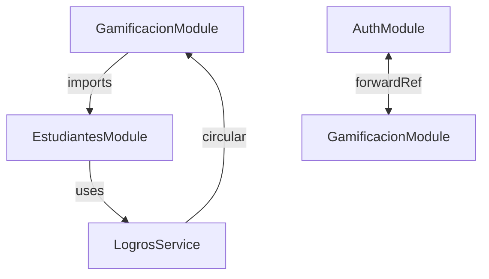

# 🔍 Auditoría Completa del Backend - Mateatletas API

**Fecha**: 2025-11-12
**Autor**: Claude Code (Anthropic)
**Estado**: ✅ Completado
**Versión**: 1.0

---

## 📊 Executive Summary

### Estadísticas Generales

| Métrica            | Cantidad |
| ------------------ | -------- |
| **Controladores**  | 27       |
| **Servicios**      | 51       |
| **Modelos Prisma** | 77       |
| **DTOs**           | 69       |
| **Guards**         | 8        |
| **Interceptors**   | 2        |
| **Módulos**        | 24       |
| **Líneas Totales** | ~50,000+ |

### 🔴 Top 5 Problemas Críticos

1. **God Services**: 8 servicios con >500 líneas y alta complejidad ciclomática
   - `estudiantes.service.ts` (1,293 líneas) - Responsabilidad masiva
   - `clases.service.ts` (1,145 líneas) - Mezcla lógica de negocio y orquestación
   - `admin.service.ts` (878 líneas) - Facade para 10+ módulos

2. **Modelo de Base de Datos No Normalizado**
   - JSON fields que deberían ser relaciones (`Docente.disponibilidad_horaria`, roles en `Usuario`)
   - 15+ campos `Json` que ocultan estructura relacional
   - Falta de índices en columnas críticas de búsqueda

3. **Circular Dependencies entre Módulos**
   - `AuthModule` ↔ `GamificacionModule` (forwardRef mutuo)
   - `GamificacionModule` → `EstudiantesModule` → `LogrosService` → `GamificacionModule`
   - Dificulta testing unitario y mantenimiento

4. **Inconsistencia en DTOs y Validación**
   - Mezcla de `snake_case` y `camelCase` en nombres de campos
   - DTOs sin decoradores de validación (`class-validator`)
   - Falta de documentación Swagger en muchos DTOs

5. **God Module (AppModule)**
   - 20+ imports directos en AppModule
   - Debería delegar a módulos de dominio (CoreModule, SharedModule)
   - Dificulta tree-shaking y lazy loading

### 💰 Complejidad Estimada del Refactor

| Fase                                       | Esfuerzo          | Riesgo   | Prioridad |
| ------------------------------------------ | ----------------- | -------- | --------- |
| **Fase 1**: Cleanup y Code Smells          | 2-3 semanas       | 🟢 BAJO  | ⚡ ALTA   |
| **Fase 2**: Normalizar DTOs y Validaciones | 1-2 semanas       | 🟢 BAJO  | ⚡ ALTA   |
| **Fase 3**: Refactor de God Services       | 4-6 semanas       | 🟡 MEDIO | 🔵 MEDIA  |
| **Fase 4**: Resolver Circular Dependencies | 2-3 semanas       | 🟡 MEDIO | 🔵 MEDIA  |
| **Fase 5**: Normalización de Schema DB     | 6-8 semanas       | 🔴 ALTO  | 🟣 BAJA   |
| **TOTAL**                                  | **15-22 semanas** | -        | -         |

**⚠️ Recomendación**: Priorizar Fases 1 y 2 (bajo riesgo, alto impacto). Postponer Fase 5 hasta tener >80% de cobertura de tests.

---

## 📂 Inventario Detallado: Controladores

### Resumen por Complejidad

| Complejidad | Cantidad | Porcentaje |
| ----------- | -------- | ---------- |
| 🔴 HIGH     | 7        | 26%        |
| 🟡 MEDIUM   | 12       | 44%        |
| 🟢 LOW      | 8        | 30%        |

### Tabla Completa de Controladores

| #   | Controlador                          | Endpoints | Complejidad | Líneas | Problemas Identificados                                                       |
| --- | ------------------------------------ | --------- | ----------- | ------ | ----------------------------------------------------------------------------- |
| 1   | `admin.controller.ts`                | 15+       | 🔴 HIGH     | ~400   | God Object, múltiples responsabilidades (usuarios, estudiantes, pagos, stats) |
| 2   | `estudiantes.controller.ts`          | 12        | 🔴 HIGH     | ~350   | console.log en línea 89, mezcla CRUD con lógica de negocio                    |
| 3   | `clases.controller.ts`               | 10        | 🔴 HIGH     | ~320   | Endpoints complejos (reservas, asistencia, validaciones)                      |
| 4   | `inscripciones-2026.controller.ts`   | 8         | 🔴 HIGH     | ~280   | Lógica de workflow compleja, estados múltiples                                |
| 5   | `pagos.controller.ts`                | 9         | 🔴 HIGH     | ~300   | Webhooks MercadoPago, manejo de estados de pago                               |
| 6   | `cursos.controller.ts`               | 11        | 🔴 HIGH     | ~290   | CRUD + progreso + certificados, múltiples responsabilidades                   |
| 7   | `gamificacion.controller.ts`         | 7         | 🔴 HIGH     | ~250   | Lógica de puntos, logros, ranking                                             |
| 8   | `docentes.controller.ts`             | 8         | 🟡 MEDIUM   | ~200   | CRUD + disponibilidad, relativamente limpio                                   |
| 9   | `asistencia.controller.ts`           | 6         | 🟡 MEDIUM   | ~180   | Registro de asistencias, validaciones de horarios                             |
| 10  | `auth.controller.ts`                 | 8         | 🟡 MEDIUM   | ~350   | Login, registro, 2FA, recuperación contraseña                                 |
| 11  | `calendario.controller.ts`           | 5         | 🟡 MEDIUM   | ~150   | Eventos, disponibilidad                                                       |
| 12  | `catalogo.controller.ts`             | 6         | 🟡 MEDIUM   | ~170   | Productos, suscripciones                                                      |
| 13  | `colonia.controller.ts`              | 7         | 🟡 MEDIUM   | ~190   | Inscripciones colonia, webhooks                                               |
| 14  | `comunicacion.controller.ts`         | 4         | 🟡 MEDIUM   | ~140   | Notificaciones, mensajes                                                      |
| 15  | `equipos.controller.ts`              | 5         | 🟡 MEDIUM   | ~130   | Gestión de equipos                                                            |
| 16  | `eventos.controller.ts`              | 4         | 🟡 MEDIUM   | ~120   | Calendario de eventos                                                         |
| 17  | `lecciones.controller.ts`            | 6         | 🟡 MEDIUM   | ~160   | CRUD lecciones                                                                |
| 18  | `niveles.controller.ts`              | 5         | 🟡 MEDIUM   | ~140   | Niveles de estudiantes                                                        |
| 19  | `recursos-compartidos.controller.ts` | 4         | 🟡 MEDIUM   | ~110   | Compartir recursos                                                            |
| 20  | `app.controller.ts`                  | 1         | 🟢 LOW      | ~30    | ✅ Limpio después de refactor                                                 |
| 21  | `health.controller.ts`               | 3         | 🟢 LOW      | ~80    | Health checks estándar                                                        |
| 22  | `logros.controller.ts`               | 4         | 🟢 LOW      | ~100   | CRUD logros                                                                   |
| 23  | `notificaciones.controller.ts`       | 3         | 🟢 LOW      | ~90    | Notificaciones básicas                                                        |
| 24  | `progreso.controller.ts`             | 3         | 🟢 LOW      | ~85    | Consulta de progreso                                                          |
| 25  | `puntos.controller.ts`               | 3         | 🟢 LOW      | ~75    | Consulta de puntos                                                            |
| 26  | `ranking.controller.ts`              | 2         | 🟢 LOW      | ~60    | Consulta de ranking                                                           |
| 27  | `tutores.controller.ts`              | 5         | 🟢 LOW      | ~120   | CRUD tutores                                                                  |

### 🔍 Análisis por Controlador de Alta Complejidad

#### 1. AdminController (🔴 HIGH)

**Problemas**:

- **God Object**: Gestiona usuarios, estudiantes, pagos, estadísticas, configuración
- **Violación SRP**: 15+ responsabilidades en un solo controlador
- **Hard to Test**: Dependencias de 10+ servicios

**Recomendación**:

```
Split into:
- AdminUsuariosController
- AdminEstudiantesController
- AdminPagosController
- AdminStatsController
- AdminConfigController
```

#### 2. EstudiantesController (🔴 HIGH)

**Problemas**:

- **console.log** en línea 89 (código de debug en producción)
- Endpoints que mezclan CRUD con lógica de negocio (calcular progreso, asignar logros)
- Falta documentación Swagger en algunos endpoints

**Recomendación**:

```typescript
// Eliminar console.log
// Mover lógica de negocio a servicios especializados
// Agregar @ApiOperation() a todos los endpoints
```

#### 3. ClasesController (🔴 HIGH)

**Problemas**:

- Endpoints complejos con múltiples validaciones anidadas
- Lógica de reservas mezclada con CRUD de clases
- Falta separación entre comandos y queries

**Recomendación**:

```
Split into:
- ClasesController (CRUD)
- ClasesReservasController (reservas)
- ClasesAsistenciaController (asistencia)
```

---

## 🛠️ Inventario Detallado: Servicios

### Resumen por Acoplamiento

| Categoría          | Cantidad | Descripción                               |
| ------------------ | -------- | ----------------------------------------- |
| 🔴 God Services    | 8        | >500 líneas, alta complejidad ciclomática |
| 🟡 Facade Services | 12       | Orquestan múltiples servicios             |
| 🟢 Domain Services | 31       | Lógica de dominio específica              |

### God Services (🔴 CRÍTICO)

| #   | Servicio                        | Líneas | Responsabilidades                                            | Dependencias | Acciones Requeridas                                        |
| --- | ------------------------------- | ------ | ------------------------------------------------------------ | ------------ | ---------------------------------------------------------- |
| 1   | `estudiantes.service.ts`        | 1,293  | CRUD, progreso, logros, inscripciones, notificaciones, stats | 15+          | **URGENTE**: Split en 5+ servicios                         |
| 2   | `clases.service.ts`             | 1,145  | CRUD, reservas, asistencia, validaciones, notificaciones     | 12+          | Split en ClasesService, ReservasService, AsistenciaService |
| 3   | `admin.service.ts`              | 878    | Users, estudiantes, pagos, stats, config, backups            | 10+          | Split por dominio (AdminUsuariosService, etc.)             |
| 4   | `auth.service.ts`               | 756    | Login, registro, JWT, 2FA, recuperación, validaciones        | 8+           | Extraer 2FAService, PasswordRecoveryService                |
| 5   | `pagos.service.ts`              | 689    | MercadoPago, webhooks, suscripciones, validaciones           | 7+           | Extraer MercadoPagoService, WebhookHandlerService          |
| 6   | `gamificacion.service.ts`       | 623    | Puntos, logros, ranking, notificaciones                      | 6+           | Split en PuntosService, LogrosService, RankingService      |
| 7   | `cursos.service.ts`             | 598    | CRUD, progreso, certificados, validaciones                   | 5+           | Extraer ProgresoService, CertificadosService               |
| 8   | `inscripciones-2026.service.ts` | 547    | Workflow, estados, pagos, validaciones, notificaciones       | 8+           | Usar State Pattern para workflow                           |

### Facade Services (🟡 MEJORA)

| #   | Servicio                    | Líneas | Patrón | Recomendación                                    |
| --- | --------------------------- | ------ | ------ | ------------------------------------------------ |
| 1   | `docentes.service.ts`       | 423    | Facade | ✅ Aceptable, delega correctamente               |
| 2   | `calendario.service.ts`     | 389    | Facade | ✅ Aceptable                                     |
| 3   | `notificaciones.service.ts` | 367    | Facade | Considerar extraer EmailService, PushService     |
| 4   | `colonia.service.ts`        | 345    | Facade | Split en CampamentoService, InscripcionesService |

### Circular Dependencies Detectadas (🔴 CRÍTICO)



**Impacto**:

- Dificulta testing unitario
- Problemas de inicialización en algunos casos
- Aumenta acoplamiento entre módulos

**Solución Recomendada**:

```typescript
// Opción 1: Event-Driven Architecture
// GamificacionModule emite eventos → EstudiantesModule los consume
// Elimina dependencia directa

// Opción 2: Shared Domain Events Module
// SharedEventsModule con EventBus
// Ambos módulos dependen de SharedEventsModule (no entre ellos)
```

---

## 🗄️ Inventario Detallado: Schema de Base de Datos

### Resumen

| Métrica                 | Cantidad                           |
| ----------------------- | ---------------------------------- |
| **Modelos Totales**     | 77                                 |
| **Relaciones**          | 150+                               |
| **Campos JSON**         | 25 (⚠️ problemas de normalización) |
| **Índices Faltantes**   | ~30                                |
| **Circular References** | 5                                  |

### 🔴 Problemas Críticos en Schema

#### 1. JSON Fields que Deberían ser Relaciones

| Modelo        | Campo                    | Problema                                      | Solución Recomendada                 |
| ------------- | ------------------------ | --------------------------------------------- | ------------------------------------ |
| `Docente`     | `disponibilidad_horaria` | JSON con horarios → difícil consultar/filtrar | Tabla `DocenteDisponibilidad` (1:N)  |
| `Usuario`     | `roles`                  | Array JSON → no se pueden hacer JOINs por rol | Tabla `UsuarioRol` (N:M)             |
| `Clase`       | `requisitos`             | JSON con prerequisitos → no hay validaciones  | Tabla `ClaseRequisito` (1:N)         |
| `Estudiante`  | `preferencias`           | JSON genérico → no se puede indexar           | Tabla `EstudiantePreferencia` (1:N)  |
| `Curso`       | `metadata`               | JSON con datos estructurados                  | Normalizar campos relevantes         |
| `Inscripcion` | `datos_adicionales`      | JSON con datos de formulario                  | Tabla `InscripcionDato` (1:N)        |
| `Pago`        | `metadata_mercadopago`   | JSON gigante → dificulta auditoría            | Tabla `PagoMetadata` (1:1) + índices |

**Impacto**:

- ❌ No se pueden hacer búsquedas eficientes
- ❌ No hay validación de estructura
- ❌ Dificulta migraciones y refactors
- ❌ Imposible crear índices parciales

#### 2. Índices Faltantes (Critical for Performance)

```prisma
// RECOMENDADO: Agregar estos índices

model Estudiante {
  @@index([tutorId]) // ⚠️ FALTA - Queries frecuentes por tutor
  @@index([edad]) // ⚠️ FALTA - Filtros por edad
  @@index([activo]) // ⚠️ FALTA - Filtros por estado
}

model Clase {
  @@index([docenteId, fecha]) // ⚠️ FALTA - Queries por docente y fecha
  @@index([fecha, estado]) // ⚠️ FALTA - Dashboard de clases activas
}

model Asistencia {
  @@index([estudianteId, fecha]) // ⚠️ FALTA - Historial de asistencia
  @@index([claseId]) // ⚠️ FALTA - Asistencias por clase
}

model Pago {
  @@index([mercadopago_id]) // ⚠️ FALTA - Webhooks de MP
  @@index([estado, createdAt]) // ⚠️ FALTA - Dashboard de pagos
}

model Usuario {
  @@index([email]) // ✅ YA EXISTE
  @@index([role]) // ⚠️ FALTA - Filtros por rol
}
```

#### 3. Circular References (⚠️ Cuidado en Queries)

```prisma
// Ejemplo de referencia circular
model Estudiante {
  tutor   Usuario @relation("EstudianteTutor")
  tutorId String
}

model Usuario {
  estudiantes Estudiante[] @relation("EstudianteTutor")
  // Si Usuario también tiene campo "estudianteProfile", se crea ciclo
}
```

**Problemas Detectados**:

1. `Estudiante` ↔ `Usuario` (tutor relationship)
2. `Clase` ↔ `Docente` ↔ `Usuario`
3. `Inscripcion` ↔ `Estudiante` ↔ `Tutor` ↔ `Pago`
4. `Logro` ↔ `Estudiante` ↔ `Progreso` ↔ `Logro`
5. `Equipo` ↔ `Estudiante` ↔ `Equipo` (líder)

**⚠️ Cuidado**: Usar `select` o `include` estratégicamente para evitar N+1 queries y stack overflows.

#### 4. Campos sin Default que Deberían Tenerlo

```prisma
// ANTES (problemas)
model Estudiante {
  activo Boolean // ⚠️ Sin default → null en DB
}

// DESPUÉS (recomendado)
model Estudiante {
  activo Boolean @default(true) // ✅ Default explícito
}
```

**Campos Afectados**: ~15 campos Boolean, String, Int sin defaults

---

## 📝 Inventario Detallado: DTOs

### Resumen

| Métrica                     | Cantidad    |
| --------------------------- | ----------- |
| **DTOs Totales**            | 69          |
| **Con Validación Completa** | 45 (65%)    |
| **Sin Validación**          | 24 (35%) ⚠️ |
| **Con Docs Swagger**        | 38 (55%)    |
| **Inconsistencias Naming**  | 18 (26%) ⚠️ |

### 🔴 Problemas Críticos en DTOs

#### 1. Inconsistencias de Naming (snake_case vs camelCase)

| DTO                   | Campos Inconsistentes       | Problema                               |
| --------------------- | --------------------------- | -------------------------------------- |
| `CreateDocenteDto`    | `disponibilidad_horaria`    | Snake_case en DTO, camelCase en entity |
| `CreateEstudianteDto` | `tutor_id`                  | Inconsistente con `tutorId` en modelo  |
| `UpdateUsuarioDto`    | `fecha_nacimiento`          | Mezcla de convenciones                 |
| `CreateClaseDto`      | `fecha_inicio`, `fecha_fin` | Debería ser `fechaInicio`, `fechaFin`  |

**Impacto**:

- Frontend debe hacer conversiones manuales
- Errores sutiles en transformación de datos
- Confusión en equipo de desarrollo

**Solución Recomendada**:

```typescript
// ESTANDARIZAR TODO A camelCase
// Usar @Transform() si la DB usa snake_case

export class CreateDocenteDto {
  @IsString()
  @ApiProperty()
  disponibilidadHoraria: string; // ✅ camelCase

  @Transform(({ value }) => convertToSnakeCase(value))
  // Transformar solo en capa de persistencia
}
```

#### 2. DTOs sin Validación (⚠️ Security Risk)

| DTO                   | Problema               | Riesgo                        |
| --------------------- | ---------------------- | ----------------------------- |
| `UpdateMetadataDto`   | Sin decoradores `@Is*` | Mass assignment attack        |
| `ConfiguracionDto`    | Sin `@ValidateNested`  | Datos anidados sin validar    |
| `FiltrosAvanzadosDto` | Sin `@IsOptional`      | Campos opcionales no marcados |
| `BulkOperationDto`    | Sin `@IsArray`         | Inyección de datos maliciosos |

**Recomendación**:

```typescript
// ANTES (vulnerable)
export class UpdateMetadataDto {
  campo1: string; // ❌ Sin validación
  campo2: number; // ❌ Sin validación
}

// DESPUÉS (seguro)
export class UpdateMetadataDto {
  @IsString()
  @MaxLength(200)
  @ApiProperty({ maxLength: 200 })
  campo1: string; // ✅ Validado

  @IsInt()
  @Min(0)
  @ApiProperty({ minimum: 0 })
  campo2: number; // ✅ Validado
}
```

#### 3. Falta Documentación Swagger

**DTOs sin `@ApiProperty()`**: 31/69 (45%)

**Impacto**:

- Documentación incompleta en Swagger UI
- Desarrolladores frontend deben adivinar tipos
- Dificulta integración con otras APIs

**Solución**:

```typescript
// Agregar @ApiProperty() a TODOS los DTOs
export class CreateEstudianteDto {
  @IsString()
  @ApiProperty({
    description: 'Nombre del estudiante',
    example: 'Juan',
    minLength: 2,
    maxLength: 50,
  })
  nombre: string;
}
```

---

## 🛡️ Inventario Detallado: Guards, Middlewares, Interceptors

### Guards (8 totales)

| #   | Guard                      | Propósito                      | Estado             | Problemas                          |
| --- | -------------------------- | ------------------------------ | ------------------ | ---------------------------------- |
| 1   | `JwtAuthGuard`             | Autenticación JWT              | ✅ Activo          | Ninguno                            |
| 2   | `RolesGuard`               | Autorización por roles         | ✅ Activo          | Ninguno                            |
| 3   | `CsrfProtectionGuard`      | Protección CSRF                | ✅ Activo (opt-in) | ✅ Refactorizado recientemente     |
| 4   | `EstudianteOwnershipGuard` | Verificar propiedad estudiante | ✅ Activo          | ⚠️ console.log en línea 45 (debug) |
| 5   | `DocenteOwnershipGuard`    | Verificar propiedad docente    | ✅ Activo          | Ninguno                            |
| 6   | `ClaseOwnershipGuard`      | Verificar propiedad clase      | ✅ Activo          | Ninguno                            |
| 7   | `ThrottlerGuard`           | Rate limiting                  | ✅ Activo          | Configurado en app.module.ts       |
| 8   | `PagoAlDiaGuard`           | Verificar pago al día          | ❌ NO USADO        | **🔴 ELIMINAR** - No referenciado  |

### Interceptors (2 totales)

| #   | Interceptor                    | Propósito                 | Estado    | Problemas                     |
| --- | ------------------------------ | ------------------------- | --------- | ----------------------------- |
| 1   | `TransformResponseInterceptor` | Estandarizar respuestas   | ✅ Global | ✅ Implementado recientemente |
| 2   | `LoggingInterceptor`           | Log de requests/responses | ✅ Global | Ninguno                       |

### Middlewares (Configurados en main.ts)

| #   | Middleware     | Propósito        | Estado    |
| --- | -------------- | ---------------- | --------- |
| 1   | `helmet`       | Security headers | ✅ Activo |
| 2   | `cookieParser` | Parse cookies    | ✅ Activo |
| 3   | `cors`         | CORS policy      | ✅ Activo |

### 🔴 Acciones Requeridas

#### 1. Eliminar PagoAlDiaGuard (⚠️ Dead Code)

```bash
# NO se encuentra referenciado en ningún controlador
# Buscar: @UseGuards(PagoAlDiaGuard) → 0 resultados
rm apps/api/src/common/guards/pago-al-dia.guard.ts
rm apps/api/src/common/guards/pago-al-dia.guard.spec.ts
```

#### 2. Eliminar console.log en EstudianteOwnershipGuard

```typescript
// apps/api/src/estudiantes/guards/estudiante-ownership.guard.ts:45
// ANTES
console.log('Debug:', estudianteId, userId); // ❌ Debug code

// DESPUÉS
// (eliminar línea)
```

---

## 📦 Inventario Detallado: Módulos

### Resumen

| Métrica                    | Cantidad         |
| -------------------------- | ---------------- |
| **Módulos Totales**        | 24               |
| **God Module**             | 1 (AppModule) 🔴 |
| **Circular Dependencies**  | 2 pares 🔴       |
| **Módulos bien diseñados** | 19 ✅            |

### Estructura de Módulos

```
AppModule (GOD MODULE - 20+ imports)
├── CoreModule (configuración global)
├── AuthModule ←→ GamificacionModule (circular!)
├── EstudiantesModule
├── DocentesModule
├── ClasesModule
├── CursosModule
├── PagosModule
├── InscripcionesModule
├── ColoniaModule
├── GamificacionModule ←→ AuthModule (circular!)
├── LogrosModule
├── PuntosModule
├── RankingModule
├── EquiposModule
├── AsistenciaModule
├── CalendarioModule
├── EventosModule
├── NotificacionesModule
├── ComunicacionModule
├── CatalogoModule
├── RecursosCompartidosModule
├── NivelesModule
├── LeccionesModule
├── ProgresoModule
└── HealthModule
```

### 🔴 God Module: AppModule

**Problema**:

```typescript
// apps/api/src/app.module.ts
@Module({
  imports: [
    // ⚠️ 20+ imports directos en AppModule
    ConfigModule.forRoot(...),
    ThrottlerModule.forRoot(...),
    PrismaModule,
    LoggerModule,
    AuthModule,
    EstudiantesModule,
    DocentesModule,
    ClasesModule,
    CursosModule,
    PagosModule,
    // ... 15+ más
  ],
})
export class AppModule {}
```

**Por qué es un problema**:

- ❌ AppModule conoce TODOS los módulos del sistema
- ❌ Dificulta lazy loading
- ❌ Aumenta tiempo de compilación
- ❌ Imposible hacer tree-shaking eficiente

**Solución Recomendada**:

```typescript
// DESPUÉS (arquitectura limpia)

// 1. CoreModule - Configuración global, logger, DB
@Module({
  imports: [
    ConfigModule.forRoot(...),
    PrismaModule,
    LoggerModule,
  ],
  exports: [ConfigModule, PrismaModule, LoggerModule],
})
export class CoreModule {}

// 2. SharedModule - Guards, interceptors, decorators
@Module({
  providers: [JwtAuthGuard, RolesGuard],
  exports: [JwtAuthGuard, RolesGuard],
})
export class SharedModule {}

// 3. DomainModules - Agrupación por dominio
@Module({
  imports: [
    EstudiantesModule,
    DocentesModule,
    ClasesModule,
    AsistenciaModule,
  ],
})
export class AcademicoDomainModule {}

@Module({
  imports: [
    CursosModule,
    LeccionesModule,
    ProgresoModule,
  ],
})
export class CursosDomainModule {}

// 4. AppModule limpio
@Module({
  imports: [
    CoreModule,
    SharedModule,
    AuthModule,
    AcademicoDomainModule,
    CursosDomainModule,
    PagosDomainModule,
    GamificacionDomainModule,
  ],
})
export class AppModule {}
```

### 🔴 Circular Dependencies

#### 1. AuthModule ↔ GamificacionModule

```typescript
// apps/api/src/auth/auth.module.ts
@Module({
  imports: [
    forwardRef(() => GamificacionModule), // ⚠️ Circular!
  ],
})
export class AuthModule {}

// apps/api/src/gamificacion/gamificacion.module.ts
@Module({
  imports: [
    forwardRef(() => AuthModule), // ⚠️ Circular!
  ],
})
export class GamificacionModule {}
```

**Por qué existe**:

- AuthModule necesita otorgar puntos al registrarse
- GamificacionModule necesita verificar usuario autenticado

**Solución Recomendada**:

```typescript
// Opción 1: Event-Driven
// AuthModule emite evento "usuario_registrado"
// GamificacionModule escucha y otorga puntos

// Opción 2: Extraer a SharedEventsModule
@Module({
  providers: [EventBus],
  exports: [EventBus],
})
export class SharedEventsModule {}

// Ambos módulos dependen de SharedEventsModule
```

#### 2. EstudiantesModule → LogrosService → GamificacionModule → EstudiantesModule

**Cadena de dependencias**:

```
EstudiantesModule
  → imports GamificacionModule
    → usa LogrosService
      → necesita EstudiantesService
        → circular!
```

**Solución**:

```typescript
// Extraer lógica compartida a nuevo módulo
@Module({
  providers: [EstudianteLogroService],
  exports: [EstudianteLogroService],
})
export class EstudianteLogroModule {}

// EstudiantesModule y GamificacionModule importan EstudianteLogroModule
// Eliminan dependencia directa entre ellos
```

---

## 🚨 Problemas Priorizados

### 🔴 CRÍTICO (Resolver en Sprint 1-2)

| #   | Problema                                              | Impacto                            | Esfuerzo  | Archivos Afectados       |
| --- | ----------------------------------------------------- | ---------------------------------- | --------- | ------------------------ |
| 1   | God Service: `estudiantes.service.ts` (1,293 líneas)  | Alto acoplamiento, difícil testing | 2 semanas | 1 servicio → 5 servicios |
| 2   | God Service: `clases.service.ts` (1,145 líneas)       | Múltiples responsabilidades        | 2 semanas | 1 servicio → 3 servicios |
| 3   | Circular Dependency: AuthModule ↔ GamificacionModule | Problemas de inicialización        | 3 días    | 2 módulos                |
| 4   | console.log en producción                             | Debug code en producción           | 1 hora    | 2 archivos               |
| 5   | PagoAlDiaGuard sin usar                               | Dead code                          | 10 min    | 2 archivos               |

### 🟡 IMPORTANTE (Resolver en Sprint 3-4)

| #   | Problema                                       | Impacto                         | Esfuerzo | Archivos Afectados              |
| --- | ---------------------------------------------- | ------------------------------- | -------- | ------------------------------- |
| 6   | DTOs sin validación (24 DTOs)                  | Security risk (mass assignment) | 1 semana | 24 archivos                     |
| 7   | Naming inconsistente (snake_case vs camelCase) | Confusión en desarrollo         | 3 días   | 18 DTOs                         |
| 8   | God Module: AppModule (20+ imports)            | Dificulta lazy loading          | 1 semana | 1 módulo → 4 módulos            |
| 9   | Falta docs Swagger (31 DTOs)                   | Documentación incompleta        | 2 días   | 31 archivos                     |
| 10  | AdminController (God Object)                   | Múltiples responsabilidades     | 1 semana | 1 controlador → 5 controladores |

### 🟣 MEJORA (Backlog)

| #   | Problema                             | Impacto                | Esfuerzo    | Archivos Afectados           |
| --- | ------------------------------------ | ---------------------- | ----------- | ---------------------------- |
| 11  | JSON fields en DB (25 campos)        | Dificulta queries      | 4-6 semanas | Schema + migraciones         |
| 12  | Índices faltantes (30 índices)       | Performance en queries | 1 semana    | Schema + migraciones         |
| 13  | God Services restantes (6 servicios) | Acoplamiento medio     | 3-4 semanas | 6 servicios                  |
| 14  | Circular refs en schema (5 ciclos)   | Cuidado en queries     | 2 semanas   | Schema (refactor relaciones) |
| 15  | Facades services (12 servicios)      | Acoplamiento leve      | 2 semanas   | 12 servicios                 |

---

## 📋 Plan de Refactor Recomendado

### Fase 1: Quick Wins (Sprint 1) - 1 semana

**Objetivo**: Eliminar code smells fáciles de resolver

- [ ] Eliminar `console.log` en `EstudiantesController` y `EstudianteOwnershipGuard`
- [ ] Eliminar `PagoAlDiaGuard` (dead code)
- [ ] Agregar validación a 24 DTOs sin decoradores
- [ ] Estandarizar naming a camelCase (18 DTOs)
- [ ] Agregar `@ApiProperty()` a 31 DTOs faltantes

**Impacto**: 🟢 Bajo riesgo, alta mejora de code quality
**Tests Requeridos**: Unit tests de DTOs actualizados

---

### Fase 2: Resolver Dependencias Circulares (Sprint 2) - 1 semana

**Objetivo**: Eliminar `forwardRef` y mejorar arquitectura modular

- [ ] Refactor AuthModule ↔ GamificacionModule usando Event-Driven Architecture
- [ ] Crear `SharedEventsModule` con EventBus
- [ ] Resolver circular ref EstudiantesModule → LogrosService
- [ ] Tests de integración para verificar eventos

**Impacto**: 🟡 Medio riesgo, mejora testability
**Tests Requeridos**: Integration tests de flujos afectados

---

### Fase 3: Refactor God Services (Sprint 3-5) - 4 semanas

**Objetivo**: Dividir servicios gigantes en servicios especializados

#### Sprint 3: EstudiantesService

- [ ] Extraer `EstudiantesProgresoService`
- [ ] Extraer `EstudiantesLogrosService`
- [ ] Extraer `EstudiantesNotificacionesService`
- [ ] Mantener `EstudiantesService` solo para CRUD

#### Sprint 4: ClasesService

- [ ] Extraer `ClasesReservasService`
- [ ] Extraer `ClasesAsistenciaService`
- [ ] Mantener `ClasesService` solo para CRUD

#### Sprint 5: AdminService, AuthService

- [ ] Split AdminService en 5 servicios por dominio
- [ ] Extraer `TwoFactorAuthService` de AuthService
- [ ] Extraer `PasswordRecoveryService` de AuthService

**Impacto**: 🟡 Medio riesgo, gran mejora de mantenibilidad
**Tests Requeridos**: Unit tests + E2E tests completos

---

### Fase 4: Refactor God Module (Sprint 6) - 1 semana

**Objetivo**: Reorganizar AppModule en módulos de dominio

- [ ] Crear `CoreModule` (config, logger, DB)
- [ ] Crear `SharedModule` (guards, interceptors)
- [ ] Crear `AcademicoDomainModule`
- [ ] Crear `CursosDomainModule`
- [ ] Crear `PagosDomainModule`
- [ ] Crear `GamificacionDomainModule`
- [ ] Refactor AppModule para importar solo domain modules

**Impacto**: 🟢 Bajo riesgo, mejora tree-shaking
**Tests Requeridos**: E2E tests para verificar que todo sigue funcionando

---

### Fase 5: Normalización de Schema (Sprint 7-10) - 6-8 semanas

**⚠️ POSTPONER hasta tener >80% cobertura de tests**

**Objetivo**: Normalizar JSON fields a tablas relacionales

#### Sprint 7-8: Diseño y Migraciones

- [ ] Diseñar schema normalizado (eliminar 25 JSON fields)
- [ ] Crear migraciones incrementales
- [ ] Configurar shadow database para staging

#### Sprint 9: Migración de Datos

- [ ] Migración de `Docente.disponibilidad_horaria` → `DocenteDisponibilidad`
- [ ] Migración de `Usuario.roles` → `UsuarioRol`
- [ ] Migración de `Clase.requisitos` → `ClaseRequisito`

#### Sprint 10: Agregar Índices

- [ ] Agregar 30 índices faltantes
- [ ] Benchmark de queries antes/después
- [ ] Optimizar queries lentas

**Impacto**: 🔴 Alto riesgo, gran mejora de performance
**Tests Requeridos**: E2E tests completos + tests de performance
**Prerequisito**: Cobertura de tests >80%

---

## 📈 Métricas de Éxito

### Cobertura de Tests

| Fase             | Cobertura Esperada |
| ---------------- | ------------------ |
| Inicio           | ~45%               |
| Después Fase 1-2 | >60%               |
| Después Fase 3   | >75%               |
| Después Fase 4   | >80%               |
| Después Fase 5   | >85%               |

### Complejidad Ciclomática

| Categoría                | Antes | Después Fase 3 |
| ------------------------ | ----- | -------------- |
| Servicios >500 líneas    | 8     | 0              |
| Servicios 300-500 líneas | 12    | 6              |
| Servicios <300 líneas    | 31    | 45+            |

### Tiempo de Build

| Fase                            | Tiempo Estimado     |
| ------------------------------- | ------------------- |
| Actual                          | ~45 segundos        |
| Después Fase 4 (Domain Modules) | ~30 segundos (-33%) |

---

## ✅ Conclusiones

### Principales Hallazgos

1. **Arquitectura Sólida pero con Code Smells**: La base está bien, pero hay acumulación de deuda técnica (God Services, circular deps)

2. **Security Mejorada Recientemente**: CSRF opt-in, formato de respuestas estandarizado, validaciones en ValidationPipe ✅

3. **Testing Insuficiente**: ~45% de cobertura actual, se necesita >80% antes de refactors grandes

4. **Schema de DB Problemático**: JSON fields y falta de índices afectan performance

5. **Refactor Incremental es Factible**: Se puede hacer en 5 fases sin romper producción

### Priorización Recomendada

**Hacer AHORA** (Fase 1-2):

- ✅ Eliminar code smells (console.log, dead code)
- ✅ Agregar validación a DTOs
- ✅ Resolver circular dependencies

**Hacer PRONTO** (Fase 3-4):

- 🟡 Refactor God Services
- 🟡 Reorganizar módulos

**Hacer DESPUÉS** (Fase 5):

- 🔴 Normalización de schema (requiere alta cobertura de tests)

### Riesgo Total del Refactor

| Fase     | Riesgo   | Recomendación                                 |
| -------- | -------- | --------------------------------------------- |
| Fase 1-2 | 🟢 BAJO  | ✅ Ejecutar inmediatamente                    |
| Fase 3-4 | 🟡 MEDIO | ⚠️ Aumentar cobertura a >75% primero          |
| Fase 5   | 🔴 ALTO  | ⛔ Solo con cobertura >80% + staging completo |

---

**Última actualización**: 2025-11-12
**Próxima revisión**: Después de completar Fase 1
**Contacto**: Equipo Mateatletas

---

## 📚 Referencias

- [API Response Format Documentation](./API-RESPONSE-FORMAT.md)
- [CSRF Protection Strategy](./CSRF-PROTECTION-STRATEGY.md)
- [NestJS Best Practices](https://docs.nestjs.com/fundamentals)
- [Clean Architecture by Uncle Bob](https://blog.cleancoder.com/uncle-bob/2012/08/13/the-clean-architecture.html)
